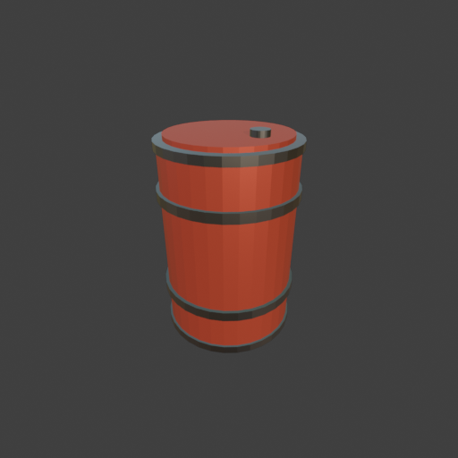

# Sohbet

- `ToolSearch` {"query": "select:mcp__blender__inspect_scene,mcp__blender__delete_object,mcp__blender__create_primitive,mcp__blender__set_material,mcp__blender__join_objects,mcp__blender__frame_view,mcp__blender__capture_viewport,mcp__blender__export_gltf,mcp__blender__inspect_mesh,mcp__blender__set_shading,mcp__blender__set_origin,mcp__blender__assign_material", "max_results": 12}
- `mcp__blender__inspect_scene` {}
  > {"success":true,"tool":"inspect_scene","data":{"active_camera":"Camera","active_collection":"Collection","active_object":"Cube","collections":["Collection"],"counts":{"camera":1,"light":1,"mesh":1,"total":3},"objects":[{"is_linked":false,"name":"Camera","type":"CAMERA"},{"is_linked":false,"name":"Cu ... [156 more characters]
- `mcp__blender__delete_object` {"name": "Cube"}
  > {"success":true,"tool":"delete_object","data":{"deleted":true,"exists":false,"object_name":"Cube","type":"MESH","previous_state":{"location":[0,0,0],"rotation":[0,0,0],"scale":[1,1,1]}},"error":null}
- `mcp__blender__create_primitive` {"primitive_type": "CYLINDER", "name": "Barrel", "size": 0.6, "scale": [1, 1, 1.5], "location": [0, 0, 0.45]}
  > {"success":true,"tool":"create_primitive","data":{"created":true,"exists":true,"object_name":"Barrel","primitive_type":"CYLINDER","type":"MESH","location":[0,0,0.45],"rotation":[0,0,0],"scale":[1,1,1.5],"vertex_count":64,"face_count":34},"error":null}
- `mcp__blender__create_primitive` {"primitive_type": "CYLINDER", "name": "Band_Low", "size": 0.63, "scale": [1, 1, 0.07], "location": [0, 0, 0.22]}
  > {"success":true,"tool":"create_primitive","data":{"created":true,"exists":true,"object_name":"Band_Low","primitive_type":"CYLINDER","type":"MESH","location":[0,0,0.22],"rotation":[0,0,0],"scale":[1,1,0.07],"vertex_count":64,"face_count":34},"error":null}
- `mcp__blender__create_primitive` {"primitive_type": "CYLINDER", "name": "Band_High", "size": 0.63, "scale": [1, 1, 0.07], "location": [0, 0, 0.68]}
  > {"success":true,"tool":"create_primitive","data":{"created":true,"exists":true,"object_name":"Band_High","primitive_type":"CYLINDER","type":"MESH","location":[0,0,0.68],"rotation":[0,0,0],"scale":[1,1,0.07],"vertex_count":64,"face_count":34},"error":null}
- `mcp__blender__create_primitive` {"primitive_type": "CYLINDER", "name": "Rim_Top", "size": 0.62, "scale": [1, 1, 0.06], "location": [0, 0, 0.885]}
  > {"success":true,"tool":"create_primitive","data":{"created":true,"exists":true,"object_name":"Rim_Top","primitive_type":"CYLINDER","type":"MESH","location":[0,0,0.885],"rotation":[0,0,0],"scale":[1,1,0.06],"vertex_count":64,"face_count":34},"error":null}
- `mcp__blender__create_primitive` {"primitive_type": "CYLINDER", "name": "Rim_Bottom", "size": 0.62, "scale": [1, 1, 0.06], "location": [0, 0, 0.018]}
  > {"success":true,"tool":"create_primitive","data":{"created":true,"exists":true,"object_name":"Rim_Bottom","primitive_type":"CYLINDER","type":"MESH","location":[0,0,0.018],"rotation":[0,0,0],"scale":[1,1,0.06],"vertex_count":64,"face_count":34},"error":null}
- `mcp__blender__create_primitive` {"primitive_type": "CYLINDER", "name": "Lid", "size": 0.54, "scale": [1, 1, 0.05], "location": [0, 0, 0.91]}
  > {"success":true,"tool":"create_primitive","data":{"created":true,"exists":true,"object_name":"Lid","primitive_type":"CYLINDER","type":"MESH","location":[0,0,0.91],"rotation":[0,0,0],"scale":[1,1,0.05],"vertex_count":64,"face_count":34},"error":null}
- `mcp__blender__create_primitive` {"primitive_type": "CYLINDER", "name": "Cap", "size": 0.08, "scale": [1, 1, 0.5], "location": [0.15, 0, 0.93]}
  > {"success":true,"tool":"create_primitive","data":{"created":true,"exists":true,"object_name":"Cap","primitive_type":"CYLINDER","type":"MESH","location":[0.15,0,0.93],"rotation":[0,0,0],"scale":[1,1,0.5],"vertex_count":64,"face_count":34},"error":null}
**Ajan:** Materials: body red painted metal, bands dark steel.

- `mcp__blender__set_material` {"material_name": "Barrel_Paint", "object_name": "Barrel", "base_color": [0.55, 0.08, 0.05], "metallic": 0.6, "roughness": 0.5}
  > {"success":true,"tool":"set_material","data":{"material_name":"Barrel_Paint","object_name":"Barrel","slot_index":0,"changed":["base_color","metallic","roughness"],"before":null,"after":{"assigned_objects":["Barrel"],"is_linked":false,"library_name":null,"material_name":"Barrel_Paint","node_summary": ... [654 more characters]
- `mcp__blender__set_material` {"material_name": "Barrel_Steel", "object_name": "Band_Low", "base_color": [0.25, 0.25, 0.27], "metallic": 1, "roughness": 0.4}
  > {"success":true,"tool":"set_material","data":{"material_name":"Barrel_Steel","object_name":"Band_Low","slot_index":0,"changed":["base_color","metallic","roughness"],"before":null,"after":{"assigned_objects":["Band_Low"],"is_linked":false,"library_name":null,"material_name":"Barrel_Steel","node_summa ... [656 more characters]
- `mcp__blender__assign_material` {"object_name": "Band_High", "material_name": "Barrel_Steel"}
  > {"success":true,"tool":"assign_material","data":{"assigned":true,"object_name":"Band_High","material_name":"Barrel_Steel","slot_index":0,"before":{"material_name":null},"after":{"object_name":"Band_High","slot_index":0,"material_name":"Barrel_Steel"},"actual":{"object_name":"Band_High","slot_index": ... [48 more characters]
- `mcp__blender__assign_material` {"object_name": "Rim_Top", "material_name": "Barrel_Steel"}
  > {"success":true,"tool":"assign_material","data":{"assigned":true,"object_name":"Rim_Top","material_name":"Barrel_Steel","slot_index":0,"before":{"material_name":null},"after":{"object_name":"Rim_Top","slot_index":0,"material_name":"Barrel_Steel"},"actual":{"object_name":"Rim_Top","slot_index":0,"mat ... [42 more characters]
- `mcp__blender__assign_material` {"object_name": "Rim_Bottom", "material_name": "Barrel_Steel"}
  > {"success":true,"tool":"assign_material","data":{"assigned":true,"object_name":"Rim_Bottom","material_name":"Barrel_Steel","slot_index":0,"before":{"material_name":null},"after":{"object_name":"Rim_Bottom","slot_index":0,"material_name":"Barrel_Steel"},"actual":{"object_name":"Rim_Bottom","slot_inde ... [51 more characters]
- `mcp__blender__assign_material` {"object_name": "Lid", "material_name": "Barrel_Paint"}
  > {"success":true,"tool":"assign_material","data":{"assigned":true,"object_name":"Lid","material_name":"Barrel_Paint","slot_index":0,"before":{"material_name":null},"after":{"object_name":"Lid","slot_index":0,"material_name":"Barrel_Paint"},"actual":{"object_name":"Lid","slot_index":0,"material_name": ... [30 more characters]
- `mcp__blender__assign_material` {"object_name": "Cap", "material_name": "Barrel_Steel"}
  > {"success":true,"tool":"assign_material","data":{"assigned":true,"object_name":"Cap","material_name":"Barrel_Steel","slot_index":0,"before":{"material_name":null},"after":{"object_name":"Cap","slot_index":0,"material_name":"Barrel_Steel"},"actual":{"object_name":"Cap","slot_index":0,"material_name": ... [30 more characters]
- `mcp__blender__frame_view` {"direction": "ISO", "shading": "MATERIAL", "overlays": false}
  > {"success":true,"tool":"frame_view","data":{"direction":"ISO","objects":["Barrel","Band_Low","Band_High","Rim_Top","Rim_Bottom","Lid","Cap"],"center":[0,0,0.475],"radius":0.651,"shading":"MATERIAL","overlays":false},"error":null}
- `mcp__blender__capture_viewport` {}
  
  > [Image: source: C:\Users\Halil Emre\.claude\projects\C--Users-Halil-Emre-Desktop-GitHub-Public-Blender-Copilot-archives-bench-runs-20260930-010746-barrel\91559948-7eb8-4a6e-9725-f12b8e0cbaeb\tool-results\mcp-blender-blob-1790719694743-h7pwyb.png]
  > {"success":true,"tool":"capture_viewport","data":{"image_id":"vp_5c0ae6d5c53d","width":512,"height":512,"format":"PNG","mime_type":"image/png","byte_size":103874,"channels":4},"error":null}
**Ajan:** Looks good. Joining and exporting.

- `mcp__blender__join_objects` {"object_names": ["Barrel", "Band_Low", "Band_High", "Rim_Top", "Rim_Bottom", "Lid", "Cap"], "target_name": "Barrel"}
  > {"success":true,"tool":"join_objects","data":{"object_name":"Barrel","type":"MESH","exists":true,"location":[0,0,0.45],"rotation":[0,0,0],"scale":[1,1,1.5],"vertex_count":448,"face_count":238,"triangle_count":868,"local_bounds_min":[-0.315,-0.315,-0.3004],"local_bounds_max":[0.315,0.315,0.3333],"dim ... [120 more characters]
- `mcp__blender__set_origin` {"object_name": "Barrel", "mode": "BOTTOM_CENTER"}
  > {"success":true,"tool":"set_origin","data":{"object_name":"Barrel","type":"MESH","exists":true,"location":[0,0,-0.0006],"rotation":[0,0,0],"scale":[1,1,1.5],"vertex_count":448,"face_count":238,"triangle_count":868,"local_bounds_min":[-0.315,-0.315,0],"local_bounds_max":[0.315,0.315,0.6337],"dimensio ... [67 more characters]
- `mcp__blender__export_gltf` {"object_names": ["Barrel"], "filename": "barrel.glb"}
  > {"success":true,"tool":"export_gltf","data":{"path":"C:\\Users\\Halil Emre\\Desktop\\GitHub\\Public\\Blender Copilot\\archives\\bench-runs\\20260930-010746-barrel\\barrel.glb","filename":"barrel.glb","bytes":39320,"objects":["Barrel"],"triangle_count":868,"format":"GLB","y_up":true,"recentered":true ... [15 more characters]
**Ajan:** Low-poly metal varil hazır ve dışa aktarıldı: `C:\Users\Halil Emre\Desktop\GitHub\Public\Blender Copilot\archives\bench-runs\20260930-010746-barrel\barrel.glb` (868 üçgen).

**Ne yaptım:**
- Varsayılan Cube'u sildim.
- **Gövde:** 60 cm çaplı, 90 cm yüksekliğinde bir silindir; standart bir metal varil boyutu.
- **Bantlar:** Gövdeden biraz daha geniş, ince silindirlerle iki orta bant ve üst/alt kenar halkaları ekledim.
- **Kapak:** Üste biraz içeride duran bir kapak diski ve kenarda küçük bir tapa koydum.
- **Malzemeler:** Gövde ve kapak için metalik kırmızı boya (`Barrel_Paint`), bantlar, halkalar ve tapa için koyu çelik (`Barrel_Steel`) kullandım.
- Parçaları tek bir `Barrel` nesnesinde birleştirdim ve orijini alt merkeze aldım, yani oyunda zemine oturuyor.
- Birleştirmeden önce viewport'ta ISO açıdan malzemeli görünümde baktım. Bantlar, kenarlar ve kapak düzgün yerinde duruyordu.

**Export:** Y-up, malzemeler dahil ve orijine merkezlenmiş olarak aktarıldı; boyut 0.63 × 0.63 × 0.95 m. Birleştirmeden sonra modele tekrar bakmadım, sadece boyutları ve üçgen sayısını kontrol ettim.

Nesnenin Z ölçeği (1.5) uygulanmadı. glTF bunu doğru taşır, ama motorda ölçekle ilgili bir sorun görürsen önce ölçeği uygulayıp yeniden export etmek gerekir.

---
**Sonuç:** Low-poly metal varil hazır ve dışa aktarıldı: `C:\Users\Halil Emre\Desktop\GitHub\Public\Blender Copilot\archives\bench-runs\20260930-010746-barrel\barrel.glb` (868 üçgen).

**Ne yaptım:**
- Varsayılan Cube'u sildim.
- **Gövde:** 60 cm çaplı, 90 cm yüksekliğinde bir silindir; standart bir metal varil boyutu.
- **Bantlar:** Gövdeden biraz daha geniş, ince silindirlerle iki orta bant ve üst/alt kenar halkaları ekledim.
- **Kapak:** Üste biraz içeride duran bir kapak diski ve kenarda küçük bir tapa koydum.
- **Malzemeler:** Gövde ve kapak için metalik kırmızı boya (`Barrel_Paint`), bantlar, halkalar ve tapa için koyu çelik (`Barrel_Steel`) kullandım.
- Parçaları tek bir `Barrel` nesnesinde birleştirdim ve orijini alt merkeze aldım, yani oyunda zemine oturuyor.
- Birleştirmeden önce viewport'ta ISO açıdan malzemeli görünümde baktım. Bantlar, kenarlar ve kapak düzgün yerinde duruyordu.

**Export:** Y-up, malzemeler dahil ve orijine merkezlenmiş olarak aktarıldı; boyut 0.63 × 0.63 × 0.95 m. Birleştirmeden sonra modele tekrar bakmadım, sadece boyutları ve üçgen sayısını kontrol ettim.

Nesnenin Z ölçeği (1.5) uygulanmadı. glTF bunu doğru taşır, ama motorda ölçekle ilgili bir sorun görürsen önce ölçeği uygulayıp yeniden export etmek gerekir.
