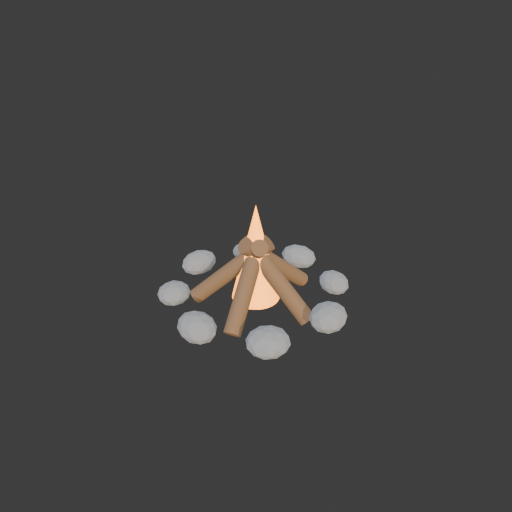
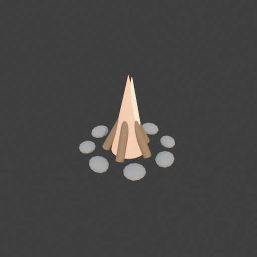
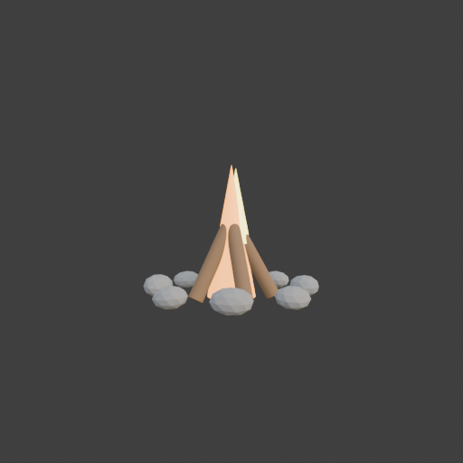

# Sohbet

- `ToolSearch` {"query": "select:mcp__blender__inspect_scene,mcp__blender__delete_object,mcp__blender__create_primitive,mcp__blender__transform_object,mcp__blender__set_material,mcp__blender__join_objects,mcp__blender__frame_view,mcp__blender__capture_viewport,mcp__blender__export_gltf,mcp__blender__duplicate_object,mcp__blender__assign_material,mcp__blender__inspect_mesh", "max_results": 12}
- `mcp__blender__inspect_scene` {}
  > {"success":true,"tool":"inspect_scene","data":{"active_camera":"Camera","active_collection":"Collection","active_object":"Cube","collections":["Collection"],"counts":{"camera":1,"light":1,"mesh":1,"total":3},"objects":[{"is_linked":false,"name":"Camera","type":"CAMERA"},{"is_linked":false,"name":"Cu ... [156 more characters]
- `mcp__blender__delete_object` {"name": "Cube"}
  > {"success":true,"tool":"delete_object","data":{"deleted":true,"exists":false,"object_name":"Cube","type":"MESH","previous_state":{"location":[0,0,0],"rotation":[0,0,0],"scale":[1,1,1]}},"error":null}
- `mcp__blender__create_primitive` {"primitive_type": "ICOSPHERE", "name": "Stone_0", "size": 0.22, "location": [0.5, 0, 0.07], "scale": [1.1, 0.9, 0.65]}
  > {"success":true,"tool":"create_primitive","data":{"created":true,"exists":true,"object_name":"Stone_0","primitive_type":"ICOSPHERE","type":"MESH","location":[0.5,0,0.07],"rotation":[0,0,0],"scale":[1.1,0.9,0.65],"vertex_count":42,"face_count":80},"error":null}
- `mcp__blender__set_material` {"object_name": "Stone_0", "material_name": "Stone", "base_color": [0.35, 0.34, 0.32], "roughness": 0.9}
  > {"success":true,"tool":"set_material","data":{"material_name":"Stone","object_name":"Stone_0","slot_index":0,"changed":["base_color","roughness"],"before":null,"after":{"assigned_objects":["Stone_0"],"is_linked":false,"library_name":null,"material_name":"Stone","node_summary":{"node_count":2,"node_t ... [621 more characters]
- `mcp__blender__transform_object` {"name": "Stone_0", "rotation": [0, 0, 1.571]}
  > {"success":true,"tool":"transform_object","data":{"object_name":"Stone_0","relative":false,"exists":true,"before":{"location":[0.5,0,0.07],"rotation":[0,0,0],"scale":[1.1,0.9,0.65]},"after":{"exists":true,"location":[0.5,0,0.07],"rotation":[0,0,1.571],"scale":[1.1,0.9,0.65]},"actual":{"exists":true, ... [108 more characters]
- `mcp__blender__duplicate_object` {"source_name": "Stone_0", "new_name": "Stone_1", "location": [0.354, 0.354, 0.06], "rotation": [0.1, 0, 2.356], "scale": [1, 0.85, 0.6]}
  > {"success":true,"tool":"duplicate_object","data":{"duplicated":true,"source_name":"Stone_0","new_name":"Stone_1","source_exists":true,"new_exists":true,"type":"MESH","location":[0.354,0.354,0.06],"rotation":[0.1,0,2.356],"scale":[1,0.85,0.6],"source_location":[0.5,0,0.07],"source_rotation":[0,0,1.57 ... [234 more characters]
- `mcp__blender__duplicate_object` {"source_name": "Stone_0", "new_name": "Stone_2", "location": [0, 0.5, 0.07], "rotation": [0, 0.1, 0.2], "scale": [1.15, 0.95, 0.7]}
  > {"success":true,"tool":"duplicate_object","data":{"duplicated":true,"source_name":"Stone_0","new_name":"Stone_2","source_exists":true,"new_exists":true,"type":"MESH","location":[0,0.5,0.07],"rotation":[0,0.1,0.2],"scale":[1.15,0.95,0.7],"source_location":[0.5,0,0.07],"source_rotation":[0,0,1.571],"s ... [229 more characters]
- `mcp__blender__duplicate_object` {"source_name": "Stone_0", "new_name": "Stone_3", "location": [-0.354, 0.354, 0.06], "rotation": [0, 0, 0.785], "scale": [1.05, 0.8, 0.6]}
  > {"success":true,"tool":"duplicate_object","data":{"duplicated":true,"source_name":"Stone_0","new_name":"Stone_3","source_exists":true,"new_exists":true,"type":"MESH","location":[-0.354,0.354,0.06],"rotation":[0,0,0.785],"scale":[1.05,0.8,0.6],"source_location":[0.5,0,0.07],"source_rotation":[0,0,1.5 ... [235 more characters]
- `mcp__blender__duplicate_object` {"source_name": "Stone_0", "new_name": "Stone_4", "location": [-0.5, 0, 0.07], "rotation": [0.1, 0, 1.5], "scale": [1.2, 0.9, 0.7]}
  > {"success":true,"tool":"duplicate_object","data":{"duplicated":true,"source_name":"Stone_0","new_name":"Stone_4","source_exists":true,"new_exists":true,"type":"MESH","location":[-0.5,0,0.07],"rotation":[0.1,0,1.5],"scale":[1.2,0.9,0.7],"source_location":[0.5,0,0.07],"source_rotation":[0,0,1.571],"so ... [228 more characters]
- `mcp__blender__duplicate_object` {"source_name": "Stone_0", "new_name": "Stone_5", "location": [-0.354, -0.354, 0.06], "rotation": [0, 0.1, 2.4], "scale": [1, 0.9, 0.62]}
  > {"success":true,"tool":"duplicate_object","data":{"duplicated":true,"source_name":"Stone_0","new_name":"Stone_5","source_exists":true,"new_exists":true,"type":"MESH","location":[-0.354,-0.354,0.06],"rotation":[0,0.1,2.4],"scale":[1,0.9,0.62],"source_location":[0.5,0,0.07],"source_rotation":[0,0,1.57 ... [234 more characters]
- `mcp__blender__duplicate_object` {"source_name": "Stone_0", "new_name": "Stone_6", "location": [0, -0.5, 0.07], "rotation": [0, 0, -0.1], "scale": [1.1, 0.85, 0.68]}
  > {"success":true,"tool":"duplicate_object","data":{"duplicated":true,"source_name":"Stone_0","new_name":"Stone_6","source_exists":true,"new_exists":true,"type":"MESH","location":[0,-0.5,0.07],"rotation":[0,0,-0.1],"scale":[1.1,0.85,0.68],"source_location":[0.5,0,0.07],"source_rotation":[0,0,1.571],"s ... [229 more characters]
- `mcp__blender__duplicate_object` {"source_name": "Stone_0", "new_name": "Stone_7", "location": [0.354, -0.354, 0.06], "rotation": [0.1, 0, 0.8], "scale": [1.05, 0.9, 0.6]}
  > {"success":true,"tool":"duplicate_object","data":{"duplicated":true,"source_name":"Stone_0","new_name":"Stone_7","source_exists":true,"new_exists":true,"type":"MESH","location":[0.354,-0.354,0.06],"rotation":[0.1,0,0.8],"scale":[1.05,0.9,0.6],"source_location":[0.5,0,0.07],"source_rotation":[0,0,1.5 ... [235 more characters]
- `mcp__blender__create_primitive` {"primitive_type": "CYLINDER", "name": "Log_0", "size": 0.1, "location": [0.15, 0, 0.18], "rotation": [0, -0.87, 0], "scale": [1, 1, 6]}
  > {"success":true,"tool":"create_primitive","data":{"created":true,"exists":true,"object_name":"Log_0","primitive_type":"CYLINDER","type":"MESH","location":[0.15,0,0.18],"rotation":[0,-0.87,0],"scale":[1,1,6],"vertex_count":64,"face_count":34},"error":null}
- `mcp__blender__set_material` {"object_name": "Log_0", "material_name": "Wood", "base_color": [0.3, 0.17, 0.08], "roughness": 0.85}
  > {"success":true,"tool":"set_material","data":{"material_name":"Wood","object_name":"Log_0","slot_index":0,"changed":["base_color","roughness"],"before":null,"after":{"assigned_objects":["Log_0"],"is_linked":false,"library_name":null,"material_name":"Wood","node_summary":{"node_count":2,"node_types": ... [612 more characters]
- `mcp__blender__duplicate_object` {"source_name": "Log_0", "new_name": "Log_1", "location": [0.046, 0.143, 0.18], "rotation": [0, -0.87, 1.257]}
  > {"success":true,"tool":"duplicate_object","data":{"duplicated":true,"source_name":"Log_0","new_name":"Log_1","source_exists":true,"new_exists":true,"type":"MESH","location":[0.046,0.143,0.18],"rotation":[0,-0.87,1.257],"scale":[1,1,6],"source_location":[0.15,0,0.18],"source_rotation":[0,-0.87,0],"so ... [214 more characters]
- `mcp__blender__duplicate_object` {"source_name": "Log_0", "new_name": "Log_2", "location": [-0.121, 0.088, 0.18], "rotation": [0, -0.87, 2.513]}
  > {"success":true,"tool":"duplicate_object","data":{"duplicated":true,"source_name":"Log_0","new_name":"Log_2","source_exists":true,"new_exists":true,"type":"MESH","location":[-0.121,0.088,0.18],"rotation":[0,-0.87,2.513],"scale":[1,1,6],"source_location":[0.15,0,0.18],"source_rotation":[0,-0.87,0],"s ... [215 more characters]
- `mcp__blender__duplicate_object` {"source_name": "Log_0", "new_name": "Log_3", "location": [-0.121, -0.088, 0.18], "rotation": [0, -0.87, 3.77]}
  > {"success":true,"tool":"duplicate_object","data":{"duplicated":true,"source_name":"Log_0","new_name":"Log_3","source_exists":true,"new_exists":true,"type":"MESH","location":[-0.121,-0.088,0.18],"rotation":[0,-0.87,3.77],"scale":[1,1,6],"source_location":[0.15,0,0.18],"source_rotation":[0,-0.87,0],"s ... [215 more characters]
- `mcp__blender__duplicate_object` {"source_name": "Log_0", "new_name": "Log_4", "location": [0.046, -0.143, 0.18], "rotation": [0, -0.87, 5.027]}
  > {"success":true,"tool":"duplicate_object","data":{"duplicated":true,"source_name":"Log_0","new_name":"Log_4","source_exists":true,"new_exists":true,"type":"MESH","location":[0.046,-0.143,0.18],"rotation":[0,-0.87,5.027],"scale":[1,1,6],"source_location":[0.15,0,0.18],"source_rotation":[0,-0.87,0],"s ... [215 more characters]
- `mcp__blender__create_primitive` {"primitive_type": "CONE", "name": "Flame_Outer", "size": 0.3, "location": [0, 0, 0.3], "scale": [1, 1, 2]}
  > {"success":true,"tool":"create_primitive","data":{"created":true,"exists":true,"object_name":"Flame_Outer","primitive_type":"CONE","type":"MESH","location":[0,0,0.3],"rotation":[0,0,0],"scale":[1,1,2],"vertex_count":33,"face_count":33},"error":null}
- `mcp__blender__create_primitive` {"primitive_type": "CONE", "name": "Flame_Inner", "size": 0.2, "location": [0.02, 0.01, 0.27], "rotation": [0, 0, 0.4], "scale": [1, 1, 2]}
  > {"success":true,"tool":"create_primitive","data":{"created":true,"exists":true,"object_name":"Flame_Inner","primitive_type":"CONE","type":"MESH","location":[0.02,0.01,0.27],"rotation":[0,0,0.4],"scale":[1,1,2],"vertex_count":33,"face_count":33},"error":null}
- `mcp__blender__set_material` {"object_name": "Flame_Outer", "material_name": "Flame_Orange", "base_color": [1, 0.35, 0.05], "emission_color": [1, 0.35, 0.05], "emission_strength": 3}
  > {"success":true,"tool":"set_material","data":{"material_name":"Flame_Orange","object_name":"Flame_Outer","slot_index":0,"changed":["base_color","emission_color","emission_strength"],"before":null,"after":{"assigned_objects":["Flame_Outer"],"is_linked":false,"library_name":null,"material_name":"Flame ... [685 more characters]
- `mcp__blender__set_material` {"object_name": "Flame_Inner", "material_name": "Flame_Yellow", "base_color": [1, 0.85, 0.2], "emission_color": [1, 0.85, 0.2], "emission_strength": 4}
  > {"success":true,"tool":"set_material","data":{"material_name":"Flame_Yellow","object_name":"Flame_Inner","slot_index":0,"changed":["base_color","emission_color","emission_strength"],"before":null,"after":{"assigned_objects":["Flame_Inner"],"is_linked":false,"library_name":null,"material_name":"Flame ... [681 more characters]
- `mcp__blender__frame_view` {"direction": "ISO", "shading": "MATERIAL", "overlays": false}
  > {"success":true,"tool":"frame_view","data":{"direction":"ISO","objects":["Stone_0","Stone_1","Stone_2","Stone_3","Stone_4","Stone_5","Stone_6","Stone_7","Log_0","Log_1","Log_2","Log_3","Log_4","Flame_Outer","Flame_Inner"],"center":[-0.008,0.012,0.274],"radius":0.924,"shading":"MATERIAL","overlays":f ... [19 more characters]
- `mcp__blender__capture_viewport` {}
  
  > [Image: source: C:\Users\Halil Emre\.claude\projects\C--Users-Halil-Emre-Desktop-GitHub-Public-Blender-Copilot-archives-bench-runs-20260930-011502-campfire\4b26a92e-74f5-4b85-bf06-dc38dad78d24\tool-results\mcp-blender-blob-1790720154936-4iy42f.png]
  > {"success":true,"tool":"capture_viewport","data":{"image_id":"vp_e1d0f1c64214","width":512,"height":512,"format":"PNG","mime_type":"image/png","byte_size":85344,"channels":4},"error":null}
**Ajan:** Taş halka ve odunlar hazır; alev odunların içinde kaybolmuş, odunları dikleştirip alevi büyütüyorum.

- `mcp__blender__transform_object` {"name": "Log_0", "location": [0.14, 0, 0.27], "rotation": [0, -0.5, 0]}
  > {"success":true,"tool":"transform_object","data":{"object_name":"Log_0","relative":false,"exists":true,"before":{"location":[0.15,0,0.18],"rotation":[0,-0.87,0],"scale":[1,1,6]},"after":{"exists":true,"location":[0.14,0,0.27],"rotation":[0,-0.5,0],"scale":[1,1,6]},"actual":{"exists":true,"location": ... [101 more characters]
- `mcp__blender__transform_object` {"name": "Log_1", "location": [0.043, 0.133, 0.27], "rotation": [0, -0.5, 1.257]}
  > {"success":true,"tool":"transform_object","data":{"object_name":"Log_1","relative":false,"exists":true,"before":{"location":[0.046,0.143,0.18],"rotation":[0,-0.87,1.257],"scale":[1,1,6]},"after":{"exists":true,"location":[0.043,0.133,0.27],"rotation":[0,-0.5,1.257],"scale":[1,1,6]},"actual":{"exists ... [128 more characters]
- `mcp__blender__transform_object` {"name": "Log_2", "location": [-0.113, 0.082, 0.27], "rotation": [0, -0.5, 2.513]}
  > {"success":true,"tool":"transform_object","data":{"object_name":"Log_2","relative":false,"exists":true,"before":{"location":[-0.121,0.088,0.18],"rotation":[0,-0.87,2.513],"scale":[1,1,6]},"after":{"exists":true,"location":[-0.113,0.082,0.27],"rotation":[0,-0.5,2.513],"scale":[1,1,6]},"actual":{"exis ... [131 more characters]
- `mcp__blender__transform_object` {"name": "Log_3", "location": [-0.113, -0.082, 0.27], "rotation": [0, -0.5, 3.77]}
  > {"success":true,"tool":"transform_object","data":{"object_name":"Log_3","relative":false,"exists":true,"before":{"location":[-0.121,-0.088,0.18],"rotation":[0,-0.87,3.77],"scale":[1,1,6]},"after":{"exists":true,"location":[-0.113,-0.082,0.27],"rotation":[0,-0.5,3.77],"scale":[1,1,6]},"actual":{"exis ... [131 more characters]
- `mcp__blender__transform_object` {"name": "Log_4", "location": [0.043, -0.133, 0.27], "rotation": [0, -0.5, 5.027]}
  > {"success":true,"tool":"transform_object","data":{"object_name":"Log_4","relative":false,"exists":true,"before":{"location":[0.046,-0.143,0.18],"rotation":[0,-0.87,5.027],"scale":[1,1,6]},"after":{"exists":true,"location":[0.043,-0.133,0.27],"rotation":[0,-0.5,5.027],"scale":[1,1,6]},"actual":{"exis ... [131 more characters]
- `mcp__blender__transform_object` {"name": "Flame_Outer", "location": [0, 0, 0.45], "scale": [1.4, 1.4, 3]}
  > {"success":true,"tool":"transform_object","data":{"object_name":"Flame_Outer","relative":false,"exists":true,"before":{"location":[0,0,0.3],"rotation":[0,0,0],"scale":[1,1,2]},"after":{"exists":true,"location":[0,0,0.45],"rotation":[0,0,0],"scale":[1.4,1.4,3]},"actual":{"exists":true,"location":[0,0 ... [92 more characters]
- `mcp__blender__transform_object` {"name": "Flame_Inner", "location": [0.03, 0.02, 0.62], "scale": [1, 1, 2.6]}
  > {"success":true,"tool":"transform_object","data":{"object_name":"Flame_Inner","relative":false,"exists":true,"before":{"location":[0.02,0.01,0.27],"rotation":[0,0,0.4],"scale":[1,1,2]},"after":{"exists":true,"location":[0.03,0.02,0.62],"rotation":[0,0,0.4],"scale":[1,1,2.6]},"actual":{"exists":true, ... [113 more characters]
- `mcp__blender__capture_viewport` {}
  
  > [Image: source: C:\Users\Halil Emre\.claude\projects\C--Users-Halil-Emre-Desktop-GitHub-Public-Blender-Copilot-archives-bench-runs-20260930-011502-campfire\4b26a92e-74f5-4b85-bf06-dc38dad78d24\tool-results\mcp-blender-blob-1790720164802-lxgy9x.png]
  > {"success":true,"tool":"capture_viewport","data":{"image_id":"vp_e74a55bb1a87","width":512,"height":512,"format":"PNG","mime_type":"image/png","byte_size":86515,"channels":4},"error":null}
- `mcp__blender__transform_object` {"name": "Flame_Outer", "scale": [1.1, 1.1, 3]}
  > {"success":true,"tool":"transform_object","data":{"object_name":"Flame_Outer","relative":false,"exists":true,"before":{"location":[0,0,0.45],"rotation":[0,0,0],"scale":[1.4,1.4,3]},"after":{"exists":true,"location":[0,0,0.45],"rotation":[0,0,0],"scale":[1.1,1.1,3]},"actual":{"exists":true,"location" ... [86 more characters]
- `ToolSearch` {"query": "select:mcp__blender__set_origin", "max_results": 1}
- `mcp__blender__join_objects` {"target_name": "Log_0", "object_names": ["Log_0", "Log_1", "Log_2", "Log_3", "Log_4", "Stone_0", "Stone_1", "Stone_2", "Stone_3", "Stone_4", "Stone_5", "Stone_6", "Stone_7", "Flame_Outer", "Flame_Inner"], "new_name": "Campfire"}
  > {"success":true,"tool":"join_objects","data":{"object_name":"Campfire","type":"MESH","exists":true,"location":[0.14,0,0.27],"rotation":[0,-0.5,0],"scale":[1,1,6],"vertex_count":722,"face_count":876,"triangle_count":1384,"local_bounds_min":[-0.7486,-0.593,-0.0709],"local_bounds_max":[0.3093,0.6024,0. ... [215 more characters]
- `ToolSearch` {"query": "select:mcp__blender__apply_transform", "max_results": 1}
- `mcp__blender__apply_transform` {"object_name": "Campfire"}
  > {"success":true,"tool":"apply_transform","data":{"object_name":"Campfire","type":"MESH","exists":true,"location":[0.14,0,0.27],"rotation":[0,0,0],"scale":[1,1,1],"vertex_count":722,"face_count":876,"triangle_count":1384,"local_bounds_min":[-0.7383,-0.593,-0.2872],"local_bounds_max":[0.459,0.6024,0.6 ... [53 more characters]
- `mcp__blender__set_origin` {"object_name": "Campfire", "mode": "BOTTOM_CENTER"}
  > {"success":true,"tool":"set_origin","data":{"object_name":"Campfire","type":"MESH","exists":true,"location":[0.0004,0.0047,-0.0172],"rotation":[0,0,0],"scale":[1,1,1],"vertex_count":722,"face_count":876,"triangle_count":1384,"local_bounds_min":[-0.5986,-0.5977,0],"local_bounds_max":[0.5986,0.5977,0. ... [86 more characters]
- `mcp__blender__frame_view` {"direction": "FRONT", "shading": "MATERIAL", "overlays": false}
  > {"success":true,"tool":"frame_view","data":{"direction":"FRONT","objects":["Campfire"],"center":[0,0.005,0.441],"radius":0.962,"shading":"MATERIAL","overlays":false},"error":null}
- `mcp__blender__capture_viewport` {}
  
  > [Image: source: C:\Users\Halil Emre\.claude\projects\C--Users-Halil-Emre-Desktop-GitHub-Public-Blender-Copilot-archives-bench-runs-20260930-011502-campfire\4b26a92e-74f5-4b85-bf06-dc38dad78d24\tool-results\mcp-blender-blob-1790720177428-i9h077.png]
  > {"success":true,"tool":"capture_viewport","data":{"image_id":"vp_c78b3569e458","width":512,"height":512,"format":"PNG","mime_type":"image/png","byte_size":81907,"channels":4},"error":null}
- `mcp__blender__export_gltf` {"object_names": ["Campfire"], "filename": "campfire.glb"}
  > {"success":true,"tool":"export_gltf","data":{"path":"C:\\Users\\Halil Emre\\Desktop\\GitHub\\Public\\Blender Copilot\\archives\\bench-runs\\20260930-011502-campfire\\campfire.glb","filename":"campfire.glb","bytes":87292,"objects":["Campfire"],"triangle_count":1384,"format":"GLB","y_up":true,"recente ... [24 more characters]
**Ajan:** Kamp ateşi hazır ve `campfire.glb` olarak dışa aktarıldı.

**Dosya:** `...\archives\bench-runs\20260930-011502-campfire\campfire.glb` (Y-up, 87 KB)

**Yaptıklarım:**
- Varsayılan Cube'u sildim.
- **Taş halka:** 0,5 m yarıçaplı bir çembere 8 düşük poligonlu taş dizdim. Her taşın boyutu ve açısı biraz farklı olsun diye basıklıklarını ve dönüşlerini değiştirdim. Malzeme: gri, mat "Stone".
- **Odunlar:** 5 silindiri merkeze doğru eğerek çadır (tipi) biçiminde dizdim. Malzeme: kahverengi "Wood".
- **Alev:** İç içe iki koni kullandım. Dıştaki turuncu, içteki sarı ve ikisi de ışık saçıyor (emission). Kısa kesim yüzeyler (flat shading) low-poly görünüme uyuyor.
- İlk ISO görüntüde odunlar fazla yatıktı ve alev içlerinde kayboluyordu. Odunları dikleştirdim, alevi uzattım ve daralttım.
- Önden bir görüntü daha alıp kontrol ettim. Taşlar, odunlar ve alev net seçiliyor.
- Bütün parçaları tek bir **Campfire** objesinde birleştirdim. Dönüş ve ölçeği geometriye işledim, orijini alt merkeze aldım.

**Sonuç:** Ölçüleri yaklaşık 1,2 × 1,2 × 0,92 m. **Toplam 1384 üçgen**, yani önerilen ~3000 üçgen sınırının oldukça altında. 4 malzeme dosyanın içinde.

Alevin ışık saçması yalnızca malzemede var. Oyun motorunda etrafı gerçekten aydınlatması için yanına ayrıca bir nokta ışığı (OmniLight) eklemeniz gerekir.

---
**Sonuç:** Kamp ateşi hazır ve `campfire.glb` olarak dışa aktarıldı.

**Dosya:** `...\archives\bench-runs\20260930-011502-campfire\campfire.glb` (Y-up, 87 KB)

**Yaptıklarım:**
- Varsayılan Cube'u sildim.
- **Taş halka:** 0,5 m yarıçaplı bir çembere 8 düşük poligonlu taş dizdim. Her taşın boyutu ve açısı biraz farklı olsun diye basıklıklarını ve dönüşlerini değiştirdim. Malzeme: gri, mat "Stone".
- **Odunlar:** 5 silindiri merkeze doğru eğerek çadır (tipi) biçiminde dizdim. Malzeme: kahverengi "Wood".
- **Alev:** İç içe iki koni kullandım. Dıştaki turuncu, içteki sarı ve ikisi de ışık saçıyor (emission). Kısa kesim yüzeyler (flat shading) low-poly görünüme uyuyor.
- İlk ISO görüntüde odunlar fazla yatıktı ve alev içlerinde kayboluyordu. Odunları dikleştirdim, alevi uzattım ve daralttım.
- Önden bir görüntü daha alıp kontrol ettim. Taşlar, odunlar ve alev net seçiliyor.
- Bütün parçaları tek bir **Campfire** objesinde birleştirdim. Dönüş ve ölçeği geometriye işledim, orijini alt merkeze aldım.

**Sonuç:** Ölçüleri yaklaşık 1,2 × 1,2 × 0,92 m. **Toplam 1384 üçgen**, yani önerilen ~3000 üçgen sınırının oldukça altında. 4 malzeme dosyanın içinde.

Alevin ışık saçması yalnızca malzemede var. Oyun motorunda etrafı gerçekten aydınlatması için yanına ayrıca bir nokta ışığı (OmniLight) eklemeniz gerekir.
