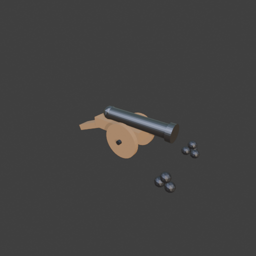
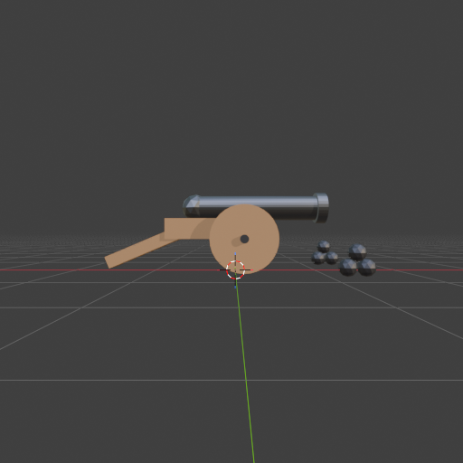

# Sohbet

- `ToolSearch` {"query": "select:mcp__blender__inspect_scene,mcp__blender__delete_object,mcp__blender__create_primitive,mcp__blender__transform_object,mcp__blender__set_material,mcp__blender__join_objects,mcp__blender__frame_view,mcp__blender__capture_viewport,mcp__blender__export_gltf,mcp__blender__duplicate_object,mcp__blender__assign_material,mcp__blender__inspect_mesh", "max_results": 12}
- `mcp__blender__delete_object` {"name": "Cube"}
  > {"success":true,"tool":"delete_object","data":{"deleted":true,"exists":false,"object_name":"Cube","type":"MESH","previous_state":{"location":[0,0,0],"rotation":[0,0,0],"scale":[1,1,1]}},"error":null}
- `mcp__blender__create_primitive` {"primitive_type": "CYLINDER", "name": "Barrel", "size": 1, "scale": [0.3, 0.3, 1.6], "rotation": [0, 1.5708, 0], "location": [0.3, 0, 0.78]}
  > {"success":true,"tool":"create_primitive","data":{"created":true,"exists":true,"object_name":"Barrel","primitive_type":"CYLINDER","type":"MESH","location":[0.3,0,0.78],"rotation":[0,1.5708,0],"scale":[0.3,0.3,1.6],"vertex_count":64,"face_count":34},"error":null}
- `mcp__blender__create_primitive` {"primitive_type": "CYLINDER", "name": "Muzzle", "size": 1, "scale": [0.38, 0.38, 0.12], "rotation": [0, 1.5708, 0], "location": [1.06, 0, 0.78]}
  > {"success":true,"tool":"create_primitive","data":{"created":true,"exists":true,"object_name":"Muzzle","primitive_type":"CYLINDER","type":"MESH","location":[1.06,0,0.78],"rotation":[0,1.5708,0],"scale":[0.38,0.38,0.12],"vertex_count":64,"face_count":34},"error":null}
- `mcp__blender__create_primitive` {"primitive_type": "SPHERE", "name": "Breech", "size": 0.34, "location": [-0.5, 0, 0.78]}
  > {"success":true,"tool":"create_primitive","data":{"created":true,"exists":true,"object_name":"Breech","primitive_type":"SPHERE","type":"MESH","location":[-0.5,0,0.78],"rotation":[0,0,0],"scale":[1,1,1],"vertex_count":482,"face_count":512},"error":null}
- `mcp__blender__create_primitive` {"primitive_type": "CUBE", "name": "Carriage", "size": 1, "scale": [1.3, 0.4, 0.25], "location": [-0.2, 0, 0.52]}
  > {"success":true,"tool":"create_primitive","data":{"created":true,"exists":true,"object_name":"Carriage","primitive_type":"CUBE","type":"MESH","location":[-0.2,0,0.52],"rotation":[0,0,0],"scale":[1.3,0.4,0.25],"vertex_count":8,"face_count":6},"error":null}
- `mcp__blender__create_primitive` {"primitive_type": "CUBE", "name": "Trail", "size": 1, "scale": [1, 0.3, 0.15], "rotation": [0, -0.4, 0], "location": [-1.1, 0, 0.3]}
  > {"success":true,"tool":"create_primitive","data":{"created":true,"exists":true,"object_name":"Trail","primitive_type":"CUBE","type":"MESH","location":[-1.1,0,0.3],"rotation":[0,-0.4,0],"scale":[1,0.3,0.15],"vertex_count":8,"face_count":6},"error":null}
- `mcp__blender__create_primitive` {"primitive_type": "CYLINDER", "name": "WheelL", "size": 1, "scale": [0.8, 0.8, 0.1], "rotation": [1.5708, 0, 0], "location": [0.1, 0.33, 0.4]}
  > {"success":true,"tool":"create_primitive","data":{"created":true,"exists":true,"object_name":"WheelL","primitive_type":"CYLINDER","type":"MESH","location":[0.1,0.33,0.4],"rotation":[1.5708,0,0],"scale":[0.8,0.8,0.1],"vertex_count":64,"face_count":34},"error":null}
- `mcp__blender__create_primitive` {"primitive_type": "CYLINDER", "name": "WheelR", "size": 1, "scale": [0.8, 0.8, 0.1], "rotation": [1.5708, 0, 0], "location": [0.1, -0.33, 0.4]}
  > {"success":true,"tool":"create_primitive","data":{"created":true,"exists":true,"object_name":"WheelR","primitive_type":"CYLINDER","type":"MESH","location":[0.1,-0.33,0.4],"rotation":[1.5708,0,0],"scale":[0.8,0.8,0.1],"vertex_count":64,"face_count":34},"error":null}
- `mcp__blender__create_primitive` {"primitive_type": "CYLINDER", "name": "Axle", "size": 1, "scale": [0.1, 0.1, 0.9], "rotation": [1.5708, 0, 0], "location": [0.1, 0, 0.4]}
  > {"success":true,"tool":"create_primitive","data":{"created":true,"exists":true,"object_name":"Axle","primitive_type":"CYLINDER","type":"MESH","location":[0.1,0,0.4],"rotation":[1.5708,0,0],"scale":[0.1,0.1,0.9],"vertex_count":64,"face_count":34},"error":null}
- `mcp__blender__delete_object` {"name": "Breech"}
  > {"success":true,"tool":"delete_object","data":{"deleted":true,"exists":false,"object_name":"Breech","type":"MESH","previous_state":{"location":[-0.5,0,0.78],"rotation":[0,0,0],"scale":[1,1,1]}},"error":null}
- `mcp__blender__create_primitive` {"primitive_type": "ICOSPHERE", "name": "Breech", "size": 0.34, "location": [-0.5, 0, 0.78]}
  > {"success":true,"tool":"create_primitive","data":{"created":true,"exists":true,"object_name":"Breech","primitive_type":"ICOSPHERE","type":"MESH","location":[-0.5,0,0.78],"rotation":[0,0,0],"scale":[1,1,1],"vertex_count":42,"face_count":80},"error":null}
- `mcp__blender__create_primitive` {"primitive_type": "ICOSPHERE", "name": "Ball1", "size": 0.2, "location": [1.2, 0.6, 0.1]}
  > {"success":true,"tool":"create_primitive","data":{"created":true,"exists":true,"object_name":"Ball1","primitive_type":"ICOSPHERE","type":"MESH","location":[1.2,0.6,0.1],"rotation":[0,0,0],"scale":[1,1,1],"vertex_count":42,"face_count":80},"error":null}
**Ajan:** Mermiler için malzeme atayıp çoğaltıyorum (pyramid yığınları).

- `mcp__blender__set_material` {"object_name": "Ball1", "material_name": "Iron", "base_color": [0.08, 0.08, 0.09], "metallic": 0.8, "roughness": 0.5}
  > {"success":true,"tool":"set_material","data":{"material_name":"Iron","object_name":"Ball1","slot_index":0,"changed":["base_color","metallic","roughness"],"before":null,"after":{"assigned_objects":["Ball1"],"is_linked":false,"library_name":null,"material_name":"Iron","node_summary":{"node_count":2,"n ... [627 more characters]
- `mcp__blender__set_material` {"material_name": "Wood", "object_name": "Carriage", "base_color": [0.4, 0.22, 0.1], "roughness": 0.85}
  > {"success":true,"tool":"set_material","data":{"material_name":"Wood","object_name":"Carriage","slot_index":0,"changed":["base_color","roughness"],"before":null,"after":{"assigned_objects":["Carriage"],"is_linked":false,"library_name":null,"material_name":"Wood","node_summary":{"node_count":2,"node_t ... [619 more characters]
- `mcp__blender__set_material` {"material_name": "Bronze", "object_name": "Barrel", "base_color": [0.15, 0.15, 0.16], "metallic": 0.9, "roughness": 0.4}
  > {"success":true,"tool":"set_material","data":{"material_name":"Bronze","object_name":"Barrel","slot_index":0,"changed":["base_color","metallic","roughness"],"before":null,"after":{"assigned_objects":["Barrel"],"is_linked":false,"library_name":null,"material_name":"Bronze","node_summary":{"node_count ... [636 more characters]
- `mcp__blender__assign_material` {"object_name": "Muzzle", "material_name": "Bronze"}
  > {"success":true,"tool":"assign_material","data":{"assigned":true,"object_name":"Muzzle","material_name":"Bronze","slot_index":0,"before":{"material_name":null},"after":{"object_name":"Muzzle","slot_index":0,"material_name":"Bronze"},"actual":{"object_name":"Muzzle","slot_index":0,"material_name":"Br ... [21 more characters]
- `mcp__blender__assign_material` {"object_name": "Breech", "material_name": "Bronze"}
  > {"success":true,"tool":"assign_material","data":{"assigned":true,"object_name":"Breech","material_name":"Bronze","slot_index":0,"before":{"material_name":null},"after":{"object_name":"Breech","slot_index":0,"material_name":"Bronze"},"actual":{"object_name":"Breech","slot_index":0,"material_name":"Br ... [21 more characters]
- `mcp__blender__assign_material` {"object_name": "Axle", "material_name": "Iron"}
  > {"success":true,"tool":"assign_material","data":{"assigned":true,"object_name":"Axle","material_name":"Iron","slot_index":0,"before":{"material_name":null},"after":{"object_name":"Axle","slot_index":0,"material_name":"Iron"},"actual":{"object_name":"Axle","slot_index":0,"material_name":"Iron"}},"err ... [9 more characters]
- `mcp__blender__assign_material` {"object_name": "Trail", "material_name": "Wood"}
  > {"success":true,"tool":"assign_material","data":{"assigned":true,"object_name":"Trail","material_name":"Wood","slot_index":0,"before":{"material_name":null},"after":{"object_name":"Trail","slot_index":0,"material_name":"Wood"},"actual":{"object_name":"Trail","slot_index":0,"material_name":"Wood"}}," ... [12 more characters]
- `mcp__blender__assign_material` {"object_name": "WheelL", "material_name": "Wood"}
  > {"success":true,"tool":"assign_material","data":{"assigned":true,"object_name":"WheelL","material_name":"Wood","slot_index":0,"before":{"material_name":null},"after":{"object_name":"WheelL","slot_index":0,"material_name":"Wood"},"actual":{"object_name":"WheelL","slot_index":0,"material_name":"Wood"} ... [15 more characters]
- `mcp__blender__assign_material` {"object_name": "WheelR", "material_name": "Wood"}
  > {"success":true,"tool":"assign_material","data":{"assigned":true,"object_name":"WheelR","material_name":"Wood","slot_index":0,"before":{"material_name":null},"after":{"object_name":"WheelR","slot_index":0,"material_name":"Wood"},"actual":{"object_name":"WheelR","slot_index":0,"material_name":"Wood"} ... [15 more characters]
- `mcp__blender__duplicate_object` {"source_name": "Ball1", "new_name": "Ball2", "location": [1.4, 0.6, 0.1]}
  > {"success":true,"tool":"duplicate_object","data":{"duplicated":true,"source_name":"Ball1","new_name":"Ball2","source_exists":true,"new_exists":true,"type":"MESH","location":[1.4,0.6,0.1],"rotation":[0,0,0],"scale":[1,1,1],"source_location":[1.2,0.6,0.1],"source_rotation":[0,0,0],"source_scale":[1,1, ... [193 more characters]
- `mcp__blender__duplicate_object` {"source_name": "Ball1", "new_name": "Ball3", "location": [1.3, 0.77, 0.1]}
  > {"success":true,"tool":"duplicate_object","data":{"duplicated":true,"source_name":"Ball1","new_name":"Ball3","source_exists":true,"new_exists":true,"type":"MESH","location":[1.3,0.77,0.1],"rotation":[0,0,0],"scale":[1,1,1],"source_location":[1.2,0.6,0.1],"source_rotation":[0,0,0],"source_scale":[1,1 ... [194 more characters]
- `mcp__blender__duplicate_object` {"source_name": "Ball1", "new_name": "Ball4", "location": [1.3, 0.66, 0.26]}
  > {"success":true,"tool":"duplicate_object","data":{"duplicated":true,"source_name":"Ball1","new_name":"Ball4","source_exists":true,"new_exists":true,"type":"MESH","location":[1.3,0.66,0.26],"rotation":[0,0,0],"scale":[1,1,1],"source_location":[1.2,0.6,0.1],"source_rotation":[0,0,0],"source_scale":[1, ... [195 more characters]
- `mcp__blender__duplicate_object` {"source_name": "Ball1", "new_name": "Ball5", "location": [1.2, -0.6, 0.1]}
  > {"success":true,"tool":"duplicate_object","data":{"duplicated":true,"source_name":"Ball1","new_name":"Ball5","source_exists":true,"new_exists":true,"type":"MESH","location":[1.2,-0.6,0.1],"rotation":[0,0,0],"scale":[1,1,1],"source_location":[1.2,0.6,0.1],"source_rotation":[0,0,0],"source_scale":[1,1 ... [194 more characters]
- `mcp__blender__duplicate_object` {"source_name": "Ball1", "new_name": "Ball6", "location": [1.4, -0.6, 0.1]}
  > {"success":true,"tool":"duplicate_object","data":{"duplicated":true,"source_name":"Ball1","new_name":"Ball6","source_exists":true,"new_exists":true,"type":"MESH","location":[1.4,-0.6,0.1],"rotation":[0,0,0],"scale":[1,1,1],"source_location":[1.2,0.6,0.1],"source_rotation":[0,0,0],"source_scale":[1,1 ... [194 more characters]
- `mcp__blender__duplicate_object` {"source_name": "Ball1", "new_name": "Ball7", "location": [1.3, -0.6, 0.26]}
  > {"success":true,"tool":"duplicate_object","data":{"duplicated":true,"source_name":"Ball1","new_name":"Ball7","source_exists":true,"new_exists":true,"type":"MESH","location":[1.3,-0.6,0.26],"rotation":[0,0,0],"scale":[1,1,1],"source_location":[1.2,0.6,0.1],"source_rotation":[0,0,0],"source_scale":[1, ... [195 more characters]
- `mcp__blender__frame_view` {"direction": "ISO", "shading": "MATERIAL", "overlays": false}
  > {"success":true,"tool":"frame_view","data":{"direction":"ISO","objects":["Barrel","Muzzle","Carriage","Trail","WheelL","WheelR","Axle","Breech","Ball1","Ball2","Ball3","Ball4","Ball5","Ball6","Ball7"],"center":[-0.047,0.085,0.485],"radius":1.797,"shading":"MATERIAL","overlays":false},"error":null}
- `mcp__blender__capture_viewport` {}
  
  > [Image: source: C:\Users\Halil Emre\.claude\projects\C--Users-Halil-Emre-Desktop-GitHub-Public-Blender-Copilot-archives-bench-runs-20260930-012801-cannon\9f0e4748-8b3e-4219-b0ad-655bf0ad93ca\tool-results\mcp-blender-blob-1790720939893-glz5lv.png]
  > {"success":true,"tool":"capture_viewport","data":{"image_id":"vp_4c561240b470","width":512,"height":512,"format":"PNG","mime_type":"image/png","byte_size":83571,"channels":4},"error":null}
- `mcp__blender__frame_view` {"direction": "FRONT", "shading": "MATERIAL", "overlays": true}
  > {"success":true,"tool":"frame_view","data":{"direction":"FRONT","objects":["Barrel","Muzzle","Carriage","Trail","WheelL","WheelR","Axle","Breech","Ball1","Ball2","Ball3","Ball4","Ball5","Ball6","Ball7"],"center":[-0.047,0.085,0.485],"radius":1.797,"shading":"MATERIAL","overlays":true},"error":null}
- `mcp__blender__capture_viewport` {}
  
  > [Image: source: C:\Users\Halil Emre\.claude\projects\C--Users-Halil-Emre-Desktop-GitHub-Public-Blender-Copilot-archives-bench-runs-20260930-012801-cannon\9f0e4748-8b3e-4219-b0ad-655bf0ad93ca\tool-results\mcp-blender-blob-1790720943044-gpbykh.png]
  > {"success":true,"tool":"capture_viewport","data":{"image_id":"vp_28f02f247d99","width":512,"height":512,"format":"PNG","mime_type":"image/png","byte_size":86677,"channels":4},"error":null}
- `mcp__blender__join_objects` {"object_names": ["Carriage", "Barrel", "Muzzle", "Trail", "WheelL", "WheelR", "Axle", "Breech", "Ball1", "Ball2", "Ball3", "Ball4", "Ball5", "Ball6", "Ball7"], "target_name": "Carriage", "new_name": "Cannon"}
  > {"success":true,"tool":"join_objects","data":{"object_name":"Cannon","type":"MESH","exists":true,"location":[-0.2,0,0.52],"rotation":[0,0,0],"scale":[1.3,0.4,0.25],"vertex_count":672,"face_count":822,"triangle_count":1284,"local_bounds_min":[-1.069,-1.75,-2.08],"local_bounds_max":[1.3039,2.175,1.8], ... [184 more characters]
- `ToolSearch` {"query": "select:mcp__blender__set_origin", "max_results": 1}
**Ajan:** Scale is non-uniform from the carriage; apply transform too.

- `ToolSearch` {"query": "select:mcp__blender__apply_transform", "max_results": 1}
- `mcp__blender__apply_transform` {"object_name": "Cannon"}
  > {"success":true,"tool":"apply_transform","data":{"object_name":"Cannon","type":"MESH","exists":true,"location":[-0.2,0,0.52],"rotation":[0,0,0],"scale":[1,1,1],"vertex_count":672,"face_count":822,"triangle_count":1284,"local_bounds_min":[-1.3897,-0.7,-0.52],"local_bounds_max":[1.6951,0.87,0.45],"dim ... [42 more characters]
- `mcp__blender__set_origin` {"object_name": "Cannon", "mode": "BOTTOM_CENTER"}
  > {"success":true,"tool":"set_origin","data":{"object_name":"Cannon","type":"MESH","exists":true,"location":[-0.0473,0.085,0],"rotation":[0,0,0],"scale":[1,1,1],"vertex_count":672,"face_count":822,"triangle_count":1284,"local_bounds_min":[-1.5424,-0.785,0],"local_bounds_max":[1.5424,0.785,0.97],"dimen ... [70 more characters]
- `mcp__blender__export_gltf` {"object_names": ["Cannon"], "filename": "cannon.glb"}
  > {"success":true,"tool":"export_gltf","data":{"path":"C:\\Users\\Halil Emre\\Desktop\\GitHub\\Public\\Blender Copilot\\archives\\bench-runs\\20260930-012801-cannon\\cannon.glb","filename":"cannon.glb","bytes":80656,"objects":["Cannon"],"triangle_count":1284,"format":"GLB","y_up":true,"recentered":tru ... [16 more characters]
**Ajan:** Top modeli bitti ve `cannon.glb` olarak dışa aktarıldı: **1284 üçgen**. Bu, düşük poligonlu bir obje için önerilen ~3000 üçgen sınırının oldukça altında.

**Yaptıklarım:**
- Varsayılan Cube'u sildim.
- **Namlu:** Uzun bir silindir, ağzında daha kalın bir halka, arka ucunda küçük bir küre (kuyruk topuzu). Koyu metal malzeme verdim. Malzemenin adı "Bronze" kaldı ama rengi bronz değil, koyu demir grisi.
- **Ahşap lav:** Namluyu taşıyan bir gövde bloğu ve arkaya doğru eğimli uzanıp yere değen bir kuyruk parçası.
- **Tekerlekler:** 0,8 m çapında iki ahşap tekerlek ve aralarında demir bir dingil. Tekerlekler yere oturuyor.
- **Mermiler:** Namlu ağzının iki yanında birer yığın var. Birinde 4, diğerinde 3 demir gülle bulunuyor. Varsayılan UV küre tek başına 512 yüz olduğu için gülleleri ve kuyruk topuzunu daha hafif ikosferlerle yaptım.
- Bütün parçaları "Cannon" adlı tek bir objede birleştirdim. Dönüş ve ölçeği modele işledim, orijini tabanın ortasına aldım. Model yaklaşık 3,1 × 1,6 × 0,97 m boyutunda.

**Kontrol:** Modeli viewport'ta hem izometrik hem önden baktım. Parçalar yerinde duruyor; tekerlekler ve kuyruk yere değiyor.

**Dosya:** `archives\bench-runs\20260930-012801-cannon\cannon.glb`. Y ekseni yukarıda, malzemeler dosyaya dahil ve model orijine ortalanmış halde.

---
**Sonuç:** Top modeli bitti ve `cannon.glb` olarak dışa aktarıldı: **1284 üçgen**. Bu, düşük poligonlu bir obje için önerilen ~3000 üçgen sınırının oldukça altında.

**Yaptıklarım:**
- Varsayılan Cube'u sildim.
- **Namlu:** Uzun bir silindir, ağzında daha kalın bir halka, arka ucunda küçük bir küre (kuyruk topuzu). Koyu metal malzeme verdim. Malzemenin adı "Bronze" kaldı ama rengi bronz değil, koyu demir grisi.
- **Ahşap lav:** Namluyu taşıyan bir gövde bloğu ve arkaya doğru eğimli uzanıp yere değen bir kuyruk parçası.
- **Tekerlekler:** 0,8 m çapında iki ahşap tekerlek ve aralarında demir bir dingil. Tekerlekler yere oturuyor.
- **Mermiler:** Namlu ağzının iki yanında birer yığın var. Birinde 4, diğerinde 3 demir gülle bulunuyor. Varsayılan UV küre tek başına 512 yüz olduğu için gülleleri ve kuyruk topuzunu daha hafif ikosferlerle yaptım.
- Bütün parçaları "Cannon" adlı tek bir objede birleştirdim. Dönüş ve ölçeği modele işledim, orijini tabanın ortasına aldım. Model yaklaşık 3,1 × 1,6 × 0,97 m boyutunda.

**Kontrol:** Modeli viewport'ta hem izometrik hem önden baktım. Parçalar yerinde duruyor; tekerlekler ve kuyruk yere değiyor.

**Dosya:** `archives\bench-runs\20260930-012801-cannon\cannon.glb`. Y ekseni yukarıda, malzemeler dosyaya dahil ve model orijine ortalanmış halde.
