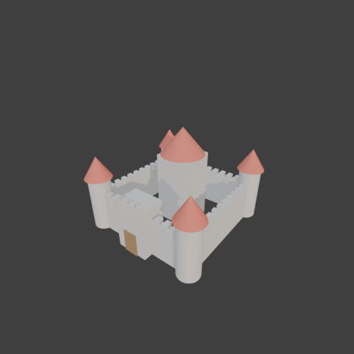

# Sohbet

- `ToolSearch` {"query": "select:mcp__blender__create_primitive,mcp__blender__delete_object,mcp__blender__inspect_scene,mcp__blender__add_shape_modifier,mcp__blender__frame_view,mcp__blender__capture_viewport,mcp__blender__export_gltf,mcp__blender__set_material,mcp__blender__join_objects,mcp__blender__duplicate_object,mcp__blender__inspect_mesh", "max_results": 11}
- `mcp__blender__inspect_scene` {}
  > {"success":true,"tool":"inspect_scene","data":{"active_camera":"Camera","active_collection":"Collection","active_object":"Cube","collections":["Collection"],"counts":{"camera":1,"light":1,"mesh":1,"total":3},"objects":[{"is_linked":false,"name":"Camera","type":"CAMERA"},{"is_linked":false,"name":"Cu ... [156 more characters]
- `mcp__blender__delete_object` {"name": "Cube"}
  > {"success":true,"tool":"delete_object","data":{"deleted":true,"exists":false,"object_name":"Cube","type":"MESH","previous_state":{"location":[0,0,0],"rotation":[0,0,0],"scale":[1,1,1]}},"error":null}
**Ajan:** Now the walls, towers, keep, and gatehouse.

- `mcp__blender__create_primitive` {"primitive_type": "CUBE", "name": "Wall_Back", "location": [0, 6, 2], "scale": [6, 0.4, 2]}
  > {"success":true,"tool":"create_primitive","data":{"created":true,"exists":true,"object_name":"Wall_Back","primitive_type":"CUBE","type":"MESH","location":[0,6,2],"rotation":[0,0,0],"scale":[6,0.4,2],"vertex_count":8,"face_count":6},"error":null}
- `mcp__blender__create_primitive` {"primitive_type": "CUBE", "name": "Wall_Front", "location": [0, -6, 2], "scale": [6, 0.4, 2]}
  > {"success":true,"tool":"create_primitive","data":{"created":true,"exists":true,"object_name":"Wall_Front","primitive_type":"CUBE","type":"MESH","location":[0,-6,2],"rotation":[0,0,0],"scale":[6,0.4,2],"vertex_count":8,"face_count":6},"error":null}
- `mcp__blender__create_primitive` {"primitive_type": "CUBE", "name": "Wall_Left", "location": [-6, 0, 2], "scale": [0.4, 6, 2]}
  > {"success":true,"tool":"create_primitive","data":{"created":true,"exists":true,"object_name":"Wall_Left","primitive_type":"CUBE","type":"MESH","location":[-6,0,2],"rotation":[0,0,0],"scale":[0.4,6,2],"vertex_count":8,"face_count":6},"error":null}
- `mcp__blender__create_primitive` {"primitive_type": "CUBE", "name": "Wall_Right", "location": [6, 0, 2], "scale": [0.4, 6, 2]}
  > {"success":true,"tool":"create_primitive","data":{"created":true,"exists":true,"object_name":"Wall_Right","primitive_type":"CUBE","type":"MESH","location":[6,0,2],"rotation":[0,0,0],"scale":[0.4,6,2],"vertex_count":8,"face_count":6},"error":null}
- `mcp__blender__create_primitive` {"primitive_type": "CYLINDER", "name": "Tower_FL", "location": [-6, -6, 3], "scale": [1.2, 1.2, 3]}
  > {"success":true,"tool":"create_primitive","data":{"created":true,"exists":true,"object_name":"Tower_FL","primitive_type":"CYLINDER","type":"MESH","location":[-6,-6,3],"rotation":[0,0,0],"scale":[1.2,1.2,3],"vertex_count":64,"face_count":34},"error":null}
- `mcp__blender__create_primitive` {"primitive_type": "CONE", "name": "Roof_FL", "location": [-6, -6, 7.2], "scale": [1.5, 1.5, 1.2]}
  > {"success":true,"tool":"create_primitive","data":{"created":true,"exists":true,"object_name":"Roof_FL","primitive_type":"CONE","type":"MESH","location":[-6,-6,7.2],"rotation":[0,0,0],"scale":[1.5,1.5,1.2],"vertex_count":33,"face_count":33},"error":null}
- `mcp__blender__create_primitive` {"primitive_type": "CUBE", "name": "Keep", "location": [0, 1, 4], "scale": [2, 2, 4]}
  > {"success":true,"tool":"create_primitive","data":{"created":true,"exists":true,"object_name":"Keep","primitive_type":"CUBE","type":"MESH","location":[0,1,4],"rotation":[0,0,0],"scale":[2,2,4],"vertex_count":8,"face_count":6},"error":null}
- `mcp__blender__create_primitive` {"primitive_type": "CONE", "name": "Keep_Roof", "location": [0, 1, 9.5], "rotation": [0, 0, 0.7854], "scale": [1.6, 1.6, 1.5]}
  > {"success":true,"tool":"create_primitive","data":{"created":true,"exists":true,"object_name":"Keep_Roof","primitive_type":"CONE","type":"MESH","location":[0,1,9.5],"rotation":[0,0,0.7854],"scale":[1.6,1.6,1.5],"vertex_count":33,"face_count":33},"error":null}
- `mcp__blender__create_primitive` {"primitive_type": "CUBE", "name": "Gatehouse", "location": [0, -6, 2.75], "scale": [1.8, 1.4, 2.75]}
  > {"success":true,"tool":"create_primitive","data":{"created":true,"exists":true,"object_name":"Gatehouse","primitive_type":"CUBE","type":"MESH","location":[0,-6,2.75],"rotation":[0,0,0],"scale":[1.8,1.4,2.75],"vertex_count":8,"face_count":6},"error":null}
- `mcp__blender__create_primitive` {"primitive_type": "CUBE", "name": "Gate", "location": [0, -7.45, 1.25], "scale": [0.8, 0.1, 1.25]}
  > {"success":true,"tool":"create_primitive","data":{"created":true,"exists":true,"object_name":"Gate","primitive_type":"CUBE","type":"MESH","location":[0,-7.45,1.25],"rotation":[0,0,0],"scale":[0.8,0.1,1.25],"vertex_count":8,"face_count":6},"error":null}
- `mcp__blender__transform_object` {}
  > {"success": false, "tool": "transform_object", "data": null, "error": {"type": "INVALID_ARGUMENT", "message": "Missing required argument 'name' for tool 'transform_object'.", "details": {"missing_field": "name", "required": ["name"]}}}
- `ToolSearch` {"query": "select:mcp__blender__transform_object", "max_results": 1}
- `mcp__blender__transform_object` {"name": "Keep_Roof", "scale": [2.5, 2.5, 1.5]}
  > {"success":true,"tool":"transform_object","data":{"object_name":"Keep_Roof","relative":false,"exists":true,"before":{"location":[0,1,9.5],"rotation":[0,0,0.7854],"scale":[1.6,1.6,1.5]},"after":{"exists":true,"location":[0,1,9.5],"rotation":[0,0,0.7854],"scale":[2.5,2.5,1.5]},"actual":{"exists":true, ... [102 more characters]
- `mcp__blender__duplicate_object` {"source_name": "Tower_FL", "new_name": "Tower_FR", "location": [6, -6, 3]}
  > {"success":true,"tool":"duplicate_object","data":{"duplicated":true,"source_name":"Tower_FL","new_name":"Tower_FR","source_exists":true,"new_exists":true,"type":"MESH","location":[6,-6,3],"rotation":[0,0,0],"scale":[1.2,1.2,3],"source_location":[-6,-6,3],"source_rotation":[0,0,0],"source_scale":[1.2 ... [192 more characters]
- `mcp__blender__duplicate_object` {"source_name": "Tower_FL", "new_name": "Tower_BL", "location": [-6, 6, 3]}
  > {"success":true,"tool":"duplicate_object","data":{"duplicated":true,"source_name":"Tower_FL","new_name":"Tower_BL","source_exists":true,"new_exists":true,"type":"MESH","location":[-6,6,3],"rotation":[0,0,0],"scale":[1.2,1.2,3],"source_location":[-6,-6,3],"source_rotation":[0,0,0],"source_scale":[1.2 ... [192 more characters]
- `mcp__blender__duplicate_object` {"source_name": "Tower_FL", "new_name": "Tower_BR", "location": [6, 6, 3]}
  > {"success":true,"tool":"duplicate_object","data":{"duplicated":true,"source_name":"Tower_FL","new_name":"Tower_BR","source_exists":true,"new_exists":true,"type":"MESH","location":[6,6,3],"rotation":[0,0,0],"scale":[1.2,1.2,3],"source_location":[-6,-6,3],"source_rotation":[0,0,0],"source_scale":[1.2, ... [191 more characters]
- `mcp__blender__duplicate_object` {"source_name": "Roof_FL", "new_name": "Roof_FR", "location": [6, -6, 7.2]}
  > {"success":true,"tool":"duplicate_object","data":{"duplicated":true,"source_name":"Roof_FL","new_name":"Roof_FR","source_exists":true,"new_exists":true,"type":"MESH","location":[6,-6,7.2],"rotation":[0,0,0],"scale":[1.5,1.5,1.2],"source_location":[-6,-6,7.2],"source_rotation":[0,0,0],"source_scale": ... [202 more characters]
- `mcp__blender__duplicate_object` {"source_name": "Roof_FL", "new_name": "Roof_BL", "location": [-6, 6, 7.2]}
  > {"success":true,"tool":"duplicate_object","data":{"duplicated":true,"source_name":"Roof_FL","new_name":"Roof_BL","source_exists":true,"new_exists":true,"type":"MESH","location":[-6,6,7.2],"rotation":[0,0,0],"scale":[1.5,1.5,1.2],"source_location":[-6,-6,7.2],"source_rotation":[0,0,0],"source_scale": ... [202 more characters]
- `mcp__blender__duplicate_object` {"source_name": "Roof_FL", "new_name": "Roof_BR", "location": [6, 6, 7.2]}
  > {"success":true,"tool":"duplicate_object","data":{"duplicated":true,"source_name":"Roof_FL","new_name":"Roof_BR","source_exists":true,"new_exists":true,"type":"MESH","location":[6,6,7.2],"rotation":[0,0,0],"scale":[1.5,1.5,1.2],"source_location":[-6,-6,7.2],"source_rotation":[0,0,0],"source_scale":[ ... [201 more characters]
- `mcp__blender__create_primitive` {"primitive_type": "CUBE", "name": "Merlons_Back", "size": 0.5, "location": [-4.5, 6, 4.25], "scale": [1, 1.6, 1]}
  > {"success":true,"tool":"create_primitive","data":{"created":true,"exists":true,"object_name":"Merlons_Back","primitive_type":"CUBE","type":"MESH","location":[-4.5,6,4.25],"rotation":[0,0,0],"scale":[1,1.6,1],"vertex_count":8,"face_count":6},"error":null}
- `mcp__blender__create_primitive` {"primitive_type": "CUBE", "name": "Merlons_Left", "size": 0.5, "location": [-6, -4.5, 4.25], "scale": [1.6, 1, 1]}
  > {"success":true,"tool":"create_primitive","data":{"created":true,"exists":true,"object_name":"Merlons_Left","primitive_type":"CUBE","type":"MESH","location":[-6,-4.5,4.25],"rotation":[0,0,0],"scale":[1.6,1,1],"vertex_count":8,"face_count":6},"error":null}
- `mcp__blender__create_primitive` {"primitive_type": "CUBE", "name": "Merlons_Gate", "size": 0.5, "location": [-1.5, -7.2, 5.75]}
  > {"success":true,"tool":"create_primitive","data":{"created":true,"exists":true,"object_name":"Merlons_Gate","primitive_type":"CUBE","type":"MESH","location":[-1.5,-7.2,5.75],"rotation":[0,0,0],"scale":[1,1,1],"vertex_count":8,"face_count":6},"error":null}
- `mcp__blender__add_shape_modifier` {"name": "Merlons_Back", "modifier_type": "ARRAY", "count": 10, "relative_offset": [2, 0, 0]}
  > {"success":true,"tool":"add_shape_modifier","data":{"object_name":"Merlons_Back","modifier_name":"Array","modifier_type":"ARRAY","exists":true,"count":10,"relative_offset":[2,0,0],"evaluated_triangle_count":120},"error":null}
- `mcp__blender__add_shape_modifier` {"name": "Merlons_Left", "modifier_type": "ARRAY", "count": 10, "relative_offset": [0, 2, 0]}
  > {"success":true,"tool":"add_shape_modifier","data":{"object_name":"Merlons_Left","modifier_name":"Array","modifier_type":"ARRAY","exists":true,"count":10,"relative_offset":[0,2,0],"evaluated_triangle_count":120},"error":null}
- `mcp__blender__add_shape_modifier` {"name": "Merlons_Gate", "modifier_type": "ARRAY", "count": 4, "relative_offset": [2, 0, 0]}
  > {"success":true,"tool":"add_shape_modifier","data":{"object_name":"Merlons_Gate","modifier_name":"Array","modifier_type":"ARRAY","exists":true,"count":4,"relative_offset":[2,0,0],"evaluated_triangle_count":48},"error":null}
- `mcp__blender__duplicate_object` {"source_name": "Merlons_Back", "new_name": "Merlons_Front", "location": [-4.5, -6, 4.25]}
  > {"success":true,"tool":"duplicate_object","data":{"duplicated":true,"source_name":"Merlons_Back","new_name":"Merlons_Front","source_exists":true,"new_exists":true,"type":"MESH","location":[-4.5,-6,4.25],"rotation":[0,0,0],"scale":[1,1.6,1],"source_location":[-4.5,6,4.25],"source_rotation":[0,0,0],"s ... [209 more characters]
- `mcp__blender__duplicate_object` {"source_name": "Merlons_Left", "new_name": "Merlons_Right", "location": [6, -4.5, 4.25]}
  > {"success":true,"tool":"duplicate_object","data":{"duplicated":true,"source_name":"Merlons_Left","new_name":"Merlons_Right","source_exists":true,"new_exists":true,"type":"MESH","location":[6,-4.5,4.25],"rotation":[0,0,0],"scale":[1.6,1,1],"source_location":[-6,-4.5,4.25],"source_rotation":[0,0,0],"s ... [210 more characters]
- `mcp__blender__set_material` {"material_name": "Stone", "object_name": "Wall_Back", "base_color": [0.55, 0.53, 0.5], "roughness": 0.9}
  > {"success":true,"tool":"set_material","data":{"material_name":"Stone","object_name":"Wall_Back","slot_index":0,"changed":["base_color","roughness"],"before":null,"after":{"assigned_objects":["Wall_Back"],"is_linked":false,"library_name":null,"material_name":"Stone","node_summary":{"node_count":2,"no ... [625 more characters]
- `mcp__blender__set_material` {"material_name": "Roof", "object_name": "Roof_FL", "base_color": [0.6, 0.15, 0.1], "roughness": 0.8}
  > {"success":true,"tool":"set_material","data":{"material_name":"Roof","object_name":"Roof_FL","slot_index":0,"changed":["base_color","roughness"],"before":null,"after":{"assigned_objects":["Roof_FL"],"is_linked":false,"library_name":null,"material_name":"Roof","node_summary":{"node_count":2,"node_typ ... [614 more characters]
- `mcp__blender__set_material` {"material_name": "Wood", "object_name": "Gate", "base_color": [0.3, 0.18, 0.08], "roughness": 0.9}
  > {"success":true,"tool":"set_material","data":{"material_name":"Wood","object_name":"Gate","slot_index":0,"changed":["base_color","roughness"],"before":null,"after":{"assigned_objects":["Gate"],"is_linked":false,"library_name":null,"material_name":"Wood","node_summary":{"node_count":2,"node_types":[" ... [607 more characters]
**Ajan:** Parçalar hazır (surlar, 4 kule, konik çatılar, mazgallar, kapı kulesi, ana kule). Şimdi malzemeleri atayıp viewport'ta kontrol ediyorum.

- `mcp__blender__set_material` {"material_name": "Stone", "object_name": "Wall_Front"}
  > {"success":true,"tool":"set_material","data":{"material_name":"Stone","object_name":"Wall_Front","slot_index":0,"changed":[],"before":{"assigned_objects":["Wall_Back","Wall_Front"],"is_linked":false,"library_name":null,"material_name":"Stone","node_summary":{"node_count":2,"node_types":["BSDF_PRINCI ... [1002 more characters]
- `mcp__blender__set_material` {"material_name": "Stone", "object_name": "Wall_Left"}
  > {"success":true,"tool":"set_material","data":{"material_name":"Stone","object_name":"Wall_Left","slot_index":0,"changed":[],"before":{"assigned_objects":["Wall_Back","Wall_Front","Wall_Left"],"is_linked":false,"library_name":null,"material_name":"Stone","node_summary":{"node_count":2,"node_types":[" ... [1037 more characters]
- `mcp__blender__set_material` {"material_name": "Stone", "object_name": "Wall_Right"}
  > {"success":true,"tool":"set_material","data":{"material_name":"Stone","object_name":"Wall_Right","slot_index":0,"changed":[],"before":{"assigned_objects":["Wall_Back","Wall_Front","Wall_Left","Wall_Right"],"is_linked":false,"library_name":null,"material_name":"Stone","node_summary":{"node_count":2," ... [1077 more characters]
- `mcp__blender__set_material` {"material_name": "Stone", "object_name": "Tower_FL"}
  > {"success":true,"tool":"set_material","data":{"material_name":"Stone","object_name":"Tower_FL","slot_index":0,"changed":[],"before":{"assigned_objects":["Tower_FL","Wall_Back","Wall_Front","Wall_Left","Wall_Right"],"is_linked":false,"library_name":null,"material_name":"Stone","node_summary":{"node_c ... [1108 more characters]
- `mcp__blender__set_material` {"material_name": "Stone", "object_name": "Tower_FR"}
  > {"success":true,"tool":"set_material","data":{"material_name":"Stone","object_name":"Tower_FR","slot_index":0,"changed":[],"before":{"assigned_objects":["Tower_FL","Tower_FR","Wall_Back","Wall_Front","Wall_Left","Wall_Right"],"is_linked":false,"library_name":null,"material_name":"Stone","node_summar ... [1141 more characters]
- `mcp__blender__set_material` {"material_name": "Stone", "object_name": "Tower_BL"}
  > {"success":true,"tool":"set_material","data":{"material_name":"Stone","object_name":"Tower_BL","slot_index":0,"changed":[],"before":{"assigned_objects":["Tower_BL","Tower_FL","Tower_FR","Wall_Back","Wall_Front","Wall_Left","Wall_Right"],"is_linked":false,"library_name":null,"material_name":"Stone"," ... [1174 more characters]
- `mcp__blender__set_material` {"material_name": "Stone", "object_name": "Tower_BR"}
  > {"success":true,"tool":"set_material","data":{"material_name":"Stone","object_name":"Tower_BR","slot_index":0,"changed":[],"before":{"assigned_objects":["Tower_BL","Tower_BR","Tower_FL","Tower_FR","Wall_Back","Wall_Front","Wall_Left","Wall_Right"],"is_linked":false,"library_name":null,"material_name ... [1207 more characters]
- `mcp__blender__set_material` {"material_name": "Stone", "object_name": "Keep"}
  > {"success":true,"tool":"set_material","data":{"material_name":"Stone","object_name":"Keep","slot_index":0,"changed":[],"before":{"assigned_objects":["Keep","Tower_BL","Tower_BR","Tower_FL","Tower_FR","Wall_Back","Wall_Front","Wall_Left","Wall_Right"],"is_linked":false,"library_name":null,"material_n ... [1224 more characters]
- `mcp__blender__set_material` {"material_name": "Stone", "object_name": "Gatehouse"}
  > {"success":true,"tool":"set_material","data":{"material_name":"Stone","object_name":"Gatehouse","slot_index":0,"changed":[],"before":{"assigned_objects":["Gatehouse","Keep","Tower_BL","Tower_BR","Tower_FL","Tower_FR","Wall_Back","Wall_Front","Wall_Left","Wall_Right"],"is_linked":false,"library_name" ... [1265 more characters]
- `mcp__blender__set_material` {"material_name": "Stone", "object_name": "Merlons_Back"}
  > {"success":true,"tool":"set_material","data":{"material_name":"Stone","object_name":"Merlons_Back","slot_index":0,"changed":[],"before":{"assigned_objects":["Gatehouse","Keep","Merlons_Back","Tower_BL","Tower_BR","Tower_FL","Tower_FR","Wall_Back","Wall_Front","Wall_Left","Wall_Right"],"is_linked":fa ... [1313 more characters]
- `mcp__blender__set_material` {"material_name": "Stone", "object_name": "Merlons_Front"}
  > {"success":true,"tool":"set_material","data":{"material_name":"Stone","object_name":"Merlons_Front","slot_index":0,"changed":[],"before":{"assigned_objects":["Gatehouse","Keep","Merlons_Back","Merlons_Front","Tower_BL","Tower_BR","Tower_FL","Tower_FR","Wall_Back","Wall_Front","Wall_Left","Wall_Right ... [1362 more characters]
- `mcp__blender__set_material` {"material_name": "Stone", "object_name": "Merlons_Left"}
  > {"success":true,"tool":"set_material","data":{"material_name":"Stone","object_name":"Merlons_Left","slot_index":0,"changed":[],"before":{"assigned_objects":["Gatehouse","Keep","Merlons_Back","Merlons_Front","Merlons_Left","Tower_BL","Tower_BR","Tower_FL","Tower_FR","Wall_Back","Wall_Front","Wall_Lef ... [1406 more characters]
- `mcp__blender__set_material` {"material_name": "Stone", "object_name": "Merlons_Right"}
  > {"success":true,"tool":"set_material","data":{"material_name":"Stone","object_name":"Merlons_Right","slot_index":0,"changed":[],"before":{"assigned_objects":["Gatehouse","Keep","Merlons_Back","Merlons_Front","Merlons_Left","Merlons_Right","Tower_BL","Tower_BR","Tower_FL","Tower_FR","Wall_Back","Wall ... [1455 more characters]
- `mcp__blender__set_material` {"material_name": "Stone", "object_name": "Merlons_Gate"}
  > {"success":true,"tool":"set_material","data":{"material_name":"Stone","object_name":"Merlons_Gate","slot_index":0,"changed":[],"before":{"assigned_objects":["Gatehouse","Keep","Merlons_Back","Merlons_Front","Merlons_Gate","Merlons_Left","Merlons_Right","Tower_BL","Tower_BR","Tower_FL","Tower_FR","Wa ... [1499 more characters]
- `mcp__blender__set_material` {"material_name": "Roof", "object_name": "Roof_FR"}
  > {"success":true,"tool":"set_material","data":{"material_name":"Roof","object_name":"Roof_FR","slot_index":0,"changed":[],"before":{"assigned_objects":["Roof_FL","Roof_FR"],"is_linked":false,"library_name":null,"material_name":"Roof","node_summary":{"node_count":2,"node_types":["BSDF_PRINCIPLED","OUT ... [977 more characters]
- `mcp__blender__set_material` {"material_name": "Roof", "object_name": "Roof_BL"}
  > {"success":true,"tool":"set_material","data":{"material_name":"Roof","object_name":"Roof_BL","slot_index":0,"changed":[],"before":{"assigned_objects":["Roof_BL","Roof_FL","Roof_FR"],"is_linked":false,"library_name":null,"material_name":"Roof","node_summary":{"node_count":2,"node_types":["BSDF_PRINCI ... [1007 more characters]
- `mcp__blender__set_material` {"material_name": "Roof", "object_name": "Roof_BR"}
  > {"success":true,"tool":"set_material","data":{"material_name":"Roof","object_name":"Roof_BR","slot_index":0,"changed":[],"before":{"assigned_objects":["Roof_BL","Roof_BR","Roof_FL","Roof_FR"],"is_linked":false,"library_name":null,"material_name":"Roof","node_summary":{"node_count":2,"node_types":["B ... [1037 more characters]
- `mcp__blender__set_material` {"material_name": "Roof", "object_name": "Keep_Roof"}
  > {"success":true,"tool":"set_material","data":{"material_name":"Roof","object_name":"Keep_Roof","slot_index":0,"changed":[],"before":{"assigned_objects":["Keep_Roof","Roof_BL","Roof_BR","Roof_FL","Roof_FR"],"is_linked":false,"library_name":null,"material_name":"Roof","node_summary":{"node_count":2,"n ... [1075 more characters]
- `mcp__blender__frame_view` {"direction": "ISO", "shading": "MATERIAL", "overlays": false}
  > {"success":true,"tool":"frame_view","data":{"direction":"ISO","objects":["Wall_Back","Wall_Front","Wall_Left","Wall_Right","Tower_FL","Roof_FL","Keep","Keep_Roof","Gatehouse","Gate","Tower_FR","Tower_BL","Tower_BR","Roof_FR","Roof_BL","Roof_BR","Merlons_Back","Merlons_Left","Merlons_Gate","Merlons_F ... [115 more characters]
- `mcp__blender__capture_viewport` {}
  
  > [Image: source: C:\Users\Halil Emre\.claude\projects\C--Users-Halil-Emre-Desktop-GitHub-Public-Blender-Copilot-archives-bench-runs-20260930-074047-castle\bd9f7a11-270d-4c47-b1a5-65e03ee34802\tool-results\mcp-blender-blob-1790743314612-g1tazy.png]
  > {"success":true,"tool":"capture_viewport","data":{"image_id":"vp_63e6625bed30","width":512,"height":512,"format":"PNG","mime_type":"image/png","byte_size":95504,"channels":4},"error":null}
- `mcp__blender__export_gltf` {"filename": "castle.glb", "recenter": false, "object_names": ["Wall_Back", "Wall_Front", "Wall_Left", "Wall_Right", "Tower_FL", "Tower_FR", "Tower_BL", "Tower_BR", "Roof_FL", "Roof_FR", "Roof_BL", "Roof_BR", "Keep", "Keep_Roof", "Gatehouse", "Gate", "Merlons_Back", "Merlons_Front", "Merlons_Left", "Merlons_Right", "Merlons_Gate"]}
  > {"success":true,"tool":"export_gltf","data":{"path":"C:\\Users\\Halil Emre\\Desktop\\GitHub\\Public\\Blender Copilot\\archives\\bench-runs\\20260930-074047-castle\\castle.glb","filename":"castle.glb","bytes":77376,"objects":["Wall_Back","Wall_Front","Wall_Left","Wall_Right","Tower_FL","Tower_FR","To ... [257 more characters]
**Ajan:** Kale hazır ve `castle.glb` olarak dışa aktarıldı. Toplam **1.418 üçgen**, yani ~3000'lik low-poly bütçesinin epey altında.

**Neler yaptım:**
- Varsayılan Cube'u sildim.
- **Surlar:** 12×12 m'lik bir avluyu çeviren dört duvar yaptım. Her duvar 0,8 m kalın ve 4 m yüksek.
- **Mazgallar:** Her duvarın üstüne, Array modifier'la çoğaltılmış 10'ar diş koydum. Kapı kulesinin önünde de 4 diş var.
- **Köşe kuleleri:** 4 adet, 2,4 m çaplı ve 6 m yüksek silindir. Üstlerinde kırmızı konik çatılar var.
- **Kapı kulesi:** Ön duvarın ortasında, 3,6×2,8×5,5 m boyutlarında bir blok. Önünde ahşap renkli bir kapı paneli var.
- **Ana kule:** Ortada 4×4 m tabanlı, 8 m yüksek bir blok ve üstünde konik bir çatı. En üst nokta yaklaşık 11 m.
- **Malzemeler:** Üç malzeme kullandım: gri taş (Stone), kırmızı kiremit (Roof) ve kahverengi ahşap (Wood).

Modeli ISO açıdan viewport'ta yakalayıp kontrol ettim. Kuleler, surlar, mazgallar ve kapı yerli yerinde görünüyor. Diğer yönlerden bakmadım.

**Bilmen gerekenler:**
- Ana kulenin çatısı yuvarlak bir koni, gövdesi ise kare. Çatıyı büyüttüğüm için gövdeyi kapatıyor ama görünüm biraz sade kaldı. İstersen dört kenarlı bir piramit çatıyla değiştirebilirim.
- Kapıda gerçek bir açıklık yok. Kapı, duvarın önüne konmuş bir panel; içinden geçilemez.
- Model 21 ayrı parça olarak dışa aktarıldı, parçaları birleştirmedim.
- Model zaten sahnede ortalandığı ve tabanı zemine (z=0) oturduğu için recenter'ı kapattım. Oyuna yüklendiğinde doğru yerde durmalı.

**Dosya:** `C:\Users\Halil Emre\Desktop\GitHub\Public\Blender Copilot\archives\bench-runs\20260930-074047-castle\castle.glb`

---
**Sonuç:** Kale hazır ve `castle.glb` olarak dışa aktarıldı. Toplam **1.418 üçgen**, yani ~3000'lik low-poly bütçesinin epey altında.

**Neler yaptım:**
- Varsayılan Cube'u sildim.
- **Surlar:** 12×12 m'lik bir avluyu çeviren dört duvar yaptım. Her duvar 0,8 m kalın ve 4 m yüksek.
- **Mazgallar:** Her duvarın üstüne, Array modifier'la çoğaltılmış 10'ar diş koydum. Kapı kulesinin önünde de 4 diş var.
- **Köşe kuleleri:** 4 adet, 2,4 m çaplı ve 6 m yüksek silindir. Üstlerinde kırmızı konik çatılar var.
- **Kapı kulesi:** Ön duvarın ortasında, 3,6×2,8×5,5 m boyutlarında bir blok. Önünde ahşap renkli bir kapı paneli var.
- **Ana kule:** Ortada 4×4 m tabanlı, 8 m yüksek bir blok ve üstünde konik bir çatı. En üst nokta yaklaşık 11 m.
- **Malzemeler:** Üç malzeme kullandım: gri taş (Stone), kırmızı kiremit (Roof) ve kahverengi ahşap (Wood).

Modeli ISO açıdan viewport'ta yakalayıp kontrol ettim. Kuleler, surlar, mazgallar ve kapı yerli yerinde görünüyor. Diğer yönlerden bakmadım.

**Bilmen gerekenler:**
- Ana kulenin çatısı yuvarlak bir koni, gövdesi ise kare. Çatıyı büyüttüğüm için gövdeyi kapatıyor ama görünüm biraz sade kaldı. İstersen dört kenarlı bir piramit çatıyla değiştirebilirim.
- Kapıda gerçek bir açıklık yok. Kapı, duvarın önüne konmuş bir panel; içinden geçilemez.
- Model 21 ayrı parça olarak dışa aktarıldı, parçaları birleştirmedim.
- Model zaten sahnede ortalandığı ve tabanı zemine (z=0) oturduğu için recenter'ı kapattım. Oyuna yüklendiğinde doğru yerde durmalı.

**Dosya:** `C:\Users\Halil Emre\Desktop\GitHub\Public\Blender Copilot\archives\bench-runs\20260930-074047-castle\castle.glb`
