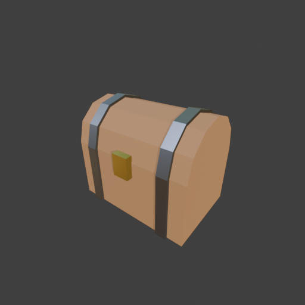

# Sohbet

- `ToolSearch` {"query": "select:mcp__blender__inspect_scene,mcp__blender__delete_object,mcp__blender__create_primitive,mcp__blender__create_mesh,mcp__blender__transform_object,mcp__blender__set_material,mcp__blender__assign_material,mcp__blender__frame_view,mcp__blender__capture_viewport,mcp__blender__export_gltf,mcp__blender__join_objects,mcp__blender__inspect_mesh", "max_results": 12}
- `mcp__blender__inspect_scene` {}
  > {"success":true,"tool":"inspect_scene","data":{"active_camera":"Camera","active_collection":"Collection","active_object":"Cube","collections":["Collection"],"counts":{"camera":1,"light":1,"mesh":1,"total":3},"objects":[{"is_linked":false,"name":"Camera","type":"CAMERA"},{"is_linked":false,"name":"Cu ... [156 more characters]
- `mcp__blender__delete_object` {"name": "Cube"}
  > {"success":true,"tool":"delete_object","data":{"deleted":true,"exists":false,"object_name":"Cube","type":"MESH","previous_state":{"location":[0,0,0],"rotation":[0,0,0],"scale":[1,1,1]}},"error":null}
- `mcp__blender__create_primitive` {"primitive_type": "CUBE", "name": "Body", "size": 1, "location": [0, 0, 0.225], "scale": [0.9, 0.6, 0.45]}
  > {"success":true,"tool":"create_primitive","data":{"created":true,"exists":true,"object_name":"Body","primitive_type":"CUBE","type":"MESH","location":[0,0,0.225],"rotation":[0,0,0],"scale":[0.9,0.6,0.45],"vertex_count":8,"face_count":6},"error":null}
- `mcp__blender__create_mesh` {"name": "Lid", "location": [0, 0, 0.45], "vertices": [[-0.45, 0.3, 0], [-0.45, 0.26, 0.15], [-0.45, 0.15, 0.26], [-0.45, 0, 0.3], [-0.45, -0.15, 0.26], [-0.45, -0.26, 0.15], [-0.45, -0.3, 0], [0.45, 0.3, 0], [0.45, 0.26, 0.15], [0.45, 0.15, 0.26], [0.45, 0, 0.3], [0.45, -0.15, 0.26], [0.45, -0.26, 0.15], [0.45, -0.3, 0]], "faces": [[0, 1, 8, 7], [1, 2, 9, 8], [2, 3, 10, 9], [3, 4, 11, 10], [4, 5, ... [91 more characters]
  > {"success":true,"tool":"create_mesh","data":{"object_name":"Lid","type":"MESH","exists":true,"location":[0,0,0.45],"rotation":[0,0,0],"scale":[1,1,1],"vertex_count":14,"face_count":9,"triangle_count":24,"local_bounds_min":[-0.45,-0.3,0],"local_bounds_max":[0.45,0.3,0.3],"dimensions":[0.9,0.6,0.3],"c ... [27 more characters]
- `mcp__blender__create_mesh` {"name": "BandLidL", "location": [-0.3, 0, 0.45], "vertices": [[-0.04, 0.32, 0], [-0.04, 0.277, 0.16], [-0.04, 0.16, 0.277], [-0.04, 0, 0.32], [-0.04, -0.16, 0.277], [-0.04, -0.277, 0.16], [-0.04, -0.32, 0], [0.04, 0.32, 0], [0.04, 0.277, 0.16], [0.04, 0.16, 0.277], [0.04, 0, 0.32], [0.04, -0.16, 0.277], [0.04, -0.277, 0.16], [0.04, -0.32, 0]], "faces": [[0, 1, 8, 7], [1, 2, 9, 8], [2, 3, 10, 9],  ... [113 more characters]
  > {"success":true,"tool":"create_mesh","data":{"object_name":"BandLidL","type":"MESH","exists":true,"location":[-0.3,0,0.45],"rotation":[0,0,0],"scale":[1,1,1],"vertex_count":14,"face_count":9,"triangle_count":24,"local_bounds_min":[-0.04,-0.32,0],"local_bounds_max":[0.04,0.32,0.32],"dimensions":[0.08 ... [41 more characters]
- `mcp__blender__create_primitive` {"primitive_type": "CUBE", "name": "BandBodyL", "size": 1, "location": [-0.3, 0, 0.225], "scale": [0.08, 0.64, 0.47]}
  > {"success":true,"tool":"create_primitive","data":{"created":true,"exists":true,"object_name":"BandBodyL","primitive_type":"CUBE","type":"MESH","location":[-0.3,0,0.225],"rotation":[0,0,0],"scale":[0.08,0.64,0.47],"vertex_count":8,"face_count":6},"error":null}
- `mcp__blender__create_primitive` {"primitive_type": "CUBE", "name": "Lock", "size": 1, "location": [0, -0.32, 0.42], "scale": [0.12, 0.05, 0.16]}
  > {"success":true,"tool":"create_primitive","data":{"created":true,"exists":true,"object_name":"Lock","primitive_type":"CUBE","type":"MESH","location":[0,-0.32,0.42],"rotation":[0,0,0],"scale":[0.12,0.05,0.16],"vertex_count":8,"face_count":6},"error":null}
- `mcp__blender__transform_object` {"name": "BandBodyL", "scale": [0.08, 0.64, 0.452], "location": [-0.3, 0, 0.226]}
  > {"success":true,"tool":"transform_object","data":{"object_name":"BandBodyL","relative":false,"exists":true,"before":{"location":[-0.3,0,0.225],"rotation":[0,0,0],"scale":[0.08,0.64,0.47]},"after":{"exists":true,"location":[-0.3,0,0.226],"rotation":[0,0,0],"scale":[0.08,0.64,0.452]},"actual":{"exists ... [124 more characters]
- `mcp__blender__create_primitive` {"primitive_type": "CUBE", "name": "BandBodyR", "size": 1, "location": [0.3, 0, 0.226], "scale": [0.08, 0.64, 0.452]}
  > {"success":true,"tool":"create_primitive","data":{"created":true,"exists":true,"object_name":"BandBodyR","primitive_type":"CUBE","type":"MESH","location":[0.3,0,0.226],"rotation":[0,0,0],"scale":[0.08,0.64,0.452],"vertex_count":8,"face_count":6},"error":null}
- `mcp__blender__create_mesh` {"name": "BandLidR", "location": [0.3, 0, 0.45], "vertices": [[-0.04, 0.32, 0], [-0.04, 0.277, 0.16], [-0.04, 0.16, 0.277], [-0.04, 0, 0.32], [-0.04, -0.16, 0.277], [-0.04, -0.277, 0.16], [-0.04, -0.32, 0], [0.04, 0.32, 0], [0.04, 0.277, 0.16], [0.04, 0.16, 0.277], [0.04, 0, 0.32], [0.04, -0.16, 0.277], [0.04, -0.277, 0.16], [0.04, -0.32, 0]], "faces": [[0, 1, 8, 7], [1, 2, 9, 8], [2, 3, 10, 9], [ ... [112 more characters]
  > {"success":true,"tool":"create_mesh","data":{"object_name":"BandLidR","type":"MESH","exists":true,"location":[0.3,0,0.45],"rotation":[0,0,0],"scale":[1,1,1],"vertex_count":14,"face_count":9,"triangle_count":24,"local_bounds_min":[-0.04,-0.32,0],"local_bounds_max":[0.04,0.32,0.32],"dimensions":[0.08, ... [40 more characters]
- `mcp__blender__set_material` {"object_name": "Body", "material_name": "Wood", "base_color": [0.4, 0.2, 0.08], "roughness": 0.8}
  > {"success":true,"tool":"set_material","data":{"material_name":"Wood","object_name":"Body","slot_index":0,"changed":["base_color","roughness"],"before":null,"after":{"assigned_objects":["Body"],"is_linked":false,"library_name":null,"material_name":"Wood","node_summary":{"node_count":2,"node_types":[" ... [605 more characters]
- `mcp__blender__set_material` {"object_name": "BandBodyL", "material_name": "Metal", "base_color": [0.35, 0.35, 0.38], "metallic": 1, "roughness": 0.4}
  > {"success":true,"tool":"set_material","data":{"material_name":"Metal","object_name":"BandBodyL","slot_index":0,"changed":["base_color","metallic","roughness"],"before":null,"after":{"assigned_objects":["BandBodyL"],"is_linked":false,"library_name":null,"material_name":"Metal","node_summary":{"node_c ... [638 more characters]
- `mcp__blender__set_material` {"object_name": "Lock", "material_name": "Gold", "base_color": [0.9, 0.65, 0.15], "metallic": 1, "roughness": 0.3}
  > {"success":true,"tool":"set_material","data":{"material_name":"Gold","object_name":"Lock","slot_index":0,"changed":["base_color","metallic","roughness"],"before":null,"after":{"assigned_objects":["Lock"],"is_linked":false,"library_name":null,"material_name":"Gold","node_summary":{"node_count":2,"nod ... [618 more characters]
- `mcp__blender__assign_material` {"object_name": "Lid", "material_name": "Wood"}
  > {"success":true,"tool":"assign_material","data":{"assigned":true,"object_name":"Lid","material_name":"Wood","slot_index":0,"before":{"material_name":null},"after":{"object_name":"Lid","slot_index":0,"material_name":"Wood"},"actual":{"object_name":"Lid","slot_index":0,"material_name":"Wood"}},"error" ... [6 more characters]
- `mcp__blender__assign_material` {"object_name": "BandBodyR", "material_name": "Metal"}
  > {"success":true,"tool":"assign_material","data":{"assigned":true,"object_name":"BandBodyR","material_name":"Metal","slot_index":0,"before":{"material_name":null},"after":{"object_name":"BandBodyR","slot_index":0,"material_name":"Metal"},"actual":{"object_name":"BandBodyR","slot_index":0,"material_na ... [27 more characters]
- `mcp__blender__assign_material` {"object_name": "BandLidL", "material_name": "Metal"}
  > {"success":true,"tool":"assign_material","data":{"assigned":true,"object_name":"BandLidL","material_name":"Metal","slot_index":0,"before":{"material_name":null},"after":{"object_name":"BandLidL","slot_index":0,"material_name":"Metal"},"actual":{"object_name":"BandLidL","slot_index":0,"material_name" ... [24 more characters]
- `mcp__blender__assign_material` {"object_name": "BandLidR", "material_name": "Metal"}
  > {"success":true,"tool":"assign_material","data":{"assigned":true,"object_name":"BandLidR","material_name":"Metal","slot_index":0,"before":{"material_name":null},"after":{"object_name":"BandLidR","slot_index":0,"material_name":"Metal"},"actual":{"object_name":"BandLidR","slot_index":0,"material_name" ... [24 more characters]
- `mcp__blender__frame_view` {"direction": "ISO", "shading": "MATERIAL", "overlays": false}
  > {"success":true,"tool":"frame_view","data":{"direction":"ISO","objects":["Body","Lid","BandLidL","BandBodyL","Lock","BandBodyR","BandLidR"],"center":[0,-0.013,0.385],"radius":0.679,"shading":"MATERIAL","overlays":false},"error":null}
**Ajan:** Parçalar ve malzemeler hazır; şimdi viewport görüntüsünü alıp kontrol ediyorum.

- `mcp__blender__capture_viewport` {}
  
  > [Image: source: C:\Users\Halil Emre\.claude\projects\C--Users-Halil-Emre-Desktop-GitHub-Public-Blender-Copilot-archives-bench-runs-20260930-012028-chest\1f8f7e79-5b35-4927-a6ec-49277f263f73\tool-results\mcp-blender-blob-1790720486192-7qrdav.png]
  > {"success":true,"tool":"capture_viewport","data":{"image_id":"vp_622ac8435c2d","width":512,"height":512,"format":"PNG","mime_type":"image/png","byte_size":99363,"channels":4},"error":null}
**Ajan:** Görüntü iyi: kubbe, bantlar ve kilit doğru yerde. Parçaları birleştirip dışa aktarıyorum.

- `mcp__blender__join_objects` {"object_names": ["Body", "Lid", "BandLidL", "BandLidR", "BandBodyL", "BandBodyR", "Lock"], "target_name": "Body", "new_name": "Chest"}
  > {"success":true,"tool":"join_objects","data":{"object_name":"Chest","type":"MESH","exists":true,"location":[0,0,0.225],"rotation":[0,0,0],"scale":[0.9,0.6,0.45],"vertex_count":74,"face_count":51,"triangle_count":120,"local_bounds_min":[-0.5,-0.575,-0.5],"local_bounds_max":[0.5,0.5333,1.2111],"dimens ... [114 more characters]
- `ToolSearch` {"query": "select:mcp__blender__apply_transform,mcp__blender__set_origin", "max_results": 2}
- `mcp__blender__apply_transform` {"object_name": "Chest"}
  > {"success":true,"tool":"apply_transform","data":{"object_name":"Chest","type":"MESH","exists":true,"location":[0,0,0.225],"rotation":[0,0,0],"scale":[1,1,1],"vertex_count":74,"face_count":51,"triangle_count":120,"local_bounds_min":[-0.45,-0.345,-0.225],"local_bounds_max":[0.45,0.32,0.545],"dimension ... [34 more characters]
- `mcp__blender__set_origin` {"object_name": "Chest", "mode": "BOTTOM_CENTER"}
  > {"success":true,"tool":"set_origin","data":{"object_name":"Chest","type":"MESH","exists":true,"location":[0,-0.0125,0],"rotation":[0,0,0],"scale":[1,1,1],"vertex_count":74,"face_count":51,"triangle_count":120,"local_bounds_min":[-0.45,-0.3325,0],"local_bounds_max":[0.45,0.3325,0.77],"dimensions":[0. ... [58 more characters]
- `mcp__blender__export_gltf` {"object_names": ["Chest"], "filename": "chest.glb"}
  > {"success":true,"tool":"export_gltf","data":{"path":"C:\\Users\\Halil Emre\\Desktop\\GitHub\\Public\\Blender Copilot\\archives\\bench-runs\\20260930-012028-chest\\chest.glb","filename":"chest.glb","bytes":8592,"objects":["Chest"],"triangle_count":120,"format":"GLB","y_up":true,"recentered":true},"er ... [10 more characters]
**Ajan:** Hazine sandığı hazır ve `chest.glb` olarak dışa aktarıldı. Toplam **120 üçgen**, yani ~3000'lik low-poly bütçesinin çok altında.

**Yaptıklarım:**
- Varsayılan Cube'u sildim.
- **Ahşap gövde:** 0.9 × 0.6 × 0.45 m boyutunda bir kutu, koyu kahverengi mat "Wood" malzemesiyle.
- **Kubbeli kapak:** 6 dilimli yarım silindiri kendi köşe noktalarımla oluşturdum ve gövdenin üstüne oturttum. Bu da "Wood" malzemesini kullanıyor.
- **Metal bantlar:** Sol ve sağda ikişer parça. Gövdeyi saran ince kutular ve kapak kavisini izleyen, kapaktan biraz daha geniş kavisli bantlar. Malzemesi gri "Metal" (metallic 1, roughness 0.4).
- **Kilit:** Ön yüzde, kapakla gövdenin birleştiği yerde duran altın rengi bir blok ("Gold").
- Viewport'ta ISO açıdan ve malzeme görünümünde kontrol ettim. Kubbe, bantlar ve kilit doğru yerde duruyordu. Bu görüntüyü tüm parçalar ayrıyken aldım; birleştirmeden sonra tekrar bakmadım.
- Tüm parçaları tek bir `Chest` nesnesinde birleştirdim. Ölçeği mesh'e işledim ve origin'i tabanın ortasına koydum, böylece model oyunda zeminde duruyor.

**Sonuç:** Boyutlar 0.9 × 0.665 × 0.77 m, 3 malzeme. Dosya Y-up olarak kaydedildi:
`C:\Users\Halil Emre\Desktop\GitHub\Public\Blender Copilot\archives\bench-runs\20260930-012028-chest\chest.glb` (8.6 KB)

Kapak ayrı bir parça değil, gövdeyle birleşik. Oyunda açılması gerekiyorsa kapağı ayrı bir nesne olarak da verebilirim.

---
**Sonuç:** Hazine sandığı hazır ve `chest.glb` olarak dışa aktarıldı. Toplam **120 üçgen**, yani ~3000'lik low-poly bütçesinin çok altında.

**Yaptıklarım:**
- Varsayılan Cube'u sildim.
- **Ahşap gövde:** 0.9 × 0.6 × 0.45 m boyutunda bir kutu, koyu kahverengi mat "Wood" malzemesiyle.
- **Kubbeli kapak:** 6 dilimli yarım silindiri kendi köşe noktalarımla oluşturdum ve gövdenin üstüne oturttum. Bu da "Wood" malzemesini kullanıyor.
- **Metal bantlar:** Sol ve sağda ikişer parça. Gövdeyi saran ince kutular ve kapak kavisini izleyen, kapaktan biraz daha geniş kavisli bantlar. Malzemesi gri "Metal" (metallic 1, roughness 0.4).
- **Kilit:** Ön yüzde, kapakla gövdenin birleştiği yerde duran altın rengi bir blok ("Gold").
- Viewport'ta ISO açıdan ve malzeme görünümünde kontrol ettim. Kubbe, bantlar ve kilit doğru yerde duruyordu. Bu görüntüyü tüm parçalar ayrıyken aldım; birleştirmeden sonra tekrar bakmadım.
- Tüm parçaları tek bir `Chest` nesnesinde birleştirdim. Ölçeği mesh'e işledim ve origin'i tabanın ortasına koydum, böylece model oyunda zeminde duruyor.

**Sonuç:** Boyutlar 0.9 × 0.665 × 0.77 m, 3 malzeme. Dosya Y-up olarak kaydedildi:
`C:\Users\Halil Emre\Desktop\GitHub\Public\Blender Copilot\archives\bench-runs\20260930-012028-chest\chest.glb` (8.6 KB)

Kapak ayrı bir parça değil, gövdeyle birleşik. Oyunda açılması gerekiyorsa kapağı ayrı bir nesne olarak da verebilirim.
