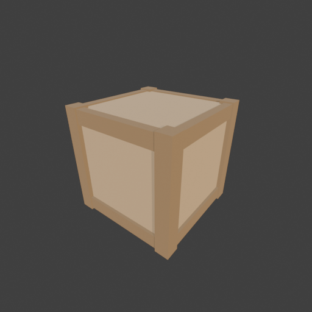

# Sohbet

- `ToolSearch` {"query": "select:mcp__blender__inspect_scene,mcp__blender__delete_object,mcp__blender__create_primitive,mcp__blender__transform_object,mcp__blender__set_material,mcp__blender__join_objects,mcp__blender__frame_view,mcp__blender__capture_viewport,mcp__blender__export_gltf,mcp__blender__set_origin,mcp__blender__assign_material,mcp__blender__apply_transform,mcp__blender__inspect_mesh", "max_results": ... [4 more characters]
- `mcp__blender__inspect_scene` {}
  > {"success":true,"tool":"inspect_scene","data":{"active_camera":"Camera","active_collection":"Collection","active_object":"Cube","collections":["Collection"],"counts":{"camera":1,"light":1,"mesh":1,"total":3},"objects":[{"is_linked":false,"name":"Camera","type":"CAMERA"},{"is_linked":false,"name":"Cu ... [156 more characters]
- `mcp__blender__delete_object` {"name": "Cube"}
  > {"success":true,"tool":"delete_object","data":{"deleted":true,"exists":false,"object_name":"Cube","type":"MESH","previous_state":{"location":[0,0,0],"rotation":[0,0,0],"scale":[1,1,1]}},"error":null}
- `mcp__blender__create_primitive` {"primitive_type": "CUBE", "name": "Crate", "size": 1, "location": [0, 0, 0.4], "scale": [0.76, 0.76, 0.76]}
  > {"success":true,"tool":"create_primitive","data":{"created":true,"exists":true,"object_name":"Crate","primitive_type":"CUBE","type":"MESH","location":[0,0,0.4],"rotation":[0,0,0],"scale":[0.76,0.76,0.76],"vertex_count":8,"face_count":6},"error":null}
- `mcp__blender__create_primitive` {"primitive_type": "CUBE", "name": "Post1", "size": 1, "location": [0.36, 0.36, 0.4], "scale": [0.1, 0.1, 0.8]}
  > {"success":true,"tool":"create_primitive","data":{"created":true,"exists":true,"object_name":"Post1","primitive_type":"CUBE","type":"MESH","location":[0.36,0.36,0.4],"rotation":[0,0,0],"scale":[0.1,0.1,0.8],"vertex_count":8,"face_count":6},"error":null}
- `mcp__blender__create_primitive` {"primitive_type": "CUBE", "name": "Post2", "size": 1, "location": [-0.36, 0.36, 0.4], "scale": [0.1, 0.1, 0.8]}
  > {"success":true,"tool":"create_primitive","data":{"created":true,"exists":true,"object_name":"Post2","primitive_type":"CUBE","type":"MESH","location":[-0.36,0.36,0.4],"rotation":[0,0,0],"scale":[0.1,0.1,0.8],"vertex_count":8,"face_count":6},"error":null}
- `mcp__blender__create_primitive` {"primitive_type": "CUBE", "name": "Post3", "size": 1, "location": [0.36, -0.36, 0.4], "scale": [0.1, 0.1, 0.8]}
  > {"success":true,"tool":"create_primitive","data":{"created":true,"exists":true,"object_name":"Post3","primitive_type":"CUBE","type":"MESH","location":[0.36,-0.36,0.4],"rotation":[0,0,0],"scale":[0.1,0.1,0.8],"vertex_count":8,"face_count":6},"error":null}
- `mcp__blender__create_primitive` {"primitive_type": "CUBE", "name": "Post4", "size": 1, "location": [-0.36, -0.36, 0.4], "scale": [0.1, 0.1, 0.8]}
  > {"success":true,"tool":"create_primitive","data":{"created":true,"exists":true,"object_name":"Post4","primitive_type":"CUBE","type":"MESH","location":[-0.36,-0.36,0.4],"rotation":[0,0,0],"scale":[0.1,0.1,0.8],"vertex_count":8,"face_count":6},"error":null}
- `mcp__blender__create_primitive` {"primitive_type": "CUBE", "name": "BX1", "size": 1, "location": [0, 0.37, 0.06], "scale": [0.62, 0.06, 0.1]}
  > {"success":true,"tool":"create_primitive","data":{"created":true,"exists":true,"object_name":"BX1","primitive_type":"CUBE","type":"MESH","location":[0,0.37,0.06],"rotation":[0,0,0],"scale":[0.62,0.06,0.1],"vertex_count":8,"face_count":6},"error":null}
- `mcp__blender__create_primitive` {"primitive_type": "CUBE", "name": "BX2", "size": 1, "location": [0, -0.37, 0.06], "scale": [0.62, 0.06, 0.1]}
  > {"success":true,"tool":"create_primitive","data":{"created":true,"exists":true,"object_name":"BX2","primitive_type":"CUBE","type":"MESH","location":[0,-0.37,0.06],"rotation":[0,0,0],"scale":[0.62,0.06,0.1],"vertex_count":8,"face_count":6},"error":null}
- `mcp__blender__create_primitive` {"primitive_type": "CUBE", "name": "BX3", "size": 1, "location": [0, 0.37, 0.74], "scale": [0.62, 0.06, 0.1]}
  > {"success":true,"tool":"create_primitive","data":{"created":true,"exists":true,"object_name":"BX3","primitive_type":"CUBE","type":"MESH","location":[0,0.37,0.74],"rotation":[0,0,0],"scale":[0.62,0.06,0.1],"vertex_count":8,"face_count":6},"error":null}
- `mcp__blender__create_primitive` {"primitive_type": "CUBE", "name": "BX4", "size": 1, "location": [0, -0.37, 0.74], "scale": [0.62, 0.06, 0.1]}
  > {"success":true,"tool":"create_primitive","data":{"created":true,"exists":true,"object_name":"BX4","primitive_type":"CUBE","type":"MESH","location":[0,-0.37,0.74],"rotation":[0,0,0],"scale":[0.62,0.06,0.1],"vertex_count":8,"face_count":6},"error":null}
- `mcp__blender__create_primitive` {"primitive_type": "CUBE", "name": "BY1", "size": 1, "location": [0.37, 0, 0.06], "scale": [0.06, 0.62, 0.1]}
  > {"success":true,"tool":"create_primitive","data":{"created":true,"exists":true,"object_name":"BY1","primitive_type":"CUBE","type":"MESH","location":[0.37,0,0.06],"rotation":[0,0,0],"scale":[0.06,0.62,0.1],"vertex_count":8,"face_count":6},"error":null}
- `mcp__blender__create_primitive` {"primitive_type": "CUBE", "name": "BY2", "size": 1, "location": [-0.37, 0, 0.06], "scale": [0.06, 0.62, 0.1]}
  > {"success":true,"tool":"create_primitive","data":{"created":true,"exists":true,"object_name":"BY2","primitive_type":"CUBE","type":"MESH","location":[-0.37,0,0.06],"rotation":[0,0,0],"scale":[0.06,0.62,0.1],"vertex_count":8,"face_count":6},"error":null}
- `mcp__blender__create_primitive` {"primitive_type": "CUBE", "name": "BY3", "size": 1, "location": [0.37, 0, 0.74], "scale": [0.06, 0.62, 0.1]}
  > {"success":true,"tool":"create_primitive","data":{"created":true,"exists":true,"object_name":"BY3","primitive_type":"CUBE","type":"MESH","location":[0.37,0,0.74],"rotation":[0,0,0],"scale":[0.06,0.62,0.1],"vertex_count":8,"face_count":6},"error":null}
- `mcp__blender__create_primitive` {"primitive_type": "CUBE", "name": "BY4", "size": 1, "location": [-0.37, 0, 0.74], "scale": [0.06, 0.62, 0.1]}
  > {"success":true,"tool":"create_primitive","data":{"created":true,"exists":true,"object_name":"BY4","primitive_type":"CUBE","type":"MESH","location":[-0.37,0,0.74],"rotation":[0,0,0],"scale":[0.06,0.62,0.1],"vertex_count":8,"face_count":6},"error":null}
- `mcp__blender__set_material` {"material_name": "WoodPlank", "base_color": [0.55, 0.36, 0.18], "roughness": 0.85}
  > {"success":true,"tool":"set_material","data":{"material_name":"WoodPlank","object_name":null,"slot_index":null,"changed":["base_color","roughness"],"before":null,"after":{"assigned_objects":[],"is_linked":false,"library_name":null,"material_name":"WoodPlank","node_summary":{"node_count":2,"node_type ... [615 more characters]
- `mcp__blender__set_material` {"material_name": "WoodFrame", "base_color": [0.3, 0.18, 0.08], "roughness": 0.9}
  > {"success":true,"tool":"set_material","data":{"material_name":"WoodFrame","object_name":null,"slot_index":null,"changed":["base_color","roughness"],"before":null,"after":{"assigned_objects":[],"is_linked":false,"library_name":null,"material_name":"WoodFrame","node_summary":{"node_count":2,"node_type ... [611 more characters]
**Ajan:** Materyalleri atıyorum.

- `mcp__blender__assign_material` {"object_name": "Crate", "material_name": "WoodPlank"}
  > {"success":true,"tool":"assign_material","data":{"assigned":true,"object_name":"Crate","material_name":"WoodPlank","slot_index":0,"before":{"material_name":null},"after":{"object_name":"Crate","slot_index":0,"material_name":"WoodPlank"},"actual":{"object_name":"Crate","slot_index":0,"material_name": ... [27 more characters]
- `mcp__blender__assign_material` {"object_name": "Post1", "material_name": "WoodFrame"}
  > {"success":true,"tool":"assign_material","data":{"assigned":true,"object_name":"Post1","material_name":"WoodFrame","slot_index":0,"before":{"material_name":null},"after":{"object_name":"Post1","slot_index":0,"material_name":"WoodFrame"},"actual":{"object_name":"Post1","slot_index":0,"material_name": ... [27 more characters]
- `mcp__blender__assign_material` {"object_name": "Post2", "material_name": "WoodFrame"}
  > {"success":true,"tool":"assign_material","data":{"assigned":true,"object_name":"Post2","material_name":"WoodFrame","slot_index":0,"before":{"material_name":null},"after":{"object_name":"Post2","slot_index":0,"material_name":"WoodFrame"},"actual":{"object_name":"Post2","slot_index":0,"material_name": ... [27 more characters]
- `mcp__blender__assign_material` {"object_name": "Post3", "material_name": "WoodFrame"}
  > {"success":true,"tool":"assign_material","data":{"assigned":true,"object_name":"Post3","material_name":"WoodFrame","slot_index":0,"before":{"material_name":null},"after":{"object_name":"Post3","slot_index":0,"material_name":"WoodFrame"},"actual":{"object_name":"Post3","slot_index":0,"material_name": ... [27 more characters]
- `mcp__blender__assign_material` {"object_name": "Post4", "material_name": "WoodFrame"}
  > {"success":true,"tool":"assign_material","data":{"assigned":true,"object_name":"Post4","material_name":"WoodFrame","slot_index":0,"before":{"material_name":null},"after":{"object_name":"Post4","slot_index":0,"material_name":"WoodFrame"},"actual":{"object_name":"Post4","slot_index":0,"material_name": ... [27 more characters]
- `mcp__blender__assign_material` {"object_name": "BX1", "material_name": "WoodFrame"}
  > {"success":true,"tool":"assign_material","data":{"assigned":true,"object_name":"BX1","material_name":"WoodFrame","slot_index":0,"before":{"material_name":null},"after":{"object_name":"BX1","slot_index":0,"material_name":"WoodFrame"},"actual":{"object_name":"BX1","slot_index":0,"material_name":"WoodF ... [21 more characters]
- `mcp__blender__assign_material` {"object_name": "BX2", "material_name": "WoodFrame"}
  > {"success":true,"tool":"assign_material","data":{"assigned":true,"object_name":"BX2","material_name":"WoodFrame","slot_index":0,"before":{"material_name":null},"after":{"object_name":"BX2","slot_index":0,"material_name":"WoodFrame"},"actual":{"object_name":"BX2","slot_index":0,"material_name":"WoodF ... [21 more characters]
- `mcp__blender__assign_material` {"object_name": "BX3", "material_name": "WoodFrame"}
  > {"success":true,"tool":"assign_material","data":{"assigned":true,"object_name":"BX3","material_name":"WoodFrame","slot_index":0,"before":{"material_name":null},"after":{"object_name":"BX3","slot_index":0,"material_name":"WoodFrame"},"actual":{"object_name":"BX3","slot_index":0,"material_name":"WoodF ... [21 more characters]
- `mcp__blender__assign_material` {"object_name": "BX4", "material_name": "WoodFrame"}
  > {"success":true,"tool":"assign_material","data":{"assigned":true,"object_name":"BX4","material_name":"WoodFrame","slot_index":0,"before":{"material_name":null},"after":{"object_name":"BX4","slot_index":0,"material_name":"WoodFrame"},"actual":{"object_name":"BX4","slot_index":0,"material_name":"WoodF ... [21 more characters]
- `mcp__blender__assign_material` {"object_name": "BY1", "material_name": "WoodFrame"}
  > {"success":true,"tool":"assign_material","data":{"assigned":true,"object_name":"BY1","material_name":"WoodFrame","slot_index":0,"before":{"material_name":null},"after":{"object_name":"BY1","slot_index":0,"material_name":"WoodFrame"},"actual":{"object_name":"BY1","slot_index":0,"material_name":"WoodF ... [21 more characters]
- `mcp__blender__assign_material` {"object_name": "BY2", "material_name": "WoodFrame"}
  > {"success":true,"tool":"assign_material","data":{"assigned":true,"object_name":"BY2","material_name":"WoodFrame","slot_index":0,"before":{"material_name":null},"after":{"object_name":"BY2","slot_index":0,"material_name":"WoodFrame"},"actual":{"object_name":"BY2","slot_index":0,"material_name":"WoodF ... [21 more characters]
- `mcp__blender__assign_material` {"object_name": "BY3", "material_name": "WoodFrame"}
  > {"success":true,"tool":"assign_material","data":{"assigned":true,"object_name":"BY3","material_name":"WoodFrame","slot_index":0,"before":{"material_name":null},"after":{"object_name":"BY3","slot_index":0,"material_name":"WoodFrame"},"actual":{"object_name":"BY3","slot_index":0,"material_name":"WoodF ... [21 more characters]
- `mcp__blender__assign_material` {"object_name": "BY4", "material_name": "WoodFrame"}
  > {"success":true,"tool":"assign_material","data":{"assigned":true,"object_name":"BY4","material_name":"WoodFrame","slot_index":0,"before":{"material_name":null},"after":{"object_name":"BY4","slot_index":0,"material_name":"WoodFrame"},"actual":{"object_name":"BY4","slot_index":0,"material_name":"WoodF ... [21 more characters]
- `mcp__blender__join_objects` {"object_names": ["Crate", "Post1", "Post2", "Post3", "Post4", "BX1", "BX2", "BX3", "BX4", "BY1", "BY2", "BY3", "BY4"], "target_name": "Crate"}
  > {"success":true,"tool":"join_objects","data":{"object_name":"Crate","type":"MESH","exists":true,"location":[0,0,0.4],"rotation":[0,0,0],"scale":[0.76,0.76,0.76],"vertex_count":104,"face_count":78,"triangle_count":156,"local_bounds_min":[-0.5395,-0.5395,-0.5263],"local_bounds_max":[0.5395,0.5395,0.52 ... [146 more characters]
- `mcp__blender__apply_transform` {"object_name": "Crate"}
  > {"success":true,"tool":"apply_transform","data":{"object_name":"Crate","type":"MESH","exists":true,"location":[0,0,0.4],"rotation":[0,0,0],"scale":[1,1,1],"vertex_count":104,"face_count":78,"triangle_count":156,"local_bounds_min":[-0.41,-0.41,-0.4],"local_bounds_max":[0.41,0.41,0.4],"dimensions":[0. ... [27 more characters]
- `mcp__blender__set_origin` {"object_name": "Crate", "mode": "BOTTOM_CENTER"}
  > {"success":true,"tool":"set_origin","data":{"object_name":"Crate","type":"MESH","exists":true,"location":[0,0,0],"rotation":[0,0,0],"scale":[1,1,1],"vertex_count":104,"face_count":78,"triangle_count":156,"local_bounds_min":[-0.41,-0.41,0],"local_bounds_max":[0.41,0.41,0.8],"dimensions":[0.82,0.82,0. ... [47 more characters]
- `mcp__blender__frame_view` {"direction": "ISO", "shading": "MATERIAL", "overlays": false}
  > {"success":true,"tool":"frame_view","data":{"direction":"ISO","objects":["Crate"],"center":[0,0,0.4],"radius":0.704,"shading":"MATERIAL","overlays":false},"error":null}
- `mcp__blender__capture_viewport` {}
  
  > [Image: source: C:\Users\Halil Emre\.claude\projects\C--Users-Halil-Emre-Desktop-GitHub-Public-Blender-Copilot-archives-bench-runs-20260930-010632-crate\2ececf91-2c01-438d-84a0-f0799ee4cd49\tool-results\mcp-blender-blob-1790719645570-bkyxbz.png]
  > {"success":true,"tool":"capture_viewport","data":{"image_id":"vp_e231788a4de2","width":512,"height":512,"format":"PNG","mime_type":"image/png","byte_size":96992,"channels":4},"error":null}
**Ajan:** Görünüm iyi: çerçeveli bir sandık, ölçüler ve oranlar doğru. Dışa aktarıyorum.

- `mcp__blender__export_gltf` {"object_names": ["Crate"], "filename": "crate.glb"}
  > {"success":true,"tool":"export_gltf","data":{"path":"C:\\Users\\Halil Emre\\Desktop\\GitHub\\Public\\Blender Copilot\\archives\\bench-runs\\20260930-010632-crate\\crate.glb","filename":"crate.glb","bytes":10280,"objects":["Crate"],"triangle_count":156,"format":"GLB","y_up":true,"recentered":true},"e ... [11 more characters]
**Ajan:** Sandık hazır ve `crate.glb` olarak dışa aktarıldı: `C:\Users\Halil Emre\Desktop\GitHub\Public\Blender Copilot\archives\bench-runs\20260930-010632-crate\crate.glb`

**Üçgen sayısı: 156.** Düşük poligonlu bir obje için ~3000 üçgen sınırının çok altında.

**Ne yaptım:**
- Varsayılan Cube'u sildim.
- Sandığın gövdesini 0,76 m'lik bir küp olarak yaptım. Üstüne 4 dikey köşe dikmesi ile üstte ve altta etrafı saran 8 yatay tahta ekledim. Çerçeve gövdeden biraz dışarı taşıyor.
- İki mat ahşap malzeme kullandım: gövdede açık kahve "WoodPlank", çerçevede koyu kahve "WoodFrame".
- Bütün parçaları tek bir `Crate` objesinde birleştirdim ve ölçeği modele işledim. Orijini alt ortaya koydum, böylece sandık oyunda zeminin üstünde duruyor.
- Toplam boyut 0,82 × 0,82 × 0,80 m, yani gerçek bir sandık ölçüsünde.
- Viewport'ta ISO açıdan ve malzeme görünümünde kendim baktım. Çerçeve ve paneller düzgün görünüyor.
- Dosya Y-up (Y ekseni yukarı) olarak ve modelin orijini dünya merkezine alınarak kaydedildi.

Modelde UV açılmadı, sadece düz renkler var. Ahşap dokusu eklemek isterseniz önce UV açmak gerekecek.

---
**Sonuç:** Sandık hazır ve `crate.glb` olarak dışa aktarıldı: `C:\Users\Halil Emre\Desktop\GitHub\Public\Blender Copilot\archives\bench-runs\20260930-010632-crate\crate.glb`

**Üçgen sayısı: 156.** Düşük poligonlu bir obje için ~3000 üçgen sınırının çok altında.

**Ne yaptım:**
- Varsayılan Cube'u sildim.
- Sandığın gövdesini 0,76 m'lik bir küp olarak yaptım. Üstüne 4 dikey köşe dikmesi ile üstte ve altta etrafı saran 8 yatay tahta ekledim. Çerçeve gövdeden biraz dışarı taşıyor.
- İki mat ahşap malzeme kullandım: gövdede açık kahve "WoodPlank", çerçevede koyu kahve "WoodFrame".
- Bütün parçaları tek bir `Crate` objesinde birleştirdim ve ölçeği modele işledim. Orijini alt ortaya koydum, böylece sandık oyunda zeminin üstünde duruyor.
- Toplam boyut 0,82 × 0,82 × 0,80 m, yani gerçek bir sandık ölçüsünde.
- Viewport'ta ISO açıdan ve malzeme görünümünde kendim baktım. Çerçeve ve paneller düzgün görünüyor.
- Dosya Y-up (Y ekseni yukarı) olarak ve modelin orijini dünya merkezine alınarak kaydedildi.

Modelde UV açılmadı, sadece düz renkler var. Ahşap dokusu eklemek isterseniz önce UV açmak gerekecek.
