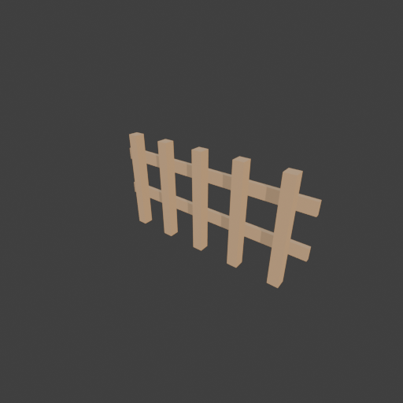

# Sohbet

- `ToolSearch` {"query": "select:mcp__blender__inspect_scene,mcp__blender__delete_object,mcp__blender__create_primitive,mcp__blender__duplicate_object,mcp__blender__join_objects,mcp__blender__set_material,mcp__blender__frame_view,mcp__blender__capture_viewport,mcp__blender__export_gltf,mcp__blender__set_origin,mcp__blender__transform_object,mcp__blender__inspect_mesh,mcp__blender__apply_transform", "max_results" ... [5 more characters]
- `mcp__blender__delete_object` {"name": "Cube"}
  > {"success":true,"tool":"delete_object","data":{"deleted":true,"exists":false,"object_name":"Cube","type":"MESH","previous_state":{"location":[0,0,0],"rotation":[0,0,0],"scale":[1,1,1]}},"error":null}
- `mcp__blender__create_primitive` {"primitive_type": "CUBE", "name": "Post1", "size": 1, "location": [-0.8, 0, 0.5], "scale": [0.1, 0.1, 1]}
  > {"success":true,"tool":"create_primitive","data":{"created":true,"exists":true,"object_name":"Post1","primitive_type":"CUBE","type":"MESH","location":[-0.8,0,0.5],"rotation":[0,0,0],"scale":[0.1,0.1,1],"vertex_count":8,"face_count":6},"error":null}
- `mcp__blender__duplicate_object` {"source_name": "Post1", "new_name": "Post2", "location": [-0.4, 0, 0.5]}
  > {"success":true,"tool":"duplicate_object","data":{"duplicated":true,"source_name":"Post1","new_name":"Post2","source_exists":true,"new_exists":true,"type":"MESH","location":[-0.4,0,0.5],"rotation":[0,0,0],"scale":[0.1,0.1,1],"source_location":[-0.8,0,0.5],"source_rotation":[0,0,0],"source_scale":[0. ... [196 more characters]
- `mcp__blender__duplicate_object` {"source_name": "Post1", "new_name": "Post3", "location": [0, 0, 0.5]}
  > {"success":true,"tool":"duplicate_object","data":{"duplicated":true,"source_name":"Post1","new_name":"Post3","source_exists":true,"new_exists":true,"type":"MESH","location":[0,0,0.5],"rotation":[0,0,0],"scale":[0.1,0.1,1],"source_location":[-0.8,0,0.5],"source_rotation":[0,0,0],"source_scale":[0.1,0 ... [193 more characters]
- `mcp__blender__duplicate_object` {"source_name": "Post1", "new_name": "Post4", "location": [0.4, 0, 0.5]}
  > {"success":true,"tool":"duplicate_object","data":{"duplicated":true,"source_name":"Post1","new_name":"Post4","source_exists":true,"new_exists":true,"type":"MESH","location":[0.4,0,0.5],"rotation":[0,0,0],"scale":[0.1,0.1,1],"source_location":[-0.8,0,0.5],"source_rotation":[0,0,0],"source_scale":[0.1 ... [195 more characters]
- `mcp__blender__duplicate_object` {"source_name": "Post1", "new_name": "Post5", "location": [0.8, 0, 0.5]}
  > {"success":true,"tool":"duplicate_object","data":{"duplicated":true,"source_name":"Post1","new_name":"Post5","source_exists":true,"new_exists":true,"type":"MESH","location":[0.8,0,0.5],"rotation":[0,0,0],"scale":[0.1,0.1,1],"source_location":[-0.8,0,0.5],"source_rotation":[0,0,0],"source_scale":[0.1 ... [195 more characters]
- `mcp__blender__create_primitive` {"primitive_type": "CUBE", "name": "RailLow", "size": 1, "location": [0, 0.07, 0.35], "scale": [2, 0.04, 0.12]}
  > {"success":true,"tool":"create_primitive","data":{"created":true,"exists":true,"object_name":"RailLow","primitive_type":"CUBE","type":"MESH","location":[0,0.07,0.35],"rotation":[0,0,0],"scale":[2,0.04,0.12],"vertex_count":8,"face_count":6},"error":null}
- `mcp__blender__create_primitive` {"primitive_type": "CUBE", "name": "RailHigh", "size": 1, "location": [0, 0.07, 0.75], "scale": [2, 0.04, 0.12]}
  > {"success":true,"tool":"create_primitive","data":{"created":true,"exists":true,"object_name":"RailHigh","primitive_type":"CUBE","type":"MESH","location":[0,0.07,0.75],"rotation":[0,0,0],"scale":[2,0.04,0.12],"vertex_count":8,"face_count":6},"error":null}
**Ajan:** Join with Post3 (center) as target, then material, origin.

- `mcp__blender__join_objects` {"object_names": ["Post1", "Post2", "Post3", "Post4", "Post5", "RailLow", "RailHigh"], "target_name": "Post3", "new_name": "Fence"}
  > {"success":true,"tool":"join_objects","data":{"object_name":"Fence","type":"MESH","exists":true,"location":[0,0,0.5],"rotation":[0,0,0],"scale":[0.1,0.1,1],"vertex_count":56,"face_count":42,"triangle_count":84,"local_bounds_min":[-10,-0.5,-0.5],"local_bounds_max":[10,0.9,0.5],"dimensions":[2,0.14,1] ... [87 more characters]
- `mcp__blender__apply_transform` {"object_name": "Fence"}
  > {"success":true,"tool":"apply_transform","data":{"object_name":"Fence","type":"MESH","exists":true,"location":[0,0,0.5],"rotation":[0,0,0],"scale":[1,1,1],"vertex_count":56,"face_count":42,"triangle_count":84,"local_bounds_min":[-1,-0.05,-0.5],"local_bounds_max":[1,0.09,0.5],"dimensions":[2,0.14,1]} ... [14 more characters]
- `mcp__blender__set_origin` {"object_name": "Fence"}
  > {"success":true,"tool":"set_origin","data":{"object_name":"Fence","type":"MESH","exists":true,"location":[0,0.02,0],"rotation":[0,0,0],"scale":[1,1,1],"vertex_count":56,"face_count":42,"triangle_count":84,"local_bounds_min":[-1,-0.07,0],"local_bounds_max":[1,0.07,1],"dimensions":[2,0.14,1],"origin_m ... [35 more characters]
- `mcp__blender__set_material` {"object_name": "Fence", "material_name": "Wood", "base_color": [0.45, 0.28, 0.14], "roughness": 0.85}
  > {"success":true,"tool":"set_material","data":{"material_name":"Wood","object_name":"Fence","slot_index":0,"changed":["base_color","roughness"],"before":null,"after":{"assigned_objects":["Fence"],"is_linked":false,"library_name":null,"material_name":"Wood","node_summary":{"node_count":2,"node_types": ... [614 more characters]
- `mcp__blender__frame_view` {"direction": "ISO", "shading": "MATERIAL", "overlays": false}
  > {"success":true,"tool":"frame_view","data":{"direction":"ISO","objects":["Fence"],"center":[0,0.02,0.5],"radius":1.12,"shading":"MATERIAL","overlays":false},"error":null}
- `mcp__blender__capture_viewport` {}
  
  > [Image: source: C:\Users\Halil Emre\.claude\projects\C--Users-Halil-Emre-Desktop-GitHub-Public-Blender-Copilot-archives-bench-runs-20260930-012457-fence\bcc83a1b-0e02-4288-b42f-058425fe0402\tool-results\mcp-blender-blob-1790720730794-rdg6h1.png]
  > {"success":true,"tool":"capture_viewport","data":{"image_id":"vp_8afa2cfa3ab4","width":512,"height":512,"format":"PNG","mime_type":"image/png","byte_size":82435,"channels":4},"error":null}
- `mcp__blender__export_gltf` {"object_names": ["Fence"], "filename": "fence.glb"}
  > {"success":true,"tool":"export_gltf","data":{"path":"C:\\Users\\Halil Emre\\Desktop\\GitHub\\Public\\Blender Copilot\\archives\\bench-runs\\20260930-012457-fence\\fence.glb","filename":"fence.glb","bytes":5596,"objects":["Fence"],"triangle_count":84,"format":"GLB","y_up":true,"recentered":true},"err ... [9 more characters]
**Ajan:** Çit hazır ve `fence.glb` olarak dışa aktarıldı. Toplam **84 üçgen**.

**Yaptıklarım:**
- Varsayılan Cube'u sildim.
- 1 m yüksekliğinde, 10×10 cm kesitli 5 kazık koydum. Kazıklar X ekseninde 0,4 m aralıkla −0,8 ile +0,8 arasında duruyor.
- 2 m uzunluğunda, 12 cm yüksekliğinde ve 4 cm kalınlığında iki yatay tahta ekledim. Tahtalar 0,35 m ve 0,75 m yükseklikte, kazıkların ön yüzüne dayalı.
- Parçaları tek bir `Fence` nesnesinde birleştirdim. Dönüşümleri modele işledim, pivotu tabanın ortasına aldım ve mat kahverengi bir `Wood` malzemesi verdim.
- Toplam genişlik tam 2 m. Tahtalar kenara kadar uzanıyor, kenardaki kazıklar ise kenara 0,2 m uzakta. Bu yüzden çitleri 2 m aralıkla yan yana koyduğunuzda ek yerlerinde de kazık aralığı 0,4 m kalıyor ve kazıklar üst üste binmiyor.
- Modeli viewport'ta ISO açıdan kendim kontrol ettim; kazıklar ve tahtalar düzgün görünüyor.

**Dosya:** `C:\Users\Halil Emre\Desktop\GitHub\Public\Blender Copilot\archives\bench-runs\20260930-012457-fence\fence.glb` (Y-up, orijine ortalanmış, yaklaşık 5,6 KB)

---
**Sonuç:** Çit hazır ve `fence.glb` olarak dışa aktarıldı. Toplam **84 üçgen**.

**Yaptıklarım:**
- Varsayılan Cube'u sildim.
- 1 m yüksekliğinde, 10×10 cm kesitli 5 kazık koydum. Kazıklar X ekseninde 0,4 m aralıkla −0,8 ile +0,8 arasında duruyor.
- 2 m uzunluğunda, 12 cm yüksekliğinde ve 4 cm kalınlığında iki yatay tahta ekledim. Tahtalar 0,35 m ve 0,75 m yükseklikte, kazıkların ön yüzüne dayalı.
- Parçaları tek bir `Fence` nesnesinde birleştirdim. Dönüşümleri modele işledim, pivotu tabanın ortasına aldım ve mat kahverengi bir `Wood` malzemesi verdim.
- Toplam genişlik tam 2 m. Tahtalar kenara kadar uzanıyor, kenardaki kazıklar ise kenara 0,2 m uzakta. Bu yüzden çitleri 2 m aralıkla yan yana koyduğunuzda ek yerlerinde de kazık aralığı 0,4 m kalıyor ve kazıklar üst üste binmiyor.
- Modeli viewport'ta ISO açıdan kendim kontrol ettim; kazıklar ve tahtalar düzgün görünüyor.

**Dosya:** `C:\Users\Halil Emre\Desktop\GitHub\Public\Blender Copilot\archives\bench-runs\20260930-012457-fence\fence.glb` (Y-up, orijine ortalanmış, yaklaşık 5,6 KB)
