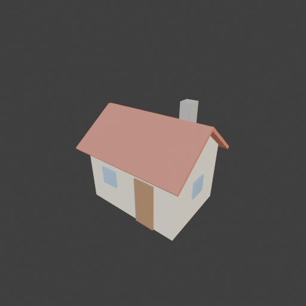

# Sohbet

- `ToolSearch` {"query": "select:mcp__blender__inspect_scene,mcp__blender__delete_object,mcp__blender__create_primitive,mcp__blender__create_mesh,mcp__blender__set_material,mcp__blender__assign_material,mcp__blender__join_objects,mcp__blender__frame_view,mcp__blender__capture_viewport,mcp__blender__export_gltf,mcp__blender__transform_object,mcp__blender__set_origin,mcp__blender__inspect_mesh", "max_results": 13}
- `mcp__blender__inspect_scene` {}
  > {"success":true,"tool":"inspect_scene","data":{"active_camera":"Camera","active_collection":"Collection","active_object":"Cube","collections":["Collection"],"counts":{"camera":1,"light":1,"mesh":1,"total":3},"objects":[{"is_linked":false,"name":"Camera","type":"CAMERA"},{"is_linked":false,"name":"Cu ... [156 more characters]
- `mcp__blender__delete_object` {"name": "Cube"}
  > {"success":true,"tool":"delete_object","data":{"deleted":true,"exists":false,"object_name":"Cube","type":"MESH","previous_state":{"location":[0,0,0],"rotation":[0,0,0],"scale":[1,1,1]}},"error":null}
- `mcp__blender__create_mesh` {"name": "House", "vertices": [[-2, -1.5, 0], [2, -1.5, 0], [2, 1.5, 0], [-2, 1.5, 0], [-2, -1.5, 2.5], [2, -1.5, 2.5], [2, 1.5, 2.5], [-2, 1.5, 2.5], [-2, 0, 3.6], [2, 0, 3.6]], "faces": [[0, 3, 2, 1], [0, 1, 5, 4], [2, 3, 7, 6], [1, 2, 6, 9, 5], [3, 0, 4, 8, 7], [4, 5, 9, 8], [6, 7, 8, 9]]}
  > {"success":true,"tool":"create_mesh","data":{"object_name":"House","type":"MESH","exists":true,"location":[0,0,0],"rotation":[0,0,0],"scale":[1,1,1],"vertex_count":10,"face_count":7,"triangle_count":16,"local_bounds_min":[-2,-1.5,0],"local_bounds_max":[2,1.5,3.6],"dimensions":[4,3,3.6],"created":tru ... [16 more characters]
- `mcp__blender__create_primitive` {"primitive_type": "CUBE", "name": "RoofFront", "size": 1, "location": [0, -0.935, 2.99], "rotation": [0.6331, 0, 0], "scale": [4.6, 2.3, 0.12]}
  > {"success":true,"tool":"create_primitive","data":{"created":true,"exists":true,"object_name":"RoofFront","primitive_type":"CUBE","type":"MESH","location":[0,-0.935,2.99],"rotation":[0.6331,0,0],"scale":[4.6,2.3,0.12],"vertex_count":8,"face_count":6},"error":null}
- `mcp__blender__create_primitive` {"primitive_type": "CUBE", "name": "RoofBack", "size": 1, "location": [0, 0.935, 2.99], "rotation": [-0.6331, 0, 0], "scale": [4.6, 2.3, 0.12]}
  > {"success":true,"tool":"create_primitive","data":{"created":true,"exists":true,"object_name":"RoofBack","primitive_type":"CUBE","type":"MESH","location":[0,0.935,2.99],"rotation":[-0.6331,0,0],"scale":[4.6,2.3,0.12],"vertex_count":8,"face_count":6},"error":null}
- `mcp__blender__create_primitive` {"primitive_type": "CUBE", "name": "Door", "size": 1, "location": [0.8, -1.53, 0.95], "scale": [0.8, 0.08, 1.9]}
  > {"success":true,"tool":"create_primitive","data":{"created":true,"exists":true,"object_name":"Door","primitive_type":"CUBE","type":"MESH","location":[0.8,-1.53,0.95],"rotation":[0,0,0],"scale":[0.8,0.08,1.9],"vertex_count":8,"face_count":6},"error":null}
- `mcp__blender__create_primitive` {"primitive_type": "CUBE", "name": "WinFront", "size": 1, "location": [-0.9, -1.53, 1.4], "scale": [0.7, 0.08, 0.7]}
  > {"success":true,"tool":"create_primitive","data":{"created":true,"exists":true,"object_name":"WinFront","primitive_type":"CUBE","type":"MESH","location":[-0.9,-1.53,1.4],"rotation":[0,0,0],"scale":[0.7,0.08,0.7],"vertex_count":8,"face_count":6},"error":null}
- `mcp__blender__create_primitive` {"primitive_type": "CUBE", "name": "WinLeft", "size": 1, "location": [-2.03, 0, 1.4], "scale": [0.08, 0.7, 0.7]}
  > {"success":true,"tool":"create_primitive","data":{"created":true,"exists":true,"object_name":"WinLeft","primitive_type":"CUBE","type":"MESH","location":[-2.03,0,1.4],"rotation":[0,0,0],"scale":[0.08,0.7,0.7],"vertex_count":8,"face_count":6},"error":null}
- `mcp__blender__create_primitive` {"primitive_type": "CUBE", "name": "WinRight", "size": 1, "location": [2.03, 0, 1.4], "scale": [0.08, 0.7, 0.7]}
  > {"success":true,"tool":"create_primitive","data":{"created":true,"exists":true,"object_name":"WinRight","primitive_type":"CUBE","type":"MESH","location":[2.03,0,1.4],"rotation":[0,0,0],"scale":[0.08,0.7,0.7],"vertex_count":8,"face_count":6},"error":null}
- `mcp__blender__create_primitive` {"primitive_type": "CUBE", "name": "Chimney", "size": 1, "location": [1.1, 0.6, 3.5], "scale": [0.45, 0.45, 1.4]}
  > {"success":true,"tool":"create_primitive","data":{"created":true,"exists":true,"object_name":"Chimney","primitive_type":"CUBE","type":"MESH","location":[1.1,0.6,3.5],"rotation":[0,0,0],"scale":[0.45,0.45,1.4],"vertex_count":8,"face_count":6},"error":null}
**Ajan:** Materials:

- `mcp__blender__set_material` {"object_name": "House", "material_name": "Wall", "base_color": [0.85, 0.78, 0.62], "roughness": 0.9}
  > {"success":true,"tool":"set_material","data":{"material_name":"Wall","object_name":"House","slot_index":0,"changed":["base_color","roughness"],"before":null,"after":{"assigned_objects":["House"],"is_linked":false,"library_name":null,"material_name":"Wall","node_summary":{"node_count":2,"node_types": ... [612 more characters]
- `mcp__blender__set_material` {"object_name": "RoofFront", "material_name": "Roof", "base_color": [0.55, 0.18, 0.12], "roughness": 0.8}
  > {"success":true,"tool":"set_material","data":{"material_name":"Roof","object_name":"RoofFront","slot_index":0,"changed":["base_color","roughness"],"before":null,"after":{"assigned_objects":["RoofFront"],"is_linked":false,"library_name":null,"material_name":"Roof","node_summary":{"node_count":2,"node ... [624 more characters]
- `mcp__blender__assign_material` {"object_name": "RoofBack", "material_name": "Roof"}
  > {"success":true,"tool":"assign_material","data":{"assigned":true,"object_name":"RoofBack","material_name":"Roof","slot_index":0,"before":{"material_name":null},"after":{"object_name":"RoofBack","slot_index":0,"material_name":"Roof"},"actual":{"object_name":"RoofBack","slot_index":0,"material_name":" ... [21 more characters]
- `mcp__blender__set_material` {"object_name": "Door", "material_name": "Wood", "base_color": [0.35, 0.2, 0.1], "roughness": 0.8}
  > {"success":true,"tool":"set_material","data":{"material_name":"Wood","object_name":"Door","slot_index":0,"changed":["base_color","roughness"],"before":null,"after":{"assigned_objects":["Door"],"is_linked":false,"library_name":null,"material_name":"Wood","node_summary":{"node_count":2,"node_types":[" ... [605 more characters]
- `mcp__blender__set_material` {"object_name": "WinFront", "material_name": "Glass", "base_color": [0.3, 0.5, 0.7], "roughness": 0.2}
  > {"success":true,"tool":"set_material","data":{"material_name":"Glass","object_name":"WinFront","slot_index":0,"changed":["base_color","roughness"],"before":null,"after":{"assigned_objects":["WinFront"],"is_linked":false,"library_name":null,"material_name":"Glass","node_summary":{"node_count":2,"node ... [618 more characters]
- `mcp__blender__assign_material` {"object_name": "WinLeft", "material_name": "Glass"}
  > {"success":true,"tool":"assign_material","data":{"assigned":true,"object_name":"WinLeft","material_name":"Glass","slot_index":0,"before":{"material_name":null},"after":{"object_name":"WinLeft","slot_index":0,"material_name":"Glass"},"actual":{"object_name":"WinLeft","slot_index":0,"material_name":"G ... [21 more characters]
- `mcp__blender__assign_material` {"object_name": "WinRight", "material_name": "Glass"}
  > {"success":true,"tool":"assign_material","data":{"assigned":true,"object_name":"WinRight","material_name":"Glass","slot_index":0,"before":{"material_name":null},"after":{"object_name":"WinRight","slot_index":0,"material_name":"Glass"},"actual":{"object_name":"WinRight","slot_index":0,"material_name" ... [24 more characters]
- `mcp__blender__set_material` {"object_name": "Chimney", "material_name": "Stone", "base_color": [0.45, 0.43, 0.4], "roughness": 0.95}
  > {"success":true,"tool":"set_material","data":{"material_name":"Stone","object_name":"Chimney","slot_index":0,"changed":["base_color","roughness"],"before":null,"after":{"assigned_objects":["Chimney"],"is_linked":false,"library_name":null,"material_name":"Stone","node_summary":{"node_count":2,"node_t ... [621 more characters]
- `mcp__blender__frame_view` {"direction": "ISO", "shading": "MATERIAL", "overlays": false}
  > {"success":true,"tool":"frame_view","data":{"direction":"ISO","objects":["House","RoofFront","RoofBack","Door","WinFront","WinLeft","WinRight","Chimney"],"center":[0,0,2.1],"radius":3.647,"shading":"MATERIAL","overlays":false},"error":null}
- `mcp__blender__capture_viewport` {}
  
  > [Image: source: C:\Users\Halil Emre\.claude\projects\C--Users-Halil-Emre-Desktop-GitHub-Public-Blender-Copilot-archives-bench-runs-20260930-011124-house\85e20f6e-eb15-4ccc-86d6-115e94e7a8ad\tool-results\mcp-blender-blob-1790719938256-yy7u0h.png]
  > {"success":true,"tool":"capture_viewport","data":{"image_id":"vp_4d1792d03a5f","width":512,"height":512,"format":"PNG","mime_type":"image/png","byte_size":84993,"channels":4},"error":null}
**Ajan:** Looks right. Joining and exporting.

- `mcp__blender__join_objects` {"object_names": ["House", "RoofFront", "RoofBack", "Door", "WinFront", "WinLeft", "WinRight", "Chimney"], "target_name": "House"}
  > {"success":true,"tool":"join_objects","data":{"object_name":"House","type":"MESH","exists":true,"location":[0,0,0],"rotation":[0,0,0],"scale":[1,1,1],"vertex_count":66,"face_count":49,"triangle_count":100,"local_bounds_min":[-2.3,-1.8976,0],"local_bounds_max":[2.3,1.8976,4.2],"dimensions":[4.6,3.795 ... [112 more characters]
- `mcp__blender__export_gltf` {"object_names": ["House"], "filename": "house.glb"}
  > {"success":true,"tool":"export_gltf","data":{"path":"C:\\Users\\Halil Emre\\Desktop\\GitHub\\Public\\Blender Copilot\\archives\\bench-runs\\20260930-011124-house\\house.glb","filename":"house.glb","bytes":9188,"objects":["House"],"triangle_count":100,"format":"GLB","y_up":true,"recentered":true},"er ... [10 more characters]
**Ajan:** Köy evi hazır ve `house.glb` olarak dışa aktarıldı. Toplam **100 üçgen**, yani ~3000'lik sınırın çok altında.

**Ne yaptım:**
- Varsayılan Cube'u sildim.
- **Duvarlar:** 4 × 3 m taban, 2,5 m duvar yüksekliği. Yan duvarların üstü, çatının altını kapatan üçgen alınlıklar; tepe noktası 3,6 m. Tek parça, kendi köşe ve yüzeylerimle kurduğum bir mesh.
- **Çatı:** İki eğimli, 12 cm kalınlığında levha. Her yönde yaklaşık 30 cm saçak payı var.
- **Kapı ve pencereler:** Duvardan hafif çıkıntılı ince kutular. Ön cephede kapı ve bir pencere, iki yan duvarda birer pencere var.
- **Baca:** Çatının arka yarısından yükselen 0,45 × 0,45 m bir kutu.
- **Malzemeler:** Duvar krem, çatı kiremit kırmızısı, kapı ahşap kahvesi, pencereler mavi cam, baca gri taş.
- Parçaları tek bir `House` objesinde birleştirdim. Obje merkezi zeminin ortasında, yani ev kendi merkezinin üstünde duruyor. Boyutlar 4,6 × 3,8 × 4,2 m.

**Kontrol:** Modeli ISO açıdan, malzemeli görünümde viewport'ta inceledim. Çatı, kapı, pencereler ve baca yerinde duruyor, belirgin bir hata görmedim. Yalnızca bu tek açıdan baktım; arka ve yandan ayrıca kontrol etmedim.

**Dosya:** `C:\Users\Halil Emre\Desktop\GitHub\Public\Blender Copilot\archives\bench-runs\20260930-011124-house\house.glb` (9 KB, Y-up)

---
**Sonuç:** Köy evi hazır ve `house.glb` olarak dışa aktarıldı. Toplam **100 üçgen**, yani ~3000'lik sınırın çok altında.

**Ne yaptım:**
- Varsayılan Cube'u sildim.
- **Duvarlar:** 4 × 3 m taban, 2,5 m duvar yüksekliği. Yan duvarların üstü, çatının altını kapatan üçgen alınlıklar; tepe noktası 3,6 m. Tek parça, kendi köşe ve yüzeylerimle kurduğum bir mesh.
- **Çatı:** İki eğimli, 12 cm kalınlığında levha. Her yönde yaklaşık 30 cm saçak payı var.
- **Kapı ve pencereler:** Duvardan hafif çıkıntılı ince kutular. Ön cephede kapı ve bir pencere, iki yan duvarda birer pencere var.
- **Baca:** Çatının arka yarısından yükselen 0,45 × 0,45 m bir kutu.
- **Malzemeler:** Duvar krem, çatı kiremit kırmızısı, kapı ahşap kahvesi, pencereler mavi cam, baca gri taş.
- Parçaları tek bir `House` objesinde birleştirdim. Obje merkezi zeminin ortasında, yani ev kendi merkezinin üstünde duruyor. Boyutlar 4,6 × 3,8 × 4,2 m.

**Kontrol:** Modeli ISO açıdan, malzemeli görünümde viewport'ta inceledim. Çatı, kapı, pencereler ve baca yerinde duruyor, belirgin bir hata görmedim. Yalnızca bu tek açıdan baktım; arka ve yandan ayrıca kontrol etmedim.

**Dosya:** `C:\Users\Halil Emre\Desktop\GitHub\Public\Blender Copilot\archives\bench-runs\20260930-011124-house\house.glb` (9 KB, Y-up)
