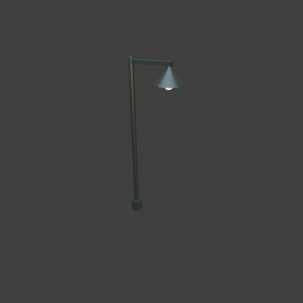

# Sohbet

- `ToolSearch` {"query": "select:mcp__blender__inspect_scene,mcp__blender__delete_object,mcp__blender__create_primitive,mcp__blender__transform_object,mcp__blender__join_objects,mcp__blender__set_material,mcp__blender__frame_view,mcp__blender__capture_viewport,mcp__blender__export_gltf,mcp__blender__assign_material,mcp__blender__set_origin,mcp__blender__inspect_mesh", "max_results": 12}
- `mcp__blender__inspect_scene` {}
  > {"success":true,"tool":"inspect_scene","data":{"active_camera":"Camera","active_collection":"Collection","active_object":"Cube","collections":["Collection"],"counts":{"camera":1,"light":1,"mesh":1,"total":3},"objects":[{"is_linked":false,"name":"Camera","type":"CAMERA"},{"is_linked":false,"name":"Cu ... [156 more characters]
- `mcp__blender__delete_object` {"name": "Cube"}
  > {"success":true,"tool":"delete_object","data":{"deleted":true,"exists":false,"object_name":"Cube","type":"MESH","previous_state":{"location":[0,0,0],"rotation":[0,0,0],"scale":[1,1,1]}},"error":null}
- `mcp__blender__create_primitive` {"primitive_type": "CYLINDER", "name": "Pole", "size": 1, "location": [0, 0, 2], "scale": [0.12, 0.12, 4]}
  > {"success":true,"tool":"create_primitive","data":{"created":true,"exists":true,"object_name":"Pole","primitive_type":"CYLINDER","type":"MESH","location":[0,0,2],"rotation":[0,0,0],"scale":[0.12,0.12,4],"vertex_count":64,"face_count":34},"error":null}
- `mcp__blender__create_primitive` {"primitive_type": "CYLINDER", "name": "Base", "size": 1, "location": [0, 0, 0.15], "scale": [0.3, 0.3, 0.3]}
  > {"success":true,"tool":"create_primitive","data":{"created":true,"exists":true,"object_name":"Base","primitive_type":"CYLINDER","type":"MESH","location":[0,0,0.15],"rotation":[0,0,0],"scale":[0.3,0.3,0.3],"vertex_count":64,"face_count":34},"error":null}
- `mcp__blender__create_primitive` {"primitive_type": "CUBE", "name": "Arm", "size": 1, "location": [0.5, 0, 3.92], "scale": [1, 0.08, 0.08]}
  > {"success":true,"tool":"create_primitive","data":{"created":true,"exists":true,"object_name":"Arm","primitive_type":"CUBE","type":"MESH","location":[0.5,0,3.92],"rotation":[0,0,0],"scale":[1,0.08,0.08],"vertex_count":8,"face_count":6},"error":null}
- `mcp__blender__create_primitive` {"primitive_type": "CONE", "name": "Shade", "size": 1, "location": [0.95, 0, 3.72], "scale": [0.55, 0.55, 0.35]}
  > {"success":true,"tool":"create_primitive","data":{"created":true,"exists":true,"object_name":"Shade","primitive_type":"CONE","type":"MESH","location":[0.95,0,3.72],"rotation":[0,0,0],"scale":[0.55,0.55,0.35],"vertex_count":33,"face_count":33},"error":null}
- `mcp__blender__create_primitive` {"primitive_type": "ICOSPHERE", "name": "Bulb", "size": 0.18, "location": [0.95, 0, 3.55]}
  > {"success":true,"tool":"create_primitive","data":{"created":true,"exists":true,"object_name":"Bulb","primitive_type":"ICOSPHERE","type":"MESH","location":[0.95,0,3.55],"rotation":[0,0,0],"scale":[1,1,1],"vertex_count":42,"face_count":80},"error":null}
**Ajan:** Materials, then a look.

- `mcp__blender__set_material` {"material_name": "LampMetal", "object_name": "Pole", "base_color": [0.08, 0.1, 0.09], "metallic": 0.8, "roughness": 0.45}
  > {"success":true,"tool":"set_material","data":{"material_name":"LampMetal","object_name":"Pole","slot_index":0,"changed":["base_color","metallic","roughness"],"before":null,"after":{"assigned_objects":["Pole"],"is_linked":false,"library_name":null,"material_name":"LampMetal","node_summary":{"node_cou ... [639 more characters]
- `mcp__blender__set_material` {"material_name": "LampGlow", "object_name": "Bulb", "base_color": [1, 0.85, 0.5], "emission_color": [1, 0.8, 0.45], "emission_strength": 5}
  > {"success":true,"tool":"set_material","data":{"material_name":"LampGlow","object_name":"Bulb","slot_index":0,"changed":["base_color","emission_color","emission_strength"],"before":null,"after":{"assigned_objects":["Bulb"],"is_linked":false,"library_name":null,"material_name":"LampGlow","node_summary ... [648 more characters]
- `mcp__blender__assign_material` {"object_name": "Base", "material_name": "LampMetal"}
  > {"success":true,"tool":"assign_material","data":{"assigned":true,"object_name":"Base","material_name":"LampMetal","slot_index":0,"before":{"material_name":null},"after":{"object_name":"Base","slot_index":0,"material_name":"LampMetal"},"actual":{"object_name":"Base","slot_index":0,"material_name":"La ... [24 more characters]
- `mcp__blender__assign_material` {"object_name": "Arm", "material_name": "LampMetal"}
  > {"success":true,"tool":"assign_material","data":{"assigned":true,"object_name":"Arm","material_name":"LampMetal","slot_index":0,"before":{"material_name":null},"after":{"object_name":"Arm","slot_index":0,"material_name":"LampMetal"},"actual":{"object_name":"Arm","slot_index":0,"material_name":"LampM ... [21 more characters]
- `mcp__blender__assign_material` {"object_name": "Shade", "material_name": "LampMetal"}
  > {"success":true,"tool":"assign_material","data":{"assigned":true,"object_name":"Shade","material_name":"LampMetal","slot_index":0,"before":{"material_name":null},"after":{"object_name":"Shade","slot_index":0,"material_name":"LampMetal"},"actual":{"object_name":"Shade","slot_index":0,"material_name": ... [27 more characters]
- `mcp__blender__frame_view` {"direction": "ISO", "shading": "MATERIAL", "overlays": false}
  > {"success":true,"tool":"frame_view","data":{"direction":"ISO","objects":["Pole","Base","Arm","Shade","Bulb"],"center":[0.538,0,2],"radius":2.133,"shading":"MATERIAL","overlays":false},"error":null}
- `mcp__blender__capture_viewport` {}
  
  > [Image: source: C:\Users\Halil Emre\.claude\projects\C--Users-Halil-Emre-Desktop-GitHub-Public-Blender-Copilot-archives-bench-runs-20260930-011232-lamp\be10961a-ff7c-44d0-a96c-815f46d517c1\tool-results\mcp-blender-blob-1790719976234-2bgwln.png]
  > {"success":true,"tool":"capture_viewport","data":{"image_id":"vp_1323ee3ea456","width":512,"height":512,"format":"PNG","mime_type":"image/png","byte_size":71521,"channels":4},"error":null}
**Ajan:** Looks right. Join, origin to bottom, export.

- `mcp__blender__join_objects` {"object_names": ["Pole", "Base", "Arm", "Shade", "Bulb"], "target_name": "Pole", "new_name": "StreetLamp"}
  > {"success":true,"tool":"join_objects","data":{"object_name":"StreetLamp","type":"MESH","exists":true,"location":[0,0,2],"rotation":[0,0,0],"scale":[0.12,0.12,4],"vertex_count":211,"face_count":187,"triangle_count":402,"local_bounds_min":[-1.25,-2.2917,-0.5],"local_bounds_max":[10.2083,2.2917,0.5],"d ... [86 more characters]
- `ToolSearch` {"query": "select:mcp__blender__apply_transform", "max_results": 1}
- `mcp__blender__apply_transform` {"object_name": "StreetLamp"}
  > {"success":true,"tool":"apply_transform","data":{"object_name":"StreetLamp","type":"MESH","exists":true,"location":[0,0,2],"rotation":[0,0,0],"scale":[1,1,1],"vertex_count":211,"face_count":187,"triangle_count":402,"local_bounds_min":[-0.15,-0.275,-2],"local_bounds_max":[1.225,0.275,2],"dimensions": ... [29 more characters]
- `mcp__blender__set_origin` {"object_name": "StreetLamp", "mode": "BOTTOM_CENTER"}
  > {"success":true,"tool":"set_origin","data":{"object_name":"StreetLamp","type":"MESH","exists":true,"location":[0.5375,0,0],"rotation":[0,0,0],"scale":[1,1,1],"vertex_count":211,"face_count":187,"triangle_count":402,"local_bounds_min":[-0.6875,-0.275,0],"local_bounds_max":[0.6875,0.275,4],"dimensions ... [61 more characters]
- `mcp__blender__export_gltf` {"object_names": ["StreetLamp"], "filename": "lamp.glb"}
  > {"success":true,"tool":"export_gltf","data":{"path":"C:\\Users\\Halil Emre\\Desktop\\GitHub\\Public\\Blender Copilot\\archives\\bench-runs\\20260930-011232-lamp\\lamp.glb","filename":"lamp.glb","bytes":23044,"objects":["StreetLamp"],"triangle_count":402,"format":"GLB","y_up":true,"recentered":true}, ... [13 more characters]
**Ajan:** Sokak lambası hazır ve `lamp.glb` olarak dışa aktarıldı: **402 üçgen**, 23 KB.

**Ne yaptım:**
- Varsayılan Cube'u sildim.
- **Direk:** 4 m boyunda, 12 cm çapında bir silindir. Tabanına 30 cm çapında kısa bir kaide ekledim.
- **Kol:** Direğin tepesinden yatay uzanan 1 m'lik ince bir kutu.
- **Abajur:** Kolun ucunda 55 cm çapında bir koni. Altına yerleştirdiğim küçük ampul (icosphere) sıcak sarı renkte ışık yayıyor.
- **Malzemeler:** Lambada iki malzeme var. Direk, kaide, kol ve abajurda koyu yeşilimsi metal; ampulde parlayan malzeme.
- Viewport'ta ISO açıdan baktım. Kol direğe bağlı, abajur kolun ucunda ve ampul abajurun altında duruyor.
- **Export öncesi:** Parçaları `StreetLamp` adlı tek bir mesh'te birleştirdim. Ölçeği mesh'e işledim (scale 1) ve orijini tabanın altına aldım. Dosya Y-up ve orijine ortalanmış olarak çıktı. Toplam ölçü 1.375 × 0.55 × 4 m.

**Dikkat edilecek bir nokta:** Orijin tabanın altında ama yatayda direğin değil, lambanın tamamının ortasında. Kol yüzünden direkten yaklaşık 54 cm yana kayık. Oyunda lambayı konumlandırırken direk bu kadar kenarda durur. Orijinin tam direk ekseninde olmasını istersen düzeltebilirim.

Dosya: `C:\Users\Halil Emre\Desktop\GitHub\Public\Blender Copilot\archives\bench-runs\20260930-011232-lamp\lamp.glb`

---
**Sonuç:** Sokak lambası hazır ve `lamp.glb` olarak dışa aktarıldı: **402 üçgen**, 23 KB.

**Ne yaptım:**
- Varsayılan Cube'u sildim.
- **Direk:** 4 m boyunda, 12 cm çapında bir silindir. Tabanına 30 cm çapında kısa bir kaide ekledim.
- **Kol:** Direğin tepesinden yatay uzanan 1 m'lik ince bir kutu.
- **Abajur:** Kolun ucunda 55 cm çapında bir koni. Altına yerleştirdiğim küçük ampul (icosphere) sıcak sarı renkte ışık yayıyor.
- **Malzemeler:** Lambada iki malzeme var. Direk, kaide, kol ve abajurda koyu yeşilimsi metal; ampulde parlayan malzeme.
- Viewport'ta ISO açıdan baktım. Kol direğe bağlı, abajur kolun ucunda ve ampul abajurun altında duruyor.
- **Export öncesi:** Parçaları `StreetLamp` adlı tek bir mesh'te birleştirdim. Ölçeği mesh'e işledim (scale 1) ve orijini tabanın altına aldım. Dosya Y-up ve orijine ortalanmış olarak çıktı. Toplam ölçü 1.375 × 0.55 × 4 m.

**Dikkat edilecek bir nokta:** Orijin tabanın altında ama yatayda direğin değil, lambanın tamamının ortasında. Kol yüzünden direkten yaklaşık 54 cm yana kayık. Oyunda lambayı konumlandırırken direk bu kadar kenarda durur. Orijinin tam direk ekseninde olmasını istersen düzeltebilirim.

Dosya: `C:\Users\Halil Emre\Desktop\GitHub\Public\Blender Copilot\archives\bench-runs\20260930-011232-lamp\lamp.glb`
