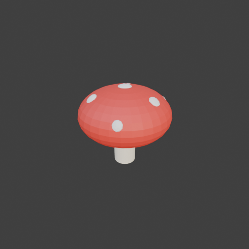

# Sohbet

- `ToolSearch` {"query": "select:mcp__blender__inspect_scene,mcp__blender__delete_object,mcp__blender__create_primitive,mcp__blender__transform_object,mcp__blender__set_material,mcp__blender__assign_material,mcp__blender__join_objects,mcp__blender__frame_view,mcp__blender__capture_viewport,mcp__blender__export_gltf,mcp__blender__set_shading,mcp__blender__apply_transform,mcp__blender__set_origin,mcp__blender__ins ... [30 more characters]
- `mcp__blender__inspect_scene` {}
  > {"success":true,"tool":"inspect_scene","data":{"active_camera":"Camera","active_collection":"Collection","active_object":"Cube","collections":["Collection"],"counts":{"camera":1,"light":1,"mesh":1,"total":3},"objects":[{"is_linked":false,"name":"Camera","type":"CAMERA"},{"is_linked":false,"name":"Cu ... [156 more characters]
- `mcp__blender__delete_object` {"name": "Cube"}
  > {"success":true,"tool":"delete_object","data":{"deleted":true,"exists":false,"object_name":"Cube","type":"MESH","previous_state":{"location":[0,0,0],"rotation":[0,0,0],"scale":[1,1,1]}},"error":null}
- `mcp__blender__create_primitive` {"primitive_type": "CYLINDER", "name": "Stem", "size": 1, "location": [0, 0, 0.6], "scale": [0.5, 0.5, 1.2]}
  > {"success":true,"tool":"create_primitive","data":{"created":true,"exists":true,"object_name":"Stem","primitive_type":"CYLINDER","type":"MESH","location":[0,0,0.6],"rotation":[0,0,0],"scale":[0.5,0.5,1.2],"vertex_count":64,"face_count":34},"error":null}
- `mcp__blender__create_primitive` {"primitive_type": "SPHERE", "name": "Cap", "size": 2, "location": [0, 0, 1.2], "scale": [1, 1, 0.6]}
  > {"success":true,"tool":"create_primitive","data":{"created":true,"exists":true,"object_name":"Cap","primitive_type":"SPHERE","type":"MESH","location":[0,0,1.2],"rotation":[0,0,0],"scale":[1,1,0.6],"vertex_count":482,"face_count":512},"error":null}
**Ajan:** Now spots on the cap surface.

- `mcp__blender__create_primitive` {"primitive_type": "ICOSPHERE", "name": "Spot1", "size": 0.3, "location": [0, 0, 1.78], "scale": [1, 1, 0.4]}
  > {"success":true,"tool":"create_primitive","data":{"created":true,"exists":true,"object_name":"Spot1","primitive_type":"ICOSPHERE","type":"MESH","location":[0,0,1.78],"rotation":[0,0,0],"scale":[1,1,0.4],"vertex_count":42,"face_count":80},"error":null}
- `mcp__blender__create_primitive` {"primitive_type": "ICOSPHERE", "name": "Spot2", "size": 0.25, "location": [0.69, 0, 1.61], "rotation": [0, 0.7, 0], "scale": [1, 1, 0.4]}
  > {"success":true,"tool":"create_primitive","data":{"created":true,"exists":true,"object_name":"Spot2","primitive_type":"ICOSPHERE","type":"MESH","location":[0.69,0,1.61],"rotation":[0,0.7,0],"scale":[1,1,0.4],"vertex_count":42,"face_count":80},"error":null}
- `mcp__blender__create_primitive` {"primitive_type": "ICOSPHERE", "name": "Spot3", "size": 0.25, "location": [-0.345, 0.6, 1.61], "rotation": [-0.6, -0.35, 0], "scale": [1, 1, 0.4]}
  > {"success":true,"tool":"create_primitive","data":{"created":true,"exists":true,"object_name":"Spot3","primitive_type":"ICOSPHERE","type":"MESH","location":[-0.345,0.6,1.61],"rotation":[-0.6,-0.35,0],"scale":[1,1,0.4],"vertex_count":42,"face_count":80},"error":null}
- `mcp__blender__create_primitive` {"primitive_type": "ICOSPHERE", "name": "Spot4", "size": 0.25, "location": [-0.345, -0.6, 1.61], "rotation": [0.6, -0.35, 0], "scale": [1, 1, 0.4]}
  > {"success":true,"tool":"create_primitive","data":{"created":true,"exists":true,"object_name":"Spot4","primitive_type":"ICOSPHERE","type":"MESH","location":[-0.345,-0.6,1.61],"rotation":[0.6,-0.35,0],"scale":[1,1,0.4],"vertex_count":42,"face_count":80},"error":null}
- `mcp__blender__create_primitive` {"primitive_type": "ICOSPHERE", "name": "Spot5", "size": 0.2, "location": [0.47, 0.81, 1.39], "rotation": [-1, 0.55, 0], "scale": [1, 1, 0.4]}
  > {"success":true,"tool":"create_primitive","data":{"created":true,"exists":true,"object_name":"Spot5","primitive_type":"ICOSPHERE","type":"MESH","location":[0.47,0.81,1.39],"rotation":[-1,0.55,0],"scale":[1,1,0.4],"vertex_count":42,"face_count":80},"error":null}
- `mcp__blender__create_primitive` {"primitive_type": "ICOSPHERE", "name": "Spot6", "size": 0.2, "location": [0.47, -0.81, 1.39], "rotation": [1, 0.55, 0], "scale": [1, 1, 0.4]}
  > {"success":true,"tool":"create_primitive","data":{"created":true,"exists":true,"object_name":"Spot6","primitive_type":"ICOSPHERE","type":"MESH","location":[0.47,-0.81,1.39],"rotation":[1,0.55,0],"scale":[1,1,0.4],"vertex_count":42,"face_count":80},"error":null}
- `mcp__blender__create_primitive` {"primitive_type": "ICOSPHERE", "name": "Spot7", "size": 0.2, "location": [-0.94, 0, 1.39], "rotation": [0, -1.1, 0], "scale": [1, 1, 0.4]}
  > {"success":true,"tool":"create_primitive","data":{"created":true,"exists":true,"object_name":"Spot7","primitive_type":"ICOSPHERE","type":"MESH","location":[-0.94,0,1.39],"rotation":[0,-1.1,0],"scale":[1,1,0.4],"vertex_count":42,"face_count":80},"error":null}
- `mcp__blender__set_material` {"material_name": "CapRed", "object_name": "Cap", "base_color": [0.8, 0.05, 0.04], "roughness": 0.6}
  > {"success":true,"tool":"set_material","data":{"material_name":"CapRed","object_name":"Cap","slot_index":0,"changed":["base_color","roughness"],"before":null,"after":{"assigned_objects":["Cap"],"is_linked":false,"library_name":null,"material_name":"CapRed","node_summary":{"node_count":2,"node_types": ... [610 more characters]
- `mcp__blender__set_material` {"material_name": "StemCream", "object_name": "Stem", "base_color": [0.93, 0.87, 0.7], "roughness": 0.8}
  > {"success":true,"tool":"set_material","data":{"material_name":"StemCream","object_name":"Stem","slot_index":0,"changed":["base_color","roughness"],"before":null,"after":{"assigned_objects":["Stem"],"is_linked":false,"library_name":null,"material_name":"StemCream","node_summary":{"node_count":2,"node ... [622 more characters]
- `mcp__blender__set_material` {"material_name": "SpotWhite", "object_name": "Spot1", "base_color": [0.95, 0.95, 0.95], "roughness": 0.7}
  > {"success":true,"tool":"set_material","data":{"material_name":"SpotWhite","object_name":"Spot1","slot_index":0,"changed":["base_color","roughness"],"before":null,"after":{"assigned_objects":["Spot1"],"is_linked":false,"library_name":null,"material_name":"SpotWhite","node_summary":{"node_count":2,"no ... [627 more characters]
- `mcp__blender__assign_material` {"object_name": "Spot2", "material_name": "SpotWhite"}
  > {"success":true,"tool":"assign_material","data":{"assigned":true,"object_name":"Spot2","material_name":"SpotWhite","slot_index":0,"before":{"material_name":null},"after":{"object_name":"Spot2","slot_index":0,"material_name":"SpotWhite"},"actual":{"object_name":"Spot2","slot_index":0,"material_name": ... [27 more characters]
- `mcp__blender__assign_material` {"object_name": "Spot3", "material_name": "SpotWhite"}
  > {"success":true,"tool":"assign_material","data":{"assigned":true,"object_name":"Spot3","material_name":"SpotWhite","slot_index":0,"before":{"material_name":null},"after":{"object_name":"Spot3","slot_index":0,"material_name":"SpotWhite"},"actual":{"object_name":"Spot3","slot_index":0,"material_name": ... [27 more characters]
- `mcp__blender__assign_material` {"object_name": "Spot4", "material_name": "SpotWhite"}
  > {"success":true,"tool":"assign_material","data":{"assigned":true,"object_name":"Spot4","material_name":"SpotWhite","slot_index":0,"before":{"material_name":null},"after":{"object_name":"Spot4","slot_index":0,"material_name":"SpotWhite"},"actual":{"object_name":"Spot4","slot_index":0,"material_name": ... [27 more characters]
- `mcp__blender__assign_material` {"object_name": "Spot5", "material_name": "SpotWhite"}
  > {"success":true,"tool":"assign_material","data":{"assigned":true,"object_name":"Spot5","material_name":"SpotWhite","slot_index":0,"before":{"material_name":null},"after":{"object_name":"Spot5","slot_index":0,"material_name":"SpotWhite"},"actual":{"object_name":"Spot5","slot_index":0,"material_name": ... [27 more characters]
- `mcp__blender__assign_material` {"object_name": "Spot6", "material_name": "SpotWhite"}
  > {"success":true,"tool":"assign_material","data":{"assigned":true,"object_name":"Spot6","material_name":"SpotWhite","slot_index":0,"before":{"material_name":null},"after":{"object_name":"Spot6","slot_index":0,"material_name":"SpotWhite"},"actual":{"object_name":"Spot6","slot_index":0,"material_name": ... [27 more characters]
- `mcp__blender__assign_material` {"object_name": "Spot7", "material_name": "SpotWhite"}
  > {"success":true,"tool":"assign_material","data":{"assigned":true,"object_name":"Spot7","material_name":"SpotWhite","slot_index":0,"before":{"material_name":null},"after":{"object_name":"Spot7","slot_index":0,"material_name":"SpotWhite"},"actual":{"object_name":"Spot7","slot_index":0,"material_name": ... [27 more characters]
- `mcp__blender__frame_view` {"direction": "ISO", "shading": "MATERIAL", "overlays": false}
  > {"success":true,"tool":"frame_view","data":{"direction":"ISO","objects":["Stem","Cap","Spot1","Spot2","Spot3","Spot4","Spot5","Spot6","Spot7"],"center":[-0.009,0,0.92],"radius":1.693,"shading":"MATERIAL","overlays":false},"error":null}
- `mcp__blender__capture_viewport` {}
  
  > [Image: source: C:\Users\Halil Emre\.claude\projects\C--Users-Halil-Emre-Desktop-GitHub-Public-Blender-Copilot-archives-bench-runs-20260930-012542-mushroom\2416ba14-9bb1-4edf-b5c6-853107c1e3a2\tool-results\mcp-blender-blob-1790720787946-it70fb.png]
  > {"success":true,"tool":"capture_viewport","data":{"image_id":"vp_a8f029d905c0","width":512,"height":512,"format":"PNG","mime_type":"image/png","byte_size":86779,"channels":4},"error":null}
**Ajan:** Looks right. Joining, cleaning up transforms, and exporting.

- `mcp__blender__join_objects` {"object_names": ["Stem", "Cap", "Spot1", "Spot2", "Spot3", "Spot4", "Spot5", "Spot6", "Spot7"], "target_name": "Stem", "new_name": "Mushroom"}
  > {"success":true,"tool":"join_objects","data":{"object_name":"Mushroom","type":"MESH","exists":true,"location":[0,0,0.6],"rotation":[0,0,0],"scale":[0.5,0.5,1.2],"vertex_count":840,"face_count":1106,"triangle_count":1644,"local_bounds_min":[-2,-2,-0.5],"local_bounds_max":[2,2,1.0333],"dimensions":[2, ... [102 more characters]
- `mcp__blender__apply_transform` {"object_name": "Mushroom"}
  > {"success":true,"tool":"apply_transform","data":{"object_name":"Mushroom","type":"MESH","exists":true,"location":[0,0,0.6],"rotation":[0,0,0],"scale":[1,1,1],"vertex_count":840,"face_count":1106,"triangle_count":1644,"local_bounds_min":[-1,-1,-0.6],"local_bounds_max":[1,1,1.24],"dimensions":[2,2,1.8 ... [17 more characters]
- `mcp__blender__set_origin` {"object_name": "Mushroom", "mode": "BOTTOM_CENTER"}
  > {"success":true,"tool":"set_origin","data":{"object_name":"Mushroom","type":"MESH","exists":true,"location":[0,0,0],"rotation":[0,0,0],"scale":[1,1,1],"vertex_count":840,"face_count":1106,"triangle_count":1644,"local_bounds_min":[-1,-1,0],"local_bounds_max":[1,1,1.84],"dimensions":[2,2,1.84],"origin ... [37 more characters]
- `mcp__blender__export_gltf` {"object_names": ["Mushroom"], "filename": "mushroom.glb"}
  > {"success":true,"tool":"export_gltf","data":{"path":"C:\\Users\\Halil Emre\\Desktop\\GitHub\\Public\\Blender Copilot\\archives\\bench-runs\\20260930-012542-mushroom\\mushroom.glb","filename":"mushroom.glb","bytes":105068,"objects":["Mushroom"],"triangle_count":1644,"format":"GLB","y_up":true,"recent ... [25 more characters]
**Ajan:** Mantar hazır ve `mushroom.glb` olarak dışa aktarıldı.

**Yaptıklarım:**
- Varsayılan Cube'u sildim.
- **Gövde:** 0,5 m çapında, 1,2 m yüksekliğinde krem renkli bir silindir.
- **Şapka:** 2 m çapında bir küre, dikeyde basılarak kubbe şekline getirildi. Rengi kırmızı.
- **Benekler:** Yassılaştırılmış 7 beyaz icosphere. Şapkanın üstüne, yüzeyin eğimine göre döndürülerek yerleştirildi.
- Viewport'ta ISO açıdan ve materyal görünümünde kontrol ettim. Renkler doğru, benekler şapkanın üstünde duruyor ve gövde şapkanın altından görünüyor.
- Tüm parçaları `Mushroom` adında tek bir objede birleştirdim. Ölçek bilgisini modele işledim ve orijini tabanın ortasına aldım.

**Sonuç:**
- **Boyut:** 2 × 2 × 1,84 m
- **Üçgen sayısı:** 1644, yani ~3000'lik low-poly sınırının rahatça altında
- **Materyaller:** CapRed, StemCream, SpotWhite
- **Dosya:** `C:\Users\Halil Emre\Desktop\GitHub\Public\Blender Copilot\archives\bench-runs\20260930-012542-mushroom\mushroom.glb`, Y-up olarak kaydedildi.

Gövde görsel olarak biraz kısa kalıyor. Daha "büyük mantar" siluetini istersen gövdeyi uzatabilirim. Üçgen sayısını düşürmek istersen de şapkanın küresi daha az segmentle yeniden yapılabilir.

---
**Sonuç:** Mantar hazır ve `mushroom.glb` olarak dışa aktarıldı.

**Yaptıklarım:**
- Varsayılan Cube'u sildim.
- **Gövde:** 0,5 m çapında, 1,2 m yüksekliğinde krem renkli bir silindir.
- **Şapka:** 2 m çapında bir küre, dikeyde basılarak kubbe şekline getirildi. Rengi kırmızı.
- **Benekler:** Yassılaştırılmış 7 beyaz icosphere. Şapkanın üstüne, yüzeyin eğimine göre döndürülerek yerleştirildi.
- Viewport'ta ISO açıdan ve materyal görünümünde kontrol ettim. Renkler doğru, benekler şapkanın üstünde duruyor ve gövde şapkanın altından görünüyor.
- Tüm parçaları `Mushroom` adında tek bir objede birleştirdim. Ölçek bilgisini modele işledim ve orijini tabanın ortasına aldım.

**Sonuç:**
- **Boyut:** 2 × 2 × 1,84 m
- **Üçgen sayısı:** 1644, yani ~3000'lik low-poly sınırının rahatça altında
- **Materyaller:** CapRed, StemCream, SpotWhite
- **Dosya:** `C:\Users\Halil Emre\Desktop\GitHub\Public\Blender Copilot\archives\bench-runs\20260930-012542-mushroom\mushroom.glb`, Y-up olarak kaydedildi.

Gövde görsel olarak biraz kısa kalıyor. Daha "büyük mantar" siluetini istersen gövdeyi uzatabilirim. Üçgen sayısını düşürmek istersen de şapkanın küresi daha az segmentle yeniden yapılabilir.
