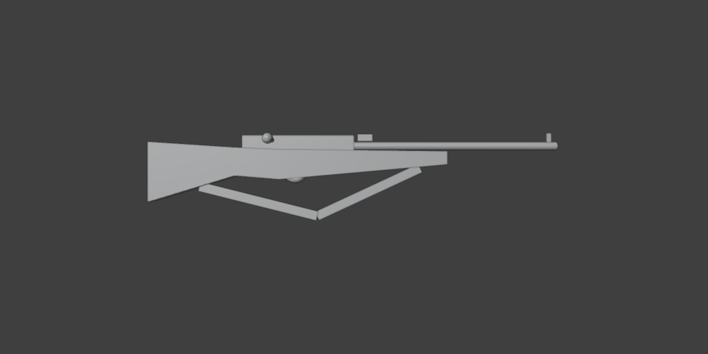
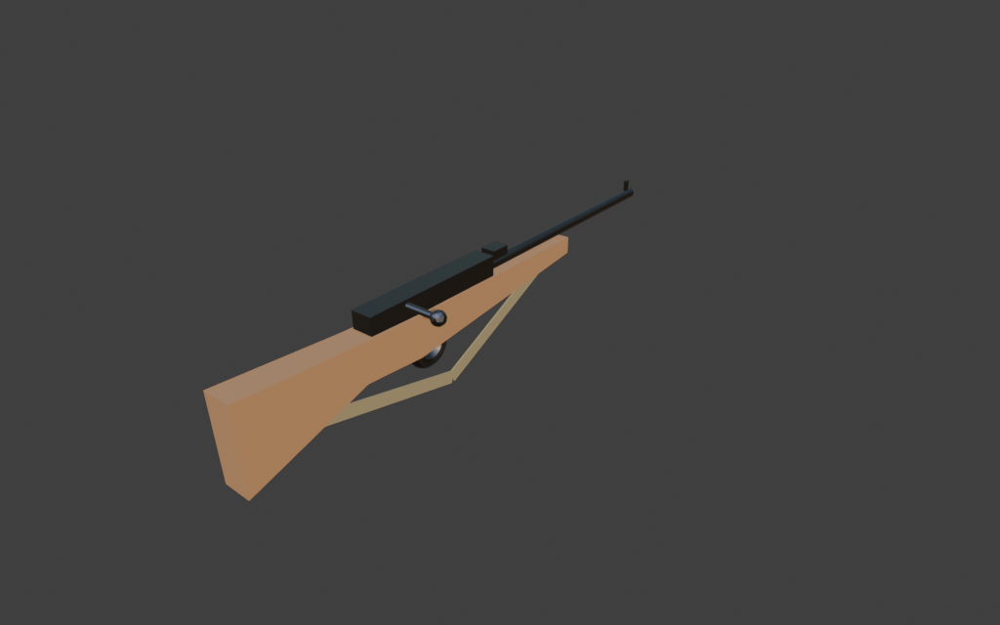

# Sohbet

- `ToolSearch` {"query": "select:mcp__blender__create_primitive,mcp__blender__create_mesh,mcp__blender__delete_object,mcp__blender__set_material,mcp__blender__frame_view,mcp__blender__capture_viewport,mcp__blender__export_gltf,mcp__blender__inspect_scene,mcp__blender__join_objects,mcp__blender__transform_object", "max_results": 10}
- `mcp__blender__delete_object` {"name": "Cube"}
  > {"success":true,"tool":"delete_object","data":{"deleted":true,"exists":false,"object_name":"Cube","type":"MESH","previous_state":{"location":[0,0,0],"rotation":[0,0,0],"scale":[1,1,1]}},"error":null}
- `mcp__blender__create_mesh` {"name": "Stock", "vertices": [[-0.028, -0.45, 0], [-0.028, -0.45, 0.16], [0.028, -0.45, 0.16], [0.028, -0.45, 0], [-0.026, -0.22, 0.07], [-0.026, -0.22, 0.145], [0.026, -0.22, 0.145], [0.026, -0.22, 0.07], [-0.026, -0.1, 0.06], [-0.026, -0.1, 0.14], [0.026, -0.1, 0.14], [0.026, -0.1, 0.06], [-0.022, 0.35, 0.1], [-0.022, 0.35, 0.135], [0.022, 0.35, 0.135], [0.022, 0.35, 0.1]], "faces": [[3, 2, 1,  ... [206 more characters]
  > {"success":true,"tool":"create_mesh","data":{"object_name":"Stock","type":"MESH","exists":true,"location":[0,0,0],"rotation":[0,0,0],"scale":[1,1,1],"vertex_count":16,"face_count":14,"triangle_count":28,"local_bounds_min":[-0.028,-0.45,0],"local_bounds_max":[0.028,0.35,0.16],"dimensions":[0.056,0.8, ... [35 more characters]
- `mcp__blender__create_primitive` {"primitive_type": "CYLINDER", "name": "Barrel", "size": 1, "location": [0, 0.35, 0.15], "rotation": [1.5708, 0, 0], "scale": [0.022, 0.022, 0.6]}
  > {"success":true,"tool":"create_primitive","data":{"created":true,"exists":true,"object_name":"Barrel","primitive_type":"CYLINDER","type":"MESH","location":[0,0.35,0.15],"rotation":[1.5708,0,0],"scale":[0.022,0.022,0.6],"vertex_count":64,"face_count":34},"error":null}
- `mcp__blender__create_primitive` {"primitive_type": "CUBE", "name": "Receiver", "size": 1, "location": [0, -0.05, 0.155], "scale": [0.042, 0.3, 0.045]}
  > {"success":true,"tool":"create_primitive","data":{"created":true,"exists":true,"object_name":"Receiver","primitive_type":"CUBE","type":"MESH","location":[0,-0.05,0.155],"rotation":[0,0,0],"scale":[0.042,0.3,0.045],"vertex_count":8,"face_count":6},"error":null}
- `mcp__blender__create_primitive` {"primitive_type": "CYLINDER", "name": "BoltHandle", "size": 1, "location": [0.05, -0.12, 0.165], "rotation": [0, 1.5708, 0], "scale": [0.012, 0.012, 0.07]}
  > {"success":true,"tool":"create_primitive","data":{"created":true,"exists":true,"object_name":"BoltHandle","primitive_type":"CYLINDER","type":"MESH","location":[0.05,-0.12,0.165],"rotation":[0,1.5708,0],"scale":[0.012,0.012,0.07],"vertex_count":64,"face_count":34},"error":null}
- `mcp__blender__create_primitive` {"primitive_type": "SPHERE", "name": "BoltKnob", "size": 0.028, "location": [0.087, -0.12, 0.165]}
  > {"success":true,"tool":"create_primitive","data":{"created":true,"exists":true,"object_name":"BoltKnob","primitive_type":"SPHERE","type":"MESH","location":[0.087,-0.12,0.165],"rotation":[0,0,0],"scale":[1,1,1],"vertex_count":482,"face_count":512},"error":null}
- `mcp__blender__create_primitive` {"primitive_type": "TORUS", "name": "TriggerGuard", "size": 0.07, "location": [0, -0.06, 0.085], "rotation": [0, 1.5708, 0]}
  > {"success":true,"tool":"create_primitive","data":{"created":true,"exists":true,"object_name":"TriggerGuard","primitive_type":"TORUS","type":"MESH","location":[0,-0.06,0.085],"rotation":[0,1.5708,0],"scale":[1,1,1],"vertex_count":384,"face_count":384},"error":null}
- `mcp__blender__create_primitive` {"primitive_type": "CUBE", "name": "Trigger", "size": 1, "location": [0, -0.055, 0.09], "rotation": [0.3, 0, 0], "scale": [0.006, 0.008, 0.035]}
  > {"success":true,"tool":"create_primitive","data":{"created":true,"exists":true,"object_name":"Trigger","primitive_type":"CUBE","type":"MESH","location":[0,-0.055,0.09],"rotation":[0.3,0,0],"scale":[0.006,0.008,0.035],"vertex_count":8,"face_count":6},"error":null}
- `mcp__blender__create_primitive` {"primitive_type": "CUBE", "name": "FrontSight", "size": 1, "location": [0, 0.63, 0.172], "scale": [0.006, 0.012, 0.025]}
  > {"success":true,"tool":"create_primitive","data":{"created":true,"exists":true,"object_name":"FrontSight","primitive_type":"CUBE","type":"MESH","location":[0,0.63,0.172],"rotation":[0,0,0],"scale":[0.006,0.012,0.025],"vertex_count":8,"face_count":6},"error":null}
- `mcp__blender__create_primitive` {"primitive_type": "CUBE", "name": "RearSight", "size": 1, "location": [0, 0.13, 0.172], "scale": [0.03, 0.04, 0.018]}
  > {"success":true,"tool":"create_primitive","data":{"created":true,"exists":true,"object_name":"RearSight","primitive_type":"CUBE","type":"MESH","location":[0,0.13,0.172],"rotation":[0,0,0],"scale":[0.03,0.04,0.018],"vertex_count":8,"face_count":6},"error":null}
- `mcp__blender__create_primitive` {"primitive_type": "CUBE", "name": "SlingA", "size": 1, "location": [0, -0.16, 0], "rotation": [-0.245, 0, 0], "scale": [0.004, 0.33, 0.025]}
  > {"success":true,"tool":"create_primitive","data":{"created":true,"exists":true,"object_name":"SlingA","primitive_type":"CUBE","type":"MESH","location":[0,-0.16,0],"rotation":[-0.245,0,0],"scale":[0.004,0.33,0.025],"vertex_count":8,"face_count":6},"error":null}
- `mcp__blender__create_primitive` {"primitive_type": "CUBE", "name": "SlingB", "size": 1, "location": [0, 0.14, 0.025], "rotation": [0.435, 0, 0], "scale": [0.004, 0.309, 0.025]}
  > {"success":true,"tool":"create_primitive","data":{"created":true,"exists":true,"object_name":"SlingB","primitive_type":"CUBE","type":"MESH","location":[0,0.14,0.025],"rotation":[0.435,0,0],"scale":[0.004,0.309,0.025],"vertex_count":8,"face_count":6},"error":null}
- `mcp__blender__delete_object` {"name": "BoltKnob"}
  > {"success":true,"tool":"delete_object","data":{"deleted":true,"exists":false,"object_name":"BoltKnob","type":"MESH","previous_state":{"location":[0.087,-0.12,0.165],"rotation":[0,0,0],"scale":[1,1,1]}},"error":null}
- `mcp__blender__create_primitive` {"primitive_type": "ICOSPHERE", "name": "BoltKnob", "size": 0.028, "location": [0.087, -0.12, 0.165]}
  > {"success":true,"tool":"create_primitive","data":{"created":true,"exists":true,"object_name":"BoltKnob","primitive_type":"ICOSPHERE","type":"MESH","location":[0.087,-0.12,0.165],"rotation":[0,0,0],"scale":[1,1,1],"vertex_count":42,"face_count":80},"error":null}
- `mcp__blender__frame_view` {"direction": "RIGHT", "overlays": false}
  > {"success":true,"tool":"frame_view","data":{"direction":"RIGHT","objects":["Stock","Barrel","Receiver","BoltHandle","TriggerGuard","Trigger","FrontSight","RearSight","SlingA","SlingB","BoltKnob"],"center":[0.036,0.1,0.066],"radius":0.566,"shading":"SOLID","overlays":false},"error":null}
- `mcp__blender__capture_viewport` {"width": 1024, "height": 512}
  
  > [Image: source: C:\Users\Halil Emre\.claude\projects\C--Users-Halil-Emre-Desktop-GitHub-Public-Blender-Copilot-archives-bench-runs-20260930-013700-rifle\ea77ca70-e9d4-47d6-8433-415126e46504\tool-results\mcp-blender-blob-1790721483851-9t2gvo.png]
  > {"success":true,"tool":"capture_viewport","data":{"image_id":"vp_bc1a2214c65c","width":1024,"height":512,"format":"PNG","mime_type":"image/png","byte_size":16096,"channels":4},"error":null}
- `mcp__blender__transform_object` {"name": "TriggerGuard", "location": [0, -0.06, 0.06], "scale": [1.3, 1.3, 1.3]}
  > {"success":true,"tool":"transform_object","data":{"object_name":"TriggerGuard","relative":false,"exists":true,"before":{"location":[0,-0.06,0.085],"rotation":[0,1.5708,0],"scale":[1,1,1]},"after":{"exists":true,"location":[0,-0.06,0.06],"rotation":[0,1.5708,0],"scale":[1.3,1.3,1.3]},"actual":{"exist ... [126 more characters]
- `mcp__blender__transform_object` {"name": "Trigger", "location": [0, -0.058, 0.065]}
  > {"success":true,"tool":"transform_object","data":{"object_name":"Trigger","relative":false,"exists":true,"before":{"location":[0,-0.055,0.09],"rotation":[0.3,0,0],"scale":[0.006,0.008,0.035]},"after":{"exists":true,"location":[0,-0.058,0.065],"rotation":[0.3,0,0],"scale":[0.006,0.008,0.035]},"actual ... [132 more characters]
- `mcp__blender__set_material` {"object_name": "Stock", "material_name": "Wood", "base_color": [0.35, 0.18, 0.08], "roughness": 0.7}
  > {"success":true,"tool":"set_material","data":{"material_name":"Wood","object_name":"Stock","slot_index":0,"changed":["base_color","roughness"],"before":null,"after":{"assigned_objects":["Stock"],"is_linked":false,"library_name":null,"material_name":"Wood","node_summary":{"node_count":2,"node_types": ... [612 more characters]
- `mcp__blender__set_material` {"object_name": "SlingA", "material_name": "Leather", "base_color": [0.25, 0.2, 0.1], "roughness": 0.9}
  > {"success":true,"tool":"set_material","data":{"material_name":"Leather","object_name":"SlingA","slot_index":0,"changed":["base_color","roughness"],"before":null,"after":{"assigned_objects":["SlingA"],"is_linked":false,"library_name":null,"material_name":"Leather","node_summary":{"node_count":2,"node ... [620 more characters]
- `mcp__blender__set_material` {"object_name": "Barrel", "material_name": "GunMetal", "base_color": [0.08, 0.08, 0.09], "metallic": 1, "roughness": 0.45}
  > {"success":true,"tool":"set_material","data":{"material_name":"GunMetal","object_name":"Barrel","slot_index":0,"changed":["base_color","metallic","roughness"],"before":null,"after":{"assigned_objects":["Barrel"],"is_linked":false,"library_name":null,"material_name":"GunMetal","node_summary":{"node_c ... [640 more characters]
**Ajan:** Kalan metal parçalara ve kayışın ikinci yarısına mevcut malzemeleri atıyorum.

- `mcp__blender__set_material` {"object_name": "SlingB", "material_name": "Leather"}
  > {"success":true,"tool":"set_material","data":{"material_name":"Leather","object_name":"SlingB","slot_index":0,"changed":[],"before":{"assigned_objects":["SlingA","SlingB"],"is_linked":false,"library_name":null,"material_name":"Leather","node_summary":{"node_count":2,"node_types":["BSDF_PRINCIPLED"," ... [982 more characters]
- `mcp__blender__set_material` {"object_name": "Receiver", "material_name": "GunMetal"}
  > {"success":true,"tool":"set_material","data":{"material_name":"GunMetal","object_name":"Receiver","slot_index":0,"changed":[],"before":{"assigned_objects":["Barrel","Receiver"],"is_linked":false,"library_name":null,"material_name":"GunMetal","node_summary":{"node_count":2,"node_types":["BSDF_PRINCIP ... [1003 more characters]
- `mcp__blender__set_material` {"object_name": "BoltHandle", "material_name": "GunMetal"}
  > {"success":true,"tool":"set_material","data":{"material_name":"GunMetal","object_name":"BoltHandle","slot_index":0,"changed":[],"before":{"assigned_objects":["Barrel","BoltHandle","Receiver"],"is_linked":false,"library_name":null,"material_name":"GunMetal","node_summary":{"node_count":2,"node_types" ... [1044 more characters]
- `mcp__blender__set_material` {"object_name": "BoltKnob", "material_name": "GunMetal"}
  > {"success":true,"tool":"set_material","data":{"material_name":"GunMetal","object_name":"BoltKnob","slot_index":0,"changed":[],"before":{"assigned_objects":["Barrel","BoltHandle","BoltKnob","Receiver"],"is_linked":false,"library_name":null,"material_name":"GunMetal","node_summary":{"node_count":2,"no ... [1075 more characters]
- `mcp__blender__set_material` {"object_name": "TriggerGuard", "material_name": "GunMetal"}
  > {"success":true,"tool":"set_material","data":{"material_name":"GunMetal","object_name":"TriggerGuard","slot_index":0,"changed":[],"before":{"assigned_objects":["Barrel","BoltHandle","BoltKnob","Receiver","TriggerGuard"],"is_linked":false,"library_name":null,"material_name":"GunMetal","node_summary": ... [1124 more characters]
- `mcp__blender__set_material` {"object_name": "Trigger", "material_name": "GunMetal"}
  > {"success":true,"tool":"set_material","data":{"material_name":"GunMetal","object_name":"Trigger","slot_index":0,"changed":[],"before":{"assigned_objects":["Barrel","BoltHandle","BoltKnob","Receiver","Trigger","TriggerGuard"],"is_linked":false,"library_name":null,"material_name":"GunMetal","node_summ ... [1149 more characters]
- `mcp__blender__set_material` {"object_name": "FrontSight", "material_name": "GunMetal"}
  > {"success":true,"tool":"set_material","data":{"material_name":"GunMetal","object_name":"FrontSight","slot_index":0,"changed":[],"before":{"assigned_objects":["Barrel","BoltHandle","BoltKnob","FrontSight","Receiver","Trigger","TriggerGuard"],"is_linked":false,"library_name":null,"material_name":"GunM ... [1191 more characters]
- `mcp__blender__set_material` {"object_name": "RearSight", "material_name": "GunMetal"}
  > {"success":true,"tool":"set_material","data":{"material_name":"GunMetal","object_name":"RearSight","slot_index":0,"changed":[],"before":{"assigned_objects":["Barrel","BoltHandle","BoltKnob","FrontSight","RearSight","Receiver","Trigger","TriggerGuard"],"is_linked":false,"library_name":null,"material_ ... [1226 more characters]
- `mcp__blender__frame_view` {"direction": "ISO", "overlays": false, "shading": "MATERIAL"}
  > {"success":true,"tool":"frame_view","data":{"direction":"ISO","objects":["Stock","Barrel","Receiver","BoltHandle","TriggerGuard","Trigger","FrontSight","RearSight","SlingA","SlingB","BoltKnob"],"center":[0.036,0.1,0.066],"radius":0.566,"shading":"MATERIAL","overlays":false},"error":null}
- `mcp__blender__capture_viewport` {"width": 1024, "height": 640}
  
  > [Image: source: C:\Users\Halil Emre\.claude\projects\C--Users-Halil-Emre-Desktop-GitHub-Public-Blender-Copilot-archives-bench-runs-20260930-013700-rifle\ea77ca70-e9d4-47d6-8433-415126e46504\tool-results\mcp-blender-blob-1790721501855-navtso.png]
  > {"success":true,"tool":"capture_viewport","data":{"image_id":"vp_8df5fe9ba135","width":1024,"height":640,"format":"PNG","mime_type":"image/png","byte_size":185210,"channels":4},"error":null}
**Ajan:** Görüntü iyi; parçaları birleştirip dışa aktarıyorum.

- `mcp__blender__join_objects` {"object_names": ["Stock", "Barrel", "Receiver", "BoltHandle", "BoltKnob", "TriggerGuard", "Trigger", "FrontSight", "RearSight", "SlingA", "SlingB"], "target_name": "Stock", "new_name": "Rifle"}
  > {"success":true,"tool":"join_objects","data":{"object_name":"Rifle","type":"MESH","exists":true,"location":[0,0,0],"rotation":[0,0,0],"scale":[1,1,1],"vertex_count":618,"face_count":582,"triangle_count":1196,"local_bounds_min":[-0.028,-0.45,-0.0521],"local_bounds_max":[0.1003,0.65,0.1845],"dimension ... [168 more characters]
- `mcp__blender__export_gltf` {"object_names": ["Rifle"], "filename": "rifle.glb"}
  > {"success":true,"tool":"export_gltf","data":{"path":"C:\\Users\\Halil Emre\\Desktop\\GitHub\\Public\\Blender Copilot\\archives\\bench-runs\\20260930-013700-rifle\\rifle.glb","filename":"rifle.glb","bytes":66444,"objects":["Rifle"],"triangle_count":1196,"format":"GLB","y_up":true,"recentered":true}," ... [12 more characters]
**Ajan:** Tüfeği modelleyip `rifle.glb` olarak dışa aktardım: **1196 üçgen**, uzunluk tam **1.10 m**, namlu +Y yönünde.

Dosya: `archives\bench-runs\20260930-013700-rifle\rifle.glb`

**Yaptıklarım:**
- Varsayılan Cube'u sildim.
- **Dipçik:** Kendi yazdığım 4 kesitli bir gövde. Arkada kalın bir omuzluk var, tetik bölgesinde tutamak için aşağı iniyor, önde ince bir el kundağı olarak uzanıyor. Malzemesi ahşap kahverengi.
- **Metal parçalar:** Namlu (silindir), mekanizma kutusu, sürgü kolu ve topuzu, tetik koruması (halka), tetik, arpacık ve gez. Hepsinde koyu, metalik bir `GunMetal` malzemesi var.
- **Kayış:** Dipçiğin altından el kundağına uzanan, hafif sarkan iki parçalı bir deri şerit.
- Son olarak tüm parçaları tek bir `Rifle` nesnesinde birleştirdim. Dışa aktarma Y-up yapıldı ve model orijine ortalandı.

**Görsel kontrol:** Modele önce yandan (RIGHT), sonra ISO açıdan malzemeli görünümde baktım. İlk bakışta tetik koruması dipçiğin içinde kalmıştı. Onu biraz aşağı indirip büyüttüm ve tetiği de onunla birlikte taşıdım. Bir de ilk koyduğum küre topuz 512 yüzlüydü; onu yerine 80 yüzlü bir icosphere koydum.

Üçgenlerin büyük kısmı tetik korumasından geliyor (768 üçgen). Model 3000 üçgen sınırının oldukça altında, ama daha hafif olsun istersen bu parçayı sadeleştirebilirim.

---
**Sonuç:** Tüfeği modelleyip `rifle.glb` olarak dışa aktardım: **1196 üçgen**, uzunluk tam **1.10 m**, namlu +Y yönünde.

Dosya: `archives\bench-runs\20260930-013700-rifle\rifle.glb`

**Yaptıklarım:**
- Varsayılan Cube'u sildim.
- **Dipçik:** Kendi yazdığım 4 kesitli bir gövde. Arkada kalın bir omuzluk var, tetik bölgesinde tutamak için aşağı iniyor, önde ince bir el kundağı olarak uzanıyor. Malzemesi ahşap kahverengi.
- **Metal parçalar:** Namlu (silindir), mekanizma kutusu, sürgü kolu ve topuzu, tetik koruması (halka), tetik, arpacık ve gez. Hepsinde koyu, metalik bir `GunMetal` malzemesi var.
- **Kayış:** Dipçiğin altından el kundağına uzanan, hafif sarkan iki parçalı bir deri şerit.
- Son olarak tüm parçaları tek bir `Rifle` nesnesinde birleştirdim. Dışa aktarma Y-up yapıldı ve model orijine ortalandı.

**Görsel kontrol:** Modele önce yandan (RIGHT), sonra ISO açıdan malzemeli görünümde baktım. İlk bakışta tetik koruması dipçiğin içinde kalmıştı. Onu biraz aşağı indirip büyüttüm ve tetiği de onunla birlikte taşıdım. Bir de ilk koyduğum küre topuz 512 yüzlüydü; onu yerine 80 yüzlü bir icosphere koydum.

Üçgenlerin büyük kısmı tetik korumasından geliyor (768 üçgen). Model 3000 üçgen sınırının oldukça altında, ama daha hafif olsun istersen bu parçayı sadeleştirebilirim.
