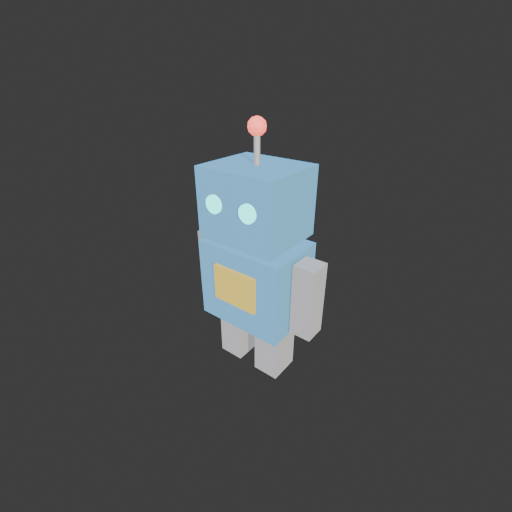
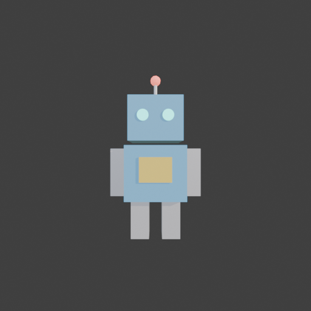

# Sohbet

- `ToolSearch` {"query": "select:mcp__blender__create_primitive,mcp__blender__delete_object,mcp__blender__set_material,mcp__blender__frame_view,mcp__blender__capture_viewport,mcp__blender__export_gltf,mcp__blender__inspect_scene,mcp__blender__join_objects,mcp__blender__duplicate_object", "max_results": 10}
- `mcp__blender__delete_object` {"name": "Cube"}
  > {"success":true,"tool":"delete_object","data":{"deleted":true,"exists":false,"object_name":"Cube","type":"MESH","previous_state":{"location":[0,0,0],"rotation":[0,0,0],"scale":[1,1,1]}},"error":null}
- `mcp__blender__create_primitive` {"primitive_type": "CUBE", "name": "Body", "size": 1, "location": [0, 0, 0.55], "scale": [0.5, 0.35, 0.45]}
  > {"success":true,"tool":"create_primitive","data":{"created":true,"exists":true,"object_name":"Body","primitive_type":"CUBE","type":"MESH","location":[0,0,0.55],"rotation":[0,0,0],"scale":[0.5,0.35,0.45],"vertex_count":8,"face_count":6},"error":null}
- `mcp__blender__create_primitive` {"primitive_type": "CUBE", "name": "Head", "size": 1, "location": [0, 0, 0.99], "scale": [0.44, 0.38, 0.36]}
  > {"success":true,"tool":"create_primitive","data":{"created":true,"exists":true,"object_name":"Head","primitive_type":"CUBE","type":"MESH","location":[0,0,0.99],"rotation":[0,0,0],"scale":[0.44,0.38,0.36],"vertex_count":8,"face_count":6},"error":null}
- `mcp__blender__create_primitive` {"primitive_type": "CYLINDER", "name": "AntennaRod", "size": 1, "location": [0, 0, 1.24], "scale": [0.03, 0.03, 0.14]}
  > {"success":true,"tool":"create_primitive","data":{"created":true,"exists":true,"object_name":"AntennaRod","primitive_type":"CYLINDER","type":"MESH","location":[0,0,1.24],"rotation":[0,0,0],"scale":[0.03,0.03,0.14],"vertex_count":64,"face_count":34},"error":null}
- `mcp__blender__create_primitive` {"primitive_type": "ICOSPHERE", "name": "AntennaTip", "size": 0.09, "location": [0, 0, 1.34]}
  > {"success":true,"tool":"create_primitive","data":{"created":true,"exists":true,"object_name":"AntennaTip","primitive_type":"ICOSPHERE","type":"MESH","location":[0,0,1.34],"rotation":[0,0,0],"scale":[1,1,1],"vertex_count":42,"face_count":80},"error":null}
- `mcp__blender__create_primitive` {"primitive_type": "CYLINDER", "name": "EyeL", "size": 1, "location": [-0.1, -0.19, 1.01], "rotation": [1.5708, 0, 0], "scale": [0.09, 0.09, 0.03]}
  > {"success":true,"tool":"create_primitive","data":{"created":true,"exists":true,"object_name":"EyeL","primitive_type":"CYLINDER","type":"MESH","location":[-0.1,-0.19,1.01],"rotation":[1.5708,0,0],"scale":[0.09,0.09,0.03],"vertex_count":64,"face_count":34},"error":null}
- `mcp__blender__create_primitive` {"primitive_type": "CYLINDER", "name": "EyeR", "size": 1, "location": [0.1, -0.19, 1.01], "rotation": [1.5708, 0, 0], "scale": [0.09, 0.09, 0.03]}
  > {"success":true,"tool":"create_primitive","data":{"created":true,"exists":true,"object_name":"EyeR","primitive_type":"CYLINDER","type":"MESH","location":[0.1,-0.19,1.01],"rotation":[1.5708,0,0],"scale":[0.09,0.09,0.03],"vertex_count":64,"face_count":34},"error":null}
- `mcp__blender__create_primitive` {"primitive_type": "CUBE", "name": "ChestPanel", "size": 1, "location": [0, -0.18, 0.58], "scale": [0.26, 0.03, 0.2]}
  > {"success":true,"tool":"create_primitive","data":{"created":true,"exists":true,"object_name":"ChestPanel","primitive_type":"CUBE","type":"MESH","location":[0,-0.18,0.58],"rotation":[0,0,0],"scale":[0.26,0.03,0.2],"vertex_count":8,"face_count":6},"error":null}
- `mcp__blender__create_primitive` {"primitive_type": "CUBE", "name": "ArmL", "size": 1, "location": [-0.32, 0, 0.55], "scale": [0.12, 0.12, 0.4]}
  > {"success":true,"tool":"create_primitive","data":{"created":true,"exists":true,"object_name":"ArmL","primitive_type":"CUBE","type":"MESH","location":[-0.32,0,0.55],"rotation":[0,0,0],"scale":[0.12,0.12,0.4],"vertex_count":8,"face_count":6},"error":null}
- `mcp__blender__create_primitive` {"primitive_type": "CUBE", "name": "ArmR", "size": 1, "location": [0.32, 0, 0.55], "scale": [0.12, 0.12, 0.4]}
  > {"success":true,"tool":"create_primitive","data":{"created":true,"exists":true,"object_name":"ArmR","primitive_type":"CUBE","type":"MESH","location":[0.32,0,0.55],"rotation":[0,0,0],"scale":[0.12,0.12,0.4],"vertex_count":8,"face_count":6},"error":null}
- `mcp__blender__create_primitive` {"primitive_type": "CUBE", "name": "LegL", "size": 1, "location": [-0.13, 0, 0.165], "scale": [0.15, 0.18, 0.33]}
  > {"success":true,"tool":"create_primitive","data":{"created":true,"exists":true,"object_name":"LegL","primitive_type":"CUBE","type":"MESH","location":[-0.13,0,0.165],"rotation":[0,0,0],"scale":[0.15,0.18,0.33],"vertex_count":8,"face_count":6},"error":null}
- `mcp__blender__create_primitive` {"primitive_type": "CUBE", "name": "LegR", "size": 1, "location": [0.13, 0, 0.165], "scale": [0.15, 0.18, 0.33]}
  > {"success":true,"tool":"create_primitive","data":{"created":true,"exists":true,"object_name":"LegR","primitive_type":"CUBE","type":"MESH","location":[0.13,0,0.165],"rotation":[0,0,0],"scale":[0.15,0.18,0.33],"vertex_count":8,"face_count":6},"error":null}
- `mcp__blender__set_material` {"object_name": "Body", "material_name": "RobotBody", "base_color": [0.2, 0.55, 0.85], "roughness": 0.5}
  > {"success":true,"tool":"set_material","data":{"material_name":"RobotBody","object_name":"Body","slot_index":0,"changed":["base_color","roughness"],"before":null,"after":{"assigned_objects":["Body"],"is_linked":false,"library_name":null,"material_name":"RobotBody","node_summary":{"node_count":2,"node ... [622 more characters]
- `mcp__blender__set_material` {"object_name": "Head", "material_name": "RobotBody"}
  > {"success":true,"tool":"set_material","data":{"material_name":"RobotBody","object_name":"Head","slot_index":0,"changed":[],"before":{"assigned_objects":["Body","Head"],"is_linked":false,"library_name":null,"material_name":"RobotBody","node_summary":{"node_count":2,"node_types":["BSDF_PRINCIPLED","OU ... [979 more characters]
- `mcp__blender__set_material` {"object_name": "ArmL", "material_name": "RobotGrey", "base_color": [0.75, 0.75, 0.78], "metallic": 0.3}
  > {"success":true,"tool":"set_material","data":{"material_name":"RobotGrey","object_name":"ArmL","slot_index":0,"changed":["base_color","metallic"],"before":null,"after":{"assigned_objects":["ArmL"],"is_linked":false,"library_name":null,"material_name":"RobotGrey","node_summary":{"node_count":2,"node_ ... [627 more characters]
- `mcp__blender__set_material` {"object_name": "ArmR", "material_name": "RobotGrey"}
  > {"success":true,"tool":"set_material","data":{"material_name":"RobotGrey","object_name":"ArmR","slot_index":0,"changed":[],"before":{"assigned_objects":["ArmL","ArmR"],"is_linked":false,"library_name":null,"material_name":"RobotGrey","node_summary":{"node_count":2,"node_types":["BSDF_PRINCIPLED","OU ... [988 more characters]
- `mcp__blender__set_material` {"object_name": "LegL", "material_name": "RobotGrey"}
  > {"success":true,"tool":"set_material","data":{"material_name":"RobotGrey","object_name":"LegL","slot_index":0,"changed":[],"before":{"assigned_objects":["ArmL","ArmR","LegL"],"is_linked":false,"library_name":null,"material_name":"RobotGrey","node_summary":{"node_count":2,"node_types":["BSDF_PRINCIPL ... [1009 more characters]
- `mcp__blender__set_material` {"object_name": "LegR", "material_name": "RobotGrey"}
  > {"success":true,"tool":"set_material","data":{"material_name":"RobotGrey","object_name":"LegR","slot_index":0,"changed":[],"before":{"assigned_objects":["ArmL","ArmR","LegL","LegR"],"is_linked":false,"library_name":null,"material_name":"RobotGrey","node_summary":{"node_count":2,"node_types":["BSDF_P ... [1030 more characters]
- `mcp__blender__set_material` {"object_name": "AntennaRod", "material_name": "RobotGrey"}
  > {"success":true,"tool":"set_material","data":{"material_name":"RobotGrey","object_name":"AntennaRod","slot_index":0,"changed":[],"before":{"assigned_objects":["AntennaRod","ArmL","ArmR","LegL","LegR"],"is_linked":false,"library_name":null,"material_name":"RobotGrey","node_summary":{"node_count":2,"n ... [1075 more characters]
- `mcp__blender__set_material` {"object_name": "EyeL", "material_name": "RobotEye", "base_color": [0.1, 1, 0.9], "emission_color": [0.1, 1, 0.9], "emission_strength": 2}
  > {"success":true,"tool":"set_material","data":{"material_name":"RobotEye","object_name":"EyeL","slot_index":0,"changed":["base_color","emission_color","emission_strength"],"before":null,"after":{"assigned_objects":["EyeL"],"is_linked":false,"library_name":null,"material_name":"RobotEye","node_summary ... [644 more characters]
- `mcp__blender__set_material` {"object_name": "EyeR", "material_name": "RobotEye"}
  > {"success":true,"tool":"set_material","data":{"material_name":"RobotEye","object_name":"EyeR","slot_index":0,"changed":[],"before":{"assigned_objects":["EyeL","EyeR"],"is_linked":false,"library_name":null,"material_name":"RobotEye","node_summary":{"node_count":2,"node_types":["BSDF_PRINCIPLED","OUTP ... [975 more characters]
- `mcp__blender__set_material` {"object_name": "AntennaTip", "material_name": "RobotRed", "base_color": [1, 0.2, 0.15], "emission_color": [1, 0.2, 0.15], "emission_strength": 1.5}
  > {"success":true,"tool":"set_material","data":{"material_name":"RobotRed","object_name":"AntennaTip","slot_index":0,"changed":["base_color","emission_color","emission_strength"],"before":null,"after":{"assigned_objects":["AntennaTip"],"is_linked":false,"library_name":null,"material_name":"RobotRed"," ... [670 more characters]
- `mcp__blender__set_material` {"object_name": "ChestPanel", "material_name": "RobotPanel", "base_color": [1, 0.75, 0.15], "roughness": 0.4}
  > {"success":true,"tool":"set_material","data":{"material_name":"RobotPanel","object_name":"ChestPanel","slot_index":0,"changed":["base_color","roughness"],"before":null,"after":{"assigned_objects":["ChestPanel"],"is_linked":false,"library_name":null,"material_name":"RobotPanel","node_summary":{"node_ ... [639 more characters]
- `mcp__blender__frame_view` {"direction": "ISO", "shading": "MATERIAL", "overlays": false}
  > {"success":true,"tool":"frame_view","data":{"direction":"ISO","objects":["Body","Head","AntennaRod","AntennaTip","EyeL","EyeR","ChestPanel","ArmL","ArmR","LegL","LegR"],"center":[0,-0.008,0.692],"radius":0.814,"shading":"MATERIAL","overlays":false},"error":null}
- `mcp__blender__capture_viewport` {}
  
  > [Image: source: C:\Users\Halil Emre\.claude\projects\C--Users-Halil-Emre-Desktop-GitHub-Public-Blender-Copilot-archives-bench-runs-20260930-013839-robot\02e1829a-59f4-4439-8a8a-63b5f580121d\tool-results\mcp-blender-blob-1790721562542-ahm5l2.png]
  > {"success":true,"tool":"capture_viewport","data":{"image_id":"vp_6df5d329f870","width":512,"height":512,"format":"PNG","mime_type":"image/png","byte_size":80344,"channels":4},"error":null}
**Ajan:** Looks good. Quick front check, then export.

- `mcp__blender__frame_view` {"direction": "FRONT", "shading": "MATERIAL", "overlays": false}
  > {"success":true,"tool":"frame_view","data":{"direction":"FRONT","objects":["Body","Head","AntennaRod","AntennaTip","EyeL","EyeR","ChestPanel","ArmL","ArmR","LegL","LegR"],"center":[0,-0.008,0.692],"radius":0.814,"shading":"MATERIAL","overlays":false},"error":null}
- `mcp__blender__capture_viewport` {}
  
  > [Image: source: C:\Users\Halil Emre\.claude\projects\C--Users-Halil-Emre-Desktop-GitHub-Public-Blender-Copilot-archives-bench-runs-20260930-013839-robot\02e1829a-59f4-4439-8a8a-63b5f580121d\tool-results\mcp-blender-blob-1790721564827-50u027.png]
  > {"success":true,"tool":"capture_viewport","data":{"image_id":"vp_9bea2775be22","width":512,"height":512,"format":"PNG","mime_type":"image/png","byte_size":76869,"channels":4},"error":null}
- `mcp__blender__export_gltf` {"filename": "robot.glb", "object_names": ["Body", "Head", "AntennaRod", "AntennaTip", "EyeL", "EyeR", "ChestPanel", "ArmL", "ArmR", "LegL", "LegR"], "recenter": false}
  > {"success":true,"tool":"export_gltf","data":{"path":"C:\\Users\\Halil Emre\\Desktop\\GitHub\\Public\\Blender Copilot\\archives\\bench-runs\\20260930-013839-robot\\robot.glb","filename":"robot.glb","bytes":32976,"objects":["Body","Head","AntennaRod","AntennaTip","EyeL","EyeR","ChestPanel","ArmL","Arm ... [99 more characters]
**Ajan:** Robot hazır ve `robot.glb` olarak dışa aktarıldı: **536 üçgen**.

**Ne yaptım:**
- Varsayılan Cube'u sildim.
- Robotu 11 basit parçadan kurdum. Boyu yaklaşık 1,4 m, ayakları z=0'da duruyor ve ön yüzü -Y yönüne bakıyor.
  - **Kafa:** mavi kutu.
  - **Anten:** gri çubuk ve ucunda kırmızı, parlayan küçük bir küre.
  - **Gözler:** önde parlayan turkuaz iki disk.
  - **Gövde:** mavi kutu, önünde sarı bir göğüs paneli.
  - **Kollar ve bacaklar:** gri blok kollar ve iki bacak.
- 5 malzeme kullandım: mavi gövde, gri metalik, parlayan göz, kırmızı anten ucu ve sarı panel.
- Modeli viewport'ta ISO ve FRONT açılardan kendim kontrol ettim. Parçalar simetrik ve oranlar sevimli görünüyor. Kafa ile gövde arasında küçük bir boyun boşluğu bıraktım.
- Dışa aktarım Y-up ayarıyla yapıldı ve malzemeler dosyaya dahil. Parçaları birleştirmedim, bu yüzden oyunda kolları, kafayı ve diğer parçaları ayrı ayrı hareket ettirebilirsin.
- `recenter=false` ile dışa aktardım. Böylece modelin orijini, alt orta noktası olan sahne orijininde (0,0,0) kalıyor.

**Dosya:** `C:\Users\Halil Emre\Desktop\GitHub\Public\Blender Copilot\archives\bench-runs\20260930-013839-robot\robot.glb`

---
**Sonuç:** Robot hazır ve `robot.glb` olarak dışa aktarıldı: **536 üçgen**.

**Ne yaptım:**
- Varsayılan Cube'u sildim.
- Robotu 11 basit parçadan kurdum. Boyu yaklaşık 1,4 m, ayakları z=0'da duruyor ve ön yüzü -Y yönüne bakıyor.
  - **Kafa:** mavi kutu.
  - **Anten:** gri çubuk ve ucunda kırmızı, parlayan küçük bir küre.
  - **Gözler:** önde parlayan turkuaz iki disk.
  - **Gövde:** mavi kutu, önünde sarı bir göğüs paneli.
  - **Kollar ve bacaklar:** gri blok kollar ve iki bacak.
- 5 malzeme kullandım: mavi gövde, gri metalik, parlayan göz, kırmızı anten ucu ve sarı panel.
- Modeli viewport'ta ISO ve FRONT açılardan kendim kontrol ettim. Parçalar simetrik ve oranlar sevimli görünüyor. Kafa ile gövde arasında küçük bir boyun boşluğu bıraktım.
- Dışa aktarım Y-up ayarıyla yapıldı ve malzemeler dosyaya dahil. Parçaları birleştirmedim, bu yüzden oyunda kolları, kafayı ve diğer parçaları ayrı ayrı hareket ettirebilirsin.
- `recenter=false` ile dışa aktardım. Böylece modelin orijini, alt orta noktası olan sahne orijininde (0,0,0) kalıyor.

**Dosya:** `C:\Users\Halil Emre\Desktop\GitHub\Public\Blender Copilot\archives\bench-runs\20260930-013839-robot\robot.glb`
