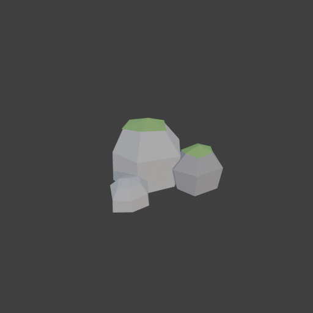
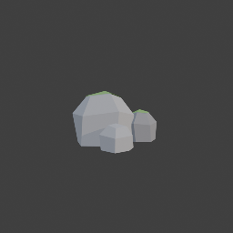

# Sohbet

- `ToolSearch` {"query": "select:mcp__blender__inspect_scene,mcp__blender__delete_object,mcp__blender__create_mesh,mcp__blender__set_material,mcp__blender__assign_material,mcp__blender__frame_view,mcp__blender__capture_viewport,mcp__blender__export_gltf,mcp__blender__join_objects,mcp__blender__set_origin,mcp__blender__mesh_edit,mcp__blender__set_shading", "max_results": 12}
- `mcp__blender__inspect_scene` {}
  > {"success":true,"tool":"inspect_scene","data":{"active_camera":"Camera","active_collection":"Collection","active_object":"Cube","collections":["Collection"],"counts":{"camera":1,"light":1,"mesh":1,"total":3},"objects":[{"is_linked":false,"name":"Camera","type":"CAMERA"},{"is_linked":false,"name":"Cu ... [156 more characters]
- `mcp__blender__delete_object` {"name": "Cube"}
  > {"success":true,"tool":"delete_object","data":{"deleted":true,"exists":false,"object_name":"Cube","type":"MESH","previous_state":{"location":[0,0,0],"rotation":[0,0,0],"scale":[1,1,1]}},"error":null}
**Ajan:** Now the three rocks (same irregular base shape, each with different scale/rotation) plus moss caps.

- `mcp__blender__create_mesh` {"name": "RockA", "vertices": [[0.6, 0, 0], [0.31, 0.45, 0], [-0.35, 0.51, 0], [-0.5, 0, 0], [-0.33, -0.48, 0], [0.3, -0.52, 0], [0.65, 0.05, 0.55], [0.34, 0.49, 0.6], [-0.33, 0.48, 0.5], [-0.62, 0.03, 0.58], [-0.31, -0.45, 0.52], [0.33, -0.57, 0.6], [0.38, 0.02, 0.9], [0.17, 0.25, 0.95], [-0.23, 0.33, 0.85], [-0.33, 0, 0.92], [-0.2, -0.3, 0.88], [0.18, -0.3, 0.93], [0.05, 0.02, 1.02]], "faces": [ ... [292 more characters]
  > {"success":true,"tool":"create_mesh","data":{"object_name":"RockA","type":"MESH","exists":true,"location":[0,0,0],"rotation":[0,0,0],"scale":[1,1,1],"vertex_count":19,"face_count":19,"triangle_count":34,"local_bounds_min":[-0.62,-0.57,0],"local_bounds_max":[0.65,0.51,1.02],"dimensions":[1.27,1.08,1. ... [33 more characters]
- `mcp__blender__create_mesh` {"name": "MossA", "vertices": [[0.4, 0.02, 0.915], [0.18, 0.26, 0.965], [-0.24, 0.34, 0.865], [-0.34, 0, 0.935], [-0.21, -0.31, 0.895], [0.19, -0.31, 0.945], [0.05, 0.02, 1.04]], "faces": [[0, 1, 6], [1, 2, 6], [2, 3, 6], [3, 4, 6], [4, 5, 6], [5, 0, 6]]}
  > {"success":true,"tool":"create_mesh","data":{"object_name":"MossA","type":"MESH","exists":true,"location":[0,0,0],"rotation":[0,0,0],"scale":[1,1,1],"vertex_count":7,"face_count":6,"triangle_count":6,"local_bounds_min":[-0.34,-0.31,0.865],"local_bounds_max":[0.4,0.34,1.04],"dimensions":[0.74,0.65,0. ... [34 more characters]
- `mcp__blender__create_mesh` {"name": "RockB", "location": [0.8, 0.3, 0], "rotation": [0, 0, 1.2], "scale": [0.7, 0.6, 0.65], "vertices": [[0.6, 0, 0], [0.31, 0.45, 0], [-0.35, 0.51, 0], [-0.5, 0, 0], [-0.33, -0.48, 0], [0.3, -0.52, 0], [0.65, 0.05, 0.55], [0.34, 0.49, 0.6], [-0.33, 0.48, 0.5], [-0.62, 0.03, 0.58], [-0.31, -0.45, 0.52], [0.33, -0.57, 0.6], [0.38, 0.02, 0.9], [0.17, 0.25, 0.95], [-0.23, 0.33, 0.85], [-0.33, 0, ... [371 more characters]
  > {"success":true,"tool":"create_mesh","data":{"object_name":"RockB","type":"MESH","exists":true,"location":[0.8,0.3,0],"rotation":[0,0,1.2],"scale":[0.7,0.6,0.65],"vertex_count":19,"face_count":19,"triangle_count":34,"local_bounds_min":[-0.62,-0.57,0],"local_bounds_max":[0.65,0.51,1.02],"dimensions": ... [49 more characters]
- `mcp__blender__create_mesh` {"name": "MossB", "location": [0.8, 0.3, 0], "rotation": [0, 0, 1.2], "scale": [0.7, 0.6, 0.65], "vertices": [[0.4, 0.02, 0.915], [0.18, 0.26, 0.965], [-0.24, 0.34, 0.865], [-0.34, 0, 0.935], [-0.21, -0.31, 0.895], [0.19, -0.31, 0.945], [0.05, 0.02, 1.04]], "faces": [[0, 1, 6], [1, 2, 6], [2, 3, 6], [3, 4, 6], [4, 5, 6], [5, 0, 6]]}
  > {"success":true,"tool":"create_mesh","data":{"object_name":"MossB","type":"MESH","exists":true,"location":[0.8,0.3,0],"rotation":[0,0,1.2],"scale":[0.7,0.6,0.65],"vertex_count":7,"face_count":6,"triangle_count":6,"local_bounds_min":[-0.34,-0.31,0.865],"local_bounds_max":[0.4,0.34,1.04],"dimensions": ... [49 more characters]
- `mcp__blender__create_mesh` {"name": "RockC", "location": [0.3, -0.72, 0], "rotation": [0, 0, 2.5], "scale": [0.45, 0.52, 0.4], "vertices": [[0.6, 0, 0], [0.31, 0.45, 0], [-0.35, 0.51, 0], [-0.5, 0, 0], [-0.33, -0.48, 0], [0.3, -0.52, 0], [0.65, 0.05, 0.55], [0.34, 0.49, 0.6], [-0.33, 0.48, 0.5], [-0.62, 0.03, 0.58], [-0.31, -0.45, 0.52], [0.33, -0.57, 0.6], [0.38, 0.02, 0.9], [0.17, 0.25, 0.95], [-0.23, 0.33, 0.85], [-0.33, ... [374 more characters]
  > {"success":true,"tool":"create_mesh","data":{"object_name":"RockC","type":"MESH","exists":true,"location":[0.3,-0.72,0],"rotation":[0,0,2.5],"scale":[0.45,0.52,0.4],"vertex_count":19,"face_count":19,"triangle_count":34,"local_bounds_min":[-0.62,-0.57,0],"local_bounds_max":[0.65,0.51,1.02],"dimension ... [54 more characters]
- `mcp__blender__set_material` {"material_name": "RockGray", "base_color": [0.32, 0.32, 0.33], "roughness": 0.95}
  > {"success":true,"tool":"set_material","data":{"material_name":"RockGray","object_name":null,"slot_index":null,"changed":["base_color","roughness"],"before":null,"after":{"assigned_objects":[],"is_linked":false,"library_name":null,"material_name":"RockGray","node_summary":{"node_count":2,"node_types" ... [612 more characters]
- `mcp__blender__set_material` {"material_name": "RockDark", "base_color": [0.2, 0.2, 0.21], "roughness": 0.95}
  > {"success":true,"tool":"set_material","data":{"material_name":"RockDark","object_name":null,"slot_index":null,"changed":["base_color","roughness"],"before":null,"after":{"assigned_objects":[],"is_linked":false,"library_name":null,"material_name":"RockDark","node_summary":{"node_count":2,"node_types" ... [608 more characters]
- `mcp__blender__set_material` {"material_name": "Moss", "base_color": [0.15, 0.3, 0.08], "roughness": 1}
  > {"success":true,"tool":"set_material","data":{"material_name":"Moss","object_name":null,"slot_index":null,"changed":["base_color","roughness"],"before":null,"after":{"assigned_objects":[],"is_linked":false,"library_name":null,"material_name":"Moss","node_summary":{"node_count":2,"node_types":["BSDF_ ... [592 more characters]
- `mcp__blender__assign_material` {"object_name": "RockA", "material_name": "RockGray"}
  > {"success":true,"tool":"assign_material","data":{"assigned":true,"object_name":"RockA","material_name":"RockGray","slot_index":0,"before":{"material_name":null},"after":{"object_name":"RockA","slot_index":0,"material_name":"RockGray"},"actual":{"object_name":"RockA","slot_index":0,"material_name":"R ... [24 more characters]
- `mcp__blender__assign_material` {"object_name": "RockB", "material_name": "RockDark"}
  > {"success":true,"tool":"assign_material","data":{"assigned":true,"object_name":"RockB","material_name":"RockDark","slot_index":0,"before":{"material_name":null},"after":{"object_name":"RockB","slot_index":0,"material_name":"RockDark"},"actual":{"object_name":"RockB","slot_index":0,"material_name":"R ... [24 more characters]
- `mcp__blender__assign_material` {"object_name": "RockC", "material_name": "RockGray"}
  > {"success":true,"tool":"assign_material","data":{"assigned":true,"object_name":"RockC","material_name":"RockGray","slot_index":0,"before":{"material_name":null},"after":{"object_name":"RockC","slot_index":0,"material_name":"RockGray"},"actual":{"object_name":"RockC","slot_index":0,"material_name":"R ... [24 more characters]
- `mcp__blender__assign_material` {"object_name": "MossA", "material_name": "Moss"}
  > {"success":true,"tool":"assign_material","data":{"assigned":true,"object_name":"MossA","material_name":"Moss","slot_index":0,"before":{"material_name":null},"after":{"object_name":"MossA","slot_index":0,"material_name":"Moss"},"actual":{"object_name":"MossA","slot_index":0,"material_name":"Moss"}}," ... [12 more characters]
- `mcp__blender__assign_material` {"object_name": "MossB", "material_name": "Moss"}
  > {"success":true,"tool":"assign_material","data":{"assigned":true,"object_name":"MossB","material_name":"Moss","slot_index":0,"before":{"material_name":null},"after":{"object_name":"MossB","slot_index":0,"material_name":"Moss"},"actual":{"object_name":"MossB","slot_index":0,"material_name":"Moss"}}," ... [12 more characters]
- `mcp__blender__frame_view` {"direction": "ISO", "shading": "MATERIAL", "overlays": false}
  > {"success":true,"tool":"frame_view","data":{"direction":"ISO","objects":["RockA","MossA","RockB","MossB","RockC"],"center":[0.332,-0.132,0.52],"radius":1.453,"shading":"MATERIAL","overlays":false},"error":null}
- `mcp__blender__capture_viewport` {}
  
  > [Image: source: C:\Users\Halil Emre\.claude\projects\C--Users-Halil-Emre-Desktop-GitHub-Public-Blender-Copilot-archives-bench-runs-20260930-011921-rock\019bd31f-f2f2-4a08-9346-325f4c7c8dc2\tool-results\mcp-blender-blob-1790720412843-sm8v82.png]
  > {"success":true,"tool":"capture_viewport","data":{"image_id":"vp_4254ca1fe203","width":512,"height":512,"format":"PNG","mime_type":"image/png","byte_size":76891,"channels":4},"error":null}
**Ajan:** Görünüm iyi. Birleştirip dışa aktarıyorum.

- `mcp__blender__join_objects` {"object_names": ["RockA", "MossA", "RockB", "MossB", "RockC"], "target_name": "RockA", "new_name": "RockCluster"}
  > {"success":true,"tool":"join_objects","data":{"object_name":"RockCluster","type":"MESH","exists":true,"location":[0,0,0],"rotation":[0,0,0],"scale":[1,1,1],"vertex_count":71,"face_count":69,"triangle_count":114,"local_bounds_min":[-0.62,-1.0267,0],"local_bounds_max":[1.2025,0.7349,1.04],"dimensions" ... [87 more characters]
- `mcp__blender__set_origin` {"object_name": "RockCluster", "mode": "BOTTOM_CENTER"}
  > {"success":true,"tool":"set_origin","data":{"object_name":"RockCluster","type":"MESH","exists":true,"location":[0.2912,-0.1459,0],"rotation":[0,0,0],"scale":[1,1,1],"vertex_count":71,"face_count":69,"triangle_count":114,"local_bounds_min":[-0.9112,-0.8808,0],"local_bounds_max":[0.9112,0.8808,1.04]," ... [77 more characters]
- `mcp__blender__frame_view` {"direction": "FRONT", "shading": "MATERIAL", "overlays": false}
  > {"success":true,"tool":"frame_view","data":{"direction":"FRONT","objects":["RockCluster"],"center":[0.291,-0.146,0.52],"radius":1.37,"shading":"MATERIAL","overlays":false},"error":null}
- `mcp__blender__capture_viewport` {"max_side": 256}
  
  > [Image: source: C:\Users\Halil Emre\.claude\projects\C--Users-Halil-Emre-Desktop-GitHub-Public-Blender-Copilot-archives-bench-runs-20260930-011921-rock\019bd31f-f2f2-4a08-9346-325f4c7c8dc2\tool-results\mcp-blender-blob-1790720417767-1gko5r.png]
  > {"success":true,"tool":"capture_viewport","data":{"image_id":"vp_1c64b6a43eb9","width":256,"height":256,"format":"PNG","mime_type":"image/png","byte_size":20374,"channels":4,"downscaled":true,"requested":"512x512"},"error":null}
- `mcp__blender__export_gltf` {"object_names": ["RockCluster"], "filename": "rock.glb"}
  > {"success":true,"tool":"export_gltf","data":{"path":"C:\\Users\\Halil Emre\\Desktop\\GitHub\\Public\\Blender Copilot\\archives\\bench-runs\\20260930-011921-rock\\rock.glb","filename":"rock.glb","bytes":9316,"objects":["RockCluster"],"triangle_count":114,"format":"GLB","y_up":true,"recentered":true}, ... [13 more characters]
**Ajan:** Kaya kümesi hazır ve `rock.glb` olarak dışa aktarıldı. Toplam **114 üçgen**.

**Ne yaptım:**
- Varsayılan Cube'u sildim.
- Tek bir köşeli kaya gövdesini kendi köşe noktalarımla oluşturdum. Gövde üç düzensiz halka ve bir tepe noktasından oluşuyor, yüzeyler düz gölgeli. Bu gövdeyi farklı ölçek ve dönüşlerle üç kez kullandım. Büyük kaya 1.0 m, orta 0.66 m, küçük 0.41 m yüksekliğinde. Kayalar birbirine yaslanıp hafifçe iç içe geçiyor.
- Renkler: büyük ve küçük kaya açık gri, orta kaya koyu gri. Büyük ve orta kayanın tepesinde ince bir yosun yeşili katman var. Küçük kayada yosun yok.
- Her kayanın alt yüzü z=0'da düz, yani küme zemine oturuyor. Parçaları tek nesnede birleştirdim (`RockCluster`) ve orijini alt-merkeze aldım. Küme yaklaşık 1.8 × 1.8 × 1.0 m boyutunda.
- Viewport'ta ISO ve önden (FRONT) baktım: alt kısım düz, kayalar birbirine yaslı, yosun tepede görünüyor.

**Dosya:** `...\archives\bench-runs\20260930-011921-rock\rock.glb` (9 KB, Y-up, merkezlenmiş)

Üç kaya da aynı temel gövdeden geldiği için yakından bakınca birbirine benziyor. Daha fazla çeşitlilik istersen her biri için ayrı gövde çizebilirim.

---
**Sonuç:** Kaya kümesi hazır ve `rock.glb` olarak dışa aktarıldı. Toplam **114 üçgen**.

**Ne yaptım:**
- Varsayılan Cube'u sildim.
- Tek bir köşeli kaya gövdesini kendi köşe noktalarımla oluşturdum. Gövde üç düzensiz halka ve bir tepe noktasından oluşuyor, yüzeyler düz gölgeli. Bu gövdeyi farklı ölçek ve dönüşlerle üç kez kullandım. Büyük kaya 1.0 m, orta 0.66 m, küçük 0.41 m yüksekliğinde. Kayalar birbirine yaslanıp hafifçe iç içe geçiyor.
- Renkler: büyük ve küçük kaya açık gri, orta kaya koyu gri. Büyük ve orta kayanın tepesinde ince bir yosun yeşili katman var. Küçük kayada yosun yok.
- Her kayanın alt yüzü z=0'da düz, yani küme zemine oturuyor. Parçaları tek nesnede birleştirdim (`RockCluster`) ve orijini alt-merkeze aldım. Küme yaklaşık 1.8 × 1.8 × 1.0 m boyutunda.
- Viewport'ta ISO ve önden (FRONT) baktım: alt kısım düz, kayalar birbirine yaslı, yosun tepede görünüyor.

**Dosya:** `...\archives\bench-runs\20260930-011921-rock\rock.glb` (9 KB, Y-up, merkezlenmiş)

Üç kaya da aynı temel gövdeden geldiği için yakından bakınca birbirine benziyor. Daha fazla çeşitlilik istersen her biri için ayrı gövde çizebilirim.
