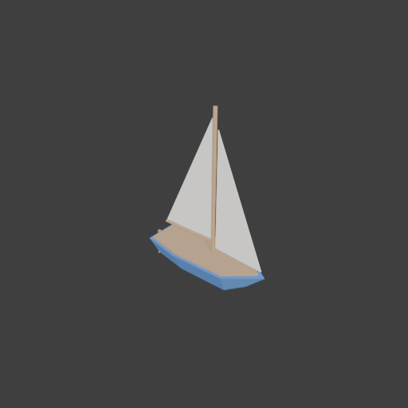
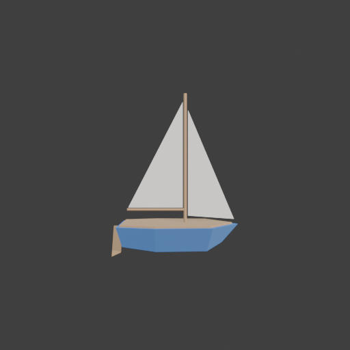

# Sohbet

- `ToolSearch` {"query": "select:mcp__blender__create_mesh,mcp__blender__create_primitive,mcp__blender__delete_object,mcp__blender__inspect_scene,mcp__blender__frame_view,mcp__blender__capture_viewport,mcp__blender__export_gltf,mcp__blender__set_material,mcp__blender__transform_object,mcp__blender__join_objects", "max_results": 10}
- `mcp__blender__delete_object` {"name": "Cube"}
  > {"success":true,"tool":"delete_object","data":{"deleted":true,"exists":false,"object_name":"Cube","type":"MESH","previous_state":{"location":[0,0,0],"rotation":[0,0,0],"scale":[1,1,1]}},"error":null}
- `mcp__blender__create_mesh` {"name": "Hull", "vertices": [[1.5, 0, 0.6], [0.8, 0.55, 0.6], [0.8, -0.55, 0.6], [-0.5, 0.6, 0.6], [-0.5, -0.6, 0.6], [-1.4, 0.45, 0.6], [-1.4, -0.45, 0.6], [1.1, 0, 0.15], [0.7, 0.25, 0], [0.7, -0.25, 0], [-0.5, 0.3, 0], [-0.5, -0.3, 0], [-1.3, 0.25, 0.1], [-1.3, -0.25, 0.1]], "faces": [[0, 1, 3, 5, 6, 4, 2], [0, 7, 8, 1], [1, 8, 10, 3], [3, 10, 12, 5], [0, 2, 9, 7], [2, 4, 11, 9], [4, 6, 13, 11 ... [46 more characters]
  > {"success":true,"tool":"create_mesh","data":{"object_name":"Hull","type":"MESH","exists":true,"location":[0,0,0],"rotation":[0,0,0],"scale":[1,1,1],"vertex_count":14,"face_count":9,"triangle_count":24,"local_bounds_min":[-1.4,-0.6,0],"local_bounds_max":[1.5,0.6,0.6],"dimensions":[2.9,1.2,0.6],"creat ... [23 more characters]
- `mcp__blender__create_mesh` {"name": "Deck", "vertices": [[1.35, 0, 0.64], [0.75, 0.48, 0.64], [0.75, -0.48, 0.64], [-0.5, 0.53, 0.64], [-0.5, -0.53, 0.64], [-1.33, 0.39, 0.64], [-1.33, -0.39, 0.64], [1.35, 0, 0.58], [0.75, 0.48, 0.58], [0.75, -0.48, 0.58], [-0.5, 0.53, 0.58], [-0.5, -0.53, 0.58], [-1.33, 0.39, 0.58], [-1.33, -0.39, 0.58]], "faces": [[0, 1, 3, 5, 6, 4, 2], [7, 9, 11, 13, 12, 10, 8], [0, 7, 8, 1], [1, 8, 10,  ... [81 more characters]
  > {"success":true,"tool":"create_mesh","data":{"object_name":"Deck","type":"MESH","exists":true,"location":[0,0,0],"rotation":[0,0,0],"scale":[1,1,1],"vertex_count":14,"face_count":9,"triangle_count":24,"local_bounds_min":[-1.33,-0.53,0.58],"local_bounds_max":[1.35,0.53,0.64],"dimensions":[2.68,1.06,0 ... [34 more characters]
- `mcp__blender__create_primitive` {"primitive_type": "CYLINDER", "name": "Mast", "size": 1, "location": [0.2, 0, 2.2], "scale": [0.08, 0.08, 3.2]}
  > {"success":true,"tool":"create_primitive","data":{"created":true,"exists":true,"object_name":"Mast","primitive_type":"CYLINDER","type":"MESH","location":[0.2,0,2.2],"rotation":[0,0,0],"scale":[0.08,0.08,3.2],"vertex_count":64,"face_count":34},"error":null}
- `mcp__blender__create_primitive` {"primitive_type": "CYLINDER", "name": "Boom", "size": 1, "location": [-0.5, 0, 0.95], "rotation": [0, 1.5708, 0], "scale": [0.06, 0.06, 1.45]}
  > {"success":true,"tool":"create_primitive","data":{"created":true,"exists":true,"object_name":"Boom","primitive_type":"CYLINDER","type":"MESH","location":[-0.5,0,0.95],"rotation":[0,1.5708,0],"scale":[0.06,0.06,1.45],"vertex_count":64,"face_count":34},"error":null}
- `mcp__blender__create_mesh` {"name": "MainSail", "vertices": [[0.14, 0, 1], [0.14, 0, 3.6], [-1.2, 0, 1], [0.14, 0.02, 1], [0.14, 0.02, 3.6], [-1.2, 0.02, 1]], "faces": [[0, 2, 1], [3, 4, 5], [0, 1, 4, 3], [1, 2, 5, 4], [2, 0, 3, 5]]}
  > {"success":true,"tool":"create_mesh","data":{"object_name":"MainSail","type":"MESH","exists":true,"location":[0,0,0],"rotation":[0,0,0],"scale":[1,1,1],"vertex_count":6,"face_count":5,"triangle_count":8,"local_bounds_min":[-1.2,0,1],"local_bounds_max":[0.14,0.02,3.6],"dimensions":[1.34,0.02,2.6],"cr ... [26 more characters]
- `mcp__blender__create_mesh` {"name": "JibSail", "vertices": [[0.27, 0, 3.4], [0.27, 0, 0.8], [1.4, 0, 0.72], [0.27, 0.02, 3.4], [0.27, 0.02, 0.8], [1.4, 0.02, 0.72]], "faces": [[0, 2, 1], [3, 4, 5], [0, 1, 4, 3], [1, 2, 5, 4], [2, 0, 3, 5]]}
  > {"success":true,"tool":"create_mesh","data":{"object_name":"JibSail","type":"MESH","exists":true,"location":[0,0,0],"rotation":[0,0,0],"scale":[1,1,1],"vertex_count":6,"face_count":5,"triangle_count":8,"local_bounds_min":[0.27,0,0.72],"local_bounds_max":[1.4,0.02,3.4],"dimensions":[1.13,0.02,2.68]," ... [28 more characters]
- `mcp__blender__create_mesh` {"name": "Rudder", "vertices": [[-1.36, -0.03, 0.55], [-1.55, -0.03, 0.55], [-1.6, -0.03, -0.2], [-1.38, -0.03, -0.1], [-1.36, 0.03, 0.55], [-1.55, 0.03, 0.55], [-1.6, 0.03, -0.2], [-1.38, 0.03, -0.1]], "faces": [[0, 1, 2, 3], [4, 7, 6, 5], [0, 4, 5, 1], [1, 5, 6, 2], [2, 6, 7, 3], [3, 7, 4, 0]]}
  > {"success":true,"tool":"create_mesh","data":{"object_name":"Rudder","type":"MESH","exists":true,"location":[0,0,0],"rotation":[0,0,0],"scale":[1,1,1],"vertex_count":8,"face_count":6,"triangle_count":12,"local_bounds_min":[-1.6,-0.03,-0.2],"local_bounds_max":[-1.36,0.03,0.55],"dimensions":[0.24,0.06, ... [35 more characters]
- `mcp__blender__set_material` {"object_name": "Hull", "material_name": "HullPaint", "base_color": [0.1, 0.25, 0.6], "roughness": 0.6}
  > {"success":true,"tool":"set_material","data":{"material_name":"HullPaint","object_name":"Hull","slot_index":0,"changed":["base_color","roughness"],"before":null,"after":{"assigned_objects":["Hull"],"is_linked":false,"library_name":null,"material_name":"HullPaint","node_summary":{"node_count":2,"node ... [620 more characters]
- `mcp__blender__set_material` {"object_name": "Deck", "material_name": "Wood", "base_color": [0.55, 0.35, 0.18], "roughness": 0.8}
  > {"success":true,"tool":"set_material","data":{"material_name":"Wood","object_name":"Deck","slot_index":0,"changed":["base_color","roughness"],"before":null,"after":{"assigned_objects":["Deck"],"is_linked":false,"library_name":null,"material_name":"Wood","node_summary":{"node_count":2,"node_types":[" ... [609 more characters]
- `mcp__blender__set_material` {"object_name": "MainSail", "material_name": "SailCloth", "base_color": [0.95, 0.93, 0.85], "roughness": 0.9}
  > {"success":true,"tool":"set_material","data":{"material_name":"SailCloth","object_name":"MainSail","slot_index":0,"changed":["base_color","roughness"],"before":null,"after":{"assigned_objects":["MainSail"],"is_linked":false,"library_name":null,"material_name":"SailCloth","node_summary":{"node_count" ... [636 more characters]
- `mcp__blender__set_material` {"object_name": "JibSail", "material_name": "SailCloth"}
  > {"success":true,"tool":"set_material","data":{"material_name":"SailCloth","object_name":"JibSail","slot_index":0,"changed":[],"before":{"assigned_objects":["JibSail","MainSail"],"is_linked":false,"library_name":null,"material_name":"SailCloth","node_summary":{"node_count":2,"node_types":["BSDF_PRINC ... [1006 more characters]
- `mcp__blender__set_material` {"object_name": "Mast", "material_name": "Wood"}
  > {"success":true,"tool":"set_material","data":{"material_name":"Wood","object_name":"Mast","slot_index":0,"changed":[],"before":{"assigned_objects":["Deck","Mast"],"is_linked":false,"library_name":null,"material_name":"Wood","node_summary":{"node_count":2,"node_types":["BSDF_PRINCIPLED","OUTPUT_MATER ... [962 more characters]
- `mcp__blender__set_material` {"object_name": "Boom", "material_name": "Wood"}
  > {"success":true,"tool":"set_material","data":{"material_name":"Wood","object_name":"Boom","slot_index":0,"changed":[],"before":{"assigned_objects":["Boom","Deck","Mast"],"is_linked":false,"library_name":null,"material_name":"Wood","node_summary":{"node_count":2,"node_types":["BSDF_PRINCIPLED","OUTPU ... [983 more characters]
- `mcp__blender__set_material` {"object_name": "Rudder", "material_name": "Wood"}
  > {"success":true,"tool":"set_material","data":{"material_name":"Wood","object_name":"Rudder","slot_index":0,"changed":[],"before":{"assigned_objects":["Boom","Deck","Mast","Rudder"],"is_linked":false,"library_name":null,"material_name":"Wood","node_summary":{"node_count":2,"node_types":["BSDF_PRINCIP ... [1012 more characters]
- `mcp__blender__frame_view` {"direction": "ISO", "overlays": false, "shading": "MATERIAL"}
  > {"success":true,"tool":"frame_view","data":{"direction":"ISO","objects":["Hull","Deck","Mast","Boom","MainSail","JibSail","Rudder"],"center":[-0.05,0,1.8],"radius":2.6,"shading":"MATERIAL","overlays":false},"error":null}
- `mcp__blender__capture_viewport` {}
  
  > [Image: source: C:\Users\Halil Emre\.claude\projects\C--Users-Halil-Emre-Desktop-GitHub-Public-Blender-Copilot-archives-bench-runs-20260930-073812-sailboat\4938ef00-a09b-4ef7-b9b0-c6ceebec4e20\tool-results\mcp-blender-blob-1790743145810-57z1rv.png]
  > {"success":true,"tool":"capture_viewport","data":{"image_id":"vp_e2b40bb8a6ca","width":512,"height":512,"format":"PNG","mime_type":"image/png","byte_size":77443,"channels":4},"error":null}
**Ajan:** Tekne hazır görünüyor; yandan kontrol edip dışa aktarıyorum.

- `mcp__blender__frame_view` {"direction": "FRONT", "overlays": false, "shading": "MATERIAL"}
  > {"success":true,"tool":"frame_view","data":{"direction":"FRONT","objects":["Hull","Deck","Mast","Boom","MainSail","JibSail","Rudder"],"center":[-0.05,0,1.8],"radius":2.6,"shading":"MATERIAL","overlays":false},"error":null}
- `mcp__blender__capture_viewport` {}
  
  > [Image: source: C:\Users\Halil Emre\.claude\projects\C--Users-Halil-Emre-Desktop-GitHub-Public-Blender-Copilot-archives-bench-runs-20260930-073812-sailboat\4938ef00-a09b-4ef7-b9b0-c6ceebec4e20\tool-results\mcp-blender-blob-1790743148855-nrf9fp.png]
  > {"success":true,"tool":"capture_viewport","data":{"image_id":"vp_a0f6cd3474db","width":512,"height":512,"format":"PNG","mime_type":"image/png","byte_size":77966,"channels":4},"error":null}
**Ajan:** Görünüm doğru. Dışa aktarıyorum (Hull ilk sırada; orijini gövdenin tabanında).

- `mcp__blender__export_gltf` {"object_names": ["Hull", "Deck", "Mast", "Boom", "MainSail", "JibSail", "Rudder"], "filename": "sailboat.glb"}
  > {"success":true,"tool":"export_gltf","data":{"path":"C:\\Users\\Halil Emre\\Desktop\\GitHub\\Public\\Blender Copilot\\archives\\bench-runs\\20260930-073812-sailboat\\sailboat.glb","filename":"sailboat.glb","bytes":19140,"objects":["Hull","Deck","Mast","Boom","MainSail","JibSail","Rudder"],"triangle_ ... [70 more characters]
**Ajan:** Yelkenli tekne hazır ve `sailboat.glb` olarak dışa aktarıldı; toplam **324 üçgen**, 19 KB.

**Parçalar:**
- **Gövde:** Kendim yazdığım 7 kenarlı bir form. Sivri bir pruvası, düz bir kıç aynası ve eğimli bir karinası var. Ölçüleri yaklaşık 2,9 × 1,2 × 0,6 m, rengi mavi.
- **Güverte:** Gövdenin üstünde ince bir ahşap plaka.
- **Direk ve bumba:** Direk yaklaşık 3,2 m, bumba ise ana yelkenin altında yatay duruyor. İkisi de ahşap.
- **İki yelken:** Direğin arkasında üçgen bir ana yelken, önünde bir flok. Oyunda arkadan da görünsünler diye 2 cm kalınlık verdim. Rengi kırık beyaz.
- **Dümen:** Kıç aynasının arkasında, suyun altına doğru inen ince bir ahşap kanat.

Varsayılan Cube'u sildim. Modeli çapraz (ISO) ve yandan (FRONT) viewport'ta görüntüleyip kontrol ettim; parçaların hepsi doğru yerinde.

Üçgenlerin çoğu direk ve bumbadan geliyor, çünkü ikisi de 32 kenarlı hazır silindir. Daha da düşük poligon istersen bunları az kenarlı silindirlerle değiştirebilirim; toplam 100 üçgenin altına iner.

Dosya konumu: `archives\bench-runs\20260930-073812-sailboat\sailboat.glb` (Y-up, orijin gövdenin tabanında)

---
**Sonuç:** Yelkenli tekne hazır ve `sailboat.glb` olarak dışa aktarıldı; toplam **324 üçgen**, 19 KB.

**Parçalar:**
- **Gövde:** Kendim yazdığım 7 kenarlı bir form. Sivri bir pruvası, düz bir kıç aynası ve eğimli bir karinası var. Ölçüleri yaklaşık 2,9 × 1,2 × 0,6 m, rengi mavi.
- **Güverte:** Gövdenin üstünde ince bir ahşap plaka.
- **Direk ve bumba:** Direk yaklaşık 3,2 m, bumba ise ana yelkenin altında yatay duruyor. İkisi de ahşap.
- **İki yelken:** Direğin arkasında üçgen bir ana yelken, önünde bir flok. Oyunda arkadan da görünsünler diye 2 cm kalınlık verdim. Rengi kırık beyaz.
- **Dümen:** Kıç aynasının arkasında, suyun altına doğru inen ince bir ahşap kanat.

Varsayılan Cube'u sildim. Modeli çapraz (ISO) ve yandan (FRONT) viewport'ta görüntüleyip kontrol ettim; parçaların hepsi doğru yerinde.

Üçgenlerin çoğu direk ve bumbadan geliyor, çünkü ikisi de 32 kenarlı hazır silindir. Daha da düşük poligon istersen bunları az kenarlı silindirlerle değiştirebilirim; toplam 100 üçgenin altına iner.

Dosya konumu: `archives\bench-runs\20260930-073812-sailboat\sailboat.glb` (Y-up, orijin gövdenin tabanında)
