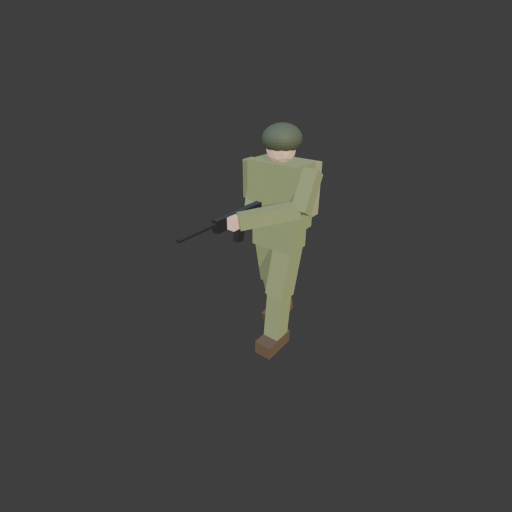
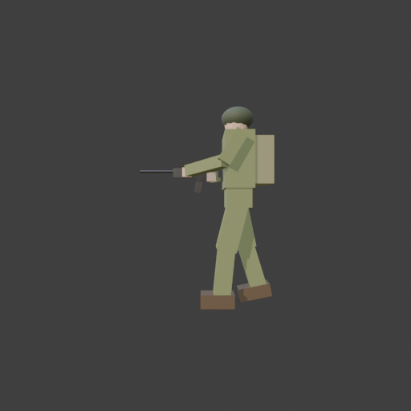

# Sohbet

- `ToolSearch` {"query": "select:mcp__blender__inspect_scene,mcp__blender__delete_object,mcp__blender__create_primitive,mcp__blender__transform_object,mcp__blender__set_material,mcp__blender__assign_material,mcp__blender__join_objects,mcp__blender__frame_view,mcp__blender__capture_viewport,mcp__blender__export_gltf,mcp__blender__inspect_mesh,mcp__blender__set_origin", "max_results": 12}
- `mcp__blender__inspect_scene` {}
- `mcp__blender__delete_object` {"name": "Cube"}
  > {"success":true,"tool":"inspect_scene","data":{"active_camera":"Camera","active_collection":"Collection","active_object":"Cube","collections":["Collection"],"counts":{"camera":1,"light":1,"mesh":1,"total":3},"objects":[{"is_linked":false,"name":"Camera","type":"CAMERA"},{"is_linked":false,"name":"Cu ... [156 more characters]
  > {"success":true,"tool":"delete_object","data":{"deleted":true,"exists":false,"object_name":"Cube","type":"MESH","previous_state":{"location":[0,0,0],"rotation":[0,0,0],"scale":[1,1,1]}},"error":null}
- `mcp__blender__create_primitive` {"primitive_type": "CUBE", "name": "Torso", "size": 1, "location": [0, 0, 1.3], "scale": [0.42, 0.26, 0.5]}
  > {"success":true,"tool":"create_primitive","data":{"created":true,"exists":true,"object_name":"Torso","primitive_type":"CUBE","type":"MESH","location":[0,0,1.3],"rotation":[0,0,0],"scale":[0.42,0.26,0.5],"vertex_count":8,"face_count":6},"error":null}
- `mcp__blender__create_primitive` {"primitive_type": "CUBE", "name": "Pelvis", "size": 1, "location": [0, 0, 0.98], "scale": [0.36, 0.22, 0.2]}
  > {"success":true,"tool":"create_primitive","data":{"created":true,"exists":true,"object_name":"Pelvis","primitive_type":"CUBE","type":"MESH","location":[0,0,0.98],"rotation":[0,0,0],"scale":[0.36,0.22,0.2],"vertex_count":8,"face_count":6},"error":null}
- `mcp__blender__create_primitive` {"primitive_type": "CUBE", "name": "ThighL", "size": 1, "location": [0.1, -0.056, 0.732], "rotation": [-0.25, 0, 0], "scale": [0.16, 0.18, 0.47]}
  > {"success":true,"tool":"create_primitive","data":{"created":true,"exists":true,"object_name":"ThighL","primitive_type":"CUBE","type":"MESH","location":[0.1,-0.056,0.732],"rotation":[-0.25,0,0],"scale":[0.16,0.18,0.47],"vertex_count":8,"face_count":6},"error":null}
- `mcp__blender__create_primitive` {"primitive_type": "CUBE", "name": "ShinL", "size": 1, "location": [0.1, -0.131, 0.313], "rotation": [-0.1, 0, 0], "scale": [0.14, 0.15, 0.42]}
  > {"success":true,"tool":"create_primitive","data":{"created":true,"exists":true,"object_name":"ShinL","primitive_type":"CUBE","type":"MESH","location":[0.1,-0.131,0.313],"rotation":[-0.1,0,0],"scale":[0.14,0.15,0.42],"vertex_count":8,"face_count":6},"error":null}
- `mcp__blender__create_primitive` {"primitive_type": "CUBE", "name": "BootL", "size": 1, "location": [0.1, -0.19, 0.06], "scale": [0.15, 0.3, 0.12]}
  > {"success":true,"tool":"create_primitive","data":{"created":true,"exists":true,"object_name":"BootL","primitive_type":"CUBE","type":"MESH","location":[0.1,-0.19,0.06],"rotation":[0,0,0],"scale":[0.15,0.3,0.12],"vertex_count":8,"face_count":6},"error":null}
- `mcp__blender__create_primitive` {"primitive_type": "CUBE", "name": "ThighR", "size": 1, "location": [-0.1, 0.045, 0.73], "rotation": [0.2, 0, 0], "scale": [0.16, 0.18, 0.47]}
  > {"success":true,"tool":"create_primitive","data":{"created":true,"exists":true,"object_name":"ThighR","primitive_type":"CUBE","type":"MESH","location":[-0.1,0.045,0.73],"rotation":[0.2,0,0],"scale":[0.16,0.18,0.47],"vertex_count":8,"face_count":6},"error":null}
- `mcp__blender__create_primitive` {"primitive_type": "CUBE", "name": "ShinR", "size": 1, "location": [-0.1, 0.149, 0.318], "rotation": [0.3, 0, 0], "scale": [0.14, 0.15, 0.42]}
  > {"success":true,"tool":"create_primitive","data":{"created":true,"exists":true,"object_name":"ShinR","primitive_type":"CUBE","type":"MESH","location":[-0.1,0.149,0.318],"rotation":[0.3,0,0],"scale":[0.14,0.15,0.42],"vertex_count":8,"face_count":6},"error":null}
- `mcp__blender__create_primitive` {"primitive_type": "CUBE", "name": "BootR", "size": 1, "location": [-0.1, 0.17, 0.08], "rotation": [0.2, 0, 0], "scale": [0.15, 0.3, 0.12]}
  > {"success":true,"tool":"create_primitive","data":{"created":true,"exists":true,"object_name":"BootR","primitive_type":"CUBE","type":"MESH","location":[-0.1,0.17,0.08],"rotation":[0.2,0,0],"scale":[0.15,0.3,0.12],"vertex_count":8,"face_count":6},"error":null}
- `mcp__blender__create_primitive` {"primitive_type": "CYLINDER", "name": "Neck", "size": 1, "location": [0, 0, 1.57], "scale": [0.1, 0.1, 0.1]}
  > {"success":true,"tool":"create_primitive","data":{"created":true,"exists":true,"object_name":"Neck","primitive_type":"CYLINDER","type":"MESH","location":[0,0,1.57],"rotation":[0,0,0],"scale":[0.1,0.1,0.1],"vertex_count":64,"face_count":34},"error":null}
- `mcp__blender__create_primitive` {"primitive_type": "ICOSPHERE", "name": "Head", "size": 0.22, "location": [0, -0.01, 1.64], "scale": [1, 1, 1.1]}
  > {"success":true,"tool":"create_primitive","data":{"created":true,"exists":true,"object_name":"Head","primitive_type":"ICOSPHERE","type":"MESH","location":[0,-0.01,1.64],"rotation":[0,0,0],"scale":[1,1,1.1],"vertex_count":42,"face_count":80},"error":null}
- `mcp__blender__create_primitive` {"primitive_type": "SPHERE", "name": "Helmet", "size": 0.28, "location": [0, 0, 1.7], "scale": [1, 1.05, 0.75]}
  > {"success":true,"tool":"create_primitive","data":{"created":true,"exists":true,"object_name":"Helmet","primitive_type":"SPHERE","type":"MESH","location":[0,0,1.7],"rotation":[0,0,0],"scale":[1,1.05,0.75],"vertex_count":482,"face_count":512},"error":null}
- `mcp__blender__create_primitive` {"primitive_type": "CUBE", "name": "Backpack", "size": 1, "location": [0, 0.21, 1.3], "scale": [0.34, 0.18, 0.42]}
  > {"success":true,"tool":"create_primitive","data":{"created":true,"exists":true,"object_name":"Backpack","primitive_type":"CUBE","type":"MESH","location":[0,0.21,1.3],"rotation":[0,0,0],"scale":[0.34,0.18,0.42],"vertex_count":8,"face_count":6},"error":null}
- `mcp__blender__create_primitive` {"primitive_type": "CUBE", "name": "UpperArmR", "size": 1, "location": [-0.27, 0.01, 1.37], "scale": [0.11, 0.11, 0.3]}
  > {"success":true,"tool":"create_primitive","data":{"created":true,"exists":true,"object_name":"UpperArmR","primitive_type":"CUBE","type":"MESH","location":[-0.27,0.01,1.37],"rotation":[0,0,0],"scale":[0.11,0.11,0.3],"vertex_count":8,"face_count":6},"error":null}
- `mcp__blender__create_primitive` {"primitive_type": "CUBE", "name": "ForearmR", "size": 1, "location": [-0.19, -0.1, 1.205], "rotation": [-1.338, 0, 0.616], "scale": [0.1, 0.1, 0.32]}
  > {"success":true,"tool":"create_primitive","data":{"created":true,"exists":true,"object_name":"ForearmR","primitive_type":"CUBE","type":"MESH","location":[-0.19,-0.1,1.205],"rotation":[-1.338,0,0.616],"scale":[0.1,0.1,0.32],"vertex_count":8,"face_count":6},"error":null}
- `mcp__blender__create_primitive` {"primitive_type": "CUBE", "name": "HandR", "size": 0.085, "location": [-0.1, -0.24, 1.17]}
  > {"success":true,"tool":"create_primitive","data":{"created":true,"exists":true,"object_name":"HandR","primitive_type":"CUBE","type":"MESH","location":[-0.1,-0.24,1.17],"rotation":[0,0,0],"scale":[1,1,1],"vertex_count":8,"face_count":6},"error":null}
- `mcp__blender__create_primitive` {"primitive_type": "CUBE", "name": "UpperArmL", "size": 1, "location": [0.265, -0.07, 1.385], "rotation": [-0.546, 0, 0.071], "scale": [0.11, 0.11, 0.3]}
  > {"success":true,"tool":"create_primitive","data":{"created":true,"exists":true,"object_name":"UpperArmL","primitive_type":"CUBE","type":"MESH","location":[0.265,-0.07,1.385],"rotation":[-0.546,0,0.071],"scale":[0.11,0.11,0.3],"vertex_count":8,"face_count":6},"error":null}
- `mcp__blender__create_primitive` {"primitive_type": "CUBE", "name": "ForearmL", "size": 1, "location": [0.11, -0.295, 1.245], "rotation": [-1.447, 0, -0.698], "scale": [0.1, 0.1, 0.42]}
  > {"success":true,"tool":"create_primitive","data":{"created":true,"exists":true,"object_name":"ForearmL","primitive_type":"CUBE","type":"MESH","location":[0.11,-0.295,1.245],"rotation":[-1.447,0,-0.698],"scale":[0.1,0.1,0.42],"vertex_count":8,"face_count":6},"error":null}
- `mcp__blender__create_primitive` {"primitive_type": "CUBE", "name": "HandL", "size": 0.085, "location": [-0.06, -0.47, 1.21]}
  > {"success":true,"tool":"create_primitive","data":{"created":true,"exists":true,"object_name":"HandL","primitive_type":"CUBE","type":"MESH","location":[-0.06,-0.47,1.21],"rotation":[0,0,0],"scale":[1,1,1],"vertex_count":8,"face_count":6},"error":null}
- `mcp__blender__create_primitive` {"primitive_type": "CUBE", "name": "RifleBody", "size": 1, "location": [-0.1, -0.33, 1.21], "scale": [0.05, 0.55, 0.09]}
  > {"success":true,"tool":"create_primitive","data":{"created":true,"exists":true,"object_name":"RifleBody","primitive_type":"CUBE","type":"MESH","location":[-0.1,-0.33,1.21],"rotation":[0,0,0],"scale":[0.05,0.55,0.09],"vertex_count":8,"face_count":6},"error":null}
- `mcp__blender__create_primitive` {"primitive_type": "CUBE", "name": "RifleStock", "size": 1, "location": [-0.1, -0.05, 1.19], "scale": [0.05, 0.2, 0.12]}
  > {"success":true,"tool":"create_primitive","data":{"created":true,"exists":true,"object_name":"RifleStock","primitive_type":"CUBE","type":"MESH","location":[-0.1,-0.05,1.19],"rotation":[0,0,0],"scale":[0.05,0.2,0.12],"vertex_count":8,"face_count":6},"error":null}
- `mcp__blender__create_primitive` {"primitive_type": "CUBE", "name": "RifleMag", "size": 1, "location": [-0.1, -0.36, 1.1], "rotation": [-0.2, 0, 0], "scale": [0.04, 0.07, 0.16]}
  > {"success":true,"tool":"create_primitive","data":{"created":true,"exists":true,"object_name":"RifleMag","primitive_type":"CUBE","type":"MESH","location":[-0.1,-0.36,1.1],"rotation":[-0.2,0,0],"scale":[0.04,0.07,0.16],"vertex_count":8,"face_count":6},"error":null}
- `mcp__blender__create_primitive` {"primitive_type": "CYLINDER", "name": "RifleBarrel", "size": 1, "location": [-0.1, -0.76, 1.225], "rotation": [1.5708, 0, 0], "scale": [0.025, 0.025, 0.32]}
  > {"success":true,"tool":"create_primitive","data":{"created":true,"exists":true,"object_name":"RifleBarrel","primitive_type":"CYLINDER","type":"MESH","location":[-0.1,-0.76,1.225],"rotation":[1.5708,0,0],"scale":[0.025,0.025,0.32],"vertex_count":64,"face_count":34},"error":null}
- `mcp__blender__set_material` {"material_name": "Uniform", "object_name": "Torso", "base_color": [0.23, 0.27, 0.12], "roughness": 0.9}
  > {"success":true,"tool":"set_material","data":{"material_name":"Uniform","object_name":"Torso","slot_index":0,"changed":["base_color","roughness"],"before":null,"after":{"assigned_objects":["Torso"],"is_linked":false,"library_name":null,"material_name":"Uniform","node_summary":{"node_count":2,"node_t ... [621 more characters]
- `mcp__blender__set_material` {"material_name": "HelmetDark", "object_name": "Helmet", "base_color": [0.08, 0.1, 0.06], "roughness": 0.7}
  > {"success":true,"tool":"set_material","data":{"material_name":"HelmetDark","object_name":"Helmet","slot_index":0,"changed":["base_color","roughness"],"before":null,"after":{"assigned_objects":["Helmet"],"is_linked":false,"library_name":null,"material_name":"HelmetDark","node_summary":{"node_count":2 ... [631 more characters]
- `mcp__blender__set_material` {"material_name": "Skin", "object_name": "Head", "base_color": [0.8, 0.55, 0.4], "roughness": 0.6}
  > {"success":true,"tool":"set_material","data":{"material_name":"Skin","object_name":"Head","slot_index":0,"changed":["base_color","roughness"],"before":null,"after":{"assigned_objects":["Head"],"is_linked":false,"library_name":null,"material_name":"Skin","node_summary":{"node_count":2,"node_types":[" ... [605 more characters]
- `mcp__blender__set_material` {"material_name": "BootLeather", "object_name": "BootL", "base_color": [0.12, 0.08, 0.05], "roughness": 0.6}
  > {"success":true,"tool":"set_material","data":{"material_name":"BootLeather","object_name":"BootL","slot_index":0,"changed":["base_color","roughness"],"before":null,"after":{"assigned_objects":["BootL"],"is_linked":false,"library_name":null,"material_name":"BootLeather","node_summary":{"node_count":2 ... [633 more characters]
- `mcp__blender__set_material` {"material_name": "Gunmetal", "object_name": "RifleBody", "base_color": [0.06, 0.06, 0.07], "metallic": 0.7, "roughness": 0.4}
  > {"success":true,"tool":"set_material","data":{"material_name":"Gunmetal","object_name":"RifleBody","slot_index":0,"changed":["base_color","metallic","roughness"],"before":null,"after":{"assigned_objects":["RifleBody"],"is_linked":false,"library_name":null,"material_name":"Gunmetal","node_summary":{" ... [651 more characters]
- `mcp__blender__set_material` {"material_name": "PackCanvas", "object_name": "Backpack", "base_color": [0.3, 0.3, 0.17], "roughness": 0.95}
  > {"success":true,"tool":"set_material","data":{"material_name":"PackCanvas","object_name":"Backpack","slot_index":0,"changed":["base_color","roughness"],"before":null,"after":{"assigned_objects":["Backpack"],"is_linked":false,"library_name":null,"material_name":"PackCanvas","node_summary":{"node_coun ... [637 more characters]
- `mcp__blender__assign_material` {"object_name": "Pelvis", "material_name": "Uniform"}
  > {"success":true,"tool":"assign_material","data":{"assigned":true,"object_name":"Pelvis","material_name":"Uniform","slot_index":0,"before":{"material_name":null},"after":{"object_name":"Pelvis","slot_index":0,"material_name":"Uniform"},"actual":{"object_name":"Pelvis","slot_index":0,"material_name":" ... [24 more characters]
- `mcp__blender__assign_material` {"object_name": "ThighL", "material_name": "Uniform"}
  > {"success":true,"tool":"assign_material","data":{"assigned":true,"object_name":"ThighL","material_name":"Uniform","slot_index":0,"before":{"material_name":null},"after":{"object_name":"ThighL","slot_index":0,"material_name":"Uniform"},"actual":{"object_name":"ThighL","slot_index":0,"material_name":" ... [24 more characters]
- `mcp__blender__assign_material` {"object_name": "ThighR", "material_name": "Uniform"}
  > {"success":true,"tool":"assign_material","data":{"assigned":true,"object_name":"ThighR","material_name":"Uniform","slot_index":0,"before":{"material_name":null},"after":{"object_name":"ThighR","slot_index":0,"material_name":"Uniform"},"actual":{"object_name":"ThighR","slot_index":0,"material_name":" ... [24 more characters]
- `mcp__blender__assign_material` {"object_name": "ShinL", "material_name": "Uniform"}
  > {"success":true,"tool":"assign_material","data":{"assigned":true,"object_name":"ShinL","material_name":"Uniform","slot_index":0,"before":{"material_name":null},"after":{"object_name":"ShinL","slot_index":0,"material_name":"Uniform"},"actual":{"object_name":"ShinL","slot_index":0,"material_name":"Uni ... [21 more characters]
- `mcp__blender__assign_material` {"object_name": "ShinR", "material_name": "Uniform"}
  > {"success":true,"tool":"assign_material","data":{"assigned":true,"object_name":"ShinR","material_name":"Uniform","slot_index":0,"before":{"material_name":null},"after":{"object_name":"ShinR","slot_index":0,"material_name":"Uniform"},"actual":{"object_name":"ShinR","slot_index":0,"material_name":"Uni ... [21 more characters]
- `mcp__blender__assign_material` {"object_name": "UpperArmL", "material_name": "Uniform"}
  > {"success":true,"tool":"assign_material","data":{"assigned":true,"object_name":"UpperArmL","material_name":"Uniform","slot_index":0,"before":{"material_name":null},"after":{"object_name":"UpperArmL","slot_index":0,"material_name":"Uniform"},"actual":{"object_name":"UpperArmL","slot_index":0,"materia ... [33 more characters]
- `mcp__blender__assign_material` {"object_name": "UpperArmR", "material_name": "Uniform"}
  > {"success":true,"tool":"assign_material","data":{"assigned":true,"object_name":"UpperArmR","material_name":"Uniform","slot_index":0,"before":{"material_name":null},"after":{"object_name":"UpperArmR","slot_index":0,"material_name":"Uniform"},"actual":{"object_name":"UpperArmR","slot_index":0,"materia ... [33 more characters]
- `mcp__blender__assign_material` {"object_name": "ForearmL", "material_name": "Uniform"}
  > {"success":true,"tool":"assign_material","data":{"assigned":true,"object_name":"ForearmL","material_name":"Uniform","slot_index":0,"before":{"material_name":null},"after":{"object_name":"ForearmL","slot_index":0,"material_name":"Uniform"},"actual":{"object_name":"ForearmL","slot_index":0,"material_n ... [30 more characters]
- `mcp__blender__assign_material` {"object_name": "ForearmR", "material_name": "Uniform"}
  > {"success":true,"tool":"assign_material","data":{"assigned":true,"object_name":"ForearmR","material_name":"Uniform","slot_index":0,"before":{"material_name":null},"after":{"object_name":"ForearmR","slot_index":0,"material_name":"Uniform"},"actual":{"object_name":"ForearmR","slot_index":0,"material_n ... [30 more characters]
- `mcp__blender__assign_material` {"object_name": "BootR", "material_name": "BootLeather"}
  > {"success":true,"tool":"assign_material","data":{"assigned":true,"object_name":"BootR","material_name":"BootLeather","slot_index":0,"before":{"material_name":null},"after":{"object_name":"BootR","slot_index":0,"material_name":"BootLeather"},"actual":{"object_name":"BootR","slot_index":0,"material_na ... [33 more characters]
- `mcp__blender__assign_material` {"object_name": "Neck", "material_name": "Skin"}
  > {"success":true,"tool":"assign_material","data":{"assigned":true,"object_name":"Neck","material_name":"Skin","slot_index":0,"before":{"material_name":null},"after":{"object_name":"Neck","slot_index":0,"material_name":"Skin"},"actual":{"object_name":"Neck","slot_index":0,"material_name":"Skin"}},"err ... [9 more characters]
- `mcp__blender__assign_material` {"object_name": "HandL", "material_name": "Skin"}
  > {"success":true,"tool":"assign_material","data":{"assigned":true,"object_name":"HandL","material_name":"Skin","slot_index":0,"before":{"material_name":null},"after":{"object_name":"HandL","slot_index":0,"material_name":"Skin"},"actual":{"object_name":"HandL","slot_index":0,"material_name":"Skin"}}," ... [12 more characters]
- `mcp__blender__assign_material` {"object_name": "HandR", "material_name": "Skin"}
  > {"success":true,"tool":"assign_material","data":{"assigned":true,"object_name":"HandR","material_name":"Skin","slot_index":0,"before":{"material_name":null},"after":{"object_name":"HandR","slot_index":0,"material_name":"Skin"},"actual":{"object_name":"HandR","slot_index":0,"material_name":"Skin"}}," ... [12 more characters]
- `mcp__blender__assign_material` {"object_name": "RifleStock", "material_name": "Gunmetal"}
  > {"success":true,"tool":"assign_material","data":{"assigned":true,"object_name":"RifleStock","material_name":"Gunmetal","slot_index":0,"before":{"material_name":null},"after":{"object_name":"RifleStock","slot_index":0,"material_name":"Gunmetal"},"actual":{"object_name":"RifleStock","slot_index":0,"ma ... [39 more characters]
- `mcp__blender__assign_material` {"object_name": "RifleMag", "material_name": "Gunmetal"}
  > {"success":true,"tool":"assign_material","data":{"assigned":true,"object_name":"RifleMag","material_name":"Gunmetal","slot_index":0,"before":{"material_name":null},"after":{"object_name":"RifleMag","slot_index":0,"material_name":"Gunmetal"},"actual":{"object_name":"RifleMag","slot_index":0,"material ... [33 more characters]
- `mcp__blender__assign_material` {"object_name": "RifleBarrel", "material_name": "Gunmetal"}
  > {"success":true,"tool":"assign_material","data":{"assigned":true,"object_name":"RifleBarrel","material_name":"Gunmetal","slot_index":0,"before":{"material_name":null},"after":{"object_name":"RifleBarrel","slot_index":0,"material_name":"Gunmetal"},"actual":{"object_name":"RifleBarrel","slot_index":0, ... [42 more characters]
- `mcp__blender__frame_view` {"direction": "ISO", "shading": "MATERIAL", "overlays": false}
  > {"success":true,"tool":"frame_view","data":{"direction":"ISO","objects":["Torso","Pelvis","ThighL","ShinL","BootL","ThighR","ShinR","BootR","Neck","Head","Helmet","Backpack","UpperArmR","ForearmR","HandR","UpperArmL","ForearmL","HandL","RifleBody","RifleStock","RifleMag","RifleBarrel"],"center":[0.0 ... [84 more characters]
- `mcp__blender__capture_viewport` {}
  
  > [Image: source: C:\Users\Halil Emre\.claude\projects\C--Users-Halil-Emre-Desktop-GitHub-Public-Blender-Copilot-archives-bench-runs-20260930-013510-soldier\7e4559ce-85e2-4c1c-b227-6101bb163de0\tool-results\mcp-blender-blob-1790721398289-sdwsqo.png]
  > {"success":true,"tool":"capture_viewport","data":{"image_id":"vp_485a0d21e211","width":512,"height":512,"format":"PNG","mime_type":"image/png","byte_size":78385,"channels":4},"error":null}
**Ajan:** Model is taking shape; checking the side view for the pose.

- `mcp__blender__frame_view` {"direction": "RIGHT", "shading": "MATERIAL", "overlays": false}
  > {"success":true,"tool":"frame_view","data":{"direction":"RIGHT","objects":["Torso","Pelvis","ThighL","ShinL","BootL","ThighR","ShinR","BootR","Neck","Head","Helmet","Backpack","UpperArmR","ForearmR","HandR","UpperArmL","ForearmL","HandL","RifleBody","RifleStock","RifleMag","RifleBarrel"],"center":[0 ... [86 more characters]
- `mcp__blender__capture_viewport` {}
  
  > [Image: source: C:\Users\Halil Emre\.claude\projects\C--Users-Halil-Emre-Desktop-GitHub-Public-Blender-Copilot-archives-bench-runs-20260930-013510-soldier\7e4559ce-85e2-4c1c-b227-6101bb163de0\tool-results\mcp-blender-blob-1790721401410-v6f0cc.png]
  > {"success":true,"tool":"capture_viewport","data":{"image_id":"vp_35625493d3d1","width":512,"height":512,"format":"PNG","mime_type":"image/png","byte_size":79228,"channels":4},"error":null}
**Ajan:** The pose looks right. Next I'll join everything into one mesh, set the origin to the bottom and export.

- `mcp__blender__join_objects` {"object_names": ["Torso", "Pelvis", "ThighL", "ShinL", "BootL", "ThighR", "ShinR", "BootR", "Neck", "Head", "Helmet", "Backpack", "UpperArmR", "ForearmR", "HandR", "UpperArmL", "ForearmL", "HandL", "RifleBody", "RifleStock", "RifleMag", "RifleBarrel"], "target_name": "Torso", "new_name": "Soldier"}
  > {"success":true,"tool":"join_objects","data":{"object_name":"Soldier","type":"MESH","exists":true,"location":[0,0,1.3],"rotation":[0,0,0],"scale":[0.42,0.26,0.5],"vertex_count":796,"face_count":768,"triangle_count":1504,"local_bounds_min":[-0.7796,-3.5385,-2.6172],"local_bounds_max":[0.7827,1.2651,1 ... [279 more characters]
- `mcp__blender__set_origin` {"object_name": "Soldier", "mode": "BOTTOM_CENTER"}
  > {"success":true,"tool":"set_origin","data":{"object_name":"Soldier","type":"MESH","exists":true,"location":[0.0006,-0.2955,-0.0086],"rotation":[0,0,0],"scale":[0.42,0.26,0.5],"vertex_count":796,"face_count":768,"triangle_count":1504,"local_bounds_min":[-0.7811,-2.4018,0],"local_bounds_max":[0.7811,2 ... [94 more characters]
- `mcp__blender__inspect_mesh` {"object_name": "Soldier"}
  > {"success":true,"tool":"inspect_mesh","data":{"bounding_box":{"center":[0.0006,-0.2955,0.8982],"max":[0.3287,0.3289,1.805],"min":[-0.3274,-0.92,-0.0086]},"counts":{"edges":1520,"polygons":768,"vertices":796},"has_uv":false,"mesh_name":"Torso_mesh","object_name":"Soldier","polygon_breakdown":{"ngons" ... [61 more characters]
- `mcp__blender__export_gltf` {"object_names": ["Soldier"], "filename": "soldier.glb"}
  > {"success":true,"tool":"export_gltf","data":{"path":"C:\\Users\\Halil Emre\\Desktop\\GitHub\\Public\\Blender Copilot\\archives\\bench-runs\\20260930-013510-soldier\\soldier.glb","filename":"soldier.glb","bytes":87084,"objects":["Soldier"],"triangle_count":1504,"format":"GLB","y_up":true,"recentered" ... [20 more characters]
**Ajan:** I built a low-poly soldier in a light walking pose holding a rifle and exported it as `soldier.glb`. The model is **1,504 triangles** (796 vertices).

**What I did:**
- Deleted the default Cube and built the soldier from 22 simple shapes.
- **Body:** pelvis, torso, neck, head and helmet, and a backpack on the back.
- **Walking pose:** the left leg steps forward and the right leg swings back, each with a thigh, shin and boot.
- **Rifle hold:** the right hand holds the grip and the left hand holds the front of the rifle. The rifle has a body, stock, magazine and barrel.
- **Materials:** olive green uniform, dark helmet, separate skin tone for the face, neck and hands, brown boots, a slightly lighter canvas backpack and a dark metal rifle.
- **Checked it by eye:** I looked at it from the ISO and side views. The walking pose, the rifle hold and the backpack looked right.
- **Finished:** joined everything into one object called `Soldier`, put the origin at the bottom and exported it with Y-up.

**Size:** 1.81 m tall, 0.66 m wide, and 1.25 m deep including the rifle.

**File:** `...\archives\bench-runs\20260930-013510-soldier\soldier.glb` (87 KB)

**Things to know before using it in a game:**
- **No UVs:** only plain colours are used, so you can't add textures until it's unwrapped.
- **The origin isn't under the feet:** it sits at the centre of the whole model's footprint. Because the rifle sticks out in front, that point is about 30 cm in front of the body. Each export setting (bottom centre, bounds centre) takes the rifle into account, so to put it between the feet I'd have to move the origin by hand.
- **Scale not applied:** the object still has its non-uniform scale (0.42, 0.26, 0.5). This carries into the glTF file, so it looks fine, but I can run `apply_transform` before the next export if you want a clean transform.
- **The helmet uses most of the triangles:** it's a smooth sphere of about 960 triangles. Making it simpler would bring the model down to about 700 triangles.

---
**Sonuç:** I built a low-poly soldier in a light walking pose holding a rifle and exported it as `soldier.glb`. The model is **1,504 triangles** (796 vertices).

**What I did:**
- Deleted the default Cube and built the soldier from 22 simple shapes.
- **Body:** pelvis, torso, neck, head and helmet, and a backpack on the back.
- **Walking pose:** the left leg steps forward and the right leg swings back, each with a thigh, shin and boot.
- **Rifle hold:** the right hand holds the grip and the left hand holds the front of the rifle. The rifle has a body, stock, magazine and barrel.
- **Materials:** olive green uniform, dark helmet, separate skin tone for the face, neck and hands, brown boots, a slightly lighter canvas backpack and a dark metal rifle.
- **Checked it by eye:** I looked at it from the ISO and side views. The walking pose, the rifle hold and the backpack looked right.
- **Finished:** joined everything into one object called `Soldier`, put the origin at the bottom and exported it with Y-up.

**Size:** 1.81 m tall, 0.66 m wide, and 1.25 m deep including the rifle.

**File:** `...\archives\bench-runs\20260930-013510-soldier\soldier.glb` (87 KB)

**Things to know before using it in a game:**
- **No UVs:** only plain colours are used, so you can't add textures until it's unwrapped.
- **The origin isn't under the feet:** it sits at the centre of the whole model's footprint. Because the rifle sticks out in front, that point is about 30 cm in front of the body. Each export setting (bottom centre, bounds centre) takes the rifle into account, so to put it between the feet I'd have to move the origin by hand.
- **Scale not applied:** the object still has its non-uniform scale (0.42, 0.26, 0.5). This carries into the glTF file, so it looks fine, but I can run `apply_transform` before the next export if you want a clean transform.
- **The helmet uses most of the triangles:** it's a smooth sphere of about 960 triangles. Making it simpler would bring the model down to about 700 triangles.
