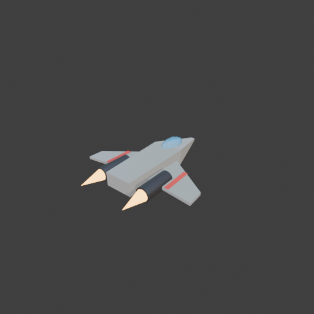
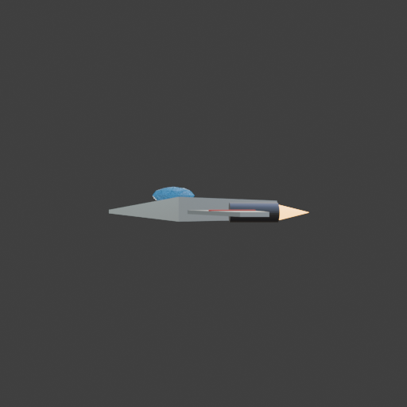

# Sohbet

- `ToolSearch` {"query": "select:mcp__blender__inspect_scene,mcp__blender__delete_object,mcp__blender__create_primitive,mcp__blender__create_mesh,mcp__blender__set_material,mcp__blender__frame_view,mcp__blender__capture_viewport,mcp__blender__export_gltf,mcp__blender__transform_object,mcp__blender__mesh_edit,mcp__blender__add_shape_modifier", "max_results": 15}
- `mcp__blender__inspect_scene` {}
  > {"success":true,"tool":"inspect_scene","data":{"active_camera":"Camera","active_collection":"Collection","active_object":"Cube","collections":["Collection"],"counts":{"camera":1,"light":1,"mesh":1,"total":3},"objects":[{"is_linked":false,"name":"Camera","type":"CAMERA"},{"is_linked":false,"name":"Cu ... [156 more characters]
- `mcp__blender__delete_object` {"name": "Cube"}
  > {"success":true,"tool":"delete_object","data":{"deleted":true,"exists":false,"object_name":"Cube","type":"MESH","previous_state":{"location":[0,0,0],"rotation":[0,0,0],"scale":[1,1,1]}},"error":null}
- `mcp__blender__create_mesh` {"name": "Hull", "vertices": [[-0.5, -2, 0.35], [0.5, -2, 0.35], [0.5, -2, 0.85], [-0.5, -2, 0.85], [-0.6, 0.6, 0.3], [0.6, 0.6, 0.3], [0.6, 0.6, 0.95], [-0.6, 0.6, 0.95], [-0.08, 2.6, 0.5], [0.08, 2.6, 0.5], [0.08, 2.6, 0.6], [-0.08, 2.6, 0.6]], "faces": [[0, 1, 2, 3], [11, 10, 9, 8], [0, 4, 5, 1], [1, 5, 6, 2], [2, 6, 7, 3], [3, 7, 4, 0], [4, 8, 9, 5], [5, 9, 10, 6], [6, 10, 11, 7], [7, 11, 8, 4 ... [3 more characters]
  > {"success":true,"tool":"create_mesh","data":{"object_name":"Hull","type":"MESH","exists":true,"location":[0,0,0],"rotation":[0,0,0],"scale":[1,1,1],"vertex_count":12,"face_count":10,"triangle_count":20,"local_bounds_min":[-0.6,-2,0.3],"local_bounds_max":[0.6,2.6,0.95],"dimensions":[1.2,4.6,0.65],"cr ... [26 more characters]
- `mcp__blender__create_mesh` {"name": "Wings", "vertices": [[0.55, -1.2, 0.5], [0.55, 0.4, 0.5], [2.2, -0.8, 0.5], [2.2, -1.4, 0.5], [0.55, -1.2, 0.6], [0.55, 0.4, 0.6], [2.2, -0.8, 0.6], [2.2, -1.4, 0.6]], "faces": [[0, 1, 2, 3], [4, 7, 6, 5], [0, 3, 7, 4], [1, 5, 6, 2], [0, 4, 5, 1], [3, 2, 6, 7]]}
  > {"success":true,"tool":"create_mesh","data":{"object_name":"Wings","type":"MESH","exists":true,"location":[0,0,0],"rotation":[0,0,0],"scale":[1,1,1],"vertex_count":8,"face_count":6,"triangle_count":12,"local_bounds_min":[0.55,-1.4,0.5],"local_bounds_max":[2.2,0.4,0.6],"dimensions":[1.65,1.8,0.1],"cr ... [26 more characters]
- `mcp__blender__create_primitive` {"primitive_type": "ICOSPHERE", "name": "Cockpit", "size": 1, "location": [0, 0.9, 0.92], "scale": [0.6, 1.2, 0.5]}
  > {"success":true,"tool":"create_primitive","data":{"created":true,"exists":true,"object_name":"Cockpit","primitive_type":"ICOSPHERE","type":"MESH","location":[0,0.9,0.92],"rotation":[0,0,0],"scale":[0.6,1.2,0.5],"vertex_count":42,"face_count":80},"error":null}
- `mcp__blender__create_primitive` {"primitive_type": "CYLINDER", "name": "Engine_L", "size": 0.5, "location": [-0.9, -1.3, 0.55], "rotation": [1.5708, 0, 0], "scale": [1, 1, 2.4]}
  > {"success":true,"tool":"create_primitive","data":{"created":true,"exists":true,"object_name":"Engine_L","primitive_type":"CYLINDER","type":"MESH","location":[-0.9,-1.3,0.55],"rotation":[1.5708,0,0],"scale":[1,1,2.4],"vertex_count":64,"face_count":34},"error":null}
- `mcp__blender__create_primitive` {"primitive_type": "CYLINDER", "name": "Engine_R", "size": 0.5, "location": [0.9, -1.3, 0.55], "rotation": [1.5708, 0, 0], "scale": [1, 1, 2.4]}
  > {"success":true,"tool":"create_primitive","data":{"created":true,"exists":true,"object_name":"Engine_R","primitive_type":"CYLINDER","type":"MESH","location":[0.9,-1.3,0.55],"rotation":[1.5708,0,0],"scale":[1,1,2.4],"vertex_count":64,"face_count":34},"error":null}
- `mcp__blender__create_primitive` {"primitive_type": "CONE", "name": "Flame_L", "size": 0.4, "location": [-0.9, -2.3, 0.55], "rotation": [1.5708, 0, 0], "scale": [1, 1, 2]}
  > {"success":true,"tool":"create_primitive","data":{"created":true,"exists":true,"object_name":"Flame_L","primitive_type":"CONE","type":"MESH","location":[-0.9,-2.3,0.55],"rotation":[1.5708,0,0],"scale":[1,1,2],"vertex_count":33,"face_count":33},"error":null}
- `mcp__blender__create_primitive` {"primitive_type": "CONE", "name": "Flame_R", "size": 0.4, "location": [0.9, -2.3, 0.55], "rotation": [1.5708, 0, 0], "scale": [1, 1, 2]}
  > {"success":true,"tool":"create_primitive","data":{"created":true,"exists":true,"object_name":"Flame_R","primitive_type":"CONE","type":"MESH","location":[0.9,-2.3,0.55],"rotation":[1.5708,0,0],"scale":[1,1,2],"vertex_count":33,"face_count":33},"error":null}
- `mcp__blender__create_primitive` {"primitive_type": "CUBE", "name": "Stripe_L", "size": 1, "location": [-1.3, -0.72, 0.61], "scale": [0.15, 1.1, 0.03]}
  > {"success":true,"tool":"create_primitive","data":{"created":true,"exists":true,"object_name":"Stripe_L","primitive_type":"CUBE","type":"MESH","location":[-1.3,-0.72,0.61],"rotation":[0,0,0],"scale":[0.15,1.1,0.03],"vertex_count":8,"face_count":6},"error":null}
- `mcp__blender__create_primitive` {"primitive_type": "CUBE", "name": "Stripe_R", "size": 1, "location": [1.3, -0.72, 0.61], "scale": [0.15, 1.1, 0.03]}
  > {"success":true,"tool":"create_primitive","data":{"created":true,"exists":true,"object_name":"Stripe_R","primitive_type":"CUBE","type":"MESH","location":[1.3,-0.72,0.61],"rotation":[0,0,0],"scale":[0.15,1.1,0.03],"vertex_count":8,"face_count":6},"error":null}
- `mcp__blender__add_shape_modifier` {"name": "Wings", "modifier_type": "MIRROR", "axes": ["X"]}
  > {"success":true,"tool":"add_shape_modifier","data":{"object_name":"Wings","modifier_name":"Mirror","modifier_type":"MIRROR","exists":true,"axes":["X"],"evaluated_triangle_count":24},"error":null}
**Ajan:** Malzemeler:

- `mcp__blender__set_material` {"object_name": "Hull", "material_name": "ShipBody", "base_color": [0.75, 0.78, 0.82], "metallic": 0.6, "roughness": 0.4}
  > {"success":true,"tool":"set_material","data":{"material_name":"ShipBody","object_name":"Hull","slot_index":0,"changed":["base_color","metallic","roughness"],"before":null,"after":{"assigned_objects":["Hull"],"is_linked":false,"library_name":null,"material_name":"ShipBody","node_summary":{"node_count ... [636 more characters]
- `mcp__blender__set_material` {"object_name": "Wings", "material_name": "ShipBody"}
  > {"success":true,"tool":"set_material","data":{"material_name":"ShipBody","object_name":"Wings","slot_index":0,"changed":[],"before":{"assigned_objects":["Hull","Wings"],"is_linked":false,"library_name":null,"material_name":"ShipBody","node_summary":{"node_count":2,"node_types":["BSDF_PRINCIPLED","OU ... [988 more characters]
- `mcp__blender__set_material` {"object_name": "Cockpit", "material_name": "Glass", "base_color": [0.1, 0.5, 0.9], "roughness": 0.05, "alpha": 0.6}
  > {"success":true,"tool":"set_material","data":{"material_name":"Glass","object_name":"Cockpit","slot_index":0,"changed":["base_color","roughness","alpha"],"before":null,"after":{"assigned_objects":["Cockpit"],"is_linked":false,"library_name":null,"material_name":"Glass","node_summary":{"node_count":2 ... [629 more characters]
- `mcp__blender__set_material` {"object_name": "Engine_L", "material_name": "EngineDark", "base_color": [0.12, 0.12, 0.14], "metallic": 0.8, "roughness": 0.5}
  > {"success":true,"tool":"set_material","data":{"material_name":"EngineDark","object_name":"Engine_L","slot_index":0,"changed":["base_color","metallic","roughness"],"before":null,"after":{"assigned_objects":["Engine_L"],"is_linked":false,"library_name":null,"material_name":"EngineDark","node_summary": ... [654 more characters]
- `mcp__blender__set_material` {"object_name": "Engine_R", "material_name": "EngineDark"}
  > {"success":true,"tool":"set_material","data":{"material_name":"EngineDark","object_name":"Engine_R","slot_index":0,"changed":[],"before":{"assigned_objects":["Engine_L","Engine_R"],"is_linked":false,"library_name":null,"material_name":"EngineDark","node_summary":{"node_count":2,"node_types":["BSDF_P ... [1020 more characters]
- `mcp__blender__set_material` {"object_name": "Flame_L", "material_name": "Flame", "base_color": [1, 0.45, 0.05], "emission_color": [1, 0.5, 0.1], "emission_strength": 5}
  > {"success":true,"tool":"set_material","data":{"material_name":"Flame","object_name":"Flame_L","slot_index":0,"changed":["base_color","emission_color","emission_strength"],"before":null,"after":{"assigned_objects":["Flame_L"],"is_linked":false,"library_name":null,"material_name":"Flame","node_summary ... [648 more characters]
- `mcp__blender__set_material` {"object_name": "Flame_R", "material_name": "Flame"}
  > {"success":true,"tool":"set_material","data":{"material_name":"Flame","object_name":"Flame_R","slot_index":0,"changed":[],"before":{"assigned_objects":["Flame_L","Flame_R"],"is_linked":false,"library_name":null,"material_name":"Flame","node_summary":{"node_count":2,"node_types":["BSDF_PRINCIPLED","O ... [990 more characters]
- `mcp__blender__set_material` {"object_name": "Stripe_L", "material_name": "StripeRed", "base_color": [0.85, 0.08, 0.08], "roughness": 0.5}
  > {"success":true,"tool":"set_material","data":{"material_name":"StripeRed","object_name":"Stripe_L","slot_index":0,"changed":["base_color","roughness"],"before":null,"after":{"assigned_objects":["Stripe_L"],"is_linked":false,"library_name":null,"material_name":"StripeRed","node_summary":{"node_count" ... [636 more characters]
- `mcp__blender__set_material` {"object_name": "Stripe_R", "material_name": "StripeRed"}
  > {"success":true,"tool":"set_material","data":{"material_name":"StripeRed","object_name":"Stripe_R","slot_index":0,"changed":[],"before":{"assigned_objects":["Stripe_L","Stripe_R"],"is_linked":false,"library_name":null,"material_name":"StripeRed","node_summary":{"node_count":2,"node_types":["BSDF_PRI ... [1010 more characters]
- `mcp__blender__frame_view` {"direction": "ISO", "shading": "MATERIAL", "overlays": false}
  > {"success":true,"tool":"frame_view","data":{"direction":"ISO","objects":["Hull","Wings","Cockpit","Engine_L","Engine_R","Flame_L","Flame_R","Stripe_L","Stripe_R"],"center":[0,-0.05,0.735],"radius":3.472,"shading":"MATERIAL","overlays":false},"error":null}
- `mcp__blender__capture_viewport` {}
  
  > [Image: source: C:\Users\Halil Emre\.claude\projects\C--Users-Halil-Emre-Desktop-GitHub-Public-Blender-Copilot-archives-bench-runs-20260930-073924-spaceship\2371c012-4185-48bc-96d3-624a16aee512\tool-results\mcp-blender-blob-1790743227475-c58moy.png]
  > {"success":true,"tool":"capture_viewport","data":{"image_id":"vp_0c611a306e7d","width":512,"height":512,"format":"PNG","mime_type":"image/png","byte_size":78820,"channels":4},"error":null}
- `mcp__blender__transform_object` {"name": "Cockpit", "location": [0, 0.8, 1]}
  > {"success":true,"tool":"transform_object","data":{"object_name":"Cockpit","relative":false,"exists":true,"before":{"location":[0,0.9,0.92],"rotation":[0,0,0],"scale":[0.6,1.2,0.5]},"after":{"exists":true,"location":[0,0.8,1],"rotation":[0,0,0],"scale":[0.6,1.2,0.5]},"actual":{"exists":true,"location ... [91 more characters]
- `mcp__blender__frame_view` {"direction": "LEFT", "shading": "MATERIAL", "overlays": false}
  > {"success":true,"tool":"frame_view","data":{"direction":"LEFT","objects":["Hull","Wings","Cockpit","Engine_L","Engine_R","Flame_L","Flame_R","Stripe_L","Stripe_R"],"center":[0,-0.05,0.775],"radius":3.477,"shading":"MATERIAL","overlays":false},"error":null}
- `mcp__blender__capture_viewport` {}
  
  > [Image: source: C:\Users\Halil Emre\.claude\projects\C--Users-Halil-Emre-Desktop-GitHub-Public-Blender-Copilot-archives-bench-runs-20260930-073924-spaceship\2371c012-4185-48bc-96d3-624a16aee512\tool-results\mcp-blender-blob-1790743231042-6qb8fe.png]
  > {"success":true,"tool":"capture_viewport","data":{"image_id":"vp_f3bddf1d6ede","width":512,"height":512,"format":"PNG","mime_type":"image/png","byte_size":71023,"channels":4},"error":null}
**Ajan:** Yan görünüm temiz; kokpit gövdenin üstünde, alevler motorların arkasında. Dışa aktarıyorum:

- `mcp__blender__export_gltf` {"object_names": ["Hull", "Wings", "Cockpit", "Engine_L", "Engine_R", "Flame_L", "Flame_R", "Stripe_L", "Stripe_R"], "filename": "spaceship.glb"}
  > {"success":true,"tool":"export_gltf","data":{"path":"C:\\Users\\Halil Emre\\Desktop\\GitHub\\Public\\Blender Copilot\\archives\\bench-runs\\20260930-073924-spaceship\\spaceship.glb","filename":"spaceship.glb","bytes":33812,"objects":["Hull","Wings","Cockpit","Engine_L","Engine_R","Flame_L","Flame_R" ... [104 more characters]
**Ajan:** Uzay gemisini modelleyip `spaceship.glb` olarak dışa aktardım. Toplam **520 üçgen**, yani önerilen ~3000 sınırının çok altında.

**Ne yaptım:**
- Varsayılan Cube'u sildim.
- **Gövde:** Kendi yazdığım 12 köşeli bir mesh. Arkası kutu gibi, önü sivri bir burna daralıyor. Uzunluğu 4,6 m. Metalik gri malzeme verdim.
- **Kokpit camı:** Basıklaştırılmış bir icosphere, gövdenin üstünde duruyor. Mavi ve yarı saydam (alpha 0.6).
- **İki kanat:** Geriye doğru açılı tek bir kanat yaptım, Mirror modifier ile X ekseninde simetriğini aldım. Malzemesi gövdeyle aynı.
- **İki motor:** Kanat köklerinin altında, uçuş yönünde yatırılmış silindirler. Koyu metal renkte.
- **Motor alevleri:** Motorların arkasından geriye bakan koniler. Turuncu ve ışık yayan (emission) malzeme verdim.
- **Şeritler:** İki kanadın üstünde ayrı kırmızı malzemeli ince şeritler.

**Kontrol:** Modele önce çapraz (ISO), sonra yan açıdan baktım. İlk bakışta kokpit gövdenin içine fazla gömülüydü, biraz yukarı ve geriye aldım. Yandan bakınca kokpit gövdenin üstünde, alevler de motorların hemen arkasında duruyordu.

**Dosya:** `C:\Users\Halil Emre\Desktop\GitHub\Public\Blender Copilot\archives\bench-runs\20260930-073924-spaceship\spaceship.glb` (33 KB). Y ekseni yukarıyı gösteriyor, modifier'lar uygulandı, malzemeler dosyanın içinde.

Kokpit camının saydamlığı oyun motorunda ayrıca kontrol edilmeli. Blender'daki alpha değeri motorda her zaman aynı görünmeyebilir.

---
**Sonuç:** Uzay gemisini modelleyip `spaceship.glb` olarak dışa aktardım. Toplam **520 üçgen**, yani önerilen ~3000 sınırının çok altında.

**Ne yaptım:**
- Varsayılan Cube'u sildim.
- **Gövde:** Kendi yazdığım 12 köşeli bir mesh. Arkası kutu gibi, önü sivri bir burna daralıyor. Uzunluğu 4,6 m. Metalik gri malzeme verdim.
- **Kokpit camı:** Basıklaştırılmış bir icosphere, gövdenin üstünde duruyor. Mavi ve yarı saydam (alpha 0.6).
- **İki kanat:** Geriye doğru açılı tek bir kanat yaptım, Mirror modifier ile X ekseninde simetriğini aldım. Malzemesi gövdeyle aynı.
- **İki motor:** Kanat köklerinin altında, uçuş yönünde yatırılmış silindirler. Koyu metal renkte.
- **Motor alevleri:** Motorların arkasından geriye bakan koniler. Turuncu ve ışık yayan (emission) malzeme verdim.
- **Şeritler:** İki kanadın üstünde ayrı kırmızı malzemeli ince şeritler.

**Kontrol:** Modele önce çapraz (ISO), sonra yan açıdan baktım. İlk bakışta kokpit gövdenin içine fazla gömülüydü, biraz yukarı ve geriye aldım. Yandan bakınca kokpit gövdenin üstünde, alevler de motorların hemen arkasında duruyordu.

**Dosya:** `C:\Users\Halil Emre\Desktop\GitHub\Public\Blender Copilot\archives\bench-runs\20260930-073924-spaceship\spaceship.glb` (33 KB). Y ekseni yukarıyı gösteriyor, modifier'lar uygulandı, malzemeler dosyanın içinde.

Kokpit camının saydamlığı oyun motorunda ayrıca kontrol edilmeli. Blender'daki alpha değeri motorda her zaman aynı görünmeyebilir.
