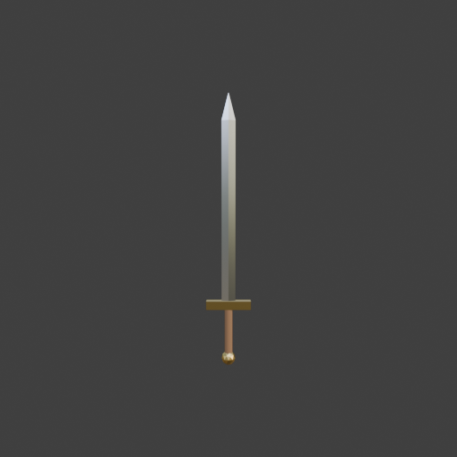
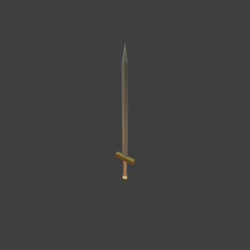

# Sohbet

- `ToolSearch` {"query": "select:mcp__blender__inspect_scene,mcp__blender__delete_object,mcp__blender__create_mesh,mcp__blender__create_primitive,mcp__blender__join_objects,mcp__blender__frame_view,mcp__blender__capture_viewport,mcp__blender__export_gltf,mcp__blender__set_material,mcp__blender__assign_material,mcp__blender__set_origin,mcp__blender__inspect_mesh", "max_results": 12}
- `mcp__blender__delete_object` {"name": "Cube"}
  > {"success":true,"tool":"delete_object","data":{"deleted":true,"exists":false,"object_name":"Cube","type":"MESH","previous_state":{"location":[0,0,0],"rotation":[0,0,0],"scale":[1,1,1]}},"error":null}
- `mcp__blender__create_mesh` {"name": "Blade", "vertices": [[0.025, 0, 0.23], [0, 0.006, 0.23], [-0.025, 0, 0.23], [0, -0.006, 0.23], [0.025, 0, 0.88], [0, 0.006, 0.88], [-0.025, 0, 0.88], [0, -0.006, 0.88], [0, 0, 0.98]], "faces": [[0, 1, 5, 4], [1, 2, 6, 5], [2, 3, 7, 6], [3, 0, 4, 7], [4, 5, 8], [5, 6, 8], [6, 7, 8], [7, 4, 8], [3, 2, 1, 0]]}
  > {"success":true,"tool":"create_mesh","data":{"object_name":"Blade","type":"MESH","exists":true,"location":[0,0,0],"rotation":[0,0,0],"scale":[1,1,1],"vertex_count":9,"face_count":9,"triangle_count":14,"local_bounds_min":[-0.025,-0.006,0.23],"local_bounds_max":[0.025,0.006,0.98],"dimensions":[0.05,0. ... [39 more characters]
- `mcp__blender__create_primitive` {"primitive_type": "CUBE", "name": "Guard", "size": 1, "location": [0, 0, 0.215], "scale": [0.16, 0.03, 0.03]}
  > {"success":true,"tool":"create_primitive","data":{"created":true,"exists":true,"object_name":"Guard","primitive_type":"CUBE","type":"MESH","location":[0,0,0.215],"rotation":[0,0,0],"scale":[0.16,0.03,0.03],"vertex_count":8,"face_count":6},"error":null}
- `mcp__blender__create_primitive` {"primitive_type": "CYLINDER", "name": "Grip", "size": 1, "location": [0, 0, 0.12], "scale": [0.028, 0.028, 0.17]}
  > {"success":true,"tool":"create_primitive","data":{"created":true,"exists":true,"object_name":"Grip","primitive_type":"CYLINDER","type":"MESH","location":[0,0,0.12],"rotation":[0,0,0],"scale":[0.028,0.028,0.17],"vertex_count":64,"face_count":34},"error":null}
- `mcp__blender__create_primitive` {"primitive_type": "ICOSPHERE", "name": "Pommel", "size": 0.05, "location": [0, 0, 0.025]}
  > {"success":true,"tool":"create_primitive","data":{"created":true,"exists":true,"object_name":"Pommel","primitive_type":"ICOSPHERE","type":"MESH","location":[0,0,0.025],"rotation":[0,0,0],"scale":[1,1,1],"vertex_count":42,"face_count":80},"error":null}
- `mcp__blender__set_material` {"object_name": "Blade", "material_name": "Steel", "base_color": [0.8, 0.82, 0.85], "metallic": 1, "roughness": 0.3}
  > {"success":true,"tool":"set_material","data":{"material_name":"Steel","object_name":"Blade","slot_index":0,"changed":["base_color","metallic","roughness"],"before":null,"after":{"assigned_objects":["Blade"],"is_linked":false,"library_name":null,"material_name":"Steel","node_summary":{"node_count":2, ... [624 more characters]
- `mcp__blender__set_material` {"object_name": "Grip", "material_name": "Leather", "base_color": [0.25, 0.13, 0.06], "roughness": 0.8}
  > {"success":true,"tool":"set_material","data":{"material_name":"Leather","object_name":"Grip","slot_index":0,"changed":["base_color","roughness"],"before":null,"after":{"assigned_objects":["Grip"],"is_linked":false,"library_name":null,"material_name":"Leather","node_summary":{"node_count":2,"node_typ ... [618 more characters]
- `mcp__blender__set_material` {"object_name": "Guard", "material_name": "Brass", "base_color": [0.75, 0.55, 0.2], "metallic": 1, "roughness": 0.4}
  > {"success":true,"tool":"set_material","data":{"material_name":"Brass","object_name":"Guard","slot_index":0,"changed":["base_color","metallic","roughness"],"before":null,"after":{"assigned_objects":["Guard"],"is_linked":false,"library_name":null,"material_name":"Brass","node_summary":{"node_count":2, ... [624 more characters]
- `mcp__blender__assign_material` {"object_name": "Pommel", "material_name": "Brass"}
  > {"success":true,"tool":"assign_material","data":{"assigned":true,"object_name":"Pommel","material_name":"Brass","slot_index":0,"before":{"material_name":null},"after":{"object_name":"Pommel","slot_index":0,"material_name":"Brass"},"actual":{"object_name":"Pommel","slot_index":0,"material_name":"Bras ... [18 more characters]
- `mcp__blender__frame_view` {"direction": "FRONT", "overlays": false, "shading": "MATERIAL"}
  > {"success":true,"tool":"frame_view","data":{"direction":"FRONT","objects":["Blade","Guard","Grip","Pommel"],"center":[0,0,0.49],"radius":0.497,"shading":"MATERIAL","overlays":false},"error":null}
- `mcp__blender__capture_viewport` {}
  
  > [Image: source: C:\Users\Halil Emre\.claude\projects\C--Users-Halil-Emre-Desktop-GitHub-Public-Blender-Copilot-archives-bench-runs-20260930-011026-sword\cd8bee6d-83b5-4ca3-8961-903f81b12a4c\tool-results\mcp-blender-blob-1790719865678-tuzml6.png]
  > {"success":true,"tool":"capture_viewport","data":{"image_id":"vp_10f555b97a35","width":512,"height":512,"format":"PNG","mime_type":"image/png","byte_size":71477,"channels":4},"error":null}
**Ajan:** Kılıç ön görünümde doğru görünüyor; şimdi birleştirip dışa aktarıyorum.

- `mcp__blender__join_objects` {"object_names": ["Pommel", "Grip", "Guard", "Blade"], "target_name": "Pommel", "new_name": "Sword"}
  > {"success":true,"tool":"join_objects","data":{"object_name":"Sword","type":"MESH","exists":true,"location":[0,0,0.025],"rotation":[0,0,0],"scale":[1,1,1],"vertex_count":123,"face_count":129,"triangle_count":230,"local_bounds_min":[-0.08,-0.025,-0.025],"local_bounds_max":[0.08,0.025,0.955],"dimension ... [77 more characters]
- `mcp__blender__set_origin` {"object_name": "Sword"}
  > {"success":true,"tool":"set_origin","data":{"object_name":"Sword","type":"MESH","exists":true,"location":[0,0,0],"rotation":[0,0,0],"scale":[1,1,1],"vertex_count":123,"face_count":129,"triangle_count":230,"local_bounds_min":[-0.08,-0.025,0],"local_bounds_max":[0.08,0.025,0.98],"dimensions":[0.16,0.0 ... [52 more characters]
- `mcp__blender__frame_view` {"direction": "ISO", "overlays": false, "shading": "MATERIAL"}
  > {"success":true,"tool":"frame_view","data":{"direction":"ISO","objects":["Sword"],"center":[0,0,0.49],"radius":0.497,"shading":"MATERIAL","overlays":false},"error":null}
- `mcp__blender__capture_viewport` {}
  
  > [Image: source: C:\Users\Halil Emre\.claude\projects\C--Users-Halil-Emre-Desktop-GitHub-Public-Blender-Copilot-archives-bench-runs-20260930-011026-sword\cd8bee6d-83b5-4ca3-8961-903f81b12a4c\tool-results\mcp-blender-blob-1790719871713-dwnskk.png]
  > {"success":true,"tool":"capture_viewport","data":{"image_id":"vp_a47a47d9e957","width":512,"height":512,"format":"PNG","mime_type":"image/png","byte_size":68844,"channels":4},"error":null}
- `mcp__blender__export_gltf` {"object_names": ["Sword"], "filename": "sword.glb"}
  > {"success":true,"tool":"export_gltf","data":{"path":"C:\\Users\\Halil Emre\\Desktop\\GitHub\\Public\\Blender Copilot\\archives\\bench-runs\\20260930-011026-sword\\sword.glb","filename":"sword.glb","bytes":15684,"objects":["Sword"],"triangle_count":230,"format":"GLB","y_up":true,"recentered":true},"e ... [11 more characters]
**Ajan:** Kılıç hazır ve `sword.glb` olarak dışa aktarıldı: `...\20260930-011026-sword\sword.glb`

**Ne yaptım:**
- Varsayılan Cube'u sildim.
- **Bıçak:** Kesiti baklava biçiminde, sivri uçlu bir parça olarak kendim modelledim. 0.75 m uzunluğunda ve 5 cm genişliğinde; yalnızca 14 üçgen. Çelik malzeme verdim (metalik).
- **Siper:** Kutuyu 16 × 3 × 3 cm boyutuna getirdim. Pirinç malzeme verdim.
- **Kabza:** 17 cm boyunda bir silindir. Kahverengi deri malzeme verdim.
- **Topuz:** 5 cm çapında küçük bir küre. Pirinç malzeme verdim.
- Dört parçayı `Sword` adında tek bir nesnede birleştirdim. Orijini tabanın ortasına, topuzun altına aldım. Toplam boy 0.98 m.
- Viewport'ta önden ve izometrik açıdan baktım. Oranlar düzgün, parçalar hizalı ve boşluk yok.
- Y-up olarak, orijin (0,0,0) noktasına ortalanmış şekilde dışa aktardım.

**Üçgen sayısı: 230.** Bunun büyük kısmı kabzadaki silindirden ve topuzdaki küreden geliyor; bıçak 14, siper 12 üçgen. Oyun için ~3000 üçgen sınırının çok altında.

---
**Sonuç:** Kılıç hazır ve `sword.glb` olarak dışa aktarıldı: `...\20260930-011026-sword\sword.glb`

**Ne yaptım:**
- Varsayılan Cube'u sildim.
- **Bıçak:** Kesiti baklava biçiminde, sivri uçlu bir parça olarak kendim modelledim. 0.75 m uzunluğunda ve 5 cm genişliğinde; yalnızca 14 üçgen. Çelik malzeme verdim (metalik).
- **Siper:** Kutuyu 16 × 3 × 3 cm boyutuna getirdim. Pirinç malzeme verdim.
- **Kabza:** 17 cm boyunda bir silindir. Kahverengi deri malzeme verdim.
- **Topuz:** 5 cm çapında küçük bir küre. Pirinç malzeme verdim.
- Dört parçayı `Sword` adında tek bir nesnede birleştirdim. Orijini tabanın ortasına, topuzun altına aldım. Toplam boy 0.98 m.
- Viewport'ta önden ve izometrik açıdan baktım. Oranlar düzgün, parçalar hizalı ve boşluk yok.
- Y-up olarak, orijin (0,0,0) noktasına ortalanmış şekilde dışa aktardım.

**Üçgen sayısı: 230.** Bunun büyük kısmı kabzadaki silindirden ve topuzdaki küreden geliyor; bıçak 14, siper 12 üçgen. Oyun için ~3000 üçgen sınırının çok altında.
