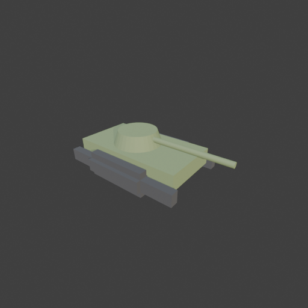

# Sohbet

- `ToolSearch` {"query": "select:mcp__blender__create_primitive,mcp__blender__delete_object,mcp__blender__inspect_scene,mcp__blender__transform_object,mcp__blender__set_material,mcp__blender__frame_view,mcp__blender__capture_viewport,mcp__blender__export_gltf,mcp__blender__join_objects,mcp__blender__mesh_edit,mcp__blender__duplicate_object,mcp__blender__assign_material", "max_results": 12}
- `mcp__blender__delete_object` {"name": "Cube"}
  > {"success":true,"tool":"delete_object","data":{"deleted":true,"exists":false,"object_name":"Cube","type":"MESH","previous_state":{"location":[0,0,0],"rotation":[0,0,0],"scale":[1,1,1]}},"error":null}
- `mcp__blender__create_primitive` {"primitive_type": "CUBE", "name": "Hull", "size": 1, "location": [0, 0, 0.75], "scale": [4.2, 2.2, 0.6]}
  > {"success":true,"tool":"create_primitive","data":{"created":true,"exists":true,"object_name":"Hull","primitive_type":"CUBE","type":"MESH","location":[0,0,0.75],"rotation":[0,0,0],"scale":[4.2,2.2,0.6],"vertex_count":8,"face_count":6},"error":null}
- `mcp__blender__create_primitive` {"primitive_type": "CUBE", "name": "TrackL", "size": 1, "location": [0, 1.3, 0.45], "scale": [4.6, 0.6, 0.9]}
  > {"success":true,"tool":"create_primitive","data":{"created":true,"exists":true,"object_name":"TrackL","primitive_type":"CUBE","type":"MESH","location":[0,1.3,0.45],"rotation":[0,0,0],"scale":[4.6,0.6,0.9],"vertex_count":8,"face_count":6},"error":null}
- `mcp__blender__create_primitive` {"primitive_type": "CYLINDER", "name": "Turret", "size": 1, "location": [-0.2, 0, 1.3], "scale": [1.8, 1.8, 0.5]}
  > {"success":true,"tool":"create_primitive","data":{"created":true,"exists":true,"object_name":"Turret","primitive_type":"CYLINDER","type":"MESH","location":[-0.2,0,1.3],"rotation":[0,0,0],"scale":[1.8,1.8,0.5],"vertex_count":64,"face_count":34},"error":null}
- `mcp__blender__create_primitive` {"primitive_type": "CYLINDER", "name": "Barrel", "size": 1, "location": [1.9, 0, 1.35], "rotation": [0, 1.5708, 0], "scale": [0.2, 0.2, 3]}
  > {"success":true,"tool":"create_primitive","data":{"created":true,"exists":true,"object_name":"Barrel","primitive_type":"CYLINDER","type":"MESH","location":[1.9,0,1.35],"rotation":[0,1.5708,0],"scale":[0.2,0.2,3],"vertex_count":64,"face_count":34},"error":null}
- `mcp__blender__mesh_edit` {"object_name": "TrackL", "operation": "BEVEL_EDGES", "width": 0.25, "segments": 2}
  > {"success":true,"tool":"mesh_edit","data":{"object_name":"TrackL","type":"MESH","exists":true,"location":[0,1.3,0.45],"rotation":[0,0,0],"scale":[4.6,0.6,0.9],"vertex_count":32,"face_count":30,"triangle_count":60,"local_bounds_min":[-0.5,-0.5,-0.5],"local_bounds_max":[0.5,0.5,0.5],"dimensions":[4.6, ... [72 more characters]
- `mcp__blender__mesh_edit` {"object_name": "Turret", "operation": "SCALE_TO_HEIGHT_TAPER", "top_scale": 0.8}
  > {"success":true,"tool":"mesh_edit","data":{"object_name":"Turret","type":"MESH","exists":true,"location":[-0.2,0,1.3],"rotation":[0,0,0],"scale":[1.8,1.8,0.5],"vertex_count":64,"face_count":34,"triangle_count":124,"local_bounds_min":[-0.5,-0.5,-0.5],"local_bounds_max":[0.5,0.5,0.5],"dimensions":[1.8 ... [83 more characters]
- `mcp__blender__duplicate_object` {"source_name": "TrackL", "new_name": "TrackR", "location": [0, -1.3, 0.45]}
  > {"success":true,"tool":"duplicate_object","data":{"duplicated":true,"source_name":"TrackL","new_name":"TrackR","source_exists":true,"new_exists":true,"type":"MESH","location":[0,-1.3,0.45],"rotation":[0,0,0],"scale":[4.6,0.6,0.9],"source_location":[0,1.3,0.45],"source_rotation":[0,0,0],"source_scale ... [205 more characters]
- `mcp__blender__set_material` {"material_name": "TankGreen", "object_name": "Hull", "base_color": [0.25, 0.32, 0.15], "roughness": 0.7}
  > {"success":true,"tool":"set_material","data":{"material_name":"TankGreen","object_name":"Hull","slot_index":0,"changed":["base_color","roughness"],"before":null,"after":{"assigned_objects":["Hull"],"is_linked":false,"library_name":null,"material_name":"TankGreen","node_summary":{"node_count":2,"node ... [624 more characters]
- `mcp__blender__set_material` {"material_name": "TrackDark", "object_name": "TrackL", "base_color": [0.08, 0.08, 0.08], "roughness": 0.9}
  > {"success":true,"tool":"set_material","data":{"material_name":"TrackDark","object_name":"TrackL","slot_index":0,"changed":["base_color","roughness"],"before":null,"after":{"assigned_objects":["TrackL"],"is_linked":false,"library_name":null,"material_name":"TrackDark","node_summary":{"node_count":2," ... [630 more characters]
- `mcp__blender__assign_material` {"object_name": "TrackR", "material_name": "TrackDark"}
- `mcp__blender__assign_material` {"object_name": "Turret", "material_name": "TankGreen"}
  > {"success":true,"tool":"assign_material","data":{"assigned":true,"object_name":"TrackR","material_name":"TrackDark","slot_index":0,"before":{"material_name":null},"after":{"object_name":"TrackR","slot_index":0,"material_name":"TrackDark"},"actual":{"object_name":"TrackR","slot_index":0,"material_nam ... [30 more characters]
  > {"success":true,"tool":"assign_material","data":{"assigned":true,"object_name":"Turret","material_name":"TankGreen","slot_index":0,"before":{"material_name":null},"after":{"object_name":"Turret","slot_index":0,"material_name":"TankGreen"},"actual":{"object_name":"Turret","slot_index":0,"material_nam ... [30 more characters]
- `mcp__blender__assign_material` {"object_name": "Barrel", "material_name": "TankGreen"}
  > {"success":true,"tool":"assign_material","data":{"assigned":true,"object_name":"Barrel","material_name":"TankGreen","slot_index":0,"before":{"material_name":null},"after":{"object_name":"Barrel","slot_index":0,"material_name":"TankGreen"},"actual":{"object_name":"Barrel","slot_index":0,"material_nam ... [30 more characters]
- `mcp__blender__frame_view` {"direction": "ISO", "shading": "MATERIAL", "overlays": false}
  > {"success":true,"tool":"frame_view","data":{"direction":"ISO","objects":["Hull","TrackL","Turret","Barrel","TrackR"],"center":[0.55,0,0.775],"radius":3.359,"shading":"MATERIAL","overlays":false},"error":null}
- `mcp__blender__capture_viewport` {}
  
  > [Image: source: C:\Users\Halil Emre\.claude\projects\C--Users-Halil-Emre-Desktop-GitHub-Public-Blender-Copilot-archives-bench-runs-20260930-011420-tank\ee255652-e0ec-4689-b469-fc19a4f1e74e\tool-results\mcp-blender-blob-1790720087789-0mevnq.png]
  > {"success":true,"tool":"capture_viewport","data":{"image_id":"vp_19ef5355aaac","width":512,"height":512,"format":"PNG","mime_type":"image/png","byte_size":79179,"channels":4},"error":null}
**Ajan:** Model görünüyor: gövde, iki palet, kule ve namlu yerinde. Şimdi dışa aktarıyorum.

- `mcp__blender__export_gltf` {"object_names": ["Hull", "TrackL", "TrackR", "Turret", "Barrel"], "filename": "tank.glb"}
  > {"success":true,"tool":"export_gltf","data":{"path":"C:\\Users\\Halil Emre\\Desktop\\GitHub\\Public\\Blender Copilot\\archives\\bench-runs\\20260930-011420-tank\\tank.glb","filename":"tank.glb","bytes":19340,"objects":["Hull","TrackL","TrackR","Turret","Barrel"],"triangle_count":380,"format":"GLB"," ... [43 more characters]
**Ajan:** Tank hazır ve `tank.glb` olarak dışa aktarıldı: `archives\bench-runs\20260930-011420-tank\tank.glb`. Toplam **380 üçgen**, yani ~3000'lik sınırın çok altında. Modeli ISO açıdan viewport'ta kontrol ettim; tüm parçalar doğru yerde duruyor.

**Yaptıklarım:**
- Varsayılan Cube'u sildim.
- **Gövde:** 4.2 × 2.2 × 0.6 m bir kutu.
- **Paletler:** 4.6 × 0.6 × 0.9 m iki kutu, gövdenin iki yanında. Köşelerini pahladım ki palet şekline yaklaşsın. Sağ paleti soldakinden kopyaladım.
- **Kule:** Gövdenin üstünde, yukarı doğru hafifçe daralan 1.8 m çaplı bir silindir.
- **Namlu:** 3 m uzunluğunda, ileri bakan ince bir silindir.
- **Malzemeler:** Gövde, kule ve namlu mat askeri yeşil (`TankGreen`), paletler koyu gri (`TrackDark`).

Parçalar birleştirilmedi; dosyada 5 ayrı obje var. Bu sayede kuleyi ve namluyu oyunda ayrı ayrı döndürebilirsiniz.

**Dikkat:** Dışa aktarma gövdenin merkezini sıfır noktası olarak aldı. Gövdenin merkezi yerden 0.75 m yüksekte olduğu için oyun motorunda tankın alt yüzü y = -0.75'te kalıyor. Oyunda tankı 0.75 m yukarı taşımanız ya da orijini alt merkeze alıp yeniden dışa aktarmam gerekiyor.

---
**Sonuç:** Tank hazır ve `tank.glb` olarak dışa aktarıldı: `archives\bench-runs\20260930-011420-tank\tank.glb`. Toplam **380 üçgen**, yani ~3000'lik sınırın çok altında. Modeli ISO açıdan viewport'ta kontrol ettim; tüm parçalar doğru yerde duruyor.

**Yaptıklarım:**
- Varsayılan Cube'u sildim.
- **Gövde:** 4.2 × 2.2 × 0.6 m bir kutu.
- **Paletler:** 4.6 × 0.6 × 0.9 m iki kutu, gövdenin iki yanında. Köşelerini pahladım ki palet şekline yaklaşsın. Sağ paleti soldakinden kopyaladım.
- **Kule:** Gövdenin üstünde, yukarı doğru hafifçe daralan 1.8 m çaplı bir silindir.
- **Namlu:** 3 m uzunluğunda, ileri bakan ince bir silindir.
- **Malzemeler:** Gövde, kule ve namlu mat askeri yeşil (`TankGreen`), paletler koyu gri (`TrackDark`).

Parçalar birleştirilmedi; dosyada 5 ayrı obje var. Bu sayede kuleyi ve namluyu oyunda ayrı ayrı döndürebilirsiniz.

**Dikkat:** Dışa aktarma gövdenin merkezini sıfır noktası olarak aldı. Gövdenin merkezi yerden 0.75 m yüksekte olduğu için oyun motorunda tankın alt yüzü y = -0.75'te kalıyor. Oyunda tankı 0.75 m yukarı taşımanız ya da orijini alt merkeze alıp yeniden dışa aktarmam gerekiyor.
