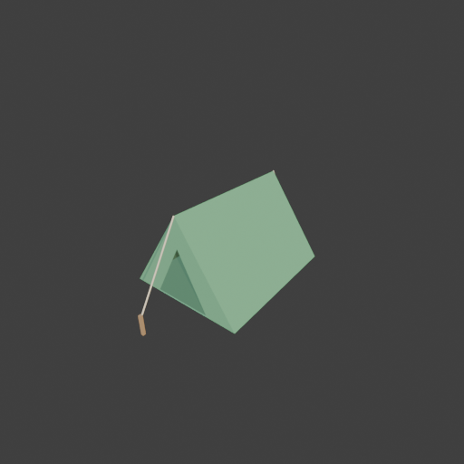

# Sohbet

- `ToolSearch` {"query": "select:mcp__blender__inspect_scene,mcp__blender__delete_object,mcp__blender__create_mesh,mcp__blender__create_primitive,mcp__blender__set_material,mcp__blender__frame_view,mcp__blender__capture_viewport,mcp__blender__export_gltf,mcp__blender__join_objects,mcp__blender__transform_object", "max_results": 10}
- `mcp__blender__inspect_scene` {}
  > {"success":true,"tool":"inspect_scene","data":{"active_camera":"Camera","active_collection":"Collection","active_object":"Cube","collections":["Collection"],"counts":{"camera":1,"light":1,"mesh":1,"total":3},"objects":[{"is_linked":false,"name":"Camera","type":"CAMERA"},{"is_linked":false,"name":"Cu ... [156 more characters]
- `mcp__blender__delete_object` {"name": "Cube"}
  > {"success":true,"tool":"delete_object","data":{"deleted":true,"exists":false,"object_name":"Cube","type":"MESH","previous_state":{"location":[0,0,0],"rotation":[0,0,0],"scale":[1,1,1]}},"error":null}
- `mcp__blender__create_mesh` {"name": "Tent", "vertices": [[-0.9, -1.1, 0], [0.9, -1.1, 0], [0, -1.1, 1.3], [-0.9, 1.1, 0], [0.9, 1.1, 0], [0, 1.1, 1.3], [-0.45, -1.1, 0], [0.45, -1.1, 0], [0, -1.1, 0.85]], "faces": [[0, 2, 5, 3], [1, 4, 5, 2], [4, 3, 5], [0, 6, 8, 2], [7, 1, 2, 8], [0, 3, 4, 1], [3, 5, 2, 0], [2, 5, 4, 1], [5, 3, 4], [2, 8, 6, 0], [8, 2, 1, 7], [1, 4, 3, 0]]}
  > {"success":true,"tool":"create_mesh","data":{"object_name":"Tent","type":"MESH","exists":true,"location":[0,0,0],"rotation":[0,0,0],"scale":[1,1,1],"vertex_count":9,"face_count":6,"triangle_count":11,"local_bounds_min":[-0.9,-1.1,0],"local_bounds_max":[0.9,1.1,1.3],"dimensions":[1.8,2.2,1.3],"create ... [22 more characters]
- `mcp__blender__create_primitive` {"primitive_type": "CUBE", "name": "StakeFront", "size": 1, "location": [0, -1.75, 0.1], "scale": [0.04, 0.04, 0.3]}
  > {"success":true,"tool":"create_primitive","data":{"created":true,"exists":true,"object_name":"StakeFront","primitive_type":"CUBE","type":"MESH","location":[0,-1.75,0.1],"rotation":[0,0,0],"scale":[0.04,0.04,0.3],"vertex_count":8,"face_count":6},"error":null}
- `mcp__blender__create_primitive` {"primitive_type": "CUBE", "name": "StakeBack", "size": 1, "location": [0, 1.75, 0.1], "scale": [0.04, 0.04, 0.3]}
  > {"success":true,"tool":"create_primitive","data":{"created":true,"exists":true,"object_name":"StakeBack","primitive_type":"CUBE","type":"MESH","location":[0,1.75,0.1],"rotation":[0,0,0],"scale":[0.04,0.04,0.3],"vertex_count":8,"face_count":6},"error":null}
- `mcp__blender__create_primitive` {"primitive_type": "CYLINDER", "name": "RopeFront", "size": 1, "location": [0, -1.425, 0.75], "rotation": [-0.534, 0, 0], "scale": [0.02, 0.02, 1.278]}
  > {"success":true,"tool":"create_primitive","data":{"created":true,"exists":true,"object_name":"RopeFront","primitive_type":"CYLINDER","type":"MESH","location":[0,-1.425,0.75],"rotation":[-0.534,0,0],"scale":[0.02,0.02,1.278],"vertex_count":64,"face_count":34},"error":null}
- `mcp__blender__create_primitive` {"primitive_type": "CYLINDER", "name": "RopeBack", "size": 1, "location": [0, 1.425, 0.75], "rotation": [0.534, 0, 0], "scale": [0.02, 0.02, 1.278]}
  > {"success":true,"tool":"create_primitive","data":{"created":true,"exists":true,"object_name":"RopeBack","primitive_type":"CYLINDER","type":"MESH","location":[0,1.425,0.75],"rotation":[0.534,0,0],"scale":[0.02,0.02,1.278],"vertex_count":64,"face_count":34},"error":null}
- `mcp__blender__create_mesh` {"name": "TentInner", "vertices": [[-0.88, -1.09, 0.01], [0.88, -1.09, 0.01], [0, -1.09, 1.28], [-0.88, 1.09, 0.01], [0.88, 1.09, 0.01], [0, 1.09, 1.28], [-0.45, -1.09, 0.01], [0.45, -1.09, 0.01], [0, -1.09, 0.85]], "faces": [[3, 5, 2, 0], [2, 5, 4, 1], [5, 3, 4], [2, 8, 6, 0], [8, 2, 1, 7], [1, 4, 3, 0]]}
  > {"success":true,"tool":"create_mesh","data":{"object_name":"TentInner","type":"MESH","exists":true,"location":[0,0,0],"rotation":[0,0,0],"scale":[1,1,1],"vertex_count":9,"face_count":6,"triangle_count":11,"local_bounds_min":[-0.88,-1.09,0.01],"local_bounds_max":[0.88,1.09,1.28],"dimensions":[1.76,2. ... [38 more characters]
- `mcp__blender__set_material` {"object_name": "Tent", "material_name": "TentFabric", "base_color": [0.15, 0.4, 0.2], "roughness": 0.9}
  > {"success":true,"tool":"set_material","data":{"material_name":"TentFabric","object_name":"Tent","slot_index":0,"changed":["base_color","roughness"],"before":null,"after":{"assigned_objects":["Tent"],"is_linked":false,"library_name":null,"material_name":"TentFabric","node_summary":{"node_count":2,"no ... [623 more characters]
- `mcp__blender__set_material` {"object_name": "TentInner", "material_name": "TentInside", "base_color": [0.08, 0.2, 0.1], "roughness": 0.9}
  > {"success":true,"tool":"set_material","data":{"material_name":"TentInside","object_name":"TentInner","slot_index":0,"changed":["base_color","roughness"],"before":null,"after":{"assigned_objects":["TentInner"],"is_linked":false,"library_name":null,"material_name":"TentInside","node_summary":{"node_co ... [638 more characters]
- `mcp__blender__set_material` {"object_name": "StakeFront", "material_name": "Wood", "base_color": [0.4, 0.25, 0.12], "roughness": 0.8}
  > {"success":true,"tool":"set_material","data":{"material_name":"Wood","object_name":"StakeFront","slot_index":0,"changed":["base_color","roughness"],"before":null,"after":{"assigned_objects":["StakeFront"],"is_linked":false,"library_name":null,"material_name":"Wood","node_summary":{"node_count":2,"no ... [625 more characters]
- `mcp__blender__set_material` {"object_name": "RopeFront", "material_name": "Rope", "base_color": [0.8, 0.7, 0.5], "roughness": 1}
  > {"success":true,"tool":"set_material","data":{"material_name":"Rope","object_name":"RopeFront","slot_index":0,"changed":["base_color","roughness"],"before":null,"after":{"assigned_objects":["RopeFront"],"is_linked":false,"library_name":null,"material_name":"Rope","node_summary":{"node_count":2,"node ... [614 more characters]
- `mcp__blender__set_material` {"object_name": "StakeBack", "material_name": "Wood"}
  > {"success": false, "tool": "set_material", "data": null, "error": {"type": "INVALID_ARGUMENT", "message": "At least one material property ('base_color', 'metallic', 'roughness', 'emission_color', 'emission_strength', 'alpha') must be provided.", "details": {"material_name": "Wood", "object_name": "S ... [12 more characters]
- `mcp__blender__set_material` {"object_name": "RopeBack", "material_name": "Rope"}
  > {"success": false, "tool": "set_material", "data": null, "error": {"type": "INVALID_ARGUMENT", "message": "At least one material property ('base_color', 'metallic', 'roughness', 'emission_color', 'emission_strength', 'alpha') must be provided.", "details": {"material_name": "Rope", "object_name": "R ... [11 more characters]
- `mcp__blender__frame_view` {"direction": "ISO", "shading": "MATERIAL", "overlays": false}
  > {"success":true,"tool":"frame_view","data":{"direction":"ISO","objects":["Tent","StakeFront","StakeBack","RopeFront","RopeBack","TentInner"],"center":[0,0,0.628],"radius":2.098,"shading":"MATERIAL","overlays":false},"error":null}
**Ajan:** Çadır, kazıklar ve ipler hazır. Şimdi eksik malzemeleri atayıp viewport'ta kontrol ediyorum.

- `mcp__blender__set_material` {"object_name": "StakeBack", "material_name": "Wood", "base_color": [0.4, 0.25, 0.12]}
  > {"success":true,"tool":"set_material","data":{"material_name":"Wood","object_name":"StakeBack","slot_index":0,"changed":["base_color"],"before":{"assigned_objects":["StakeBack","StakeFront"],"is_linked":false,"library_name":null,"material_name":"Wood","node_summary":{"node_count":2,"node_types":["BS ... [1009 more characters]
- `mcp__blender__set_material` {"object_name": "RopeBack", "material_name": "Rope", "base_color": [0.8, 0.7, 0.5]}
  > {"success":true,"tool":"set_material","data":{"material_name":"Rope","object_name":"RopeBack","slot_index":0,"changed":["base_color"],"before":{"assigned_objects":["RopeBack","RopeFront"],"is_linked":false,"library_name":null,"material_name":"Rope","node_summary":{"node_count":2,"node_types":["BSDF_ ... [990 more characters]
- `mcp__blender__capture_viewport` {}
  
  > [Image: source: C:\Users\Halil Emre\.claude\projects\C--Users-Halil-Emre-Desktop-GitHub-Public-Blender-Copilot-archives-bench-runs-20260930-012646-tent\8436e619-be37-4f69-8f82-f00698f790d8\tool-results\mcp-blender-blob-1790720866658-z7ia1d.png]
  > {"success":true,"tool":"capture_viewport","data":{"image_id":"vp_8ee179ec50a7","width":512,"height":512,"format":"PNG","mime_type":"image/png","byte_size":76035,"channels":4},"error":null}
**Ajan:** Görüntü iyi: giriş açıklığı, ön ip ve kazık yerinde. Birleştirip dışa aktarıyorum.

- `mcp__blender__join_objects` {"object_names": ["Tent", "TentInner", "StakeFront", "StakeBack", "RopeFront", "RopeBack"], "target_name": "Tent"}
  > {"success":true,"tool":"join_objects","data":{"object_name":"Tent","type":"MESH","exists":true,"location":[0,0,0],"rotation":[0,0,0],"scale":[1,1,1],"vertex_count":162,"face_count":92,"triangle_count":294,"local_bounds_min":[-0.9,-1.77,-0.05],"local_bounds_max":[0.9,1.77,1.3051],"dimensions":[1.8,3. ... [103 more characters]
- `mcp__blender__export_gltf` {"object_names": ["Tent"], "filename": "tent.glb"}
  > {"success":true,"tool":"export_gltf","data":{"path":"C:\\Users\\Halil Emre\\Desktop\\GitHub\\Public\\Blender Copilot\\archives\\bench-runs\\20260930-012646-tent\\tent.glb","filename":"tent.glb","bytes":16476,"objects":["Tent"],"triangle_count":294,"format":"GLB","y_up":true,"recentered":true},"error ... [7 more characters]
**Ajan:** Çadır hazır ve `tent.glb` olarak dışa aktarıldı: `...\20260930-012646-tent\tent.glb`

**Yaptıklarım:**
- Varsayılan Cube'u sildim.
- **Çadır:** 1,8 m genişliğinde, 2,2 m uzunluğunda ve 1,3 m yüksekliğinde üçgen bir çadır yaptım. Ön yüzde üçgen bir giriş açıklığı var. Oyun motorları arka yüzleri çizmediği için ters yüzlü koyu yeşil bir iç kabuk ekledim; girişten bakınca içi boş görünmüyor.
- **İki kazık ve ip:** Çadırın önüne ve arkasına birer ahşap kazık koydum. Her birine çatı ucundan bej bir ip iniyor.
- Malzemeler: yeşil kumaş, koyu iç yüz, ahşap ve ip.
- Viewport'ta ISO açıdan kendim baktım. Giriş, ön ip ve kazık doğru yerde görünüyordu. Arka ip ile kazık bu açıdan çadırın arkasında kaldığı için görüntüde yoktu.
- Bütün parçaları tek bir `Tent` nesnesinde birleştirdim. Orijin zeminin ortasında, dosya Y-up.

**Üçgen sayısı: 294.** Bunun çoğu ipten geliyor: iki ip 32 kenarlı silindir. Daha da hafif bir model gerekirse ipleri 6 kenara indirebilirim; o zaman toplam yaklaşık 60 üçgene düşer.

---
**Sonuç:** Çadır hazır ve `tent.glb` olarak dışa aktarıldı: `...\20260930-012646-tent\tent.glb`

**Yaptıklarım:**
- Varsayılan Cube'u sildim.
- **Çadır:** 1,8 m genişliğinde, 2,2 m uzunluğunda ve 1,3 m yüksekliğinde üçgen bir çadır yaptım. Ön yüzde üçgen bir giriş açıklığı var. Oyun motorları arka yüzleri çizmediği için ters yüzlü koyu yeşil bir iç kabuk ekledim; girişten bakınca içi boş görünmüyor.
- **İki kazık ve ip:** Çadırın önüne ve arkasına birer ahşap kazık koydum. Her birine çatı ucundan bej bir ip iniyor.
- Malzemeler: yeşil kumaş, koyu iç yüz, ahşap ve ip.
- Viewport'ta ISO açıdan kendim baktım. Giriş, ön ip ve kazık doğru yerde görünüyordu. Arka ip ile kazık bu açıdan çadırın arkasında kaldığı için görüntüde yoktu.
- Bütün parçaları tek bir `Tent` nesnesinde birleştirdim. Orijin zeminin ortasında, dosya Y-up.

**Üçgen sayısı: 294.** Bunun çoğu ipten geliyor: iki ip 32 kenarlı silindir. Daha da hafif bir model gerekirse ipleri 6 kenara indirebilirim; o zaman toplam yaklaşık 60 üçgene düşer.
