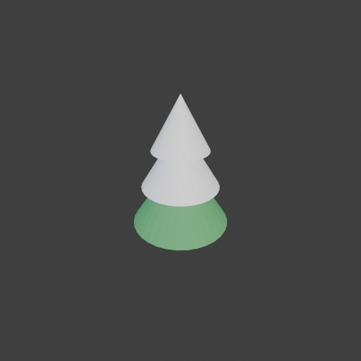
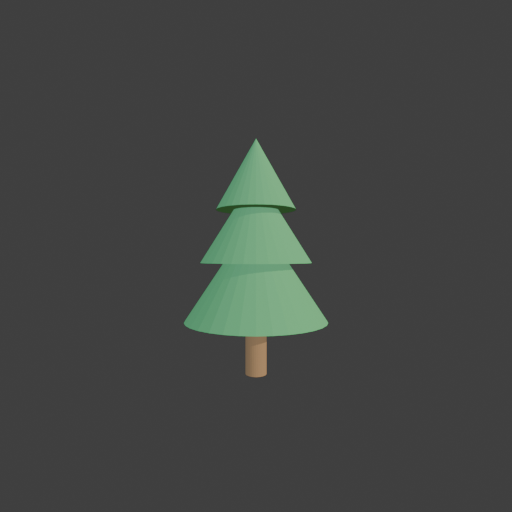

# Sohbet

- `ToolSearch` {"query": "select:mcp__blender__inspect_scene,mcp__blender__delete_object,mcp__blender__create_primitive,mcp__blender__set_material,mcp__blender__join_objects,mcp__blender__frame_view,mcp__blender__capture_viewport,mcp__blender__export_gltf,mcp__blender__set_origin,mcp__blender__inspect_mesh", "max_results": 10}
- `mcp__blender__delete_object` {"name": "Cube"}
  > {"success":true,"tool":"delete_object","data":{"deleted":true,"exists":false,"object_name":"Cube","type":"MESH","previous_state":{"location":[0,0,0],"rotation":[0,0,0],"scale":[1,1,1]}},"error":null}
- `mcp__blender__create_primitive` {"primitive_type": "CYLINDER", "name": "Trunk", "size": 0.6, "location": [0, 0, 0.3], "scale": [0.4, 0.4, 1]}
  > {"success":true,"tool":"create_primitive","data":{"created":true,"exists":true,"object_name":"Trunk","primitive_type":"CYLINDER","type":"MESH","location":[0,0,0.3],"rotation":[0,0,0],"scale":[0.4,0.4,1],"vertex_count":64,"face_count":34},"error":null}
- `mcp__blender__create_primitive` {"primitive_type": "CONE", "name": "Leaves1", "size": 1.6, "location": [0, 0, 1.2], "scale": [1, 1, 0.75]}
  > {"success":true,"tool":"create_primitive","data":{"created":true,"exists":true,"object_name":"Leaves1","primitive_type":"CONE","type":"MESH","location":[0,0,1.2],"rotation":[0,0,0],"scale":[1,1,0.75],"vertex_count":33,"face_count":33},"error":null}
- `mcp__blender__create_primitive` {"primitive_type": "CONE", "name": "Leaves2", "size": 1.25, "location": [0, 0, 1.75], "scale": [1, 1, 0.8]}
  > {"success":true,"tool":"create_primitive","data":{"created":true,"exists":true,"object_name":"Leaves2","primitive_type":"CONE","type":"MESH","location":[0,0,1.75],"rotation":[0,0,0],"scale":[1,1,0.8],"vertex_count":33,"face_count":33},"error":null}
- `mcp__blender__create_primitive` {"primitive_type": "CONE", "name": "Leaves3", "size": 0.9, "location": [0, 0, 2.25], "scale": [1, 1, 0.9]}
  > {"success":true,"tool":"create_primitive","data":{"created":true,"exists":true,"object_name":"Leaves3","primitive_type":"CONE","type":"MESH","location":[0,0,2.25],"rotation":[0,0,0],"scale":[1,1,0.9],"vertex_count":33,"face_count":33},"error":null}
- `mcp__blender__set_material` {"object_name": "Trunk", "material_name": "Bark", "base_color": [0.3, 0.18, 0.08], "roughness": 0.9}
  > {"success":true,"tool":"set_material","data":{"material_name":"Bark","object_name":"Trunk","slot_index":0,"changed":["base_color","roughness"],"before":null,"after":{"assigned_objects":["Trunk"],"is_linked":false,"library_name":null,"material_name":"Bark","node_summary":{"node_count":2,"node_types": ... [610 more characters]
- `mcp__blender__set_material` {"object_name": "Leaves1", "material_name": "Needles", "base_color": [0.08, 0.35, 0.12], "roughness": 0.8}
  > {"success":true,"tool":"set_material","data":{"material_name":"Needles","object_name":"Leaves1","slot_index":0,"changed":["base_color","roughness"],"before":null,"after":{"assigned_objects":["Leaves1"],"is_linked":false,"library_name":null,"material_name":"Needles","node_summary":{"node_count":2,"no ... [627 more characters]
**Ajan:** Join first (Leaves2/3 get the Needles material via join? They have no material — join target Leaves1 so their faces get slot 0).

- `mcp__blender__join_objects` {"object_names": ["Leaves1", "Leaves2", "Leaves3"], "target_name": "Leaves1"}
  > {"success":true,"tool":"join_objects","data":{"object_name":"Leaves1","type":"MESH","exists":true,"location":[0,0,1.2],"rotation":[0,0,0],"scale":[1,1,0.75],"vertex_count":99,"face_count":99,"triangle_count":186,"local_bounds_min":[-0.8,-0.8,-0.8],"local_bounds_max":[0.8,0.8,1.94],"dimensions":[1.6, ... [66 more characters]
- `mcp__blender__join_objects` {"object_names": ["Trunk", "Leaves1"], "target_name": "Trunk", "new_name": "PineTree"}
  > {"success":true,"tool":"join_objects","data":{"object_name":"PineTree","type":"MESH","exists":true,"location":[0,0,0.3],"rotation":[0,0,0],"scale":[0.4,0.4,1],"vertex_count":163,"face_count":133,"triangle_count":310,"local_bounds_min":[-2,-2,-0.3],"local_bounds_max":[2,2,2.355],"dimensions":[1.6,1.6 ... [51 more characters]
- `mcp__blender__set_origin` {"object_name": "PineTree"}
  > {"success":true,"tool":"set_origin","data":{"object_name":"PineTree","type":"MESH","exists":true,"location":[0,0,0],"rotation":[0,0,0],"scale":[0.4,0.4,1],"vertex_count":163,"face_count":133,"triangle_count":310,"local_bounds_min":[-2,-2,0],"local_bounds_max":[2,2,2.655],"dimensions":[1.6,1.6,2.655] ... [45 more characters]
- `mcp__blender__frame_view` {"direction": "ISO", "shading": "MATERIAL", "overlays": false}
  > {"success":true,"tool":"frame_view","data":{"direction":"ISO","objects":["PineTree"],"center":[0,0,1.327],"radius":1.744,"shading":"MATERIAL","overlays":false},"error":null}
- `mcp__blender__capture_viewport` {}
  
  > [Image: source: C:\Users\Halil Emre\.claude\projects\C--Users-Halil-Emre-Desktop-GitHub-Public-Blender-Copilot-archives-bench-runs-20260930-010831-tree\6c1cfed8-40e1-4171-b3d9-f3d30dd873be\tool-results\mcp-blender-blob-1790719747905-c4e3f5.png]
  > {"success":true,"tool":"capture_viewport","data":{"image_id":"vp_07ba181691d6","width":512,"height":512,"format":"PNG","mime_type":"image/png","byte_size":80362,"channels":4},"error":null}
- `ToolSearch` {"query": "select:mcp__blender__assign_material,mcp__blender__mesh_edit,mcp__blender__inspect_material", "max_results": 3}
**Ajan:** The two upper cones didn't get a material when I joined them. I'll rebuild and assign a material to every part before joining.

- `mcp__blender__delete_object` {"name": "PineTree"}
  > {"success":true,"tool":"delete_object","data":{"deleted":true,"exists":false,"object_name":"PineTree","type":"MESH","previous_state":{"location":[0,0,0],"rotation":[0,0,0],"scale":[0.4,0.4,1]}},"error":null}
- `mcp__blender__create_primitive` {"primitive_type": "CYLINDER", "name": "Trunk", "size": 0.8, "location": [0, 0, 0.4], "scale": [0.3, 0.3, 1]}
  > {"success":true,"tool":"create_primitive","data":{"created":true,"exists":true,"object_name":"Trunk","primitive_type":"CYLINDER","type":"MESH","location":[0,0,0.4],"rotation":[0,0,0],"scale":[0.3,0.3,1],"vertex_count":64,"face_count":34},"error":null}
- `mcp__blender__create_primitive` {"primitive_type": "CONE", "name": "Leaves1", "size": 1.6, "location": [0, 0, 1.2], "scale": [1, 1, 0.75]}
  > {"success":true,"tool":"create_primitive","data":{"created":true,"exists":true,"object_name":"Leaves1","primitive_type":"CONE","type":"MESH","location":[0,0,1.2],"rotation":[0,0,0],"scale":[1,1,0.75],"vertex_count":33,"face_count":33},"error":null}
- `mcp__blender__create_primitive` {"primitive_type": "CONE", "name": "Leaves2", "size": 1.25, "location": [0, 0, 1.75], "scale": [1, 1, 0.8]}
  > {"success":true,"tool":"create_primitive","data":{"created":true,"exists":true,"object_name":"Leaves2","primitive_type":"CONE","type":"MESH","location":[0,0,1.75],"rotation":[0,0,0],"scale":[1,1,0.8],"vertex_count":33,"face_count":33},"error":null}
- `mcp__blender__create_primitive` {"primitive_type": "CONE", "name": "Leaves3", "size": 0.9, "location": [0, 0, 2.25], "scale": [1, 1, 0.9]}
  > {"success":true,"tool":"create_primitive","data":{"created":true,"exists":true,"object_name":"Leaves3","primitive_type":"CONE","type":"MESH","location":[0,0,2.25],"rotation":[0,0,0],"scale":[1,1,0.9],"vertex_count":33,"face_count":33},"error":null}
- `mcp__blender__assign_material` {"object_name": "Trunk", "material_name": "Bark"}
  > {"success":true,"tool":"assign_material","data":{"assigned":true,"object_name":"Trunk","material_name":"Bark","slot_index":0,"before":{"material_name":null},"after":{"object_name":"Trunk","slot_index":0,"material_name":"Bark"},"actual":{"object_name":"Trunk","slot_index":0,"material_name":"Bark"}}," ... [12 more characters]
- `mcp__blender__assign_material` {"object_name": "Leaves1", "material_name": "Needles"}
  > {"success":true,"tool":"assign_material","data":{"assigned":true,"object_name":"Leaves1","material_name":"Needles","slot_index":0,"before":{"material_name":null},"after":{"object_name":"Leaves1","slot_index":0,"material_name":"Needles"},"actual":{"object_name":"Leaves1","slot_index":0,"material_name ... [27 more characters]
- `mcp__blender__assign_material` {"object_name": "Leaves2", "material_name": "Needles"}
  > {"success":true,"tool":"assign_material","data":{"assigned":true,"object_name":"Leaves2","material_name":"Needles","slot_index":0,"before":{"material_name":null},"after":{"object_name":"Leaves2","slot_index":0,"material_name":"Needles"},"actual":{"object_name":"Leaves2","slot_index":0,"material_name ... [27 more characters]
- `mcp__blender__assign_material` {"object_name": "Leaves3", "material_name": "Needles"}
  > {"success":true,"tool":"assign_material","data":{"assigned":true,"object_name":"Leaves3","material_name":"Needles","slot_index":0,"before":{"material_name":null},"after":{"object_name":"Leaves3","slot_index":0,"material_name":"Needles"},"actual":{"object_name":"Leaves3","slot_index":0,"material_name ... [27 more characters]
- `mcp__blender__join_objects` {"object_names": ["Trunk", "Leaves1", "Leaves2", "Leaves3"], "target_name": "Trunk", "new_name": "PineTree"}
  > {"success":true,"tool":"join_objects","data":{"object_name":"PineTree","type":"MESH","exists":true,"location":[0,0,0.4],"rotation":[0,0,0],"scale":[0.3,0.3,1],"vertex_count":163,"face_count":133,"triangle_count":310,"local_bounds_min":[-2.6667,-2.6667,-0.4],"local_bounds_max":[2.6667,2.6667,2.255]," ... [91 more characters]
- `mcp__blender__set_origin` {"object_name": "PineTree"}
  > {"success":true,"tool":"set_origin","data":{"object_name":"PineTree","type":"MESH","exists":true,"location":[0,0,0],"rotation":[0,0,0],"scale":[0.3,0.3,1],"vertex_count":163,"face_count":133,"triangle_count":310,"local_bounds_min":[-2.6667,-2.6667,0],"local_bounds_max":[2.6667,2.6667,2.655],"dimensi ... [65 more characters]
- `mcp__blender__frame_view` {"direction": "FRONT", "shading": "MATERIAL", "overlays": false}
  > {"success":true,"tool":"frame_view","data":{"direction":"FRONT","objects":["PineTree"],"center":[0,0,1.328],"radius":1.744,"shading":"MATERIAL","overlays":false},"error":null}
- `mcp__blender__capture_viewport` {}
  
  > [Image: source: C:\Users\Halil Emre\.claude\projects\C--Users-Halil-Emre-Desktop-GitHub-Public-Blender-Copilot-archives-bench-runs-20260930-010831-tree\6c1cfed8-40e1-4171-b3d9-f3d30dd873be\tool-results\mcp-blender-blob-1790719769529-su0btn.png]
  > {"success":true,"tool":"capture_viewport","data":{"image_id":"vp_5c7662de054f","width":512,"height":512,"format":"PNG","mime_type":"image/png","byte_size":79463,"channels":4},"error":null}
**Ajan:** Looks good. Exporting.

- `mcp__blender__export_gltf` {"object_names": ["PineTree"], "filename": "tree.glb"}
  > {"success":true,"tool":"export_gltf","data":{"path":"C:\\Users\\Halil Emre\\Desktop\\GitHub\\Public\\Blender Copilot\\archives\\bench-runs\\20260930-010831-tree\\tree.glb","filename":"tree.glb","bytes":17600,"objects":["PineTree"],"triangle_count":310,"format":"GLB","y_up":true,"recentered":true},"e ... [11 more characters]
**Ajan:** Düşük poligonlu çam ağacı hazır ve `tree.glb` olarak dışa aktarıldı: `...\20260930-010831-tree\tree.glb` (17,6 KB).

**Üçgen sayısı: 310.** Küçük bir prop için önerilen ~3000 sınırının çok altında.

**Ne yaptım:**
- Varsayılan Cube'u sildim.
- **Gövde:** kahverengi `Bark` malzemeli ince bir silindir, 0,8 m yüksekliğinde.
- **Yapraklar:** yeşil `Needles` malzemeli, yukarı doğru küçülen, üst üste binen 3 koni.
- Parçaları tek bir `PineTree` mesh'inde birleştirdim. Origin alt merkezde. Ölçüler yaklaşık 1,6 × 1,6 × 2,66 m.
- İlk denemede üstteki iki koni birleşince malzemesiz (beyaz) kaldı. Ağacı sildim, bu kez her parçaya malzemeyi birleştirmeden önce atayarak yeniden kurdum.
- Viewport'ta ISO ve FRONT açılarından kontrol ettim. Son hâlde renkler doğru, gövde görünüyor.
- Export Y-up ve dünya orijinine ortalanmış olarak yapıldı.

**Not:** Nesnede (0,3, 0,3, 1) ölçeği uygulanmamış olarak duruyor. glTF bunu doğru taşıdığı için oyunda sorun olmaz. Ölçeği mesh'e işlemek istersen `apply_transform` ile yapabilirim.

---
**Sonuç:** Düşük poligonlu çam ağacı hazır ve `tree.glb` olarak dışa aktarıldı: `...\20260930-010831-tree\tree.glb` (17,6 KB).

**Üçgen sayısı: 310.** Küçük bir prop için önerilen ~3000 sınırının çok altında.

**Ne yaptım:**
- Varsayılan Cube'u sildim.
- **Gövde:** kahverengi `Bark` malzemeli ince bir silindir, 0,8 m yüksekliğinde.
- **Yapraklar:** yeşil `Needles` malzemeli, yukarı doğru küçülen, üst üste binen 3 koni.
- Parçaları tek bir `PineTree` mesh'inde birleştirdim. Origin alt merkezde. Ölçüler yaklaşık 1,6 × 1,6 × 2,66 m.
- İlk denemede üstteki iki koni birleşince malzemesiz (beyaz) kaldı. Ağacı sildim, bu kez her parçaya malzemeyi birleştirmeden önce atayarak yeniden kurdum.
- Viewport'ta ISO ve FRONT açılarından kontrol ettim. Son hâlde renkler doğru, gövde görünüyor.
- Export Y-up ve dünya orijinine ortalanmış olarak yapıldı.

**Not:** Nesnede (0,3, 0,3, 1) ölçeği uygulanmamış olarak duruyor. glTF bunu doğru taşıdığı için oyunda sorun olmaz. Ölçeği mesh'e işlemek istersen `apply_transform` ile yapabilirim.
