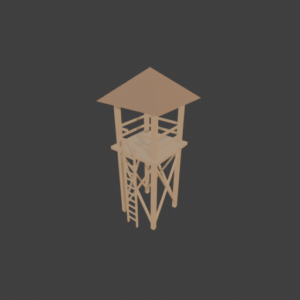
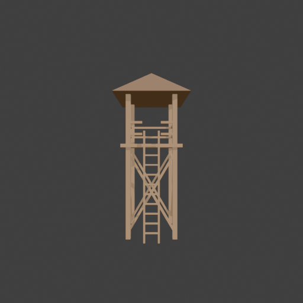

# Sohbet

- `ToolSearch` {"query": "select:mcp__blender__inspect_scene,mcp__blender__delete_object,mcp__blender__create_primitive,mcp__blender__transform_object,mcp__blender__set_material,mcp__blender__assign_material,mcp__blender__join_objects,mcp__blender__frame_view,mcp__blender__capture_viewport,mcp__blender__export_gltf,mcp__blender__create_mesh,mcp__blender__duplicate_object,mcp__blender__set_origin,mcp__blender__in ... [31 more characters]
- `mcp__blender__inspect_scene` {}
  > {"success":true,"tool":"inspect_scene","data":{"active_camera":"Camera","active_collection":"Collection","active_object":"Cube","collections":["Collection"],"counts":{"camera":1,"light":1,"mesh":1,"total":3},"objects":[{"is_linked":false,"name":"Camera","type":"CAMERA"},{"is_linked":false,"name":"Cu ... [156 more characters]
- `mcp__blender__delete_object` {"name": "Cube"}
  > {"success":true,"tool":"delete_object","data":{"deleted":true,"exists":false,"object_name":"Cube","type":"MESH","previous_state":{"location":[0,0,0],"rotation":[0,0,0],"scale":[1,1,1]}},"error":null}
- `mcp__blender__create_primitive` {"primitive_type": "CUBE", "size": 1, "name": "Leg1", "location": [1, 1, 3.1], "scale": [0.2, 0.2, 6.2]}
  > {"success":true,"tool":"create_primitive","data":{"created":true,"exists":true,"object_name":"Leg1","primitive_type":"CUBE","type":"MESH","location":[1,1,3.1],"rotation":[0,0,0],"scale":[0.2,0.2,6.2],"vertex_count":8,"face_count":6},"error":null}
- `mcp__blender__create_primitive` {"primitive_type": "CUBE", "size": 1, "name": "Leg2", "location": [-1, 1, 3.1], "scale": [0.2, 0.2, 6.2]}
  > {"success":true,"tool":"create_primitive","data":{"created":true,"exists":true,"object_name":"Leg2","primitive_type":"CUBE","type":"MESH","location":[-1,1,3.1],"rotation":[0,0,0],"scale":[0.2,0.2,6.2],"vertex_count":8,"face_count":6},"error":null}
- `mcp__blender__create_primitive` {"primitive_type": "CUBE", "size": 1, "name": "Leg3", "location": [1, -1, 3.1], "scale": [0.2, 0.2, 6.2]}
  > {"success":true,"tool":"create_primitive","data":{"created":true,"exists":true,"object_name":"Leg3","primitive_type":"CUBE","type":"MESH","location":[1,-1,3.1],"rotation":[0,0,0],"scale":[0.2,0.2,6.2],"vertex_count":8,"face_count":6},"error":null}
- `mcp__blender__create_primitive` {"primitive_type": "CUBE", "size": 1, "name": "Leg4", "location": [-1, -1, 3.1], "scale": [0.2, 0.2, 6.2]}
  > {"success":true,"tool":"create_primitive","data":{"created":true,"exists":true,"object_name":"Leg4","primitive_type":"CUBE","type":"MESH","location":[-1,-1,3.1],"rotation":[0,0,0],"scale":[0.2,0.2,6.2],"vertex_count":8,"face_count":6},"error":null}
- `mcp__blender__create_primitive` {"primitive_type": "CUBE", "size": 1, "name": "BraceF1", "location": [0, -1.05, 2], "rotation": [0, 0.532, 0], "scale": [0.1, 0.1, 3.94]}
  > {"success":true,"tool":"create_primitive","data":{"created":true,"exists":true,"object_name":"BraceF1","primitive_type":"CUBE","type":"MESH","location":[0,-1.05,2],"rotation":[0,0.532,0],"scale":[0.1,0.1,3.94],"vertex_count":8,"face_count":6},"error":null}
- `mcp__blender__create_primitive` {"primitive_type": "CUBE", "size": 1, "name": "BraceF2", "location": [0, -1.05, 2], "rotation": [0, -0.532, 0], "scale": [0.1, 0.1, 3.94]}
  > {"success":true,"tool":"create_primitive","data":{"created":true,"exists":true,"object_name":"BraceF2","primitive_type":"CUBE","type":"MESH","location":[0,-1.05,2],"rotation":[0,-0.532,0],"scale":[0.1,0.1,3.94],"vertex_count":8,"face_count":6},"error":null}
- `mcp__blender__create_primitive` {"primitive_type": "CUBE", "size": 1, "name": "BraceB1", "location": [0, 1.05, 2], "rotation": [0, 0.532, 0], "scale": [0.1, 0.1, 3.94]}
  > {"success":true,"tool":"create_primitive","data":{"created":true,"exists":true,"object_name":"BraceB1","primitive_type":"CUBE","type":"MESH","location":[0,1.05,2],"rotation":[0,0.532,0],"scale":[0.1,0.1,3.94],"vertex_count":8,"face_count":6},"error":null}
- `mcp__blender__create_primitive` {"primitive_type": "CUBE", "size": 1, "name": "BraceB2", "location": [0, 1.05, 2], "rotation": [0, -0.532, 0], "scale": [0.1, 0.1, 3.94]}
  > {"success":true,"tool":"create_primitive","data":{"created":true,"exists":true,"object_name":"BraceB2","primitive_type":"CUBE","type":"MESH","location":[0,1.05,2],"rotation":[0,-0.532,0],"scale":[0.1,0.1,3.94],"vertex_count":8,"face_count":6},"error":null}
- `mcp__blender__create_primitive` {"primitive_type": "CUBE", "size": 1, "name": "BraceL1", "location": [-1.05, 0, 2], "rotation": [0.532, 0, 0], "scale": [0.1, 0.1, 3.94]}
  > {"success":true,"tool":"create_primitive","data":{"created":true,"exists":true,"object_name":"BraceL1","primitive_type":"CUBE","type":"MESH","location":[-1.05,0,2],"rotation":[0.532,0,0],"scale":[0.1,0.1,3.94],"vertex_count":8,"face_count":6},"error":null}
- `mcp__blender__create_primitive` {"primitive_type": "CUBE", "size": 1, "name": "BraceL2", "location": [-1.05, 0, 2], "rotation": [-0.532, 0, 0], "scale": [0.1, 0.1, 3.94]}
  > {"success":true,"tool":"create_primitive","data":{"created":true,"exists":true,"object_name":"BraceL2","primitive_type":"CUBE","type":"MESH","location":[-1.05,0,2],"rotation":[-0.532,0,0],"scale":[0.1,0.1,3.94],"vertex_count":8,"face_count":6},"error":null}
- `mcp__blender__create_primitive` {"primitive_type": "CUBE", "size": 1, "name": "BraceR1", "location": [1.05, 0, 2], "rotation": [0.532, 0, 0], "scale": [0.1, 0.1, 3.94]}
  > {"success":true,"tool":"create_primitive","data":{"created":true,"exists":true,"object_name":"BraceR1","primitive_type":"CUBE","type":"MESH","location":[1.05,0,2],"rotation":[0.532,0,0],"scale":[0.1,0.1,3.94],"vertex_count":8,"face_count":6},"error":null}
- `mcp__blender__create_primitive` {"primitive_type": "CUBE", "size": 1, "name": "BraceR2", "location": [1.05, 0, 2], "rotation": [-0.532, 0, 0], "scale": [0.1, 0.1, 3.94]}
  > {"success":true,"tool":"create_primitive","data":{"created":true,"exists":true,"object_name":"BraceR2","primitive_type":"CUBE","type":"MESH","location":[1.05,0,2],"rotation":[-0.532,0,0],"scale":[0.1,0.1,3.94],"vertex_count":8,"face_count":6},"error":null}
- `mcp__blender__create_primitive` {"primitive_type": "CUBE", "size": 1, "name": "Platform", "location": [0, 0, 4], "scale": [2.6, 2.6, 0.15]}
  > {"success":true,"tool":"create_primitive","data":{"created":true,"exists":true,"object_name":"Platform","primitive_type":"CUBE","type":"MESH","location":[0,0,4],"rotation":[0,0,0],"scale":[2.6,2.6,0.15],"vertex_count":8,"face_count":6},"error":null}
- `mcp__blender__create_mesh` {"name": "Roof", "vertices": [[-1.6, -1.6, 6.2], [1.6, -1.6, 6.2], [1.6, 1.6, 6.2], [-1.6, 1.6, 6.2], [0, 0, 7.5]], "faces": [[0, 1, 4], [1, 2, 4], [2, 3, 4], [3, 0, 4], [3, 2, 1, 0]]}
  > {"success":true,"tool":"create_mesh","data":{"object_name":"Roof","type":"MESH","exists":true,"location":[0,0,0],"rotation":[0,0,0],"scale":[1,1,1],"vertex_count":5,"face_count":5,"triangle_count":6,"local_bounds_min":[-1.6,-1.6,6.2],"local_bounds_max":[1.6,1.6,7.5],"dimensions":[3.2,3.2,1.3],"creat ... [23 more characters]
**Ajan:** Şimdi korkuluklar ve merdiven.

- `mcp__blender__create_primitive` {"primitive_type": "CUBE", "size": 1, "name": "RailB", "location": [0, 1.05, 5], "scale": [2.2, 0.08, 0.1]}
  > {"success":true,"tool":"create_primitive","data":{"created":true,"exists":true,"object_name":"RailB","primitive_type":"CUBE","type":"MESH","location":[0,1.05,5],"rotation":[0,0,0],"scale":[2.2,0.08,0.1],"vertex_count":8,"face_count":6},"error":null}
- `mcp__blender__create_primitive` {"primitive_type": "CUBE", "size": 1, "name": "RailBm", "location": [0, 1.05, 4.5], "scale": [2.2, 0.08, 0.1]}
  > {"success":true,"tool":"create_primitive","data":{"created":true,"exists":true,"object_name":"RailBm","primitive_type":"CUBE","type":"MESH","location":[0,1.05,4.5],"rotation":[0,0,0],"scale":[2.2,0.08,0.1],"vertex_count":8,"face_count":6},"error":null}
- `mcp__blender__create_primitive` {"primitive_type": "CUBE", "size": 1, "name": "RailL", "location": [-1.05, 0, 5], "scale": [0.08, 2.2, 0.1]}
  > {"success":true,"tool":"create_primitive","data":{"created":true,"exists":true,"object_name":"RailL","primitive_type":"CUBE","type":"MESH","location":[-1.05,0,5],"rotation":[0,0,0],"scale":[0.08,2.2,0.1],"vertex_count":8,"face_count":6},"error":null}
- `mcp__blender__create_primitive` {"primitive_type": "CUBE", "size": 1, "name": "RailLm", "location": [-1.05, 0, 4.5], "scale": [0.08, 2.2, 0.1]}
  > {"success":true,"tool":"create_primitive","data":{"created":true,"exists":true,"object_name":"RailLm","primitive_type":"CUBE","type":"MESH","location":[-1.05,0,4.5],"rotation":[0,0,0],"scale":[0.08,2.2,0.1],"vertex_count":8,"face_count":6},"error":null}
- `mcp__blender__create_primitive` {"primitive_type": "CUBE", "size": 1, "name": "RailR", "location": [1.05, 0, 5], "scale": [0.08, 2.2, 0.1]}
  > {"success":true,"tool":"create_primitive","data":{"created":true,"exists":true,"object_name":"RailR","primitive_type":"CUBE","type":"MESH","location":[1.05,0,5],"rotation":[0,0,0],"scale":[0.08,2.2,0.1],"vertex_count":8,"face_count":6},"error":null}
- `mcp__blender__create_primitive` {"primitive_type": "CUBE", "size": 1, "name": "RailRm", "location": [1.05, 0, 4.5], "scale": [0.08, 2.2, 0.1]}
  > {"success":true,"tool":"create_primitive","data":{"created":true,"exists":true,"object_name":"RailRm","primitive_type":"CUBE","type":"MESH","location":[1.05,0,4.5],"rotation":[0,0,0],"scale":[0.08,2.2,0.1],"vertex_count":8,"face_count":6},"error":null}
- `mcp__blender__create_primitive` {"primitive_type": "CUBE", "size": 1, "name": "RailF1", "location": [-0.7, -1.05, 5], "scale": [0.6, 0.08, 0.1]}
  > {"success":true,"tool":"create_primitive","data":{"created":true,"exists":true,"object_name":"RailF1","primitive_type":"CUBE","type":"MESH","location":[-0.7,-1.05,5],"rotation":[0,0,0],"scale":[0.6,0.08,0.1],"vertex_count":8,"face_count":6},"error":null}
- `mcp__blender__create_primitive` {"primitive_type": "CUBE", "size": 1, "name": "RailF2", "location": [0.7, -1.05, 5], "scale": [0.6, 0.08, 0.1]}
  > {"success":true,"tool":"create_primitive","data":{"created":true,"exists":true,"object_name":"RailF2","primitive_type":"CUBE","type":"MESH","location":[0.7,-1.05,5],"rotation":[0,0,0],"scale":[0.6,0.08,0.1],"vertex_count":8,"face_count":6},"error":null}
- `mcp__blender__create_primitive` {"primitive_type": "CUBE", "size": 1, "name": "RailF3", "location": [-0.7, -1.05, 4.5], "scale": [0.6, 0.08, 0.1]}
  > {"success":true,"tool":"create_primitive","data":{"created":true,"exists":true,"object_name":"RailF3","primitive_type":"CUBE","type":"MESH","location":[-0.7,-1.05,4.5],"rotation":[0,0,0],"scale":[0.6,0.08,0.1],"vertex_count":8,"face_count":6},"error":null}
- `mcp__blender__create_primitive` {"primitive_type": "CUBE", "size": 1, "name": "RailF4", "location": [0.7, -1.05, 4.5], "scale": [0.6, 0.08, 0.1]}
  > {"success":true,"tool":"create_primitive","data":{"created":true,"exists":true,"object_name":"RailF4","primitive_type":"CUBE","type":"MESH","location":[0.7,-1.05,4.5],"rotation":[0,0,0],"scale":[0.6,0.08,0.1],"vertex_count":8,"face_count":6},"error":null}
- `mcp__blender__create_primitive` {"primitive_type": "CUBE", "size": 1, "name": "LadderL", "location": [-0.3, -1.45, 2.3], "scale": [0.08, 0.08, 4.6]}
  > {"success":true,"tool":"create_primitive","data":{"created":true,"exists":true,"object_name":"LadderL","primitive_type":"CUBE","type":"MESH","location":[-0.3,-1.45,2.3],"rotation":[0,0,0],"scale":[0.08,0.08,4.6],"vertex_count":8,"face_count":6},"error":null}
- `mcp__blender__create_primitive` {"primitive_type": "CUBE", "size": 1, "name": "LadderR", "location": [0.3, -1.45, 2.3], "scale": [0.08, 0.08, 4.6]}
  > {"success":true,"tool":"create_primitive","data":{"created":true,"exists":true,"object_name":"LadderR","primitive_type":"CUBE","type":"MESH","location":[0.3,-1.45,2.3],"rotation":[0,0,0],"scale":[0.08,0.08,4.6],"vertex_count":8,"face_count":6},"error":null}
- `mcp__blender__create_mesh` {"name": "Rungs", "vertices": [[-0.3, -1.48, 0.37], [0.3, -1.48, 0.37], [0.3, -1.42, 0.37], [-0.3, -1.42, 0.37], [-0.3, -1.48, 0.43], [0.3, -1.48, 0.43], [0.3, -1.42, 0.43], [-0.3, -1.42, 0.43], [-0.3, -1.48, 0.77], [0.3, -1.48, 0.77], [0.3, -1.42, 0.77], [-0.3, -1.42, 0.77], [-0.3, -1.48, 0.83], [0.3, -1.48, 0.83], [0.3, -1.42, 0.83], [-0.3, -1.42, 0.83], [-0.3, -1.48, 1.17], [0.3, -1.48, 1.17],  ... [1982 more characters]
  > {"success":true,"tool":"create_mesh","data":{"object_name":"Rungs","type":"MESH","exists":true,"location":[0,0,0],"rotation":[0,0,0],"scale":[1,1,1],"vertex_count":80,"face_count":40,"triangle_count":80,"local_bounds_min":[-0.3,-1.48,0.37],"local_bounds_max":[0.3,-1.42,4.03],"dimensions":[0.6,0.06,3 ... [34 more characters]
**Ajan:** Malzemeler ve görsel kontrol:

- `mcp__blender__set_material` {"material_name": "Wood", "base_color": [0.42, 0.26, 0.13], "roughness": 0.85}
  > {"success":true,"tool":"set_material","data":{"material_name":"Wood","object_name":null,"slot_index":null,"changed":["base_color","roughness"],"before":null,"after":{"assigned_objects":[],"is_linked":false,"library_name":null,"material_name":"Wood","node_summary":{"node_count":2,"node_types":["BSDF_ ... [600 more characters]
- `mcp__blender__set_material` {"material_name": "RoofWood", "base_color": [0.25, 0.14, 0.07], "roughness": 0.9}
  > {"success":true,"tool":"set_material","data":{"material_name":"RoofWood","object_name":null,"slot_index":null,"changed":["base_color","roughness"],"before":null,"after":{"assigned_objects":[],"is_linked":false,"library_name":null,"material_name":"RoofWood","node_summary":{"node_count":2,"node_types" ... [610 more characters]
- `mcp__blender__join_objects` {"target_name": "Leg1", "object_names": ["Leg1", "Leg2", "Leg3", "Leg4", "BraceF1", "BraceF2", "BraceB1", "BraceB2", "BraceL1", "BraceL2", "BraceR1", "BraceR2", "Platform", "RailB", "RailBm", "RailL", "RailLm", "RailR", "RailRm", "RailF1", "RailF2", "RailF3", "RailF4", "LadderL", "LadderR", "Rungs"], "new_name": "Watchtower"}
  > {"success":true,"tool":"join_objects","data":{"object_name":"Watchtower","type":"MESH","exists":true,"location":[1,1,3.1],"rotation":[0,0,0],"scale":[0.2,0.2,6.2],"vertex_count":280,"face_count":190,"triangle_count":380,"local_bounds_min":[-11.5,-12.45,-0.5],"local_bounds_max":[1.5,1.5,0.5],"dimensi ... [279 more characters]
- `mcp__blender__assign_material` {"object_name": "Roof", "material_name": "RoofWood"}
  > {"success":true,"tool":"assign_material","data":{"assigned":true,"object_name":"Roof","material_name":"RoofWood","slot_index":0,"before":{"material_name":null},"after":{"object_name":"Roof","slot_index":0,"material_name":"RoofWood"},"actual":{"object_name":"Roof","slot_index":0,"material_name":"Roof ... [21 more characters]
- `ToolSearch` {"query": "select:mcp__blender__apply_transform", "max_results": 1}
- `mcp__blender__apply_transform` {"object_name": "Watchtower"}
  > {"success":true,"tool":"apply_transform","data":{"object_name":"Watchtower","type":"MESH","exists":true,"location":[1,1,3.1],"rotation":[0,0,0],"scale":[1,1,1],"vertex_count":280,"face_count":190,"triangle_count":380,"local_bounds_min":[-2.3,-2.49,-3.1],"local_bounds_max":[0.3,0.3,3.1],"dimensions": ... [29 more characters]
- `mcp__blender__assign_material` {"object_name": "Watchtower", "material_name": "Wood"}
  > {"success":true,"tool":"assign_material","data":{"assigned":true,"object_name":"Watchtower","material_name":"Wood","slot_index":0,"before":{"material_name":null},"after":{"object_name":"Watchtower","slot_index":0,"material_name":"Wood"},"actual":{"object_name":"Watchtower","slot_index":0,"material_n ... [27 more characters]
- `mcp__blender__join_objects` {"target_name": "Watchtower", "object_names": ["Watchtower", "Roof"]}
  > {"success":true,"tool":"join_objects","data":{"object_name":"Watchtower","type":"MESH","exists":true,"location":[1,1,3.1],"rotation":[0,0,0],"scale":[1,1,1],"vertex_count":285,"face_count":195,"triangle_count":386,"local_bounds_min":[-2.6,-2.6,-3.1],"local_bounds_max":[0.6,0.6,4.4],"dimensions":[3.2 ... [55 more characters]
- `mcp__blender__set_origin` {"object_name": "Watchtower"}
  > {"success":true,"tool":"set_origin","data":{"object_name":"Watchtower","type":"MESH","exists":true,"location":[0,0,0],"rotation":[0,0,0],"scale":[1,1,1],"vertex_count":285,"face_count":195,"triangle_count":386,"local_bounds_min":[-1.6,-1.6,0],"local_bounds_max":[1.6,1.6,7.5],"dimensions":[3.2,3.2,7. ... [47 more characters]
- `mcp__blender__frame_view` {"direction": "ISO", "shading": "MATERIAL", "overlays": false}
  > {"success":true,"tool":"frame_view","data":{"direction":"ISO","objects":["Watchtower"],"center":[0,0,3.75],"radius":4.38,"shading":"MATERIAL","overlays":false},"error":null}
- `mcp__blender__capture_viewport` {}
  
  > [Image: source: C:\Users\Halil Emre\.claude\projects\C--Users-Halil-Emre-Desktop-GitHub-Public-Blender-Copilot-archives-bench-runs-20260930-012256-watchtower\02a74677-3062-408b-bff2-541bdcedcc6e\tool-results\mcp-blender-blob-1790720678064-6nf5bn.png]
  > {"success":true,"tool":"capture_viewport","data":{"image_id":"vp_5f939bf6db93","width":512,"height":512,"format":"PNG","mime_type":"image/png","byte_size":93632,"channels":4},"error":null}
**Ajan:** Model hazır ve görüntü doğru; önden bir kez daha bakıp export ediyorum.

- `mcp__blender__frame_view` {"direction": "FRONT", "shading": "MATERIAL", "overlays": false}
- `mcp__blender__capture_viewport` {}
  > {"success":true,"tool":"frame_view","data":{"direction":"FRONT","objects":["Watchtower"],"center":[0,0,3.75],"radius":4.38,"shading":"MATERIAL","overlays":false},"error":null}
- `mcp__blender__export_gltf` {"object_names": ["Watchtower"], "filename": "watchtower.glb"}
  
  > [Image: source: C:\Users\Halil Emre\.claude\projects\C--Users-Halil-Emre-Desktop-GitHub-Public-Blender-Copilot-archives-bench-runs-20260930-012256-watchtower\02a74677-3062-408b-bff2-541bdcedcc6e\tool-results\mcp-blender-blob-1790720683617-icznls.png]
  > {"success":true,"tool":"capture_viewport","data":{"image_id":"vp_bf020b7e9791","width":512,"height":512,"format":"PNG","mime_type":"image/png","byte_size":84677,"channels":4},"error":null}
  > {"success":true,"tool":"export_gltf","data":{"path":"C:\\Users\\Halil Emre\\Desktop\\GitHub\\Public\\Blender Copilot\\archives\\bench-runs\\20260930-012256-watchtower\\watchtower.glb","filename":"watchtower.glb","bytes":22772,"objects":["Watchtower"],"triangle_count":386,"format":"GLB","y_up":true," ... [31 more characters]
**Ajan:** Gözetleme kulesi bitti ve `watchtower.glb` olarak dışa aktarıldı. Toplam **386 üçgen**, 3000'lik düşük poligon sınırının çok altında.

**Ne yaptım:**
- Varsayılan Cube'u sildim.
- **Ayaklar:** 4 adet, 0.2×0.2 m kalınlıkta ve 6.2 m yüksekliğinde. Köşe direkleri yukarıda platformu geçip çatıyı da taşıyor.
- **Çapraz destekler:** Dört yüzün her birinde birbirini kesen iki eğik kiriş, yani X şeklinde bağlantılar var.
- **Platform:** 2.6×2.6 m boyutunda, 4 m yükseklikte.
- **Korkuluk:** Her kenarda iki sıra (4.5 m ve 5.0 m yükseklikte). Merdivenin geldiği ön tarafta giriş için boşluk bıraktım.
- **Çatı:** 3.2×3.2 m'lik saçaklı piramit, tepesi 7.5 m'de.
- **Merdiven:** Ön yüzde iki dikme ve 10 basamak, yerden platform seviyesine çıkıyor.
- **Malzemeler:** Gövdeye açık kahve "Wood", çatıya koyu kahve "RoofWood" verdim. Tüm parçaları tek bir `Watchtower` objesinde birleştirdim ve ölçekleri objenin içine uyguladım. Orijin tabanın ortasında, model 3.2 × 3.2 × 7.5 m.

**Kontrol:** Viewport'ta ISO ve önden (FRONT) görüntü aldım. Ayaklar, destekler, platform, korkuluk, çatı ve merdiven yerli yerinde görünüyor. Görüntülerde çatı ile gövde arasındaki renk farkı pek belli olmuyor; bunu ayrıca kontrol etmedim.

**Dosya:** `C:\Users\Halil Emre\Desktop\GitHub\Public\Blender Copilot\archives\bench-runs\20260930-012256-watchtower\watchtower.glb` (Y-up, orijine ortalanmış, yaklaşık 22 KB)

---
**Sonuç:** Gözetleme kulesi bitti ve `watchtower.glb` olarak dışa aktarıldı. Toplam **386 üçgen**, 3000'lik düşük poligon sınırının çok altında.

**Ne yaptım:**
- Varsayılan Cube'u sildim.
- **Ayaklar:** 4 adet, 0.2×0.2 m kalınlıkta ve 6.2 m yüksekliğinde. Köşe direkleri yukarıda platformu geçip çatıyı da taşıyor.
- **Çapraz destekler:** Dört yüzün her birinde birbirini kesen iki eğik kiriş, yani X şeklinde bağlantılar var.
- **Platform:** 2.6×2.6 m boyutunda, 4 m yükseklikte.
- **Korkuluk:** Her kenarda iki sıra (4.5 m ve 5.0 m yükseklikte). Merdivenin geldiği ön tarafta giriş için boşluk bıraktım.
- **Çatı:** 3.2×3.2 m'lik saçaklı piramit, tepesi 7.5 m'de.
- **Merdiven:** Ön yüzde iki dikme ve 10 basamak, yerden platform seviyesine çıkıyor.
- **Malzemeler:** Gövdeye açık kahve "Wood", çatıya koyu kahve "RoofWood" verdim. Tüm parçaları tek bir `Watchtower` objesinde birleştirdim ve ölçekleri objenin içine uyguladım. Orijin tabanın ortasında, model 3.2 × 3.2 × 7.5 m.

**Kontrol:** Viewport'ta ISO ve önden (FRONT) görüntü aldım. Ayaklar, destekler, platform, korkuluk, çatı ve merdiven yerli yerinde görünüyor. Görüntülerde çatı ile gövde arasındaki renk farkı pek belli olmuyor; bunu ayrıca kontrol etmedim.

**Dosya:** `C:\Users\Halil Emre\Desktop\GitHub\Public\Blender Copilot\archives\bench-runs\20260930-012256-watchtower\watchtower.glb` (Y-up, orijine ortalanmış, yaklaşık 22 KB)
