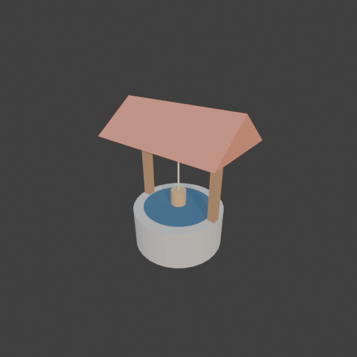

# Sohbet

- `ToolSearch` {"query": "select:mcp__blender__inspect_scene,mcp__blender__delete_object,mcp__blender__create_primitive,mcp__blender__set_material,mcp__blender__frame_view,mcp__blender__capture_viewport,mcp__blender__export_gltf,mcp__blender__transform_object,mcp__blender__join_objects,mcp__blender__create_mesh", "max_results": 10}
- `mcp__blender__inspect_scene` {}
  > {"success":true,"tool":"inspect_scene","data":{"active_camera":"Camera","active_collection":"Collection","active_object":"Cube","collections":["Collection"],"counts":{"camera":1,"light":1,"mesh":1,"total":3},"objects":[{"is_linked":false,"name":"Camera","type":"CAMERA"},{"is_linked":false,"name":"Cu ... [156 more characters]
- `mcp__blender__delete_object` {"name": "Cube"}
  > {"success":true,"tool":"delete_object","data":{"deleted":true,"exists":false,"object_name":"Cube","type":"MESH","previous_state":{"location":[0,0,0],"rotation":[0,0,0],"scale":[1,1,1]}},"error":null}
**Ajan:** Parçaları oluşturuyorum.

- `mcp__blender__create_mesh` {"name": "Roof", "vertices": [[-1.2, -0.8, 2.2], [1.2, -0.8, 2.2], [1.2, 0.8, 2.2], [-1.2, 0.8, 2.2], [-1.2, 0, 2.8], [1.2, 0, 2.8]], "faces": [[0, 1, 5, 4], [2, 3, 4, 5], [0, 4, 3], [1, 2, 5], [0, 3, 2, 1]]}
  > {"success":true,"tool":"create_mesh","data":{"object_name":"Roof","type":"MESH","exists":true,"location":[0,0,0],"rotation":[0,0,0],"scale":[1,1,1],"vertex_count":6,"face_count":5,"triangle_count":8,"local_bounds_min":[-1.2,-0.8,2.2],"local_bounds_max":[1.2,0.8,2.8],"dimensions":[2.4,1.6,0.6],"creat ... [23 more characters]
- `mcp__blender__create_primitive` {"primitive_type": "CYLINDER", "name": "Ring", "size": 1, "scale": [1.8, 1.8, 0.8], "location": [0, 0, 0.4]}
  > {"success":true,"tool":"create_primitive","data":{"created":true,"exists":true,"object_name":"Ring","primitive_type":"CYLINDER","type":"MESH","location":[0,0,0.4],"rotation":[0,0,0],"scale":[1.8,1.8,0.8],"vertex_count":64,"face_count":34},"error":null}
- `mcp__blender__create_primitive` {"primitive_type": "CYLINDER", "name": "Water", "size": 1, "scale": [1.4, 1.4, 0.02], "location": [0, 0, 0.8]}
  > {"success":true,"tool":"create_primitive","data":{"created":true,"exists":true,"object_name":"Water","primitive_type":"CYLINDER","type":"MESH","location":[0,0,0.8],"rotation":[0,0,0],"scale":[1.4,1.4,0.02],"vertex_count":64,"face_count":34},"error":null}
- `mcp__blender__create_primitive` {"primitive_type": "CUBE", "name": "PostL", "size": 1, "scale": [0.15, 0.15, 2.2], "location": [-0.8, 0, 1.1]}
  > {"success":true,"tool":"create_primitive","data":{"created":true,"exists":true,"object_name":"PostL","primitive_type":"CUBE","type":"MESH","location":[-0.8,0,1.1],"rotation":[0,0,0],"scale":[0.15,0.15,2.2],"vertex_count":8,"face_count":6},"error":null}
- `mcp__blender__create_primitive` {"primitive_type": "CUBE", "name": "PostR", "size": 1, "scale": [0.15, 0.15, 2.2], "location": [0.8, 0, 1.1]}
  > {"success":true,"tool":"create_primitive","data":{"created":true,"exists":true,"object_name":"PostR","primitive_type":"CUBE","type":"MESH","location":[0.8,0,1.1],"rotation":[0,0,0],"scale":[0.15,0.15,2.2],"vertex_count":8,"face_count":6},"error":null}
- `mcp__blender__create_primitive` {"primitive_type": "CYLINDER", "name": "Axle", "size": 1, "scale": [0.1, 0.1, 1.6], "rotation": [0, 1.5708, 0], "location": [0, 0, 1.9]}
  > {"success":true,"tool":"create_primitive","data":{"created":true,"exists":true,"object_name":"Axle","primitive_type":"CYLINDER","type":"MESH","location":[0,0,1.9],"rotation":[0,1.5708,0],"scale":[0.1,0.1,1.6],"vertex_count":64,"face_count":34},"error":null}
- `mcp__blender__create_primitive` {"primitive_type": "CYLINDER", "name": "Rope", "size": 1, "scale": [0.03, 0.03, 0.7], "location": [0, 0, 1.5]}
  > {"success":true,"tool":"create_primitive","data":{"created":true,"exists":true,"object_name":"Rope","primitive_type":"CYLINDER","type":"MESH","location":[0,0,1.5],"rotation":[0,0,0],"scale":[0.03,0.03,0.7],"vertex_count":64,"face_count":34},"error":null}
- `mcp__blender__create_primitive` {"primitive_type": "CYLINDER", "name": "Bucket", "size": 1, "scale": [0.3, 0.3, 0.3], "location": [0, 0, 1]}
  > {"success":true,"tool":"create_primitive","data":{"created":true,"exists":true,"object_name":"Bucket","primitive_type":"CYLINDER","type":"MESH","location":[0,0,1],"rotation":[0,0,0],"scale":[0.3,0.3,0.3],"vertex_count":64,"face_count":34},"error":null}
- `mcp__blender__set_material` {"object_name": "Ring", "material_name": "Stone", "base_color": [0.45, 0.43, 0.4], "roughness": 0.9}
  > {"success":true,"tool":"set_material","data":{"material_name":"Stone","object_name":"Ring","slot_index":0,"changed":["base_color","roughness"],"before":null,"after":{"assigned_objects":["Ring"],"is_linked":false,"library_name":null,"material_name":"Stone","node_summary":{"node_count":2,"node_types": ... [610 more characters]
- `mcp__blender__set_material` {"object_name": "Water", "material_name": "Water", "base_color": [0.05, 0.12, 0.2], "roughness": 0.2}
  > {"success":true,"tool":"set_material","data":{"material_name":"Water","object_name":"Water","slot_index":0,"changed":["base_color","roughness"],"before":null,"after":{"assigned_objects":["Water"],"is_linked":false,"library_name":null,"material_name":"Water","node_summary":{"node_count":2,"node_types ... [613 more characters]
- `mcp__blender__set_material` {"object_name": "PostL", "material_name": "Wood", "base_color": [0.35, 0.2, 0.1], "roughness": 0.8}
  > {"success":true,"tool":"set_material","data":{"material_name":"Wood","object_name":"PostL","slot_index":0,"changed":["base_color","roughness"],"before":null,"after":{"assigned_objects":["PostL"],"is_linked":false,"library_name":null,"material_name":"Wood","node_summary":{"node_count":2,"node_types": ... [608 more characters]
- `mcp__blender__set_material` {"object_name": "Roof", "material_name": "RoofMat", "base_color": [0.55, 0.2, 0.12], "roughness": 0.8}
  > {"success":true,"tool":"set_material","data":{"material_name":"RoofMat","object_name":"Roof","slot_index":0,"changed":["base_color","roughness"],"before":null,"after":{"assigned_objects":["Roof"],"is_linked":false,"library_name":null,"material_name":"RoofMat","node_summary":{"node_count":2,"node_typ ... [616 more characters]
- `mcp__blender__set_material` {"object_name": "Rope", "material_name": "RopeMat", "base_color": [0.7, 0.6, 0.4], "roughness": 0.9}
  > {"success":true,"tool":"set_material","data":{"material_name":"RopeMat","object_name":"Rope","slot_index":0,"changed":["base_color","roughness"],"before":null,"after":{"assigned_objects":["Rope"],"is_linked":false,"library_name":null,"material_name":"RopeMat","node_summary":{"node_count":2,"node_typ ... [612 more characters]
- `mcp__blender__set_material` {"object_name": "Bucket", "material_name": "BucketMat", "base_color": [0.5, 0.32, 0.15], "roughness": 0.8}
  > {"success":true,"tool":"set_material","data":{"material_name":"BucketMat","object_name":"Bucket","slot_index":0,"changed":["base_color","roughness"],"before":null,"after":{"assigned_objects":["Bucket"],"is_linked":false,"library_name":null,"material_name":"BucketMat","node_summary":{"node_count":2," ... [628 more characters]
**Ajan:** PostR and Axle need wood too; assign_material needed.

- `ToolSearch` {"query": "select:mcp__blender__assign_material", "max_results": 1}
- `mcp__blender__assign_material` {"object_name": "PostR", "material_name": "Wood"}
  > {"success":true,"tool":"assign_material","data":{"assigned":true,"object_name":"PostR","material_name":"Wood","slot_index":0,"before":{"material_name":null},"after":{"object_name":"PostR","slot_index":0,"material_name":"Wood"},"actual":{"object_name":"PostR","slot_index":0,"material_name":"Wood"}}," ... [12 more characters]
- `mcp__blender__assign_material` {"object_name": "Axle", "material_name": "Wood"}
  > {"success":true,"tool":"assign_material","data":{"assigned":true,"object_name":"Axle","material_name":"Wood","slot_index":0,"before":{"material_name":null},"after":{"object_name":"Axle","slot_index":0,"material_name":"Wood"},"actual":{"object_name":"Axle","slot_index":0,"material_name":"Wood"}},"err ... [9 more characters]
- `mcp__blender__frame_view` {"direction": "ISO", "shading": "MATERIAL", "overlays": false}
  > {"success":true,"tool":"frame_view","data":{"direction":"ISO","objects":["Roof","Ring","Water","PostL","PostR","Axle","Rope","Bucket"],"center":[0,0,1.4],"radius":2.052,"shading":"MATERIAL","overlays":false},"error":null}
- `mcp__blender__capture_viewport` {}
  
  > [Image: source: C:\Users\Halil Emre\.claude\projects\C--Users-Halil-Emre-Desktop-GitHub-Public-Blender-Copilot-archives-bench-runs-20260930-012148-well\db267e67-f953-40b0-b882-c74d54fc62e3\tool-results\mcp-blender-blob-1790720561158-yogvy9.png]
  > {"success":true,"tool":"capture_viewport","data":{"image_id":"vp_daecbc259815","width":512,"height":512,"format":"PNG","mime_type":"image/png","byte_size":84873,"channels":4},"error":null}
**Ajan:** Görünüm iyi. Dışa aktarıyorum (Roof ilk sırada; origin'i dünya merkezinde, yani tabanın ortasında).

- `mcp__blender__export_gltf` {"object_names": ["Roof", "Ring", "Water", "PostL", "PostR", "Axle", "Rope", "Bucket"], "filename": "well.glb"}
  > {"success":true,"tool":"export_gltf","data":{"path":"C:\\Users\\Halil Emre\\Desktop\\GitHub\\Public\\Blender Copilot\\archives\\bench-runs\\20260930-012148-well\\well.glb","filename":"well.glb","bytes":31632,"objects":["Roof","Ring","Water","PostL","PostR","Axle","Rope","Bucket"],"triangle_count":65 ... [61 more characters]
**Ajan:** Taş kuyu hazır ve `well.glb` olarak dışa aktarıldı. Toplam **652 üçgen**, yani ~3000 sınırının çok altında.

**Ne yaptım:**
- Varsayılan Cube'u sildim.
- **Taş halka (`Ring`):** 1.8 m çapında, 0.8 m yüksekliğinde gri taş silindir. Halka içi boş değil, dolu bir silindir. Üst yüzeyine koyu mavi, ince bir **su diski (`Water`)** oturttum.
- **İki direk (`PostL`, `PostR`):** 0.15×0.15×2.2 m, ahşap renginde.
- **Çatı (`Roof`):** 2.4×1.6 m'lik, 0.6 m yüksekliğinde kendi yaptığım üçgen prizma, kiremit renginde. Çatının pivotu dünya merkezinde, bu yüzden export'ta onu ilk nesne yaptım. Böylece modelin pivotu taban ortasına denk geliyor.
- **Makara, ip, kova:** İki direk arasında yatay bir ahşap makara (`Axle`), ondan sarkan ince bir ip (`Rope`) ve ucunda küçük bir ahşap kova (`Bucket`).
- Viewport'ta ISO açıdan kendim kontrol ettim; parçalar yerli yerinde ve oranlar tutarlı görünüyor.

**Bilmen gerekenler:**
- Su diski halkanın üst kenarıyla aynı hizada. Bu yüzden kuyu derin değil, ağzına kadar dolu görünüyor.
- Parçalar birleştirilmedi (join yapmadım). Dosyada 8 ayrı mesh var ama tek bir `.glb` içinde, Y-up olarak export edildi.

**Dosya:** `C:\Users\Halil Emre\Desktop\GitHub\Public\Blender Copilot\archives\bench-runs\20260930-012148-well\well.glb`

---
**Sonuç:** Taş kuyu hazır ve `well.glb` olarak dışa aktarıldı. Toplam **652 üçgen**, yani ~3000 sınırının çok altında.

**Ne yaptım:**
- Varsayılan Cube'u sildim.
- **Taş halka (`Ring`):** 1.8 m çapında, 0.8 m yüksekliğinde gri taş silindir. Halka içi boş değil, dolu bir silindir. Üst yüzeyine koyu mavi, ince bir **su diski (`Water`)** oturttum.
- **İki direk (`PostL`, `PostR`):** 0.15×0.15×2.2 m, ahşap renginde.
- **Çatı (`Roof`):** 2.4×1.6 m'lik, 0.6 m yüksekliğinde kendi yaptığım üçgen prizma, kiremit renginde. Çatının pivotu dünya merkezinde, bu yüzden export'ta onu ilk nesne yaptım. Böylece modelin pivotu taban ortasına denk geliyor.
- **Makara, ip, kova:** İki direk arasında yatay bir ahşap makara (`Axle`), ondan sarkan ince bir ip (`Rope`) ve ucunda küçük bir ahşap kova (`Bucket`).
- Viewport'ta ISO açıdan kendim kontrol ettim; parçalar yerli yerinde ve oranlar tutarlı görünüyor.

**Bilmen gerekenler:**
- Su diski halkanın üst kenarıyla aynı hizada. Bu yüzden kuyu derin değil, ağzına kadar dolu görünüyor.
- Parçalar birleştirilmedi (join yapmadım). Dosyada 8 ayrı mesh var ama tek bir `.glb` içinde, Y-up olarak export edildi.

**Dosya:** `C:\Users\Halil Emre\Desktop\GitHub\Public\Blender Copilot\archives\bench-runs\20260930-012148-well\well.glb`
