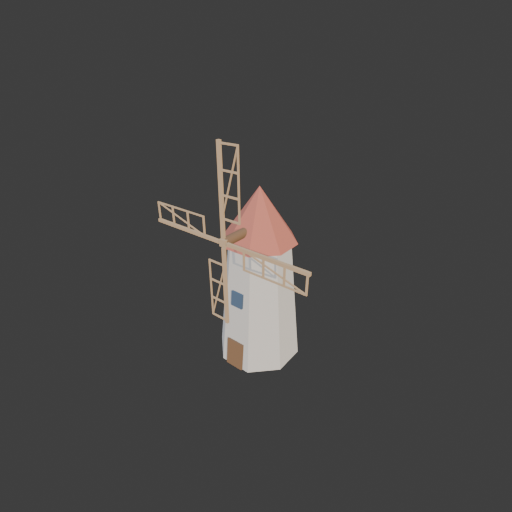
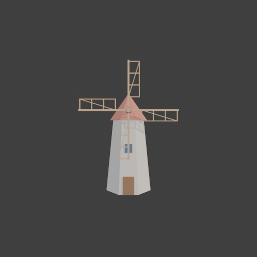

# Sohbet

- `ToolSearch` {"query": "select:mcp__blender__create_primitive,mcp__blender__create_mesh,mcp__blender__transform_object,mcp__blender__delete_object,mcp__blender__set_material,mcp__blender__frame_view,mcp__blender__capture_viewport,mcp__blender__export_gltf,mcp__blender__inspect_scene,mcp__blender__join_objects,mcp__blender__duplicate_object,mcp__blender__inspect_mesh", "max_results": 12}
- `Bash` {"command": "python -c \"\nimport json,math\nV=[];F=[]\ndef box(x0,x1,y0,y1,z0,z1,r):\n    b=len(V);c,s=math.cos(r),math.sin(r)\n    for z in(z0,z1):\n        for x,y in((x0,y0),(x1,y0),(x1,y1),(x0,y1)):\n            V.append([round(x*c+z*s,3),y,round(-x*s+z*c,3)])\n    F.extend([[b+3,b+2,b+1,b],[b+4,b+5,b+6,b+7],[b,b+1,b+5,b+4],[b+1,b+2,b+6,b+5],[b+2,b+3,b+7,b+6],[b+3,b,b+4,b+7]])\nfor k in range ... [322 more characters]
  > Output redirection to 'C:\Users\Halil Emre\Desktop\GitHub\Public\Blender Copilot\archives\bench-runs\20260930-013939-windmill\sails.json' needs approval. The path is inside the working directories for this session ('C:\Users\Halil Emre\Desktop\GitHub\Public\Blender Copilot\archives\bench-runs\202609 ... [106 more characters]
- `Bash` {"command": "python -c \"\nimport json,math\nV=[];F=[]\ndef box(x0,x1,y0,y1,z0,z1,r):\n    b=len(V);c,s=math.cos(r),math.sin(r)\n    for z in(z0,z1):\n        for x,y in((x0,y0),(x1,y0),(x1,y1),(x0,y1)):\n            V.append([round(x*c+z*s,2),y,round(-x*s+z*c,2)])\n    F.extend([[b+3,b+2,b+1,b],[b+4,b+5,b+6,b+7],[b,b+1,b+5,b+4],[b+1,b+2,b+6,b+5],[b+2,b+3,b+7,b+6],[b+3,b,b+4,b+7]])\nfor k in range ... [304 more characters]
  > This command requires approval
- `mcp__blender__delete_object` {"name": "Cube"}
  > {"success":true,"tool":"delete_object","data":{"deleted":true,"exists":false,"object_name":"Cube","type":"MESH","previous_state":{"location":[0,0,0],"rotation":[0,0,0],"scale":[1,1,1]}},"error":null}
- `mcp__blender__create_mesh` {"name": "Tower", "vertices": [[1.848, 0.765, 0], [0.765, 1.848, 0], [-0.765, 1.848, 0], [-1.848, 0.765, 0], [-1.848, -0.765, 0], [-0.765, -1.848, 0], [0.765, -1.848, 0], [1.848, -0.765, 0], [1.293, 0.536, 6], [0.536, 1.293, 6], [-0.536, 1.293, 6], [-1.293, 0.536, 6], [-1.293, -0.536, 6], [-0.536, -1.293, 6], [0.536, -1.293, 6], [1.293, -0.536, 6]], "faces": [[0, 1, 9, 8], [1, 2, 10, 9], [2, 3, 11 ... [144 more characters]
  > {"success":true,"tool":"create_mesh","data":{"object_name":"Tower","type":"MESH","exists":true,"location":[0,0,0],"rotation":[0,0,0],"scale":[1,1,1],"vertex_count":16,"face_count":10,"triangle_count":28,"local_bounds_min":[-1.848,-1.848,0],"local_bounds_max":[1.848,1.848,6],"dimensions":[3.696,3.696 ... [33 more characters]
- `mcp__blender__create_mesh` {"name": "Roof", "vertices": [[1.571, 0.651, 5.9], [0.651, 1.571, 5.9], [-0.651, 1.571, 5.9], [-1.571, 0.651, 5.9], [-1.571, -0.651, 5.9], [-0.651, -1.571, 5.9], [0.651, -1.571, 5.9], [1.571, -0.651, 5.9], [0, 0, 8.3]], "faces": [[0, 1, 8], [1, 2, 8], [2, 3, 8], [3, 4, 8], [4, 5, 8], [5, 6, 8], [6, 7, 8], [7, 0, 8], [7, 6, 5, 4, 3, 2, 1, 0]]}
  > {"success":true,"tool":"create_mesh","data":{"object_name":"Roof","type":"MESH","exists":true,"location":[0,0,0],"rotation":[0,0,0],"scale":[1,1,1],"vertex_count":9,"face_count":9,"triangle_count":14,"local_bounds_min":[-1.571,-1.571,5.9],"local_bounds_max":[1.571,1.571,8.3],"dimensions":[3.142,3.14 ... [36 more characters]
- `mcp__blender__create_primitive` {"primitive_type": "CYLINDER", "name": "Shaft", "location": [0, -1.6, 6.6], "rotation": [1.5708, 0, 0], "size": 0.4, "scale": [1, 1, 3]}
  > {"success":true,"tool":"create_primitive","data":{"created":true,"exists":true,"object_name":"Shaft","primitive_type":"CYLINDER","type":"MESH","location":[0,-1.6,6.6],"rotation":[1.5708,0,0],"scale":[1,1,3],"vertex_count":64,"face_count":34},"error":null}
- `mcp__blender__create_primitive` {"primitive_type": "CUBE", "name": "Blade1", "location": [0, -2.25, 6.6], "scale": [0.15, 0.08, 0.15]}
  > {"success":true,"tool":"create_primitive","data":{"created":true,"exists":true,"object_name":"Blade1","primitive_type":"CUBE","type":"MESH","location":[0,-2.25,6.6],"rotation":[0,0,0],"scale":[0.15,0.08,0.15],"vertex_count":8,"face_count":6},"error":null}
- `mcp__blender__create_primitive` {"primitive_type": "CUBE", "name": "Spar", "location": [0, -2.25, 8.6], "scale": [0.07, 0.06, 1.8]}
  > {"success":true,"tool":"create_primitive","data":{"created":true,"exists":true,"object_name":"Spar","primitive_type":"CUBE","type":"MESH","location":[0,-2.25,8.6],"rotation":[0,0,0],"scale":[0.07,0.06,1.8],"vertex_count":8,"face_count":6},"error":null}
- `mcp__blender__create_primitive` {"primitive_type": "CUBE", "name": "Rail", "location": [0.83, -2.25, 8.95], "scale": [0.03, 0.03, 1.38]}
  > {"success":true,"tool":"create_primitive","data":{"created":true,"exists":true,"object_name":"Rail","primitive_type":"CUBE","type":"MESH","location":[0.83,-2.25,8.95],"rotation":[0,0,0],"scale":[0.03,0.03,1.38],"vertex_count":8,"face_count":6},"error":null}
- `mcp__blender__create_primitive` {"primitive_type": "CUBE", "name": "Slat1", "location": [0.43, -2.25, 7.6], "scale": [0.43, 0.03, 0.035]}
  > {"success":true,"tool":"create_primitive","data":{"created":true,"exists":true,"object_name":"Slat1","primitive_type":"CUBE","type":"MESH","location":[0.43,-2.25,7.6],"rotation":[0,0,0],"scale":[0.43,0.03,0.035],"vertex_count":8,"face_count":6},"error":null}
- `mcp__blender__create_primitive` {"primitive_type": "CUBE", "name": "Slat2", "location": [0.43, -2.25, 8.5], "scale": [0.43, 0.03, 0.035]}
  > {"success":true,"tool":"create_primitive","data":{"created":true,"exists":true,"object_name":"Slat2","primitive_type":"CUBE","type":"MESH","location":[0.43,-2.25,8.5],"rotation":[0,0,0],"scale":[0.43,0.03,0.035],"vertex_count":8,"face_count":6},"error":null}
- `mcp__blender__create_primitive` {"primitive_type": "CUBE", "name": "Slat3", "location": [0.43, -2.25, 9.4], "scale": [0.43, 0.03, 0.035]}
  > {"success":true,"tool":"create_primitive","data":{"created":true,"exists":true,"object_name":"Slat3","primitive_type":"CUBE","type":"MESH","location":[0.43,-2.25,9.4],"rotation":[0,0,0],"scale":[0.43,0.03,0.035],"vertex_count":8,"face_count":6},"error":null}
- `mcp__blender__create_primitive` {"primitive_type": "CUBE", "name": "Slat4", "location": [0.43, -2.25, 10.3], "scale": [0.43, 0.03, 0.035]}
  > {"success":true,"tool":"create_primitive","data":{"created":true,"exists":true,"object_name":"Slat4","primitive_type":"CUBE","type":"MESH","location":[0.43,-2.25,10.3],"rotation":[0,0,0],"scale":[0.43,0.03,0.035],"vertex_count":8,"face_count":6},"error":null}
- `mcp__blender__create_primitive` {"primitive_type": "CUBE", "name": "Brace", "location": [0.415, -2.25, 8.95], "rotation": [0, 0.298, 0], "scale": [0.025, 0.025, 1.41]}
  > {"success":true,"tool":"create_primitive","data":{"created":true,"exists":true,"object_name":"Brace","primitive_type":"CUBE","type":"MESH","location":[0.415,-2.25,8.95],"rotation":[0,0.298,0],"scale":[0.025,0.025,1.41],"vertex_count":8,"face_count":6},"error":null}
- `mcp__blender__create_primitive` {"primitive_type": "CUBE", "name": "Door", "location": [0, -1.8, 0.7], "rotation": [-0.092, 0, 0], "scale": [0.45, 0.08, 0.7]}
  > {"success":true,"tool":"create_primitive","data":{"created":true,"exists":true,"object_name":"Door","primitive_type":"CUBE","type":"MESH","location":[0,-1.8,0.7],"rotation":[-0.092,0,0],"scale":[0.45,0.08,0.7],"vertex_count":8,"face_count":6},"error":null}
- `mcp__blender__create_primitive` {"primitive_type": "CUBE", "name": "Window", "location": [0, -1.54, 3.6], "rotation": [-0.092, 0, 0], "scale": [0.3, 0.08, 0.35]}
  > {"success":true,"tool":"create_primitive","data":{"created":true,"exists":true,"object_name":"Window","primitive_type":"CUBE","type":"MESH","location":[0,-1.54,3.6],"rotation":[-0.092,0,0],"scale":[0.3,0.08,0.35],"vertex_count":8,"face_count":6},"error":null}
**Ajan:** Gövde, çatı, mil, kapı, pencere ve ilk kanat parçaları hazır; şimdi kanadı birleştirip çoğaltıyorum.

- `mcp__blender__join_objects` {"object_names": ["Blade1", "Spar", "Rail", "Slat1", "Slat2", "Slat3", "Slat4", "Brace"], "target_name": "Blade1"}
  > {"success":true,"tool":"join_objects","data":{"object_name":"Blade1","type":"MESH","exists":true,"location":[0,-2.25,6.6],"rotation":[0,0,0],"scale":[0.15,0.08,0.15],"vertex_count":64,"face_count":48,"triangle_count":96,"local_bounds_min":[-1,-1,-1],"local_bounds_max":[5.7333,1,25.3333],"dimensions" ... [106 more characters]
- `mcp__blender__duplicate_object` {"source_name": "Blade1", "new_name": "Blade2", "rotation": [0, 1.5708, 0]}
  > {"success":true,"tool":"duplicate_object","data":{"duplicated":true,"source_name":"Blade1","new_name":"Blade2","source_exists":true,"new_exists":true,"type":"MESH","location":[0,-2.25,6.6],"rotation":[0,1.5708,0],"scale":[0.15,0.08,0.15],"source_location":[0,-2.25,6.6],"source_rotation":[0,0,0],"sou ... [221 more characters]
- `mcp__blender__duplicate_object` {"source_name": "Blade1", "new_name": "Blade3", "rotation": [0, 3.1416, 0]}
  > {"success":true,"tool":"duplicate_object","data":{"duplicated":true,"source_name":"Blade1","new_name":"Blade3","source_exists":true,"new_exists":true,"type":"MESH","location":[0,-2.25,6.6],"rotation":[0,3.1416,0],"scale":[0.15,0.08,0.15],"source_location":[0,-2.25,6.6],"source_rotation":[0,0,0],"sou ... [221 more characters]
- `mcp__blender__duplicate_object` {"source_name": "Blade1", "new_name": "Blade4", "rotation": [0, 4.7124, 0]}
  > {"success":true,"tool":"duplicate_object","data":{"duplicated":true,"source_name":"Blade1","new_name":"Blade4","source_exists":true,"new_exists":true,"type":"MESH","location":[0,-2.25,6.6],"rotation":[0,4.7124,0],"scale":[0.15,0.08,0.15],"source_location":[0,-2.25,6.6],"source_rotation":[0,0,0],"sou ... [221 more characters]
- `mcp__blender__set_material` {"object_name": "Tower", "material_name": "Stone", "base_color": [0.62, 0.58, 0.52], "roughness": 0.9}
  > {"success":true,"tool":"set_material","data":{"material_name":"Stone","object_name":"Tower","slot_index":0,"changed":["base_color","roughness"],"before":null,"after":{"assigned_objects":["Tower"],"is_linked":false,"library_name":null,"material_name":"Stone","node_summary":{"node_count":2,"node_types ... [615 more characters]
- `mcp__blender__set_material` {"object_name": "Roof", "material_name": "RoofRed", "base_color": [0.55, 0.18, 0.12], "roughness": 0.8}
  > {"success":true,"tool":"set_material","data":{"material_name":"RoofRed","object_name":"Roof","slot_index":0,"changed":["base_color","roughness"],"before":null,"after":{"assigned_objects":["Roof"],"is_linked":false,"library_name":null,"material_name":"RoofRed","node_summary":{"node_count":2,"node_typ ... [618 more characters]
- `mcp__blender__set_material` {"object_name": "Door", "material_name": "DarkWood", "base_color": [0.25, 0.14, 0.07], "roughness": 0.8}
  > {"success":true,"tool":"set_material","data":{"material_name":"DarkWood","object_name":"Door","slot_index":0,"changed":["base_color","roughness"],"before":null,"after":{"assigned_objects":["Door"],"is_linked":false,"library_name":null,"material_name":"DarkWood","node_summary":{"node_count":2,"node_t ... [621 more characters]
- `mcp__blender__set_material` {"object_name": "Window", "material_name": "Glass", "base_color": [0.1, 0.15, 0.22], "roughness": 0.3}
  > {"success":true,"tool":"set_material","data":{"material_name":"Glass","object_name":"Window","slot_index":0,"changed":["base_color","roughness"],"before":null,"after":{"assigned_objects":["Window"],"is_linked":false,"library_name":null,"material_name":"Glass","node_summary":{"node_count":2,"node_typ ... [616 more characters]
- `mcp__blender__set_material` {"object_name": "Blade1", "material_name": "Wood", "base_color": [0.55, 0.38, 0.22], "roughness": 0.85}
  > {"success":true,"tool":"set_material","data":{"material_name":"Wood","object_name":"Blade1","slot_index":0,"changed":["base_color","roughness"],"before":null,"after":{"assigned_objects":["Blade1"],"is_linked":false,"library_name":null,"material_name":"Wood","node_summary":{"node_count":2,"node_types ... [617 more characters]
**Ajan:** Duplicates don't share the new material; assigning Wood to them and the shaft.

- `mcp__blender__set_material` {"object_name": "Blade2", "material_name": "Wood"}
  > {"success":true,"tool":"set_material","data":{"material_name":"Wood","object_name":"Blade2","slot_index":0,"changed":[],"before":{"assigned_objects":["Blade1","Blade2"],"is_linked":false,"library_name":null,"material_name":"Wood","node_summary":{"node_count":2,"node_types":["BSDF_PRINCIPLED","OUTPUT ... [979 more characters]
- `mcp__blender__set_material` {"object_name": "Blade3", "material_name": "Wood"}
  > {"success":true,"tool":"set_material","data":{"material_name":"Wood","object_name":"Blade3","slot_index":0,"changed":[],"before":{"assigned_objects":["Blade1","Blade2","Blade3"],"is_linked":false,"library_name":null,"material_name":"Wood","node_summary":{"node_count":2,"node_types":["BSDF_PRINCIPLED ... [1006 more characters]
- `mcp__blender__set_material` {"object_name": "Blade4", "material_name": "Wood"}
  > {"success":true,"tool":"set_material","data":{"material_name":"Wood","object_name":"Blade4","slot_index":0,"changed":[],"before":{"assigned_objects":["Blade1","Blade2","Blade3","Blade4"],"is_linked":false,"library_name":null,"material_name":"Wood","node_summary":{"node_count":2,"node_types":["BSDF_P ... [1033 more characters]
- `mcp__blender__set_material` {"object_name": "Shaft", "material_name": "DarkWood"}
  > {"success":true,"tool":"set_material","data":{"material_name":"DarkWood","object_name":"Shaft","slot_index":0,"changed":[],"before":{"assigned_objects":["Door","Shaft"],"is_linked":false,"library_name":null,"material_name":"DarkWood","node_summary":{"node_count":2,"node_types":["BSDF_PRINCIPLED","OU ... [982 more characters]
- `mcp__blender__frame_view` {"direction": "ISO", "shading": "MATERIAL", "overlays": false}
  > {"success":true,"tool":"frame_view","data":{"direction":"ISO","objects":["Tower","Roof","Shaft","Blade1","Door","Window","Blade2","Blade3","Blade4"],"center":[0,-0.241,5.198],"radius":6.773,"shading":"MATERIAL","overlays":false},"error":null}
- `mcp__blender__capture_viewport` {}
  
  > [Image: source: C:\Users\Halil Emre\.claude\projects\C--Users-Halil-Emre-Desktop-GitHub-Public-Blender-Copilot-archives-bench-runs-20260930-013939-windmill\e482fea1-712e-4508-8d95-9d02532770a4\tool-results\mcp-blender-blob-1790721667711-tm0ko7.png]
  > {"success":true,"tool":"capture_viewport","data":{"image_id":"vp_7c24084cdc3b","width":512,"height":512,"format":"PNG","mime_type":"image/png","byte_size":84674,"channels":4},"error":null}
**Ajan:** Looks right. Quick front check, then export.

- `mcp__blender__frame_view` {"direction": "FRONT", "shading": "MATERIAL", "overlays": false}
  > {"success":true,"tool":"frame_view","data":{"direction":"FRONT","objects":["Tower","Roof","Shaft","Blade1","Door","Window","Blade2","Blade3","Blade4"],"center":[0,-0.241,5.198],"radius":6.773,"shading":"MATERIAL","overlays":false},"error":null}
- `mcp__blender__capture_viewport` {}
  
  > [Image: source: C:\Users\Halil Emre\.claude\projects\C--Users-Halil-Emre-Desktop-GitHub-Public-Blender-Copilot-archives-bench-runs-20260930-013939-windmill\e482fea1-712e-4508-8d95-9d02532770a4\tool-results\mcp-blender-blob-1790721670282-ugubk5.png]
  > {"success":true,"tool":"capture_viewport","data":{"image_id":"vp_e82753cb27e0","width":512,"height":512,"format":"PNG","mime_type":"image/png","byte_size":80492,"channels":4},"error":null}
- `mcp__blender__export_gltf` {"object_names": ["Tower", "Roof", "Door", "Window", "Shaft", "Blade1", "Blade2", "Blade3", "Blade4"], "filename": "windmill.glb"}
  > {"success":true,"tool":"export_gltf","data":{"path":"C:\\Users\\Halil Emre\\Desktop\\GitHub\\Public\\Blender Copilot\\archives\\bench-runs\\20260930-013939-windmill\\windmill.glb","filename":"windmill.glb","bytes":35036,"objects":["Tower","Roof","Door","Window","Shaft","Blade1","Blade2","Blade3","Bl ... [87 more characters]
**Ajan:** You've hit your session limit · resets 5am (Europe/Istanbul)

---
**Sonuç:** You've hit your session limit · resets 5am (Europe/Istanbul)
